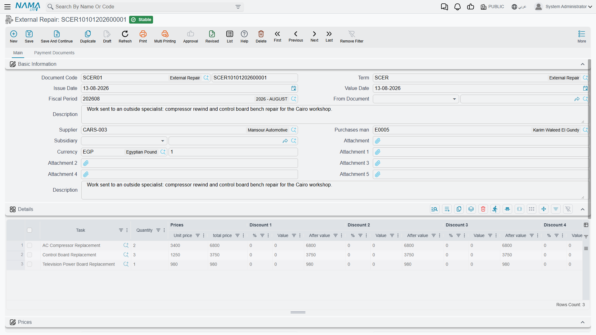

# External Repair

Some jobs leave the building. The A/C compressor on Fahad Al-Otaibi's Saif has to be bench-tested,
and Al-Sahra has no rig for it, so it goes across town to `SUP-91` Al-Faisal Auto Electric, who
charge **400** for the work.

The **External Repair** document (مستند اصلاج خارجي) is how that 400 is recorded. It is worth being
precise about what it is, because its name suggests a workshop document and it is not one: **it is a
purchase invoice for sublet work**, and it behaves like one.

You will find it at **Service Center > Documents > External Repair**.

::: info Required licence
`srvcenter`
:::

::: tip Two label defects on this screen
The screen title has no English translation, so it shows Arabic in an English session — and the
Arabic itself carries a typo, **«مستند اصلاج خارجي»**, where the correct spelling is
**«مستند إصلاح خارجي»**. The menu entry reads *External Repair* correctly.
:::

## What the document holds

The **Main** page carries the document book and code, term, dates and fiscal period, a description,
and then the commercial block: **مورد / Supplier**, **مندوب المشتريات / Purchases man**, **الذمة /
Subsidiary** — which may be an employee or an account — currency and rate, six attachments, and a
**بناءا على / From Document** field.

The **details** grid is where the work is listed, and it has no item and no warehouse:

| Column | What it is |
|---|---|
| **المهمة / Task** | Required. Which task of the job order the outside workshop performed. |
| Quantity, unit price, total | The sublet charge for that task. |
| Discounts 1–8, taxes 1–4, net | The standard invoice line money block. |
| **حساب / Account** | The expense account the charge is debited to. Typed per line. |
| Subsidiary and subsidiary account type | The counterparty for that line, if it differs from the header. |

Below the grid sits the money block — totals, discounts, taxes, net value, paid, remaining — and a
**Payment Documents** page carrying external payment lines, payment method lines, a payment template
and an instalment schedule, plus the standard **إنشاء الدفعات / Generate Payments** action. In other
words, the whole of the supplier-invoice payment apparatus is available here.

Its only connection to the workshop is **From Document**. There is no job order field. Point *From
Document* at [job order](/modules/servicecenter/job-cycle/servicecenter-job-order.md)
`SCJO-2026-0417` and the grid pre-fills with one line per task on that order,
each at quantity 1 — **and no price**. You delete the tasks that stayed in-house, keep `TSK-AC`, and
type 400 and the expense account against it.

## What committing does

Two things, and only two.

**It books the money.** The document posts as a purchase: the supplier — or the subsidiary named on
the line — is credited and the line's expense account is debited, with discounts, taxes and cash
following the accounts on the
[document's term](/modules/servicecenter/document-terms/servicecenter-terms-workshop.md). (The term
option **تعمل مبيعات ليست مشتريات / Is Sales
Not Purchase** reverses the direction for the unusual case where you are billing an outside party for
work you did.) Any payments or instalments are handled from the second page, exactly as on any
supplier invoice.

**It marks the tasks finished.** For every line on the document, the matching task on the job order is
set to **Finished**.

It creates no purchase order, no purchase invoice, no stock document and no inventory movement.

## The external cost does not reach the job order

This is the expectation everybody arrives with, and it is wrong.

::: warning The sublet cost never lands in job costing
Nothing in the job order's costing chain reads an external repair. The job order's own cost, the
[parts ledger](/modules/servicecenter/spare-parts/servicecenter-spare-parts-overview.md), the
[job order closing](/modules/servicecenter/job-cycle/servicecenter-job-order-closing.md) and all
three customer / insurance / warranty invoices are **unaware that the document exists**.

So Al-Sahra's 400 lands in the general ledger against the expense account and against Al-Faisal's
supplier balance — correctly, and that is where it stays. It does **not** join `SCJO-2026-0417`'s
3,215, it does not appear as a cost line on the job, and it is **not re-billed to anybody**
automatically.

If the customer, the insurer or the warranty provider is meant to pay for the sublet work, somebody
has to put it on the job order **by hand**: add a task or a material line carrying that value, before
the order is closed. Nothing will remind you.
:::

The practical consequence for anyone reading job profitability out of Nama: a job with sublet work
looks more profitable than it is. If external repair is a regular part of your business, treat the
supplier's account — or a dedicated expense account per workshop — as the place where that cost is
analysed, and do not expect the job order to reconcile to it.

## The tasks flip to Finished immediately

The moment the external repair is committed, every task it names goes to **Finished** on the job
order — not when the outside workshop returns the work, but when the invoice is entered.

::: warning Cancelling does not put the tasks back
If you cancel or correct an external repair, the tasks it marked *Finished* **stay finished**. The
document's cancellation restores nothing, and there is no message. Put the task status back yourself
from the
[job order execution](/modules/servicecenter/workshop-execution/servicecenter-production-execution.md)
document — its *change status* buttons and its Review grid are the only way — before the closing
picks up work that was never actually done.
:::

::: danger Cancelling destroys the line attachments
Un-committing an external repair sets every detail line's **attachment to empty, permanently**. The
outside workshop's quotation, its report, the photographs of the stripped part — all gone, and they
are not restored when the document is committed again.

Keep the supplier's paperwork somewhere else as well: on the header attachments, on the job order, or
in your document archive. Treat the line attachments on this document as disposable.
:::

## The car is out of the workshop, and nothing tracks it

There is no vehicle on this document. No sub-item, no warehouse, no locator, no "sent" date and no
"returned" date. The only status it moves is the job order **task** status described above.

So the module has no answer to *where is the car, and since when?* while it is at an outside
workshop. If you need that, the options are the job order's own remarks, a suspension raised from the
[pending operation document](/modules/servicecenter/workshop-execution/servicecenter-pending-and-resume.md)
with a *sent for external repair* reason — which at least puts the order into a visible *Pending*
state and stops it being closed — or a procedure outside the system. Do not look for it on the
external repair.

Note also that the
[gate pass](/modules/servicecenter/job-cycle/servicecenter-gate-pass.md) is a different document with
a different job: it is a release check
against invoices and payment, not a record of a vehicle leaving for a sublet repair. The two must not
be confused.

## Effects at a glance

| | |
|---|---|
| Inventory effect | **None.** No item, no warehouse, nothing moves. |
| Accounting effect | A **payable** to the supplier (or a receivable, with *Is Sales Not Purchase*), against the expense account named on each line. |
| Documents generated | Payment documents, through the standard *Generate Payments* action. |
| Effect on the job order | The named tasks are set to **Finished**. Nothing else — no cost, no material, no price. |
