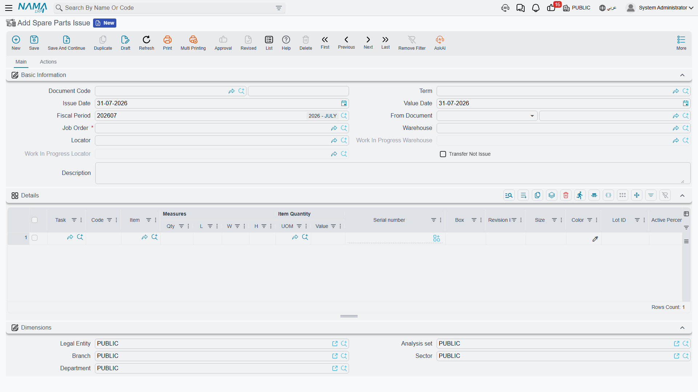

# Issuing Spare Parts

The **Spare Parts Issue** (صرف قطع غيار) is the document the storekeeper raises when parts leave the
store for a car. It is the busiest document in the workshop and the one that decides, more than any
other, whether the job's cost and the customer's bill come out right.

You will find it at **Service Center > Documents > Spare Parts Issue**.

::: info Required licence
`srvcenter`
:::

::: tip The screen title is in Arabic even in an English session
This document — like the return, the request and the external repair — has no English title
registered, so the screen header shows **صرف قطع غيار** whichever language you are working in. The
menu entry is in English. Nothing is wrong with your installation.
:::

## The screen

**Basic Information** carries the document book and code, **توجيه المستند / Term**, issue and value
dates, fiscal period, **بناءا على / From Document**, and then the fields that matter:

| Field | What it is |
|---|---|
| **أمر الشغل / Job Order** | Required. Everything on the document hangs off it. |
| **المخزن / Warehouse** and **الموقع / Locator** | **Typed by you** — the store the parts come out of. Pushed down onto the lines, which may each override it. |
| **مخزن التشغيل / WIP Warehouse** and **موقع مخزن التشغيل / WIP Locator** | Read-only, copied from the job order. Used only in transfer mode. |
| **تحويل لا صرف / Transfer Not Issue** | Read-only, copied from the document term. It decides which of the two modes below you are in. |

The **details** grid is a full supply-chain line: **المهمة / Task**, item code and item, quantity and
unit of measure, the item's own dimensions (serial, lot, size, colour, revision, production and
expiry dates), a **السياره / Customer Car** column, a line-level warehouse and locator, an attachment,
and — the two columns this page keeps returning to — **سعر الوحدة / Unit price** and the resulting
total price.

The **الحركات / Actions** page holds two read-only lists: the **stock transfer documents** and the
**stock issues** generated by this document. That is where you confirm the parts really moved.

## Filling it in

**Choosing the [job order](/modules/servicecenter/job-cycle/servicecenter-job-order.md) copies its
planned materials in**, one line each, with the item, the
quantity and the planned unit price. That is the normal path and the one that keeps prices right. If
your workshop would rather start from an empty grid, the term option **عدم نسخ التفاصيل من أمر الشغل
/ Do Not Copy Details From Job Order** turns the copying off.

**Choosing a task in a line expands that task's parts list.** The line you were editing disappears and
is replaced by one line per material the task consumes, filtered to the vehicle's brand and model.
Convenient — and the one place on this screen where you must check your work:

::: danger Parts added by expanding a task arrive with no price
The lines created by picking a task carry the item, the task and the quantity — and **no unit
price**. Because the price write-back onto the job order only fills a price that is still zero, a
zero-priced part stays zero all the way through: zero on the job order, zero in the closing, and
**zero on the customer's invoice**. The part is given away and nothing warns anybody.

After expanding a task, type the unit price on every line it produced, before you commit.
:::

The **Task** lookup on a line only offers tasks that exist on the job order, and the **From Document**
lookup only offers job orders that are *Under Processing* or *Not Started*.

## Two modes: issue, or transfer to the work-in-progress store

Which mode you are in is decided by **تحويل لا صرف / Transfer Not Issue** on the
[document's term](/modules/servicecenter/document-terms/servicecenter-terms-workshop.md), and
copied onto the header where you can see it.

**Issue mode (the default).** Committing generates a **Stock Issue** out of the line's warehouse
using the term's Generation Book and Term. That document raises the inventory business request,
relieves the quantity and posts the cost-of-sales entry under its own term's accounts. On the
canonical job, issue `SCRMI-2026-1902` generates stock issue `STI-2026-1188` out of `WH-PARTS`.

**Transfer mode.** Committing generates a **Stock Transfer** instead, using the term's **Transfer
Book** and **Transfer Term**, moving the parts from your warehouse and locator into the job order's
work-in-progress store — `WH-WIP` / `WIP-01` at Al-Sahra. The parts remain in stock; they have simply
moved to the shop floor. Use this when you want work-in-progress visible as inventory, and remember
that in this mode it is the **Transfer** book and term that must be filled, not the generation pair.

::: warning If the book and term are blank, nothing moves
In either mode, an empty book or term means **no stock document is generated at all** — and any
previously generated one is deleted. The issue still commits, still prices, still writes the parts
ledger and still feeds the invoice. The parts simply never leave the store in inventory terms.

Un-ticking *أنشاء مستندات تلقائيا / Generate Document(s)* does **not** stop generation on this
document; it is ignored here. Clearing the book or the term is the only control.
:::

::: tip Different warehouses, several stock issues
The generated stock documents are grouped by the **line's** warehouse. If some lines draw from
`WH-PARTS` and others from a second store, one spare parts issue produces **more than one** stock
issue. Both appear on the Actions page; both post separately.
:::

## What the price on the line does

The unit price on an issue line is **not** a cost. It is the price the customer will be billed, and
after commit it is written back onto the job order:

- For every issued line, the matching job order material line is found by task and item, and **if its
  unit price is still zero it is set to the issue line's price**. A price already planned on the job
  order is never overwritten — the plan wins.
- When the job order's term has **إضافة مهام قطع غيار لأمر الشغل من سندات خارجيه / Add Tasks And
  Materials to Job Order From Other Documents** switched on, the job order's whole materials grid is
  **rebuilt** from the parts ledger instead: net quantity per item, unit price from the ledger, value
  recomputed. The term option **فرد كميات الأصناف… / Spread Items Quantity If It Is Issued In
  Different Material Issues** switches that rebuild from one aggregated line per item to one line per
  issue line.

::: warning The rebuild clears the payer split
When the materials grid is rebuilt from the issues, each rebuilt line comes back with its **customer,
insurance, warranty and internal values at zero**. On a job like `SCJO-2026-0417`, where the
compressor is 100 % warranty and the pad set is split 50/50, that
[split](/modules/servicecenter/job-cycle/servicecenter-payer-split.md) has to be re-entered on the
job order after the parts are issued — and before the
[closing](/modules/servicecenter/job-cycle/servicecenter-job-order-closing.md). Reopen the job order
and check the four columns before you close.
:::

::: warning The same part issued twice at two prices
The parts ledger keeps **one** unit price per item, and it is overwritten by each issue line
processed — the last one wins, in no particular order. Issue five litres of oil at 32 and one more at
35 and the price that reaches the job order is whichever was processed last, not an average. Either
keep one price per item per job, or switch on the *spread quantities* option so each issue keeps its
own line and its own price.
:::

## What is refused

A spare parts issue is refused when the job order is **Closed** or **Cancelled**, or when a customer,
insurance or warranty invoice has already been raised for it — *"Invoice or more issued for this job
order"*. With the plan regime in force, it is also refused for a line with no task, an item that is
not planned for that task, or a quantity that takes the cumulative issued past the plan. Those checks
are described on the
[overview page](/modules/servicecenter/spare-parts/servicecenter-spare-parts-overview.md).

::: warning Deletion is not protected on this document
A **committed** spare parts issue can be deleted even after its job order has been closed and
invoiced — the check that refuses this on the return document was overridden away here. Deleting one
silently changes the cost of a job that has already been billed.

Restrict the delete permission on the spare parts issue to a small number of supervisors, and correct
mistakes with a [return](/modules/servicecenter/spare-parts/servicecenter-spare-parts-return.md)
rather than a deletion.
:::

## Accounting

The spare parts issue itself posts **nothing** unless you deliberately configure the debit and credit
sides on its own term. Leave them empty — which is the normal setup — and the only accounting entry
in the whole chain is the one the **generated stock issue** posts under its own term: inventory
relieved at the item's cost, cost of sales charged. The customer's revenue arrives later, from the
invoices raised after the job order closing.
