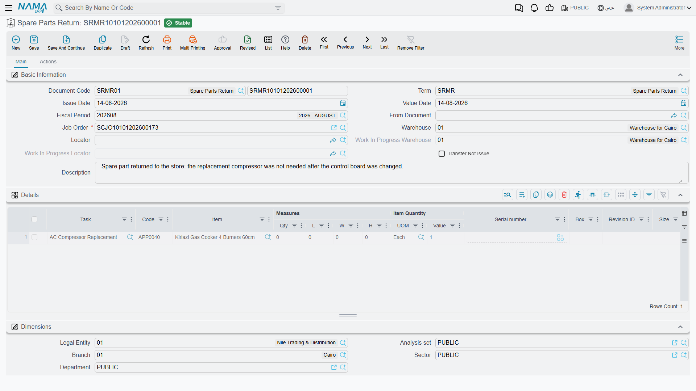

# Returning Spare Parts

Not everything the store issues gets used. The storekeeper sends six litres of oil out with the
service kit and the engine takes five; a gasket turns out to be the wrong one; a part is issued for a
job the customer then declines. The **Spare Parts Return** (إرتجاع قطع غيار) is how those parts come
back — off the job, out of the customer's bill, and into stock.

You will find it at **Service Center > Documents > Spare Parts Return**.

::: info Required licence
`srvcenter`
:::

## The screen, and what commits

The return is the
[issue](/modules/servicecenter/spare-parts/servicecenter-spare-parts-issue.md)'s mirror image, and
the screen says so: the same **أمر الشغل / Job Order**,
the same warehouse and locator, the same read-only work-in-progress store and *Transfer Not Issue*
flag copied from the term, and the same details grid keyed on **المهمة / Task** and item. Its
**الحركات / Actions** page shows the generated stock transfer documents.

Committing does three things:

1. It **generates the stock document that actually moves the parts** — a **Stock Receipt** back into
   the line's warehouse in normal mode, or a **Stock Transfer** out of the job order's
   work-in-progress store and back into your store when the
   [term](/modules/servicecenter/document-terms/servicecenter-terms-workshop.md) says
   *Transfer Not Issue*. As with
   the issue, an empty generation book or term means **nothing moves at all**, and un-ticking
   *Generate Document(s)* does not stop it — clearing the book or term is the only control.
2. It **nets the parts ledger**: the job order's issued quantity for that item less what has come
   back.
3. It **refreshes the job order's materials grid**, so the closing and the invoices bill the net
   quantity.

On Al-Sahra's job `SCJO-2026-0417`, return `SRMR-2026-0344` brings one litre of `SP-OIL-5W30` back on
a **single line**. Six litres issued, one returned, five consumed, and the customer is billed
5 × 32 = 160.

## One return line per item — and one return document at a time

::: danger A second return line for the same item is lost
The parts ledger accumulates issued quantities correctly, but **it does not accumulate returned
quantities**. When the same item is returned on more than one line, or across more than one return
document for the same job order, only the **last** one processed is counted. Every earlier return of
that item is silently discarded.

The consequence is money. The
[job order](/modules/servicecenter/job-cycle/servicecenter-job-order.md) keeps showing the parts as
consumed, the [closing](/modules/servicecenter/job-cycle/servicecenter-job-order-closing.md) splits
them across the payers, and **the customer is invoiced for parts that are physically back on the
shelf**.
Nothing warns anybody, and the stock is right — only the bill is wrong — so it will not be caught by
a stock count either.

**The rule to work to:**

- one line per item on a return — if two litres come back, return them as a single line of 2, never
  as two lines of 1;
- one open return document per job order at a time — if a second return of the same item is needed,
  amend the existing return rather than raising a new one;
- before invoicing a job that had returns, open the job order and check the material quantities
  against what is physically back.

This applies to returns in normal (stock receipt) mode. The *Transfer Not Issue* path accumulates
correctly.
:::

::: warning Cancelling a return leaves the job order stale
Cancelling or un-committing a return recalculates the parts ledger correctly, but — unlike the issue —
it does **not** refresh the job order's materials grid. With the job order term set to accept
materials from other documents, the grid keeps showing the **reduced**, post-return quantity even
though the return has been cancelled, so the customer is **under**-billed.

After cancelling a return, reopen the job order and save it again before closing or invoicing. That
one save rebuilds the grid from the ledger and puts the quantity back.
:::

## Where the return is and is not the issue's mirror

| | Issue | Return |
|---|---|---|
| Generates the document that moves stock | Stock issue, or transfer to the work-in-progress store | Stock receipt, or transfer back |
| Updates the parts ledger on commit | Yes | Yes |
| Accumulates several lines of the same item | Yes | **No — see the box above** |
| Refreshes the job order's materials grid on commit | Yes | Yes |
| Refreshes the job order's materials grid on **cancel** | Yes | **No — see the box above** |
| Writes a price back onto the job order | Yes, when the plan had none | No — and correctly so; a return should never set a price |
| Counted in the "issued exceeds planned" limit | Added | Subtracted |
| Deletion refused once the job order is closed or invoiced | No | **Yes** |

That last row is worth reading twice, because it is the opposite of what people expect: the return is
the *protected* document. Once a job order has been closed or invoiced, a committed return cannot be
deleted — while a committed issue can.

## Prices, and what the return does not touch

A return carries the same price columns as the issue, and they are the right ones to leave alone.
Nothing on the return writes a price back onto the job order — the value the customer is credited is
simply the planned unit price multiplied by the smaller quantity.

The return also posts nothing of its own by default. The only accounting entry in the chain is the
one the **generated stock receipt** posts under its own term: the item back into inventory at cost,
and the cost-of-sales charge relieved by the same amount.

## Before you invoice a job that had returns

Three checks, in this order, on any job order where parts came back:

1. Open the return's **الحركات / Actions** page and confirm the stock receipt (or transfer) is
   actually there.
2. Open the job order's materials grid and confirm the quantities match what was physically
   consumed — five litres, not six.
3. Confirm the
   [customer, insurance, warranty and internal split](/modules/servicecenter/job-cycle/servicecenter-payer-split.md)
   still adds up on each material line, since a rebuilt grid comes back with those four columns
   zeroed.

Then close and invoice.
