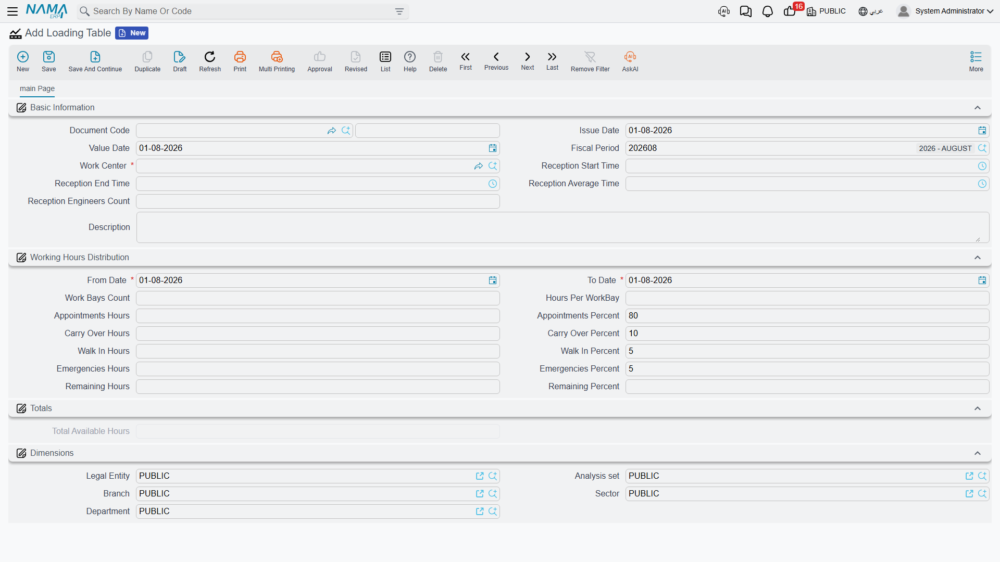

# Publishing Daily Capacity

A workshop only has so many hours in a day, and they are not all available to the person answering
the telephone. Some of yesterday's work is still on the ramps. Somebody will walk in without an
appointment. Something will arrive on a recovery truck at four o'clock. If the whole day is sold as
appointments, all three of those cars become a problem.

The **Loading Table** (جدول تحميل) is where you write that judgement down: it takes a
[work centre](/modules/servicecenter/workshop-setup/servicecenter-work-centers.md)'s
total available hours for a date range and splits them between appointments, carry-over, walk-ins and
emergencies. You will find it at **Service Center > Settings > Loading Table**.

::: info Required licence
`srvcenter`
:::

It is a document, so it needs a **document book** — but unusually it needs no
[term](/modules/servicecenter/document-terms/servicecenter-terms-basics.md) at all.

## What the sheet holds

The Basic Information block carries the document code, issue and value dates, fiscal period, the
**صالة الإنتاج / Work Center** (required), the reception window and reception staffing copied from
that work centre, and remarks. Below it sits the sheet proper: **من تاريخ / From Date**, **إلى تاريخ /
To Date**, the bay count and hours per bay, and then the four buckets — each as a pair of hours and a
percentage — with a fifth "remaining" pair below them. **إجمالي الساعات المتاحة / Total Available
Hours** is calculated and read-only.

Choosing the work centre does most of the typing for you: its reception times, engineer count, bay
count and hours per bay are copied across, total available hours are computed as bays × hours per
bay, and the four percentages — seeded from the
[Service Center settings](/modules/servicecenter/servicecenter-configuration.md) at 80 / 10 / 5 / 5 —
are turned into hours. After that, typing an hours figure recalculates its own percentage, and typing a
percentage recalculates its hours.

Al-Sahra's mechanical hall `WC-MECH` has 5 bays working 8 hours, so its sheet for 1–31 March 2026
reads:

| Bucket | Percent | Hours |
|---|---|---|
| ساعات الحجز / Appointments Hours | 80 % | **32** |
| Carry Over Hours | 10 % | 4 |
| Walk In Hours | 5 % | 2 |
| ساعات الطوارئ / Emergencies Hours | 5 % | 2 |
| الساعات المتبقة / Remaining Hours | 0 % | 0 |
| **إجمالي الساعات المتاحة / Total Available Hours** | | **40** |

::: tip Four English labels on an Arabic screen
The *Carry Over* and *Walk In* pairs have no Arabic translation registered, so they show their English
labels even in an Arabic session. They are reproduced above exactly as they appear.
:::

## What it actually enforces — one bucket, and only sometimes

Committing the sheet writes one capacity row per calendar day in the range, each carrying that day's
**appointment hours**, the engineer count and the reception window.

From then on, a **[service request](/modules/servicecenter/job-cycle/servicecenter-service-request.md)**
— the booking document — does two things against those rows: it
adds its own total hours to the day's
reserved hours, and it refuses a booking whose hours would take the day past its **appointment**
allowance, unless the visit type is flagged as always allowed. It also refuses a reservation time
outside the reception window.

That is the entire enforcement surface. **Carry-over, walk-in, emergency and remaining hours are
recorded, displayed and read by nothing.** They are planning information: a statement of intent for
the people running the shop, not a rule the system applies. Nobody is stopped from booking into the
carry-over hours, and no walk-in is counted against anything.

Which is a perfectly reasonable way to use the sheet — as long as you know that is what you are
doing. Publish it, print it, use the appointment figure as the number reception may sell, and treat
the other three as the shop's own budget.

::: danger Publish loading tables for one work centre only
The day-capacity rows this document writes are keyed on the **date alone** — the work centre is not
part of the key, and it is not part of the query that looks them up.

On an installation with two or more work centres this is destructive: committing a sheet for the
mechanical hall **overwrites the day capacity of the body and paint hall**, and a booking for either
shop may be checked against whichever sheet happens to cover that day. The numbers reception sees can
belong to the wrong workshop entirely.

Until this is fixed, publish loading tables for a **single** work centre. If you run several, manage
the others' capacity outside the system rather than by publishing a second sheet.
:::

::: danger The sheet validates nothing
Neither of the two checks this screen appears to make actually refuses anything:

- **Duplicate sheets save silently.** Two loading tables for the same work centre and the same date
  range are both accepted, and both write over the same days. Keep your own register of which sheet
  covers which period, and delete rather than re-issue.
- **An inverted reception window saves silently.** A reception end time earlier than the start time
  is accepted, and is then stamped onto every day in the range — after which every booking is outside
  the window and is refused, with nothing on screen to explain why.

Read the sheet back after saving it, before you rely on it.
:::

::: warning The first booking of a day is never checked
The capacity check only runs when the day **already has** a reservation. The first appointment of any
day is accepted whatever its size — a single 500-hour booking against a 40-hour day goes through
without a murmur, and only the *second* booking of that day is refused. Treat the check as a backstop
for a busy diary, not as a guarantee.
:::

## Keep the four shares adding up to 100

The **الساعات المتبقة / Remaining Hours** and **النسبة المتبقية / Remaining Percent** pair is only
meaningful while the four buckets total 100 % or less — as they do in the table above, where nothing
is left over.

Nothing prevents you from allocating more than 100 %, and if you do, the screen and the saved record
stop agreeing with each other: the remaining figure can come back larger than the total available
hours, and the remaining percentage larger than 100. That is a sign the sheet is over-allocated, not
a spare-capacity figure to work from. Adjust the buckets until they add to 100 and save again.

## Effects

The loading table moves no stock and posts no accounting entry. Its only footprint is the set of
day-capacity rows described above — which is also why deleting or re-issuing a sheet is something to
do deliberately, with an eye on the days it covers.
