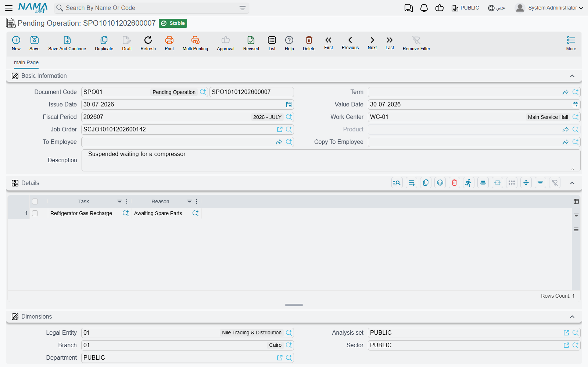
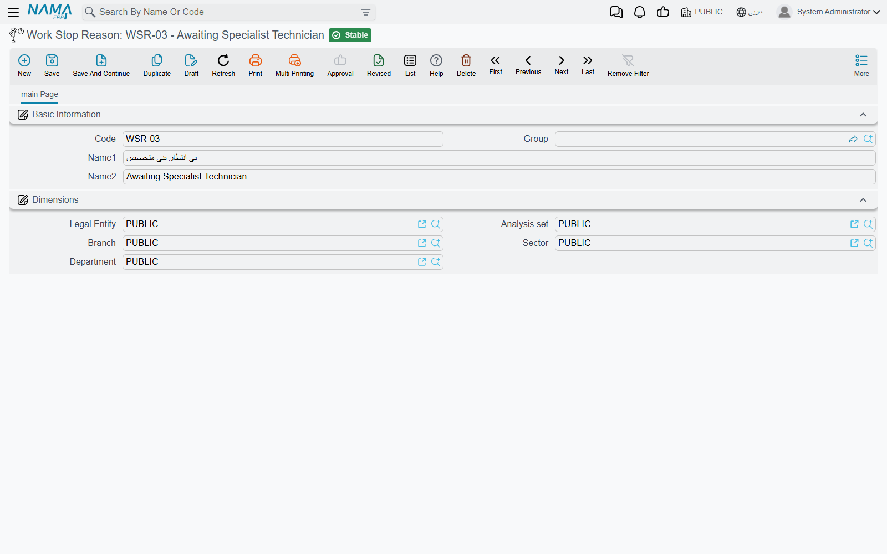

# Suspending and Resuming Work

Work stops for reasons that have nothing to do with the technician. The compressor is on back order.
The customer has not approved the extra 1,850. The car is waiting on a decision from the insurer. The
bay is needed for a warranty job that arrived on a truck.

Nama gives you a pair of documents for exactly that: **Pending Operation** (إيقاف خدمة) puts named
tasks on hold with a reason, and **Resuming Operation** (إستكمال خدمة) puts them back. Both live under
**Service Center > Documents**.

::: info Required licence
`srvcenter`
:::

## What a suspension is — and what it is not

A suspension is a **status marker with a reason attached**. That is the whole of it.

It records **no timestamp**. There is no "paused at" and no "resumed at" anywhere on either document,
and there is nothing on an execution line that could hold one. Consequently a suspension **does not
shorten the recorded time** on a
[job order execution](/modules/servicecenter/workshop-execution/servicecenter-production-execution.md)
line — that time stays the plain difference between the technician's start and finish stamps — and it
**does not change the amount billed**, because billing never uses measured time in the first place. It
uses the standard hours from the
[task catalogue](/modules/servicecenter/workshop-setup/servicecenter-tasks.md).

So if Turki starts the A/C compressor job at 08:30 on 4 March, the job is suspended for two hours
while a part is chased, and he finishes at 12:10, the line reads 3:40 net exactly as though nothing
had happened, and the customer is billed for the catalogue's 3.0 hours exactly as though nothing had
happened. What the suspension gives you is the *record*: this order stopped, here is why, and here is
when somebody restarted it.

That record is worth having. It is what turns "the workshop is slow" into "eleven orders stopped last
month waiting for parts", and it is what stops a stalled order being closed and invoiced by mistake.

## Work Stop Reasons

Before you can suspend anything you need a reason to point at. **Work Stop Reason** (سبب توقف العمل)
lives under **Service Center > Settings** and is as small as a master file gets — a code, an Arabic
name, an English name and dimensions. It carries no behaviour of any kind; its only use in the whole
module is the *Reason* column on a pending operation line.

Keep the list short and analytic, because it is the only thing you will ever be able to group
stoppages by. Al-Sahra runs six: *waiting for parts*, *waiting for customer approval*, *waiting for
insurance approval*, *sent for external repair*, *waiting for a bay*, and *technician reassigned*.

## Suspending work

The pending document's header carries the document book and code, the dates and fiscal period, the
**work centre** (صالة الإنتاج), the **job order** (أمر الشغل), the **product** — the vehicle — an
**إلى موظف / To Employee** and **صورة إلى موظف / Copy To Employee** pair for whoever needs telling,
and remarks. Its grid has exactly two columns: **المهمة / Task** and **السبب / Reason**.

The screen is deliberately narrow in what it lets you do:

1. Choose the **job order**. The lookup only offers orders that are currently *Under Processing*, and
   it can be narrowed further to the work centre you named.
2. The **product** fills in automatically, and the grid fills with **every task on that order whose
   status is currently under processing**.
3. **Delete the rows you are not suspending**, and pick a reason on each row that stays. You cannot
   type a task in yourself and you cannot change the vehicle — both are read-only, by design. What you
   are doing here is choosing from the order's live work, not describing new work.
4. Use the header **remarks** for the detail — which part is on order, which supplier, which claim
   number. There is no field on the line for it, and the reason master file is too coarse to carry
   it.
5. Commit.

Committing does four things. Each named task on the job order goes to **Pending**; every execution
line already recorded for that task on that order goes to **Pending** too; a job order status entry
is written, which is what re-derives the **header status of the order** itself; and a status entry is
added against the vehicle.

A suspension is refused if the
[job order](/modules/servicecenter/job-cycle/servicecenter-job-order.md) is already **Closed** or
**Cancelled**, and — the one that
surprises people — if **any customer, insurance or warranty invoice has already been raised for that
order**. Once an order has been invoiced it is finished with, whatever its tasks say.

::: tip A suspended order will not close
Unless the closing document's own term is configured to allow suspended orders, a job order sitting
at *Pending* is refused by the
[job order closing](/modules/servicecenter/job-cycle/servicecenter-job-order-closing.md). This is the
useful half of the feature: a car whose
work genuinely stopped cannot quietly be closed and billed.
:::

## Resuming work

**Resuming Operation** is the mirror image, with one extra header field: **مستند إيقاف الخدمة /
Pending Operation Document**, which is required. You do not resume a job order; you resume a specific
suspension.

Choose the pending document and the vehicle, the job order and the work centre all fill in from it —
they are overwritten from the pending document on every save, so there is nothing to correct — and
the grid pre-loads one line per task on that suspension **that has not already been resumed**. Its
single column, *Task*, is read-only for the same reason as before: you may only delete rows, not
invent them. Delete the tasks that are still waiting, keep the ones going back to work, and commit.

Committing puts the job order's matching task lines and their execution lines back to **Under
Processing**, marks those lines of the pending document as resumed so they are not offered again, and
writes the status entries that move the order and the vehicle back.

Cancelling either document reverses precisely the steps it performed — a cancelled suspension puts the
tasks back where they were, a cancelled resumption re-suspends them.

::: tip Resume before you clock
An order at *Pending* is not collected by the *Collect Job Orders* button on the execution document,
whatever you answer to its question about postponed orders. If a technician cannot find the car's job
order on the shop-floor screen, the first thing to check is whether it is still suspended.
:::

## Both documents in one sentence each

Neither document moves stock, neither posts an accounting entry, and neither generates any other
document. Both belong to the
[workshop document term](/modules/servicecenter/document-terms/servicecenter-terms-workshop.md)
family and show a **توجيه المستند / Term** field that they do not actually require — you may leave
it empty and the document will still save and still work.

::: warning Say it again, because it is the question people ask
Suspending work records **no time**. It does not pause the clock on an execution line, it does not
subtract anything from the technician's recorded hours, and it does not reduce what the customer
pays. It marks the tasks — and the order — as stopped, says why, and blocks the closing. Nothing more.
:::
