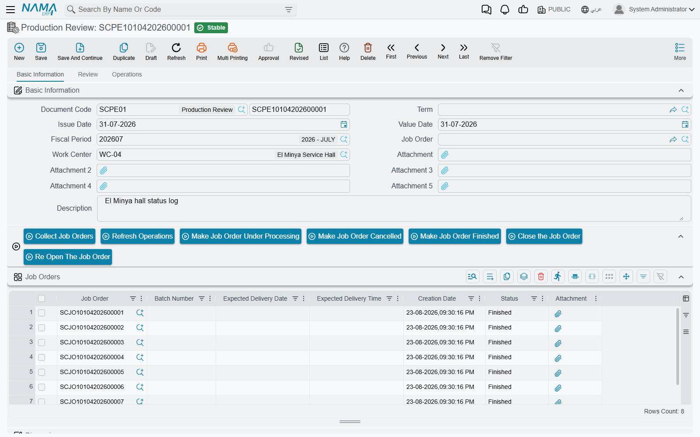

# Job Order Execution

A [job order](/modules/servicecenter/job-cycle/servicecenter-job-order.md) says what the workshop
promised to do. It says nothing about what actually happened on
the floor — who picked the car up, when the compressor job started, whether the technician was still
on it at closing time. That is what the **Job Order Execution** document records: a time sheet for
the shop, one row per task, with a real start and a real finish stamped by the person doing the work.

You will find it at **Service Center > Documents > Production Review**.

::: info Required licence
`srvcenter`
:::

::: tip The menu says something else
The document's own title is **تنفيذ أمر الشغل — Job Order Execution**, and that is what this
documentation calls it. The English menu entry currently reads **Production Review**, so that is the
line to look for while you are finding your way to the screen.
:::

## The one thing to understand before you start clocking

Every reader arrives at this screen expecting that the hours it captures end up on the customer's
bill. They do not.

The clock on this document measures wall-clock time — the plain difference between the start stamp
and the finish stamp. The customer, meanwhile, is billed for the **standard hours** held in the
[task catalogue](/modules/servicecenter/workshop-setup/servicecenter-tasks.md) and copied onto the
job order when the task was chosen. Nothing anywhere in the module
turns a measured minute into money.

Al-Sahra Motors' job order `SCJO-2026-0417` makes the point in two numbers. The five tasks carry
**6.5 standard hours** between them, which is what the invoices are built from. Turki Al-Shammari,
who did all five, was clocked on execution document `SCPE-2026-0774` for this:

| Task | From | To | Net time |
|---|---|---|---|
| `TSK-OIL` Engine oil and filter change | 3 Mar 09:00 | 3 Mar 10:05 | 1:05 |
| `TSK-BRK` Front brake pad replacement | 3 Mar 10:15 | 3 Mar 11:50 | 1:35 |
| `TSK-AC` A/C compressor replacement | 4 Mar 08:30 | 4 Mar 12:10 | 3:40 |
| `TSK-ALN` Wheel alignment | 4 Mar 13:00 | 4 Mar 13:35 | 0:35 |
| `TSK-WSH` Vehicle wash and valet | 4 Mar 13:40 | 4 Mar 14:05 | 0:25 |
| | | **Total time** | **7:20** |

Seven hours twenty measured; six and a half billed. Neither figure moves the other. What the
execution document *does* drive is **status** — which tasks are finished, therefore which job orders
are finished, therefore what the
[closing document](/modules/servicecenter/job-cycle/servicecenter-job-order-closing.md) is allowed to
pull in — and that is reason enough to keep it accurate.

## Three tabs, three jobs

**Basic Information** carries the header — document book and code, issue and value dates, fiscal
period, the **job order** and the **work centre** (صالة الإنتاج), attachments and remarks — and one
grid, **Job Orders** (أوامر الشغل).

That grid is not a selection list. It is the **status log**: each row is one status transition of one
job order, with its own creation date, and the job order's current status is derived by replaying the
rows in date order. Add a row with status *Finished* and the order is finished; add a later row with
*Under Processing* and it is back in the shop.

**Review** (المتابعة) is the fine-grained tab, where one grid row is one **task** worked by one
technician: the task, the resource used, up to five technicians, from date/time, to date/time, the
computed net time, the status and remarks. Above the grid sit **المهمه الحالية / Current Operation**,
**الفني الحالي / Current Technician**, **المهمه التالية / Next Operation**, **الفني التالي / Next
Technician** and a **Unified Technician** field.

::: warning Two labels that mislead
The two fields the English screen calls *Current Operation* and *Next Operation* pick from the
**task** list, not from services — the Arabic labels (**المهمه**) are the correct ones.

**Unified Technician** is not a default. Fill it and, on save, it **overwrites the technician on
every line of the document**. Use it when one person genuinely did everything, as Turki did on
`SCJO-2026-0417`; leave it empty as soon as two people share the work.
:::

**Operations** (العمليات) is the coarse tab. Here you clock a whole **service** (خدمة) rather than
its individual tasks, and the system splits the elapsed time across that service's tasks in
proportion to their standard hours.

## Working the floor

A normal day at `WC-MECH` runs like this.

1. Open a new execution document, choose the **work centre**, and press **تجميع أوامر الشغل /
   Collect Job Orders**. Every job order of that
   [work centre](/modules/servicecenter/workshop-setup/servicecenter-work-centers.md) that is *Under
   Processing* or *Not Started* is loaded into the Job Orders grid, with one detail row per order.
2. Select the row for the task about to start and press **بدء المهمة للسطر الحالي / Start Task For
   Current Line**. The start date and time are stamped with *now* and the line goes to *Under
   Processing*. If the order had no status row yet, one is added at *Under Processing*.
3. When the technician downs tools, select the same row and press **إنهاء المهمة السطر الحالي /
   Finish Task For Current Line**. The finish stamp is *now*, the line goes to *Finished*, and the
   net time appears in the **ساعات العمل** columns — as a decimal and as `hh:mm`.
4. Repeat per task. **إنهاء أمر شغل / Finish Job Order** is the shortcut at the end of a car: it
   marks every order row and every detail row finished, stamping *now* on anything still open.
5. When the car is done, **إغلق أمر الشغل / Close Job Order** generates the job order closing
   document straight from here, using the closing book and term set on this document's own term.
   **إعاده فتح أمر الشغل / Reopen Job Order** deletes that closing again. Save the execution document
   before pressing either.

The three **change status** buttons — *Under Processing*, *Cancelled*, *Finished* — do nothing more
than append one row to the Job Orders grid with that status and the current moment as its creation
date. They are how you correct a status log that has drifted.

::: warning Collecting never brings in paused work
*Collect Job Orders* asks whether to include postponed orders. Whatever you answer, the orders it
loads are always and only those that are *Under Processing* or *Not Started* — an order you have
suspended with a
[pending operation document](/modules/servicecenter/workshop-execution/servicecenter-pending-and-resume.md)
will not appear. Resume it first, then collect.
:::

::: warning "تحديث العمليات / Refresh Operations" does nothing
The refresh button on the Basic Information action bar is inert: pressing it produces no message, no
change to the grids and no error. Nothing has gone wrong and nothing needs retrying — to bring in
more work, press *Collect Job Orders*, and to bring in a specific order's tasks, choose it in the
header.
:::

## Rules the document enforces

**No technician may be in two places at once.** If two lines share a technician and their
from/to intervals overlap — whether both lines are on this document or one of them is on another
execution document for the same dates — the save is refused, naming the interval. This is the
module's one genuine integrity check on recorded time, and it is worth the discipline it imposes.

**Only work that was planned may be clocked.** Every detail line's job order must appear in the Job
Orders grid, and every detail line's task must exist on that job order's own operations grid. Neither
message is a defect: they mean somebody is recording work the order does not contain, which is a
conversation to have before it becomes an invoice.

**Finished orders are protected.** An order that is already *Closed*, or that already has a customer,
insurance or warranty invoice, cannot appear on a new execution document at all.

**Started lines freeze.** Once a line has a from-date and a to-date, its service, resource and five
technician columns can no longer be changed. If the module setting *Can Not Edit Line Status Is
Finished* is switched on, a finished line is read-only in every column.

One further check is optional. Tick **preventing more than one unfinished task per technician** on
this document's term and a save is refused when a technician would be left with two open tasks on the
same day. Treat it as a helpful nudge rather than a guarantee: it stops applying to the rest of the
document once it meets one open line with no technician named.

::: warning The Term field looks optional — on this document it is not
The document saves happily with **توجيه المستند / Term** left empty. But an empty term silently
switches off the one-open-task-per-technician check *and* leaves the *Close Job Order* button with no
book and term to create the closing with. Always fill it.
:::

## Two ways to clock, and why you must not mix them

The Review tab and the Operations tab are alternatives, not companions.

::: danger Rows on the Operations tab destroy hand-typed Review lines
Whenever the **Operations** tab has any row at all, saving the document **clears the Review grid and
rebuilds it** from the operation rows. Anything a technician typed by hand on the Review tab is gone,
without a prompt and without a message.

**Use one tab per document.** Task-by-task clocking on the Review tab, or service-level clocking on
the Operations tab — never both on the same document.
:::

::: danger Clock one service per document on the Operations tab
When a single operations row is exploded into task lines, the chain is built correctly: the first
task starts when the service started, the last ends when it ended, and the middle ones divide the
elapsed time in proportion to their standard hours.

With a **second** operations row on the same document, the task lines of the second service take
their start times from the tasks of the *first* one. The resulting net times are wrong and may even
trip the overlap check. Raise one execution document per service you clock this way.
:::

## Choosing the technician

By default the module hides from the technician lookups anybody who currently has an execution line
with no finish stamp — a reasonable way of steering a foreman towards someone who is free. In a large
installation the underlying look-up is capped, so a genuinely busy technician can still appear in the
list; the setting is an aid, not a lock. If you would rather see everybody, switch
*Do Not Show Technicians Who Have Open Task* off in the Service Center settings.

## What the document does — and does not — produce

It moves **no stock** and posts **no accounting entry**. There is no material line on it at all: parts
are handled entirely by the
[spare parts documents](/modules/servicecenter/spare-parts/servicecenter-spare-parts-overview.md).

What it writes is status: the job order's own task lines are stamped with the status of their
execution lines, a job order status entry is recorded (which is what re-derives the header status),
and a product status entry is added for the vehicle. The only document it can generate is the job
order closing, and only when you press the button.

## The attendance sheet

**Service Center Attendance** (حضور / انصراف مركز الخدمة) sits under **Service Center > Documents**
on the same `srvcenter` licence. It is a plain capture sheet: one grid of employee, time from, time
to, and the resulting total time, with the document's value date used for any line you leave undated.

It is honest to say what it is for, which is your own record-keeping. **Nothing reads it.** It is not
HR attendance, it does not feed payroll, it is never compared with the times clocked on an execution
document, and no report ships against it. If you need technician attendance to drive anything, it has
to be captured in the HR module instead.

::: warning Never enter a shift that crosses midnight
A line from 22:00 to 06:00 is treated as both times on the *same* day, so it stores a negative total
of −16 hours — and the document saves without complaint, because this screen validates nothing at
all. Split a night shift into two lines on two days: 22:00–23:59 and 00:00–06:00.
:::
