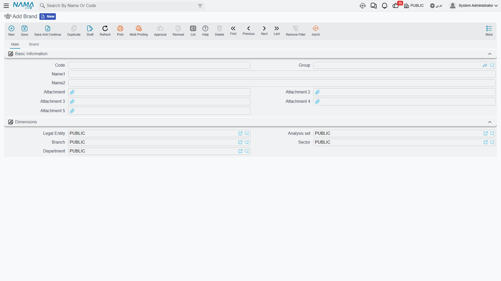
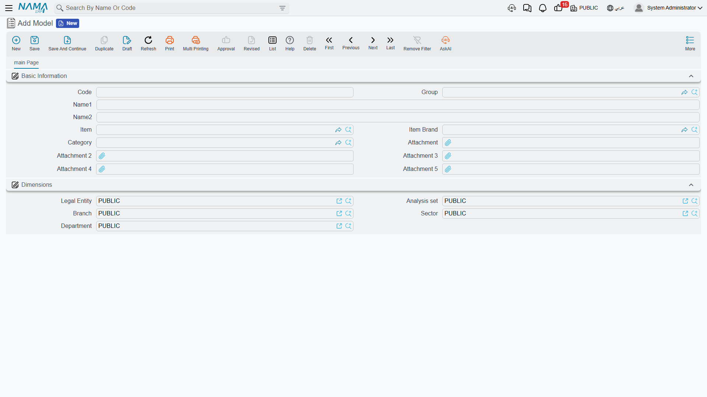

# Brands, Models and Model Categories

Al-Sahra Motors services NAWA cars, and a NAWA Saif 1.6 is not a NAWA Rimal 2.4. The oil change takes longer on the SUV, the service intervals differ, and the ten-thousand-kilometre package sells for a different figure. Somewhere the workshop has to be able to say *this vehicle is that kind of vehicle* — and that is what the three-level classification does.

| | |
|---|---|
| Menu | **Service Center → Master Files → Brand / Model / Product Model Category** (`مركز خدمة > الملفات > ماركة منتج / موديل / تصنيف موديل`) |
| Kind | Three master files — no inventory effect, no accounting effect |

::: info Required licence
`srvcenter`
:::

## The Three Levels

```
Brand            BRD-NAWA    NAWA / ناوا
  └─ Model       MDL-SAIF16  NAWA Saif 1.6 (sedan)
     MDL-RIMAL24 NAWA Rimal 2.4 (SUV)
     MDL-NAKHLA  NAWA Nakhla (panel van)
        └─ each model points up at a category
Model category   MCT-PASS    Passenger Cars / سيارات ركاب
```

Read it as: a **brand** is the marque; a **model** is one vehicle line of that marque; a **model category** is a way of grouping models across brands ("passenger cars", "light commercial").

### The Brand File

**Brand** (`ماركة منتج`) is deliberately thin — code, Arabic and English names, attachments. Its second tab, headed **Brand** (ماركه), is a read-only list of every model that belongs to it, which is the quickest way to see whether a marque has been set up completely.



### The Model File

**Model** (`موديل`) is where the useful classification happens.

| Field | Arabic label | What it holds |
|---|---|---|
| Code, Group, Name1, Name2 | الكود، المجموعة، الاسم العربي، الاسم الإنجليزي | Identity. Name1 Arabic, Name2 English. |
| Item | الصنف | An inventory item associated with the model. |
| Item Brand | الماركة | The marque this model belongs to — `BRD-NAWA`. |
| Category | فئة صنف | The model category. |
| Attachments, Dimensions | مرفق، المحددات | The usual blocks. |

The three things a model drives, below, all key off the **model record itself**, not off the item named in the Item field.



### The Model Category File

**Product Model Category** (`تصنيف موديل`) is code and names and nothing else. It groups models for a human reader and for list-view filtering. No price, no interval and no rule anywhere in the module reads it.

## What the Model Actually Drives

This is the part worth memorising, because it is short and it is the entire return on setting the classification up properly. The model selects exactly **three** things.

**1. The price of a service package.** A [service](/modules/servicecenter/workshop-setup/servicecenter-operations.md) priced by **Total** carries a model price table. When that service goes onto a [job order](/modules/servicecenter/job-cycle/servicecenter-job-order.md) for `VEH-2031`, the price taken is the row whose model is the Saif 1.6. Whether the ordinary price column or the manufacturer's column is read depends on the installation-wide Service Price Strategy setting.

**2. The labour time and rate of a task.** A [task](/modules/servicecenter/workshop-setup/servicecenter-tasks.md) carries a Products grid — one row per model, with the hours that model takes and the rate charged. The oil change is 1.0 hours at 120 on the Saif 1.6 because a row says so.

**3. The [service interval](/modules/servicecenter/job-cycle/servicecenter-odometer-and-service-intervals.md).** A task's recurrence rows can set a different **Recur Every KM** per model, and a service's model price row carries its own recurrence figure. That is how the same oil change can be due every 10,000 km on a sedan and every 7,500 on a van.

And one thing it explicitly does **not** drive: **[inspection templates](/modules/servicecenter/inspections-and-campaigns/servicecenter-inspections.md)**. Inspection templates and the inspection points they are built from carry no model and no brand at all, and no rule, filter or `توجيه` option picks a template. The template is chosen by hand, by the person filling the form — never by the car.

::: warning Brand is required but ignored
On a task's Products grid the **Brand** column is mandatory — you cannot save a row without it. On a service's model price grid the brand column is displayed and is checked against the header.

Neither is used to choose a row. Every matcher that picks a price, a labour time or an interval keys on the **model**. Two rows for the same model that differ only in brand are indistinguishable to the system, and the **first** one always wins.

So: fill the brand with the marque that genuinely owns the model, because you have to — and then design your data as though the column were not there. One row per model, never two.
:::

::: warning Choosing a model does not filter the task list
On a job order, picking the vehicle does not narrow the task or service pickers to the things defined for that model. The whole catalogue is offered every time, and it is up to the service advisor to choose correctly.

The mechanism that would have filtered the list exists in the model but is switched off in the code, so do not build a training story around it. If the catalogue is large, invest in codes and master groups that sort sensibly instead.
:::

::: tip Write `brad`, not `brand`
The brand field on the task and on its product lines is spelled **`brad`** in its identifier. That spelling reaches you through import files, criteria definitions, entity flows and query expressions — anywhere you name the field rather than click it. The screen label reads "Brand"; the identifier does not.
:::

## Setting the Classification Up

1. Create the **brand** first — one per marque you service. Al-Sahra has one, `BRD-NAWA`.
2. Create the **model categories** you actually want to group by. Keep the list short; nothing depends on it, so a long one costs you effort and buys nothing.
3. Create one **model** per vehicle line, point it at its brand and its category, and use codes people will recognise (`MDL-SAIF16` rather than `M001`).
4. Then, and only then, build the [task catalogue](/modules/servicecenter/workshop-setup/servicecenter-tasks.md) and the [service packages](/modules/servicecenter/workshop-setup/servicecenter-operations.md) — because their price rows are typed *per model*, and a model that does not yet exist cannot be priced.
5. When a new model joins the range, remember it needs a price row added to every task and every service that applies to it. Nothing inherits from the brand, so an unpriced new model quietly falls back to the generic average period and the [work center's hour price](/modules/servicecenter/workshop-setup/servicecenter-work-centers.md).
