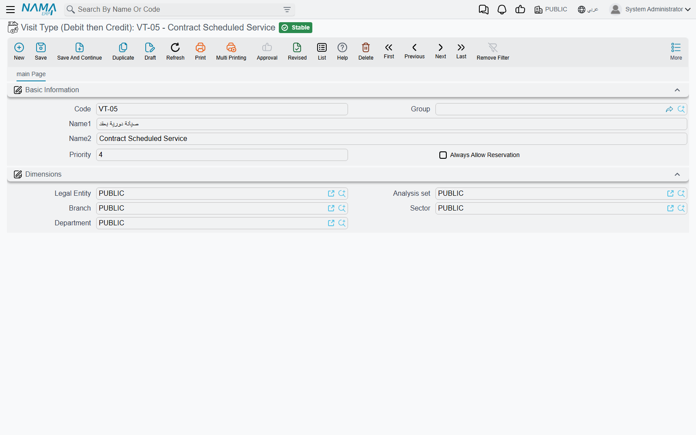

# Tags and Classification Files

Three small master files sit in the Service Center menu that a reader will reasonably expect to *do* something — and none of them does. They classify. They travel from the vehicle onto the job order, they appear as columns in list views and they group things for a human being reading a screen, and there their contribution ends.

This page covers all three together, honestly and briefly, so that nobody spends a morning configuring one and waiting for a behaviour that will not arrive.

::: info Required licence
`srvcenter`
:::

## Accessories Kit

**Accessories Kit** (`مجموعة ملحقات`), under **Service Center → Master Files**, names the package a vehicle came with — `AK-STD` *Standard Kit / مجموعة قياسية* on Al-Sahra's `VEH-2031`.

It appears in three places, and always as a single reference field:

- on the [vehicle file](/modules/servicecenter/workshop-setup/servicecenter-product-file.md), in the product-details block;
- on the [job order](/modules/servicecenter/job-cycle/servicecenter-job-order.md) and the [estimation](/modules/servicecenter/job-cycle/servicecenter-job-estimation.md), filled in for you from the vehicle when you pick the car;
- on a [gate pass](/modules/servicecenter/job-cycle/servicecenter-gate-pass.md) line, likewise filled in from the vehicle.

And it is written back onto the vehicle when a job document commits, if the vehicle's own field was still empty.

::: warning A tag, not a parts list
An accessories kit is a **label**. It contains no items, adds no lines to a document, carries no price, moves no stock, posts nothing and is checked by no validation. Naming a kit tells a later reader "this car arrived with the standard package"; it does not tell the system to bill or issue anything.

If you need the accessories themselves on a job, put them on the [spare-parts grid](/modules/servicecenter/spare-parts/servicecenter-spare-parts-overview.md) as ordinary items.
:::

::: warning No screen of its own has been registered
Unlike every other master file in the module, this one has no edit-screen layout registered for it. What you get when you open it from the menu has not been confirmed on a running system, so this documentation does not describe its screen. If the file is important to you, check it on your own installation before designing a process around it.
:::

## Visit Type

**Visit Type** (`نوع الزيارة`) classifies why the car came in — scheduled service, warranty claim, accident repair, complaint. Al-Sahra uses `VT-SRV` *Scheduled Service / صيانة دورية* for `VEH-2031`'s March visit.

It lives under **Service Center → Settings**, and it is carried on the [service request](/modules/servicecenter/job-cycle/servicecenter-service-request.md), the job order, the estimation, the [inspection sheet](/modules/servicecenter/inspections-and-campaigns/servicecenter-inspections.md) and a gate pass line, plus the *expected next visit type* fields that project the vehicle's next appointment.

The screen holds code, group, the two names, and two settings:

| Field | Arabic label |
|---|---|
| Priority | الأولوية |
| Always Allow Reservation | السماح بالحجز دائما |

::: danger Neither setting does anything
**Priority** and **Always Allow Reservation** are read by no code in the system. Setting a priority does not order anything; ticking *Always Allow Reservation* does not exempt an emergency visit from the appointment capacity check, and there is no third setting behind them that does.

A visit type is a **classification label only**. Use it to describe and to report; never build a booking rule on it, and never tell a service advisor that ticking a box here will get a car in.
:::

::: tip Two menu-label defects to expect
The English menu entry reads **"Visit Type (Debit then Credit)"** — the parenthetical is a stray accounting label that has nothing to do with visits, and it does not appear in Arabic. The **Settings** folder itself also carries a stray leading space in both languages (` الإعدادات` / ` Settings`), so it may sort oddly in the menu tree. Both are cosmetic; the file is the one described here.
:::

## Standard Operation Classification

**Standard Operation Classification** (`تصنيف خدمة`), under **Service Center → Master Files**, holds code, both names, attachments and dimensions — nothing more.

Its one use in the whole module is the **classification** field (التصنيف) on the [service task](/modules/servicecenter/workshop-setup/servicecenter-tasks.md) screen. Nothing else references it.

::: warning A free tag on the task
No price, no filter, no grouping rule and no report reads this classification. It is a column you can search a task list by, and a word a colleague can read. That is the whole of it.

It is still worth using — "mechanical", "electrical", "body", "valeting" makes a catalogue of two hundred tasks navigable — as long as nobody expects it to route work or price anything.
:::

## Why Fill Them In At All

Because list views, search criteria, custom reports and imports all read whatever you put in these fields, even though the module's own logic does not. A workshop that tags its tasks by discipline and its visits by reason can answer "how many warranty visits did we take in March" from a list view; a workshop that leaves them empty cannot. Just size the effort to what it buys — description and reporting, not behaviour.

The fourth small classification file, the **product model category**, is covered on the [brands and models](/modules/servicecenter/workshop-setup/servicecenter-brands-and-models.md) page, where it belongs to the same hierarchy as the brand and the model.
