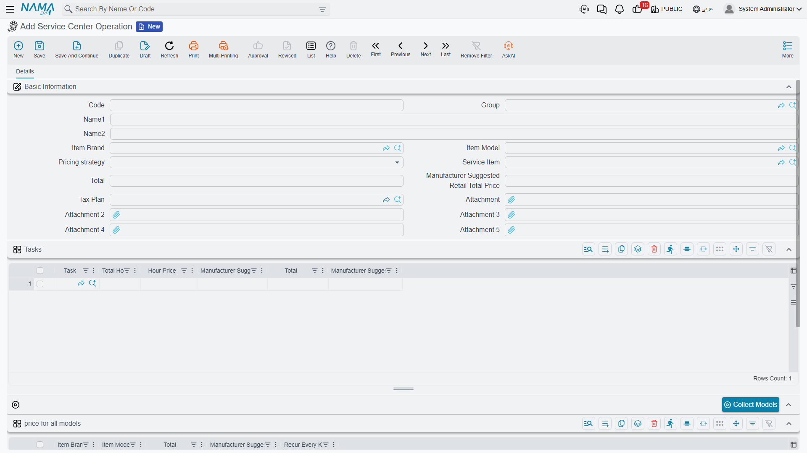

# Services and Operation Groups

A customer does not ask for "an oil change, a filter change, a brake inspection and a fluid top-up". They ask for the 10,000-kilometre service, and they want one price for it. The **service** — `خدمة` in the Arabic menu, *Operation* in the English one — is how the workshop sells a bundle like that.

A service is a named package of [tasks](/modules/servicecenter/workshop-setup/servicecenter-tasks.md), with a decision attached: does the customer see the tasks priced one by one, or does the package carry a single price and the tasks come along silently?

| | |
|---|---|
| Menu | **Service Center → Master Files → Service Center Operation** (`مركز خدمة > الملفات > خدمة`) |
| Kind | Master file — no inventory effect, no accounting effect |

::: info Required licence
`srvcenter`
:::

::: tip Two words for the same thing
The English menu says **Operation**; the Arabic menu and every Arabic label say **خدمة**, a *service*. They are the same file. Throughout this documentation "service" and "operation group" both mean this record — never a running job.
:::



## Both Files Are Catalogue Masters

It is worth being blunt about the relationship, because the two words sound like different stages of the same thing and they are not.

- A **task** is the atom: one repair step, with a standard duration, a labour rate and a bill of materials.
- A **service** is a bundle of tasks with a price policy on top.

**Neither one is the work being done.** Both are things you set up once and reuse. The performed work is a line on a job order and a clocked line on the [shop-floor time sheet](/modules/servicecenter/workshop-execution/servicecenter-production-execution.md) — never a task record and never a service record.

## The Screen

### Basic Information

| Field | Arabic label | What it does |
|---|---|---|
| Code, Group, Name1, Name2 | الكود، المجموعة، الاسم العربي، الاسم الإنجليزي | Identity. Name1 Arabic, Name2 English. |
| Item Brand | الماركة | The marque this service belongs to. It also governs the model price table — see below. |
| Item Model | الموديل | The model this service belongs to. |
| Pricing strategy | سياسه التسعير | **Per Line** (لكل سطر) or **Total** ( الإجمالي). The fork this whole page is about. |
| Service Item | صنف الخدمة | The item [invoiced](/modules/servicecenter/job-cycle/servicecenter-job-order-invoicing.md) for the package. |
| Total | إجمالي السعر | The package price, used when the strategy is Total. |
| Manufacturer Suggested Retail Total Price | إجمالي سعر المورد | The manufacturer's package price, used instead when the installation runs the MSRP pricing strategy. |
| Tax Plan | سياسة الضريبة | The tax treatment carried with the service. |

### The Tasks Grid

| Column | Arabic label | What it holds |
|---|---|---|
| Task | المهمة | The member task. **Required on every row** — a service with an empty task column cannot be saved. |
| Total Hours | المدة | The hours this task contributes to the package. |
| Hour Price | سعر الساعة | The rate for those hours. |
| Manufacturer Suggested Retail Hour Price | سعر ساعة المورد | The manufacturer's rate. |
| Total | إجمالي السعر | Hours × rate. |
| Manufacturer Suggested Retail Total Price | إجمالي سعر المورد | The same, at the manufacturer's rate. |

### The Model Price Table

Below the tasks grid sits a button, **collectModels**, and a grid headed **price for all models** (أسعار الخدمة لكل الموديلات).

| Column | Arabic label | What it holds |
|---|---|---|
| Item Brand | الماركة | The marque. |
| Item Model | الموديل | The model this price applies to. |
| Total | إجمالي السعر | The package price for that model. |
| Manufacturer Suggested Retail Total Price | إجمالي سعر المورد | The manufacturer's package price for that model. |
| Recur Every KM | تكرر كل / كم | How often this service comes round on that model. |

Pressing **collectModels** saves typing: it reads the marque in the header and drops one row into the grid for every model that marque owns. At Al-Sahra, with `BRD-NAWA` in the header, one press produces rows for the Saif 1.6, the Rimal 2.4 and the Nakhla — and you then type a price against each.

Two rules govern the grid at save time. A row whose brand is **not** the header's brand is refused when you commit. And after a successful commit, each row's brand is filled in from its model, so rows produced by the button keep themselves tidy.

::: warning The brand column does not select anything
When the system looks for the price of this service on a particular car, it matches on the **model alone**. The Item Brand column in the model price table is displayed, is validated against the header, and is then ignored by the lookup.

Consequence: two rows for the same model with different brands are indistinguishable to the matcher, and the **first** one always wins. Keep one row per model.
:::

## Per Line or Total — the Fork That Matters

The **Pricing strategy** field decides which level of the record carries the money, and it does so by zeroing the other one. This is not a display preference; the numbers are actually cleared when you save.

**Per Line** — each task row is priced in its own right: *hours × hour price*. The header's Total is forced to **zero**. Use this when the customer should see the components: "oil change 120, brake pads 180, alignment 60".

**Total** — the header's Total is the price of the package, and **every task row's price is forced to zero**. Use this when you sell "the 10,000 km service" for one figure and do not want the parts of it argued over. With this strategy, the price the job order actually takes is the row of the model price table that matches the vehicle's model, and whether it reads the ordinary Total column or the manufacturer's column depends on the installation-wide Service Price Strategy setting.

::: warning Switching strategy destroys the other side's prices
Because the losing side is zeroed on save, changing an existing service from Per Line to Total wipes the per-task prices, and changing it back does not bring them back. Decide the strategy when you create the service, and if you must change it, expect to retype prices.
:::

## How a Service Reaches a Job Order

There is exactly **one** grid for work on a [job order](/modules/servicecenter/job-cycle/servicecenter-job-order.md), and both files feed it. A service goes in as a **header row**; the tasks it contains go in **underneath it as child rows**. A task that is not part of any package goes in on its own, with no parent.

So Al-Sahra's job order could equally have looked like this — a service row with four children and one free-standing task:

```
▸ SRV-10K   Ten-thousand kilometre service   ← the service, a header row
    TSK-OIL   Engine oil and filter change   ← its tasks, child rows
    TSK-BRK   Front brake pad replacement
    TSK-ALN   Wheel alignment
  TSK-AC     A/C compressor replacement      ← a task on its own
```

Four rules are enforced when you save the document:

| If you do this | The document refuses with |
|---|---|
| Put a service **and** a task on the same row | *Task and operation not allowed at the same line* |
| Enter a service with no child rows under it | *Operation must have sub-rows* |
| Put a service on a row that is itself a child | *It is slave line and must not have operations* |
| Repeat the same task twice in one job order | *The task {0} cannot be repeated for the same job order* |

That last rule is worth remembering when you build packages: if two of your services share a task, they cannot both go on the same job order.

The pricing fork follows the rows onto the document. A service's header row has its hours, hour price and count zeroed — a package header is not billed by the hour. Its child rows are priced only if the parent service is **Per Line**; if the parent is **Total**, the children are zeroed too and the package price stands alone — and which payer carries that price is then settled by the [payer split](/modules/servicecenter/job-cycle/servicecenter-payer-split.md) on the document.

## Building a Service

1. Build the [tasks](/modules/servicecenter/workshop-setup/servicecenter-tasks.md) first. A service is nothing without them, and every row must name one.
2. Create the service, name it the way a customer would ask for it, and set the marque in the header.
3. Choose the **Pricing strategy** now, before anyone uses the record.
4. Add the member tasks. Under Per Line, give each its hours and rate; under Total, put the package price in the header and leave the rows alone.
5. If you price the package differently by model, press **collectModels** and fill in the Total column row by row — one row per model, no duplicates.
6. Add a **Recur Every KM** on the model rows if the package is a scheduled service that comes round with mileage.
