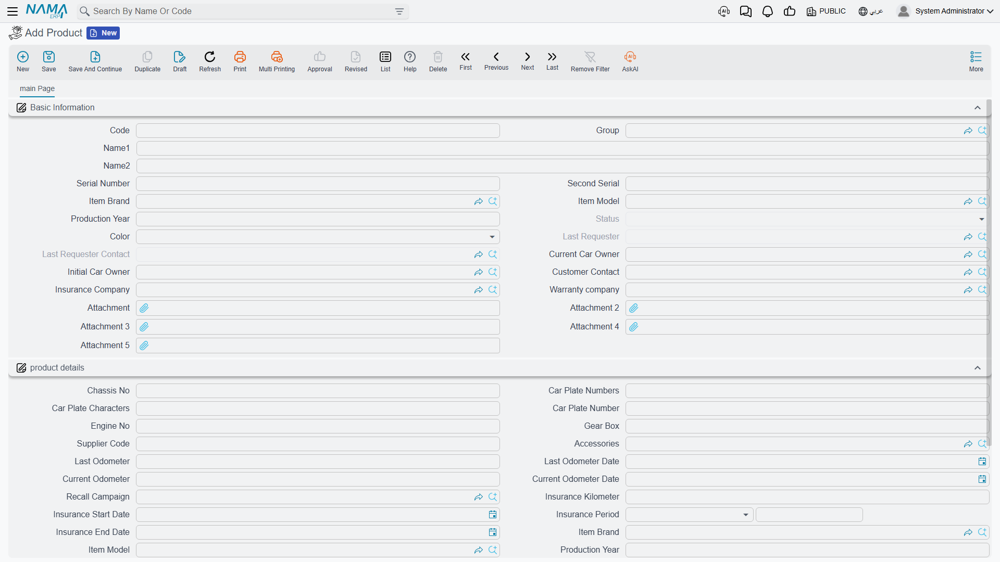

# The Serviced Product

When Fahad Al-Otaibi brings his NAWA Saif 1.6 in for its service, the workshop needs somewhere to keep the things that are true about *that car* rather than about this visit: its chassis number, its plate, who owns it, who insures it, what the odometer read last time, and what has been done to it before. That file is the **product** — the workshop's record of one physical vehicle.

The menu calls it simply **Product** (`منتج`), which undersells it. Everywhere else in this documentation it is "the vehicle file", because that is what a workshop uses it as.

| | |
|---|---|
| Menu | **Service Center → Master Files → Product** (`مركز خدمة > الملفات > منتج`) |
| Kind | Master file — no inventory effect, no accounting effect |

::: info Required licence
`srvcenter`
:::

## Al-Sahra's Example Vehicle

| Field | Value |
|---|---|
| Code | `VEH-2031` |
| Brand / model / year | NAWA / Saif 1.6 / 2023 |
| Serial (chassis) number | `NWA5S1B23K004471` |
| Engine number | `S16-224471` |
| Plate | `ر ط ص 4471` |
| Colour | Silver / فضي |
| Current owner | `CUS-1042` Fahad Al-Otaibi |
| Insurance company | `INS-02` Wafa Insurance |
| Warranty provider | `WRN-01` NAWA Warranty Programme |
| Accessories kit | `AK-STD` Standard Kit |

Every workshop page in this documentation is about this car.

::: danger The workshop's vehicle file and the showroom's car record are not connected
Al-Sahra also sells cars, and a car it sells gets a completely different record in a completely different register — the **[car file](/modules/servicecenter/cars-setup/car-master-file.md)**, under the `cars` menu root, with its own status engine and its own documents.

There is **no working link between the two**. A car sold by the showroom does not appear in the workshop's product list, and servicing a car does not touch the showroom record. The two reference fields in the model that were meant to join them are on no screen and are read by no code.

If you need the same physical vehicle to be visible on both sides, you must create it twice — once as a car record when it is bought, once as a product when it first comes in for service — and keep the chassis number identical so a human can match them. Nothing automates that, and nothing checks it.
:::

## The Screen

Everything lives on one page, in two blocks and three lists.

### Basic Information — Who and What

| Field | Arabic label | Notes |
|---|---|---|
| Code, Group, Name1, Name2 | الكود، المجموعة، الاسم العربي، الاسم الإنجليزي | Identity. `VEH-2031`. Name1 is the Arabic name, Name2 the English one. |
| Serial Number | الرقم المسلسل | The chassis number as the vehicle's serial. |
| Second Serial | الرقم المسلسل الثاني | A second identifier where one is needed. |
| Item Brand / Item Model | الماركة / الموديل | NAWA / Saif 1.6. These two drive labour rates and service intervals — see [brands and models](/modules/servicecenter/workshop-setup/servicecenter-brands-and-models.md). |
| Production Year | سنة الموديل | 2023. |
| Status | الحالة | **Read-only.** Where the car is in its visit — see below. |
| Color | اللون | Silver. |
| Last Requester / Last Requester Contact | مقدم آخر طلب / جهة اتصال مقدم اخر طلب | Filled by the system from the most recent service request. |
| Current Car Owner | المالك الحالي | Fahad Al-Otaibi. The party the workshop deals with. |
| Initial Car Owner / Customer Contact | المالك الأصلي / جهة اتصال العميل | Who first owned it, and the contact person. |
| Insurance Company | شركة التأمين | Wafa Insurance — the party behind an insurance share on a job. |
| Warranty company | شركه الضمان | NAWA Warranty Programme — the party behind a warranty share. |

### Product Details — the Metal and the Mileage

| Field | Arabic label | Notes |
|---|---|---|
| Chassis No | رقم الشاسيه | The chassis number again, in the details block. |
| Car Plate Numbers / Car Plate Characters | ارقام اللوحة / حروف اللوحة | The plate typed in two parts. |
| Car Plate Number | رقم لوحة السيارة | **Calculated** — the numbers and the characters joined with a space. Do not type into it. |
| Engine No | رقم المحرك | `S16-224471`. |
| Gear Box | ناقل الحركة | Manual, automatic, and so on. |
| Supplier Code | كود المورد | The supplier's own reference for the vehicle. |
| Accessories | مجموعة المحلقات | The accessories kit the car came with — a descriptive tag. |
| Last Odometer / Last Odometer Date | قراءة العداد السابقة / تاريخها | 41,600 on 1 January 2026. |
| Current Odometer / Current Odometer Date | قراءة العداد الحالية / تاريخها | 45,300 on 3 March 2026. |
| Difference Between Current OdoMeter and Last OdoMeter | الفرق بين القراءة الحالية وأخر قراءة | 3,700 km. |
| Average KM Daily Consumption | متوسط استهلاك الكيلومتر يوميا | **Calculated** — 3,700 ÷ 61 days = **60.7 km/day**. |
| Recall Campaign | حملة الإستدعاء | The campaign this vehicle is caught by, if any. |
| Insurance Kilometer | كيلومتر الضمان | The mileage limit on the cover. |
| Insurance Start Date / Insurance Period / Insurance End Date | تاريخ بداية التأمين / فترة التأمين / تاريخ انتهاء الضمان | The cover's window. |
| Item Brand / Item Model / Production Year | الماركة / الموديل / سنة الموديل | Repeated here for convenience — the same values as the block above. |
| Service Contract / Service Contract Status | عقد خدمة / حالة العقد | Filled by the system where the vehicle is on a contract. |

### How the Odometer Behaves

The two readings work as a pair, and the rule is simple: **a newer reading pushes the old one down a slot.** When a document reports a fresh reading, the current odometer becomes the last odometer, the new figure becomes the current one, and both dates move with them.

The reading refuses to go backwards. A document trying to record a lower number than the vehicle already carries is rejected unless it is explicitly forced — which is the behaviour you want, because a mistyped odometer would otherwise corrupt every service interval on the car.

The average daily consumption is only recomputed when enough time has passed. A module setting names the **minimum number of days** between readings for the average to be recalculated; readings closer together than that leave the previous average in place, precisely so that two visits in the same week do not produce a nonsensical figure.

That average is what turns mileage into dates. `VEH-2031` last had its oil changed at 36,000 km, the interval is 10,000 km, so the next is due at 46,000 — 700 km away at 60.7 km a day, about eleven and a half days, which is why the [job order closing](/modules/servicecenter/job-cycle/servicecenter-job-order-closing.md) projects a next visit of **15 March 2026**.

### Almost Nothing Financial Is Typed Here

Look down the field list and notice what is missing: no price, no cost, no rate, no account, no balance. The vehicle file is an identity record. Money lives on the job order, its closing and the invoices; the file's only contribution to a price is the **model**, which selects a labour rate and a package price elsewhere.

## Status — Read, Never Typed

The **Status** field is disabled on the screen, and deliberately so. The vehicle's status is not a value you set; it is the last word of a conversation between documents.

Each job document — the estimation, the job order, the shop-floor execution, the suspend and resume documents, the closing, the gate pass — can write a **status entry** against the vehicle when it commits. Which status it writes is set on that document's [`توجيه`](/modules/servicecenter/document-terms/servicecenter-terms-workshop.md). The entries are then read back in value-date order and the **last one wins**, which is what you see in the field. A `توجيه` can also name a notification to fire when the status actually changes.

Two consequences follow, and both bite in practice:

- **A back-dated document can change the current status.** Because the entries are ordered by value date rather than by when they were entered, committing a document with an earlier value date can insert itself into the middle of the sequence — or, if it is the latest, take over the field.
- **Cancelling a document removes its entry**, and the status falls back to whatever the remaining entries say.

The statuses available are:

| Status | Arabic |
|---|---|
| Not Started | لم تبدأ |
| Waiting Reception | إنتظار استقبال |
| Reception In Progress | جارى الاستقبال |
| Loading | إنتظار التحميل |
| In Progress | قيد التنفيذ |
| Discontinued Work | أعمال متوقفة |
| Repair Completed | إنتهاء الإصلاح |
| An Invoice Was Issued | تم اصدار فاتورة |
| Exited From The Center | خرجت من المركز |
| Canceled | ألغيت |
| Other 1 … Other 5 | أخرى 1 … أخرى 5 |

The five **Other** slots exist so an installation can name stages the standard list does not cover. Nothing is hard-coded to a particular status: which document sets which one is entirely a matter of how you fill the `توجيه` of each document.

## What Documents Write Back

Committing a job document fills in the vehicle's **empty** fields from what the document knows: chassis number, plate number, engine number, gear box, accessories kit, supplier code, recall campaign, brand, model, production year, and the three insurance fields.

The word *empty* is the whole rule. A field that already carries a value is left alone — the write-back is a convenience for cars whose file was created in a hurry at reception, not a synchronisation mechanism. If a value on the vehicle is wrong, correcting it on a document will not correct the file; open the file and fix it there.

## The Three Lists

At the bottom of the page sit three read-only lists, and together they are the vehicle's history.

**Services** (الخدمات) — the [job orders](/modules/servicecenter/job-cycle/servicecenter-job-order.md) raised against this vehicle. The first place to look when a customer says "you already fixed that".

**Product Last Service** (أخر الخدمات) — one row per task or service, holding when it was last performed and at what mileage. This is the register that [mileage-based maintenance](/modules/servicecenter/job-cycle/servicecenter-odometer-and-service-intervals.md) reads. For a vehicle that was serviced before the system went live, the register is seeded by the product task opening document, so intervals work from day one instead of treating every car as new.

**Product Status Entries** (ملخص تغير حالة منتج) — the audit trail behind the status field: which document, from which status to which, and over what dates. When somebody asks why a car shows *Repair Completed* when it is standing in the yard, this list has the answer.

## Creating a Vehicle File

1. Create the record at first contact — usually at reception, when the car arrives for the first time.
2. Fill the identity: code, names, **serial (chassis) number**, engine number, plate, colour, production year.
3. Set **Item Brand** and **Item Model** carefully. These two fields decide the labour rate the job order proposes and the mileage interval a maintenance task uses; a wrong model quietly produces wrong prices.
4. Name the **Current Car Owner**, and the insurance and warranty companies if the vehicle is covered — those are the parties who will [carry a share of a bill](/modules/servicecenter/job-cycle/servicecenter-payer-split.md).
5. Record the odometer as it reads on arrival, with its date.
6. Leave **Status**, the calculated plate, the average consumption, the contract fields and the three lists alone. They fill themselves.
