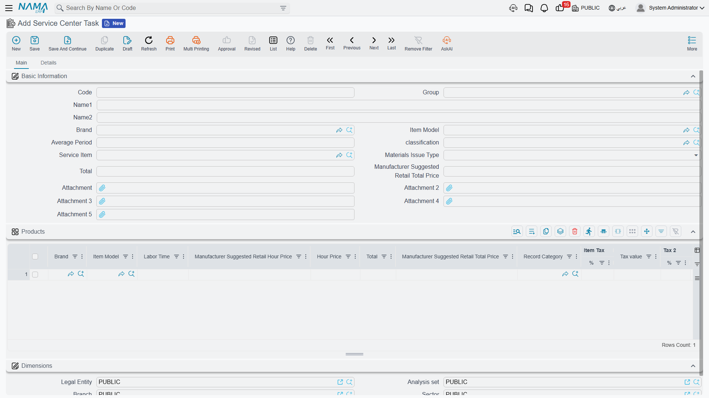

# Service Tasks

A workshop sells time. Before it can put a price on a repair it has to agree what the repair *is* — "change the engine oil and the oil filter", "replace the front brake pads" — how long that takes on a normal car, what parts it swallows, and what an hour of it costs. The **service task** is that agreement written down.

It is the atom of the whole workshop. Everything larger is built from tasks: a [service](/modules/servicecenter/workshop-setup/servicecenter-operations.md) is a bundle of them, a [job order](/modules/servicecenter/job-cycle/servicecenter-job-order.md) is a list of them, the [shop-floor time sheet](/modules/servicecenter/workshop-execution/servicecenter-production-execution.md) clocks them one by one, and the customer's invoice carries one line per task performed.

| | |
|---|---|
| Menu | **Service Center → Master Files → Service Center Task** (`مركز خدمة > الملفات > المهمه`) |
| Kind | Master file — no inventory effect, no accounting effect |

::: info Required licence
`srvcenter`
:::

## Al-Sahra's Catalogue

Five tasks carry the whole of this documentation's workshop story:

| Code | Task | Standard hours | Hour price | Recurs every |
|---|---|---|---|---|
| `TSK-OIL` | Engine oil and filter change / تغيير زيت وفلتر | 1.0 | 120 | 10,000 km |
| `TSK-BRK` | Front brake pad replacement / تغيير تيل الفرامل الأمامي | 1.5 | 120 | — |
| `TSK-AC` | A/C compressor replacement / تغيير كمبروسر التكييف | 3.0 | 120 | — |
| `TSK-ALN` | Wheel alignment / ضبط زوايا الإطارات | 0.5 | 120 | — |
| `TSK-WSH` | Vehicle wash and valet / غسيل وتنظيف السيارة | 0.5 | 120 | — |

Read the first row as a sentence: *an oil and filter change on a NAWA Saif 1.6 takes one hour, that hour is billed at 120, and the car needs it again 10,000 km later.*

## A Task Is a Catalogue Entry, Not a Job

The single most common misreading of this screen is to treat it as work in progress. It is not. Nothing on the task record belongs to one car, one customer or one day. It is a price list entry and a method sheet — the thing the workshop *can* do.

The performed work lives elsewhere: as a line on a job order (planned), and as a clocked line on the shop-floor time sheet (actual). Editing a task never changes a job order that has already been raised; the figures were copied onto the job order when the task was picked.

## The Main Tab

### Basic Information

| Field | Arabic label | What it does |
|---|---|---|
| Code, Group, Name1, Name2 | الكود، المجموعة، الاسم العربي، الاسم الإنجليزي | Identity. Name1 is Arabic, Name2 English. |
| Brand | الماركة | Header classification — which marque this task belongs to. |
| Item Model | الموديل | Header classification — which model. |
| Average Period | متوسط مدة العملية | **The generic standard duration**, in hours. `1.0` for the oil change. This is the figure used when no model-specific row fits. |
| classification | التصنيف | A free tag from the Standard Operation Classification file. |
| Service Item | صنف الخدمة | **The item that gets invoiced.** When a job order is [invoiced](/modules/servicecenter/job-cycle/servicecenter-job-order-invoicing.md), this is the item on the labour line — `SRV-OIL` for the oil change — with a quantity of standard hours × count. Without it the task cannot be billed. |
| Materials Issue Type | طريقة صرف المواد الخام | **Automatic** (تلقائي) or **Manual** (يدوي) — how the parts this task consumes are meant to leave the store. |
| Total | إجمالي السعر | A flat total price for the task. |
| Manufacturer Suggested Retail Total Price | إجمالي سعر المورد | The manufacturer's list price for the same task, used instead of Total when the module is set to the MSRP pricing strategy. |

::: tip The brand field is spelled `brad`
Wherever you refer to this field by its identifier — an import file, a criteria definition, an entity flow, a query expression — the correct spelling is **`brad`**, not `brand`. The screen label reads "Brand"; the identifier does not. The same typo appears on the Products grid below.
:::

### The Products Grid — Labour Time per Model

Below the basic block is the grid headed **Products** (منتج), and despite the name it is not a list of vehicles. It is the manufacturer-style **labour-time guide**: one row per model, saying how long *this* task takes on *that* model and what the hour costs.

| Column | Arabic label | What it holds |
|---|---|---|
| Brand | الماركه | The marque. Required on every row. |
| Item Model | الموديل | The model — `MDL-SAIF16`. |
| Labor Time | مدة التشغيل | Hours this task takes on this model — `1.0`. |
| Hour Price | سعر الساعة | The rate — `120`. |
| Manufacturer Suggested Retail Hour Price | سعر ساعة المورد | The manufacturer's rate for the same hour. |
| Total | إجمالي السعر | Labour time × hour price, filled in for you. |
| Manufacturer Suggested Retail Total Price | إجمالي سعر المورد | The same product using the manufacturer's rate. |
| Record Category | تصنيف سجل | Optional. Lets you hold different rates for different categories of document. |
| Item Tax and Tax 2 / 3 / 4, Total After Taxes | ضريبة مبيعات … | The tax treatment carried with the row. |
| Description | الوصف | Free text. |
| Legal Entity, Branch, Sector, Department, Analysis Set | الشركة، الفرع، القطاع، الإدارة، المجموعة التحليلية | Dimensions on the row. |

Al-Sahra keeps this simple: each of the five tasks carries **one row, for `MDL-SAIF16`**, at the labour time and the 120 rate in the table above. That is deliberate, and the next section explains why.

## Where the Hours and the Rate Actually Come From

Pick `TSK-OIL` on a job order for `VEH-2031` and two numbers appear on the line: **1.0 hours** and **120 an hour**, giving a line total of 120. Where did they come from?

The screen looked in the task's Products grid for a row that fits the vehicle in front of it, found the `MDL-SAIF16` row, and took its labour time and hour price. If it had found nothing, it would have fallen back to the header — the **Average Period** and the header **Total** — and derived an hour price by dividing one by the other.

That is the behaviour you see while typing. The complication is what happens afterwards.

::: warning Three matching rules, one grid — keep it simple
The product row that fits your vehicle is chosen by three different rules in three different places:

- while you are **picking the task on a document**, the match considers the model, the brand, the record category and the dimensions;
- when the server **recalculates prices** on the saved document, the match considers the **model and the record category only** — the brand column is ignored — and where nothing matches it falls back to the **work center's** hour price and the task's Average Period, not to zero;
- while you are **building a service** out of tasks, a brand-only row can win over a model-specific one.

You cannot control which rule runs where. What you can control is your data, so that all three rules land on the same row:

1. **One row per model.** Never two rows for the same model that differ only by brand — the first one always wins and the brand column will not save you.
2. **Fill Brand with the marque that actually owns the model.** The column is required, so you have no choice; just do not expect it to select anything.
3. **Leave Record Category empty** unless you genuinely price by document category, and then use it on every row.
4. **Make the work center's hour price agree with your rows.** At Al-Sahra both are 120, so a recalculation cannot move the price.

After any bulk recalculation, reopen a job order and check the labour figures before invoicing.
:::

::: tip Which price column is used
The module setting **Service Price Strategy** decides whether the workshop reads the ordinary **Hour Price** column or the **Manufacturer Suggested Retail Hour Price** column. It is an installation-wide switch, not a per-task one. Al-Sahra uses the ordinary price throughout.
:::

## The Details Tab

### Raw Materials — What the Task Consumes

The grid headed **Raw Materials** (المواد الخام) is the task's bill of materials.

| Column | Arabic label | What it holds |
|---|---|---|
| Material | مادة خام | The spare part — `SP-OIL-5W30`, `SP-FLT-OIL`. |
| Item Model / Item Brand | الموديل / الماركة | Which vehicles the row applies to. |
| Primary UOM / Primary Quantity | الوحدة الرئيسية | How much of it the task uses — 5 litres of oil, 1 filter. |
| Issue Type | طريقة الصرف | Automatic or manual issue for this part. |
| Restrict In Issuing | المطابقة في السحب | Whether the store is held to the planned quantity when the part is issued. |
| Description | ملاحظات | Free text. |

On a job order there is a button, **Collect Resources and Materials** (تجميع الموارد والمواد الخام), which walks the task lines already on the order and appends each task's standard materials — filtered by the vehicle's model and brand — pricing each one through the ordinary sales-price engine. That is how the oil change's 5 litres and one filter reach the [spare-parts grid](/modules/servicecenter/spare-parts/servicecenter-spare-parts-overview.md) without anyone typing them.

::: tip Restrict In Issuing is set by the document
The Restrict In Issuing column also appears on the job order's spare-parts grid, and there it is forced from the job order's `توجيه` on every save. Setting it here describes your intent; the document decides.
:::

### Resources — the Machines It Needs

A second grid, **Resources** (الموارد المستخدمة), lists the equipment the task needs: **Resource** (` مورد تشغيل`), **Resources Count** (العدد), **Resource Rate** (مدة عمل المورد) and a description. The same job-order button that collects materials also collects these onto the order.

They travel as descriptive columns. There is no equipment scheduling anywhere in the module, so listing the alignment rig here documents the method — it does not reserve the rig.

### Recurrence — What Makes a Task Come Back

The rest of the tab is about mileage-based maintenance.

- **Default Recur Every Kilometre** (القيمة الافتراضية لمدة تكرار الخدمة) — the general interval. `10,000` on the oil change.
- The **Recurrence Rates** grid (سطور معدلات التكرار) — per **Product** (المنتج), **Item Model** (الموديل) and **Item Brand** (الماركة), each with its own **Recur Every KM** (تكرر كل / كم). Use it when the same task recurs at different intervals on different models, or on one particular vehicle.

The first matching row wins; if none matches, the default interval applies.

That interval is what makes the arithmetic on the [vehicle's file](/modules/servicecenter/workshop-setup/servicecenter-product-file.md) mean something. `VEH-2031` last had its oil done at **36,000 km**; the interval is **10,000 km**; so the next one falls due at **46,000 km**. The car reads **45,300** on 3 March and burns about **60.7 km a day**, which puts the next visit around **15 March 2026** — and that is the date the job order closing projects.

::: danger Do not use "Collect Tasks" to find what is due
The job order carries a button, **Collect Tasks** (تجميع المهام), which is meant to read the [vehicle's odometer and the last-service register](/modules/servicecenter/job-cycle/servicecenter-odometer-and-service-intervals.md) and propose the maintenance that has come due. **It proposes the opposite set** — the tasks that are *not* yet due — so a car that needs its oil change gets nothing and a freshly serviced car gets the full list.

Enter the due tasks by hand. Al-Sahra's five tasks on job order `SCJO-2026-0417` were all typed in, and every worked example in this documentation does the same.
:::

## Two Things the Task Does Not Do

**It does not filter itself by the vehicle.** On a job order, the task picker shows every task in the catalogue regardless of the car's model. The filter that would narrow it exists in the model but is switched off in the code. If you want technicians to find the right task quickly, use codes and groups that sort well — the system will not narrow the list for you.

**Its classification changes nothing.** The **classification** field, and the whole Standard Operation Classification file behind it, are a free tag. No price, no filter, no grouping and no report reads it. Use it for your own record-keeping, and see [tags and classification files](/modules/servicecenter/workshop-setup/servicecenter-classification-files.md).

## Building the Catalogue

1. Create the work center first, so its hour price is available as the safety net.
2. Create one task per repair step you want to be able to quote, name and clock separately. Resist the urge to make one task mean "full service" — that is what a [service bundle](/modules/servicecenter/workshop-setup/servicecenter-operations.md) is for.
3. Give every task a **Service Item**. Without one the labour cannot be invoiced.
4. Set the **Average Period** to the honest generic duration, then add one Products row per model you actually service, at the labour time and rate that model deserves.
5. Add the raw materials and the equipment if you want the job order's collect button to fill them in.
6. Add a recurrence interval to anything mileage-based, and give the mileage-based tasks the tightest naming — they are the ones a service advisor hunts for under pressure.
