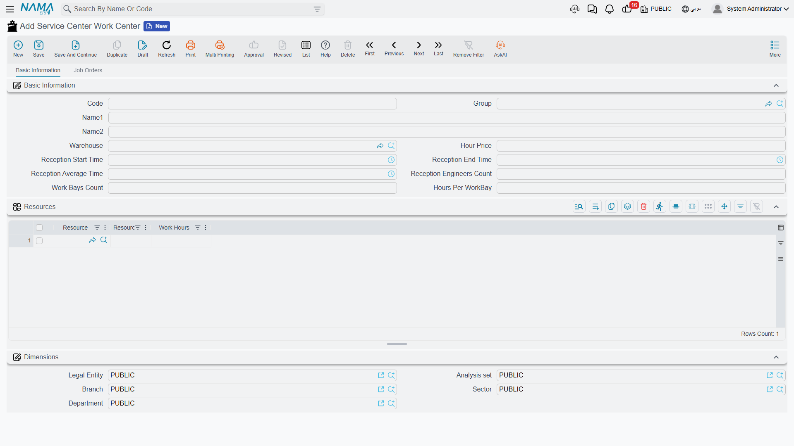

# Work Centers

Al-Sahra Motors runs two halls behind the showroom: a mechanical hall where oil changes, brakes and air-conditioning work happen, and a body-and-paint hall. They are different rooms, with different people, different equipment and different hourly rates, and a customer's car goes to one or the other. The **work center** is the file that says so.

It is a short file — a dozen fields on one page — and that shortness is the point. The work center answers three questions and no more: *which store do the parts come from, what does an hour of labour cost here, and how big is the shop?*

| | |
|---|---|
| Menu | **Service Center → Master Files → Service Center Work Center** (`مركز خدمة > الملفات > مركز خدمة`) |
| Kind | Master file — no inventory effect, no accounting effect |

::: info Required licence
`srvcenter`
:::

::: tip The name collides with the menu root
The Arabic name of this master file is `مركز خدمة` — exactly the same wording as the top-level menu root. When somebody says "open the service center", ask whether they mean the module or this file.
:::

## The Two Halls at Al-Sahra

| Code | Name | Warehouse | Bays × hours | Hour price |
|---|---|---|---|---|
| `WC-MECH` | Mechanical Hall / صالة الميكانيكا | `WH-PARTS` | 5 × 8 | **120** |
| `WC-BODY` | Body and Paint Hall / صالة السمكرة والدهان | `WH-PARTS` | 3 × 8 | 150 |

Every [job order](/modules/servicecenter/job-cycle/servicecenter-job-order.md), every appointment and every [shop-floor time sheet](/modules/servicecenter/workshop-execution/servicecenter-production-execution.md) names one of these two. The rest of this page walks the fields that make them different.

## The Screen

### Basic Information

| Field | Arabic label | What it is for |
|---|---|---|
| Code, Group, Name1, Name2 | الكود، المجموعة، الاسم العربي، الاسم الإنجليزي | The usual master-file identity. Name1 is the Arabic name, Name2 the English one. |
| Warehouse | المخزن | The shop's default store. `WH-PARTS` for both Al-Sahra halls — [spare parts are issued](/modules/servicecenter/spare-parts/servicecenter-spare-parts-issue.md) from here onto a job order. |
| Hour Price | سعر الساعة | The **fallback** labour rate for this shop: `120` in the mechanical hall, `150` in body and paint. It is used only when a service task has no rate of its own for the vehicle's model — see below. |
| Reception Start Time / Reception End Time | وقت بدء الاستقبال / وقت انتهاء الاستقبال | The window during which the shop takes cars in. `08:00` → `14:00` at Al-Sahra. Bookings outside the window are refused — with the qualification below. |
| Reception Average Time | متوسط مدة الاستقبال | How long the reception desk takes with one car — 15 minutes at Al-Sahra. |
| Reception Engineers Count | عدد مهندسي الاستقبال | How many service advisors staff the desk — 2 at Al-Sahra. |
| Work Bays Count | عدد اماكن العمل | Physical working positions. `5` in the mechanical hall. |
| Hours Per WorkBay | الساعات لكل مكان | How many hours a bay is worked in a day. `8`. |

Three of these fill themselves in if you leave them blank when you save: reception start becomes **08:00**, reception end becomes **14:00**, and the average reception time becomes **15 minutes**. If you want different values, type them — do not expect a blank field to stay blank.

### Bays × Hours — the Only Capacity Number

Multiply the last two fields and you get the shop's **total available hours** for a day:

> 5 bays × 8 hours = **40 hours a day** in the mechanical hall.

That 40 is the raw material for the [daily capacity sheet](/modules/servicecenter/workshop-execution/servicecenter-loading-table.md), where it is split between appointments, carry-over, walk-ins and emergencies. Al-Sahra publishes 80 % of it — **32 hours** — as bookable appointment time, and that is the figure an appointment is actually checked against.

The number is computed on the capacity sheet, not here. The work center simply supplies the two factors.

::: warning The first booking of a day is never checked
The check that compares a booking against the reception window and the appointment hours only runs when the day already holds another reservation. The **first** booking of any day passes untested — it can be for fifty hours, at midnight, and nothing objects. The second one is checked, and the total includes the first.

In practice this means a shop that takes one appointment a day is not being controlled at all, and a wrongly entered first booking silently eats the day's capacity before anyone notices.
:::

::: danger Publish capacity for one hall only
The daily capacity sheet does not distinguish between work centers. If you publish a sheet for the mechanical hall and another for the body-and-paint hall over the same dates, one silently overwrites the day capacity the other published, and a booking can end up checked against the wrong hall's hours.

Until this is fixed, treat published capacity as an **installation-wide** figure: publish it once, for the shop you actually want to control, and manage the second hall's load by hand. Do not build a multi-hall capacity plan on it.
:::

### The Resources Grid

Below the basic block sits a grid headed **Resources** (` موارد التشغيل`), with three columns — **Resource** (` مورد تشغيل`), **Resources Count** (العدد) and **Work Hours** (ساعات العمل). It invites you to list the lift, the alignment rig, the paint booth and how many hours a day each is available.

::: warning This grid is recorded and never used
Nothing in the module reads these rows. There is no equipment scheduling, no finite-capacity check, no "the alignment rig is busy" message — the counts and hours you type here change no behaviour anywhere.

Fill the grid if you want the file to describe the shop honestly for a human reader, and leave it empty if you do not. Either way, plan equipment availability outside the system.
:::

### Dimensions

The standard block — Legal Entity (الشركة), Branch (الفرع), Sector (القطاع), Department (الإدارة) and Analysis Set (المجموعة التحليلية) — files the work center in the organisation.

### The Job Orders Tab

The second tab, **Job Orders** (أوامر الشغل), is read-only. It carries three lists — **Executions** (التنفيذات), **Exceptions** (الإستثناءات) and **Waiting Orders** (الأوامر المؤجلة) — so a supervisor can open the hall's file and see what it is carrying, including the orders [suspended and waiting to be resumed](/modules/servicecenter/workshop-execution/servicecenter-pending-and-resume.md), without going to the job-order list view. Nothing is typed here.

## The Hour Price Is a Fallback, Not a Price List

This is the field readers most often misunderstand, so it is worth stating twice.

When you pick a service task on a job order, the system first looks inside the **task** for a rate that fits the vehicle's model. Al-Sahra's oil change carries a row for the Saif 1.6 at 120 an hour, so that is the rate the job order takes — the work center's 120 is never consulted.

The work center's rate is what the **server-side recalculation** falls back to when the task has no row that matches. So the two numbers should agree, and at Al-Sahra they deliberately do: 120 in the mechanical hall, 120 on the Saif 1.6 rows of every mechanical task. Where they disagree, a recalculation can quietly move the price of a job. The [service task](/modules/servicecenter/workshop-setup/servicecenter-tasks.md) page has the full story.

## There Is No Resource Hierarchy

The work center is the **only** workshop resource in the module. There is no bay record, no equipment calendar, no technician roster with a capacity, and no parent/child structure of shops. A shop is one flat file with a bay count on it.

::: warning "Station" is not a workshop bay
Under the same Master Files folder you will find a master file called **Service Center Station** (`محطة`). It looks like it should be a bay or a work station, and it is not: it belongs to the vehicle **trip and route** feature, where it names a departure or arrival point. It has no fields beyond code, names, dimensions and attachments, and nothing in the workshop reads it.

Do not model your bays as stations. Model them as the bay count on the work center — that is the only place the number means anything.
:::

## Setting One Up

1. Decide how many work centers you really need. One per hall that has its **own labour rate** or its **own store** is a good rule; splitting further buys you nothing, because the module gives you no cross-shop scheduling.
2. Create the record with its code and both names, point **Warehouse** at the store the shop draws parts from, and set **Hour Price** to the rate you will also put on your task rows.
3. Set the reception window to the hours the desk really takes cars in — an appointment outside it is refused, so a wrong window is felt immediately.
4. Type the bay count and hours per bay. These are the two factors behind the shop's daily hours; get them right before anyone publishes capacity.
5. Leave the resources grid to your own judgement, knowing it is descriptive.

Once the work center exists you can build the [task catalogue](/modules/servicecenter/workshop-setup/servicecenter-tasks.md) and bundle tasks into [services](/modules/servicecenter/workshop-setup/servicecenter-operations.md).
