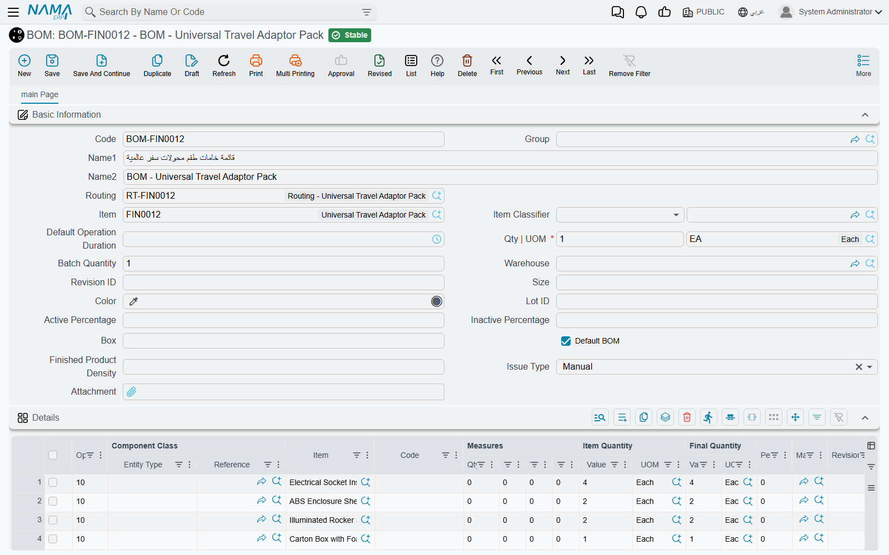
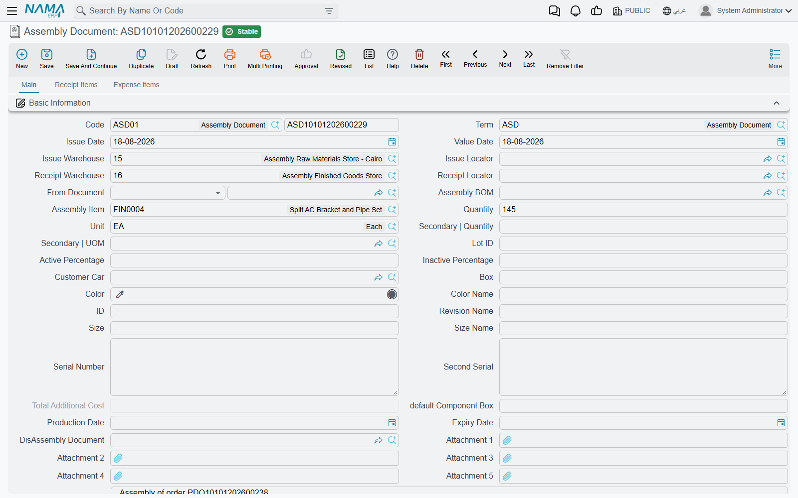

# Assembly & Packaging

Not everything you sell is bought as-is; some items are assembled from components, or transformed and packaged before sale. **Assembly** is the "light manufacturing" within the supply chain: you issue components and receive an assembled product, without the complexity of full production orders in the Manufacturing module.

::: info When Assembly, When Manufacturing?
Use assembly for simple cases: kitting, building custom configurations, or packaging. Complex production with its stages, labor, and overhead belongs in the [Manufacturing module](/modules/manufacturing/).
:::

## The Bill of Materials: The Recipe (AssemblyBOM)

The **Assembly BOM** is the "recipe" of the assembled product: it defines the main item, its components and their quantities, plus co-products and dimension specifiers (size, color, revision), and the issue and receipt warehouses and locators for the assembly operation. It also allows linking alternative materials when source flexibility is needed.

To reduce repetitive entry, the **Partial Assembly BOM** (PartialAssemblyBOM) lets you define an assembly rule at the item-classification level (not per item), so similar items inherit their component structure. The **Assembly Component** (AssemblyComponent) is available as a registry of reusable component sets.

## The Assembly Document: Executing the Recipe (AssemblyDocument)

The **Assembly Document** actually executes the operation: it issues components from inventory and receives the assembled item, allocating costs from components to the finished product and co-products, with the ability to track processing stages and quality control.

**Example - assembling computer systems:** a customer orders 20 complete systems. The document issues 20 base units, 20 monitors, 20 keyboards, and 20 mice, and receives 20 integrated systems. Component stock decreases, system stock rises, and value moves from components to systems (a system's cost = the sum of its components). The system also supports **de-assembly** to reverse the operation: breaking an unsold kit back into its components to restock them.

### Assembly Types and Tools

- **Aggregated Assembly Document** (AggrAssemblyDocument): a batch assembly document for multiple items/days with accumulated materials and costs, separating staging and final warehouses and generating the linked issue and receipt documents.
- **Multi-Assembly Document** (MultiAssemblyDoc): assembles a main item from multiple materials and components in a single document.
- **Assembly Request** (AssemblyRequest): starts the assembly path as a request (with its components and quantities) and converts to an assembly document after approval.
- **Alternative Materials** (AssemblyAltMaterial): a register of approved alternative materials per BOM, with quantity ranges and substitution rules that maintain component compatibility with source flexibility.

### Supporting Configuration Files

- **Assembly Process File** (AssemblyProcessFile): defines the assembly process steps (process routing) for quality control and batch tracking.
- **Assembly Machine** (AssemblyMachine): defines the machine used and its raw and indirect material warehouses, outputs, and costs.

## Processing (ProcessingDoc)

The **Processing Document** records intermediate processing operations: it manages raw and indirect materials and outputs with warehouse and locator assignment, and generates the linked inventory documents with direct-labor tracking and batch date/time for traceability.

## Packaging (PackagingMethodFile)

The **Packaging Method File** defines the standard packaging units for the finished product and its packaging components (the quantity per package), used in costing and delivery consolidation. This links the product's form as sold (pack, carton, pallet) to its actual components in inventory.

## Actions on these screens

**On the Assembly Document and the Assembly Request:** **Calculate Values From Expense Items** — works out each expense line's value from the assembly quantity and the assembled item, and writes it back onto the lines, so the overhead carried into the assembled item is not typed by hand.

**On the Aggregated Assembly Document:**

- **Calc Materials** — the document must be saved; it works out the materials the whole aggregation needs and fills the materials grid.
- **Calculate Main Materials Dependent Data** — also needs the document saved, and fills in everything that follows from the main materials once they are known.
- **Collect Material Lots** and **Collect Material Boxs** — fill the batch and the box on each material line from what is available in the header warehouse. Both ask first whether to clear what is already entered.

**On the Multi Assembly Document:**

- **Spread Main Items** — expands the main-items grid into the detail lines, so one row per finished product becomes the full set of lines.
- **Change Details Status To Create Assembly Documents By Level** — flips the line statuses so the assembly documents are generated level by level, which is what a multi-level build needs.
- **Delete Generated Assembly Documents** — removes the assembly documents this one produced. It asks for confirmation first and does nothing until you give it.

**On the Processing Document**, the direct-labour grid carries **Start** and **End**: standing on a labour line, they stamp its start and its end date and time, so the time spent is recorded as the work happens rather than estimated afterwards.

## Assembly and Cost

Assembling a product means rolling up its cost. **Finished Product Pricing** captures this roll-up from the BOM or the assembly document to arrive at the final cost - you'll find the details in [Inventory Costing & Revaluation](./inventory-costing.md).

## Messages you may see

| Message | Why | What to do |
|---|---|---|
| *Cannot save without issued items when using bom* — «لا يمكن الحفظ بدون أصناف مسحوبة عند إستحدام طريقة تجميع» | The assembly document names a BOM but its issued-items grid is empty, and the document's term has *Prevent Save Without Issued Items If Using BOM* switched on. | Fill the issued-components grid from the BOM before saving, or clear that option on the term if empty drafts are wanted. |
| *Could not find co product line with cost line id {0}* — «لا يوجد سطر في الاصناف الموردة بمُعرف تكلفة {0}» | Cost is being distributed onto the co-product source line only, and a detail line carries a cost line id that matches no co-product row. | Correct the cost line id on the detail so it matches a co-product row, or add the missing co-product. |
| *Cost line id {0} is repeated at line {1}* — «معرف التكلفة {0} مكرر في السطر {1}» | Two co-product rows share the same cost line id, so the system cannot tell which one a cost belongs to. | Give each co-product row its own cost line id. |
| *Assembly Processes do not contain the Co-Product {0}* — «لا تحتوى عمليات التجميع على الصنف المورد {0}» | The term has *Prevent Save If Co-Prod Not In Assembly Operations* on, and a co-product on the document is not produced by any of the assembly process lines named on it. | Add that item to the assembly process file's lines (calculated from co-products), or remove the co-product from the document. |
| *The item {0} at line {1} - document {2} - {3} can not be issued and receipted from the same assembly document* — «الصنف {0} في السطر رقم {1} - في المستند {2} - {3} لا يمكن صرفه وتوريده من نفس سند التجميع» | The same item, with the same batch, size, colour and revision, appears both among the components issued and among the items received. Cost cannot flow out of and into the same stock line in one document. | Split the operation into two documents, or distinguish the received stock by batch, size, colour, revision, warehouse or locator. |
| *Please fill additional cost doc book and term in the term {0}* — «يرجي ملأ دفتر وتوجيه التكاليف الإضافيه في التوجيه {0}» | The assembly document has expense lines, so it must generate an Additional Cost document, but the term it was saved under names no book and term for that document. | Open the document's term and fill *Additional Cost Doc Book* and *Additional Cost Doc Term*. |
| *Item {0} does not contain uom {1}* — «الصنف {0} لا يحتوي على الوحدة {1}» | A unit was entered on the assembly BOM's item, or on an assembly document line, that is not among that item's primary or secondary units. | Pick one of the units listed on the item, or add the unit to the item's units grid first. |
| *From date {0} can not be after to date {1} in line number {2}* — «من تاريخ {0} لا يمكن أن يكون أكبر من إلى تاريخ {1} في السطر رقم {2}» | An alternative-BOM line on the Assembly BOM has a From Date that is not earlier than its To Date. Equal dates are refused too, so a one-day window has to be entered as two consecutive dates. | Set To Date at least one day after From Date. |
| *Default Quantity unit of measure must be one of the component {0} primary units* — «وحدة الكمية الافتراضية يجب أن تكون من وحدات المكون {0}» | The quantity unit on a component line of the BOM is not one of that component's **primary** units — a secondary unit is not accepted here, even though it is accepted on the BOM's own item. | Change the line's unit to one of the component's primary units. |
| *Assembled unit of measure must be one of the component {0} primary units* — «وحدة كمية الصنف المجمع يجب أن تكون من وحدات المكون {0}» | The Assembled UOM on a component line is not a primary unit of the assembled item the BOM is for. Despite the wording, the item named in the message is the assembled item, not the component. | Change Assembled UOM to one of the assembled item's primary units. |
| *Assembly Bom Can not be empty in line {0}* — «لايمكن ترك طريقة التجميع فارغة» | A detail line of the Multi-Assembly Document has no assembly method, so the system does not know the recipe to build that product from. | Fill the assembly method on the line. The Arabic text does not repeat the line number the English one gives. |
| *The item {0} at line {1} is not included in the grid* — «الصنف {0} في السطر {1} غير موجود في تفاصيل بنود المصروفات» | An expense line of the Multi-Assembly Document names an item that is not one of the products being assembled, so there is nothing for the expense to load onto. | Change the expense line to one of the assembled products, or add that product to the details grid. |
| *Total quantity {0} of {1} must be same as header quantity ({2})* — «إجمالى الكمية {0} لسطور {1} يجب أن تساوى الكمية فى الهيدر ({2})» | On Alternative Materials, the quantities in one of the alternative grids do not add up to the quantity on the header, so the substitution would change the recipe's total. | Adjust the grid's quantities until they total the header quantity — each of the five grids is checked separately. |
| *Expense Item {0} can not be percentage of it is self* — «لا يمكن ليند المصروف {0} ان يكون نسبة من نفسه» | A line of the Assembly Process File makes an expense item a percentage of a set of expenses that includes itself, which cannot be computed. | Remove that expense item from its own additional-cost set. |
| *Option {0} can be activated only with value {1} of field {2}* — «الأوبشن {0} يجب تقعيله مع القيمة {1} للحقل {2}» | On the Assembly Process File, *Copy Item To Dist Cost On Item* was ticked on a line that calculates from the details grid rather than from co-products. | Either set the line to calculate from co-products, or untick the option. |
| *Packaging method files are added only with value {0} in field {1}* — «لا يمكنك استعمال ملفات طرق التعبئة مع القيمة {0} للحقل {1}» | Packaging method files were attached to an Assembly Process File line that does not calculate from co-products. | Set the line to calculate from co-products, or remove the packaging method files from it. |

## Next Steps

- [Inventory Costing & Revaluation](./inventory-costing.md) - rolling up the costs of assembled products
- [Quality Control](./quality-control.md) - quality checks within assembly stages
- [Manufacturing module](/modules/manufacturing/) - complex production with full orders
