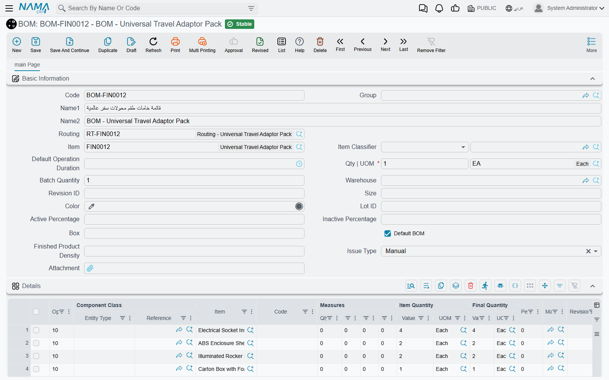

# Assembly BOMs, Components & Packaging Methods

Before you can assemble anything the system needs to know the recipe. A PC shop that builds a **DT-500 desktop** knows by heart that it takes one case, one motherboard, two 8 GB memory sticks and one 512 GB drive — the Assembly BOM is where you write that down once, so every assembly document after it can fill itself in.

This page covers the recipe and the master files that hang off it. The documents that use the recipe are on [Assembly Requests & Assembly Documents](./assembly-documents-and-requests.md).

## The Assembly BOM

**Inventory → Assembly Documents → Assembly BOM** (*المخازن ← التجميع ← طريقة تجميع أصناف*). Inside documents the same record is called **Assembly BOM** (*طريقة التجميع*).

### The header

| Field | What it does |
|---|---|
| **Item** | The finished item this recipe makes — the DT-500. |
| **Item UOM** | The unit the recipe is written for. It must be one of the item's primary or secondary units. |
| **Issue Warehouse** / **Issue Locator** | Where the components are normally taken from. |
| **Reciept Warehouse** / **Receipt Locator** | Where the finished item is normally put. |
| **Revision ID**, **Size**, **Color** | The variant of the finished item, when the recipe is for one variant only. |
| **Average Sales Price** | Copied to the finished-item line of the assembly document; used when cost is split by sales value (see [how cost is split](./assembly-documents-and-requests.md#How-the-cost-is-split)). |
| **Do Not Share Unplanned Items Cost** | Used with planned-details costing: a product made from this BOM does not take a share of components that were not in its recipe. |
| **Update CoProducts Quantity With Main** | When ticked, the by-products in the **Coproducts** grid scale with the quantity assembled instead of being copied as fixed quantities. |

Picking the BOM on an assembly document copies the item, its unit, both warehouses and locators, the variant and this last option into the document header, so the people doing the work rarely type any of them.

### The Details grid — the ingredients

Each line names either an item or a **Component** (see below) in **Item/Component**, and says how much of it goes into how much finished product:

- **Quantity For Assembly Item | UOM** and **Default Quantity** — how much of the component. The unit must be one of the component's **primary** units.
- **Assembled Item Quantity | Quantity** and **UOM** — per how much of the finished item. Leave it empty and the system fills **1** of the BOM's Item UOM. The unit must be a primary unit of the finished item.

So "2 memory sticks per 1 PC" is Default Quantity 2, Assembled Item Quantity 1. A drum of glue that serves 50 PCs is Default Quantity 1, Assembled Item Quantity 50 — an assembly of 20 PCs then issues 0.4 drums. **Quantity Always Integer** rounds the issued quantity up to a whole number (1 drum, not 0.4). **Min. Quantity** and **Max. Quantity** are bounds; if Default Quantity is left empty it takes the minimum, or failing that the maximum.

The rest of the line controls *when* it applies and *where* it comes from:

- **Issue Warehouse** / **Issue Locator** on the line is copied to that component's line on the document. Note that an assembly document with an Issue Warehouse in its header writes the header warehouse onto every issued line when it is saved, so a per-line warehouse only survives when the document header leaves Issue Warehouse empty.
- **Use Only With Assembled UOM / Size / Color / Lot Id / Revision Id / Box / Active Percent / Inactive Percent** — the line is used only when the item being assembled has that value. One BOM can then cover a red and a blue variant, each pulling its own paint.
- **Use Only With Main Item Revision Ids / Colors / Sizes** — the same idea with a comma-separated list of values.
- **Sub Assembly BOM** — the component is itself assembled, from this BOM. The [Multi Assembly Document](./multi-level-and-aggregated-assembly.md) follows these links to build every level.
- **Material Classification** — links the line to a grid of the Alternative Material screen (below).
- **Main Material**, **Dependent On Carton Count**, **One Per Ballet**, **For Main Materials** — used only by the [Aggregated Packaging Document](./multi-level-and-aggregated-assembly.md#The-Aggregated-Packaging-Document). Only one line may be the Main Material.
- **Average Sales Price**, **Cost Type**, **Cost Percentage** — used when this BOM is the recipe for *taking an item apart* (disassembly), because then these lines become the received items. See [Disassembly](./assembly-documents-and-requests.md#Disassembly).

### Coproducts, remarks and dated alternatives

The **Coproducts** grid (*أصناف أخرى*) lists anything else the assembly gives off — a by-product, an offcut, a second grade. When the BOM is picked on an assembly document these lines are added to the document's **Receipt Items**, with their cost type and cost percentage, so they are received alongside the main product.

**Assembly BOM Remarks** is free text for the workshop.

**Alternative Assembly Bom Lines** (*طرق التجميع البديلة*) name another BOM with a **From Date** and **To Date**. They are read when this BOM is set on an item as its **Disassembly Bom Components Spread Method** (*طريقة فرد مكونات الصنف المجمع*) — the kit-on-a-sales-invoice case: a sales document whose term has **Spread Assembly Components With Save** or **Spread Assembly Components With Insert** replaces a kit line with its components, and uses the alternative BOM whose dates cover the document's value date. From Date must be strictly earlier than To Date.

## Components

**Inventory → Assembly Documents → Components** (*المخازن ← التجميع ← مكون*).

A Component is a set of interchangeable items that a BOM line can name instead of a single item — "any 512 GB drive", listing the three drive models you stock. Each line carries an item, its quantity, unit, measures and variant; tick **Default** on the one to use when nothing else is said. **Allow Duplicate Lines** lets the same item appear twice.

When an assembly document is filled from a BOM line that names a Component, it takes the Default line (or the first line if none is ticked): its item, quantity, unit and variant. On the assembly document the line keeps the Component in its **Component** column, so you can see which choice the item stands for. A BOM line that names a Component cannot carry its own revision, size or colour — those come from the Component.

## Partial Assembly BOM

**Inventory → Assembly Documents → Partial Assembly BOM** (*المخازن ← التجميع ← طريقة تجميع جزئية*).

A Partial Assembly BOM is a recipe fragment for a classification rather than for an item: an **Item Section** and up to ten **Class** fields in the header, and a details grid with the same columns as a BOM's. "Every item in class *Steel doors* needs 4 hinges and 1 lock" is one partial BOM; "every item in class *Glazed* also needs 1 glass panel" is another.

Partial BOMs do nothing on their own. They are turned into real Assembly BOMs by the entity flow [EAUniCreteGenAssemblyBOM](/entity-flows/supplychain/EAUniCreteGenAssemblyBOM), run on an item section or item class: for every item in it, the flow collects every partial BOM whose classifications the item carries, and writes the combined lines into that item's Assembly BOM (creating it if needed, replacing its details if it exists). Only one run can be in progress at a time.

## Alternative Materials

**Inventory → Assembly Documents → Assembly Alternative Material** (*المخازن ← التجميع ← خامات التجميع البديلة*).

Sometimes a recipe allows substitution: a cake needs 100 kg of flour, but it may be all type A, or 60 of type A and 40 of type B. Two files work together for this:

1. **Material Classification** (*تصنيف الخامة*, under **Sales → Master Files**) has one setting, **Material Classification Affects Grid** — Grid 1 to Grid 5, or None. Put the classification on the BOM lines that may be substituted.
2. An **Assembly Alternative Material** record names an **Assembly BOM** and a **Quantity**. Picking the BOM fills its five grids, one per tab: each BOM line whose material classification points to Grid *n* lands in grid *n*. You then edit the items and quantities — and each grid's quantities must add up to the header Quantity.

On an assembly document, select the alternative material record in the **Assembly Alternative Material** column of a Receipt Items line. The components for that product are then calculated from the grid instead of the BOM: a classified BOM line takes the quantity its item has in the matching grid, and is left out entirely if its item is not in that grid. The receipt line's quantity must equal the alternative material's Quantity.

## Packaging Method File

**Inventory → Assembly Documents → Packaging Method File** (*المخازن ← التجميع ← ملف طريقة تعبئة*).

A packaging method lists what one package consumes: a carton, a divider, two labels, a strip of tape. **Quantity For One Package** is how many units of product one package holds; the details grid lists the packing materials and their quantity per package.

On an assembly document (or request), a Receipt Items line can name a **Packaging Method**. The system suggests the **Packaging Quantity** — the number of packages — by dividing the line's quantity by Quantity For One Package and rounding up: 100 bags at 12 per carton is 9 cartons. On save it adds the packing materials to **Issued Items**, multiplied by the number of packages, and marks them **Packaging Material** (*تعبئة خام*). Those lines are rebuilt on every save, so change the packaging on the receipt line, not on the generated lines. Their cost goes to the product line that asked for them, not into the pool shared by all received items.

[Assembly Process Files](./assembly-documents-and-requests.md#Expense-items-and-assembly-process-files) can also target a packaging method, to charge an expense only to products packed that way.

## Messages you may see

| Message | Why | What to do |
|---|---|---|
| *Item {0} does not contain uom {1}* — «الصنف {0} لا يحتوي على الوحدة {1}» | The BOM's **Item UOM** is not one of the item's primary or secondary units. | Pick one of the units on the item, or add the unit to the item first. |
| *Default Quantity unit of measure must be one of the component {0} primary units* — «وحدة الكمية الافتراضية يجب أن تكون من وحدات المكون {0}» | A details line's unit is not a **primary** unit of the component. A secondary unit is refused here, even though it is accepted as the BOM's Item UOM. | Use one of the component's primary units. |
| *Assembled unit of measure must be one of the component {0} primary units* — «وحدة كمية الصنف المجمع يجب أن تكون من وحدات المكون {0}» | **Assembled Item Quantity \| UOM** is not a primary unit of the finished item. Despite the wording, the item named in the message is the finished item, not the component. | Pick a primary unit of the finished item. |
| *Default Quantity must be positive* — «الكمية الإفتراضية يجب أن تكون أكبر من الصفر» | A line naming an item has no positive Default, Min. or Max. Quantity. | Enter a quantity greater than zero. |
| *You can select only one line to be main material* | More than one line is ticked **Main Material**. This message has no Arabic translation and appears in English on Arabic screens. | Untick all but one. |
| *Component cannot have Revision* — «لا يمكن إدخال إصدار لمكون» (likewise *Size* — «لا يمكن إدخال مقاس لمكون», *Color* — «لا يمكن إدخال لون لمكون») | A line that names a Component also has a revision, size or colour. | Clear it — the Component's own lines carry the variant. |
| *From date {0} can not be after to date {1} in line number {2}* — «من تاريخ {0} لا يمكن أن يكون أكبر من إلى تاريخ {1} في السطر رقم {2}» | An alternative BOM line's From Date is not earlier than its To Date. Equal dates are refused too. | Make To Date at least one day after From Date. |
| *Total quantity {0} of {1} must be same as header quantity ({2})* — «إجمالى الكمية {0} لسطور {1} يجب أن تساوى الكمية فى الهيدر ({2})» | On Assembly Alternative Material, one grid's quantities do not add up to the header Quantity. Each of the five grids is checked separately; an empty grid is not checked. | Adjust that grid until it totals the header Quantity. |
