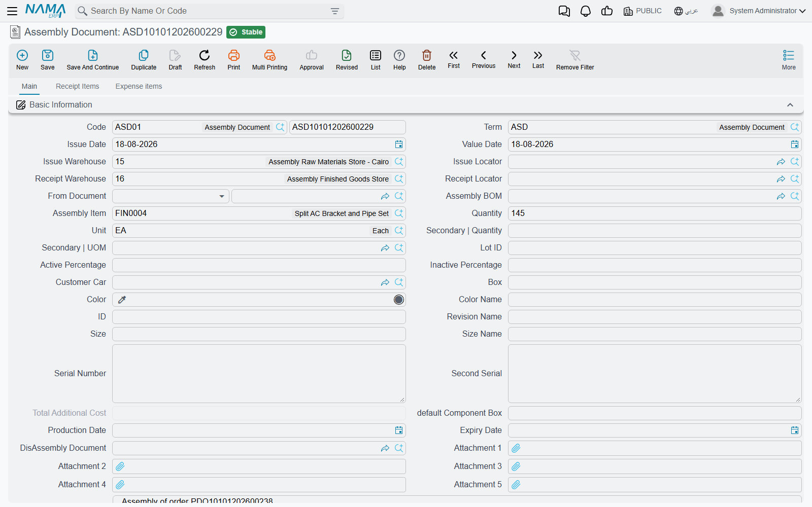
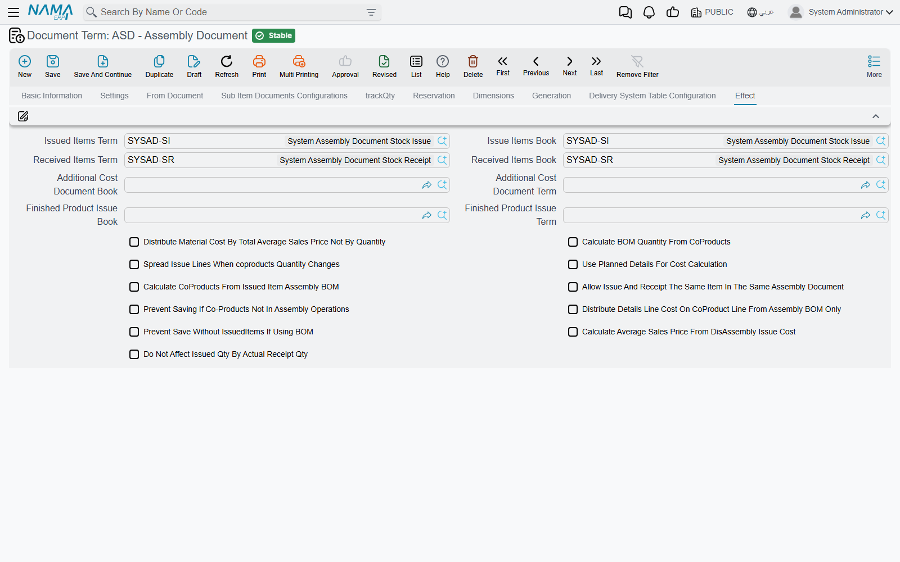
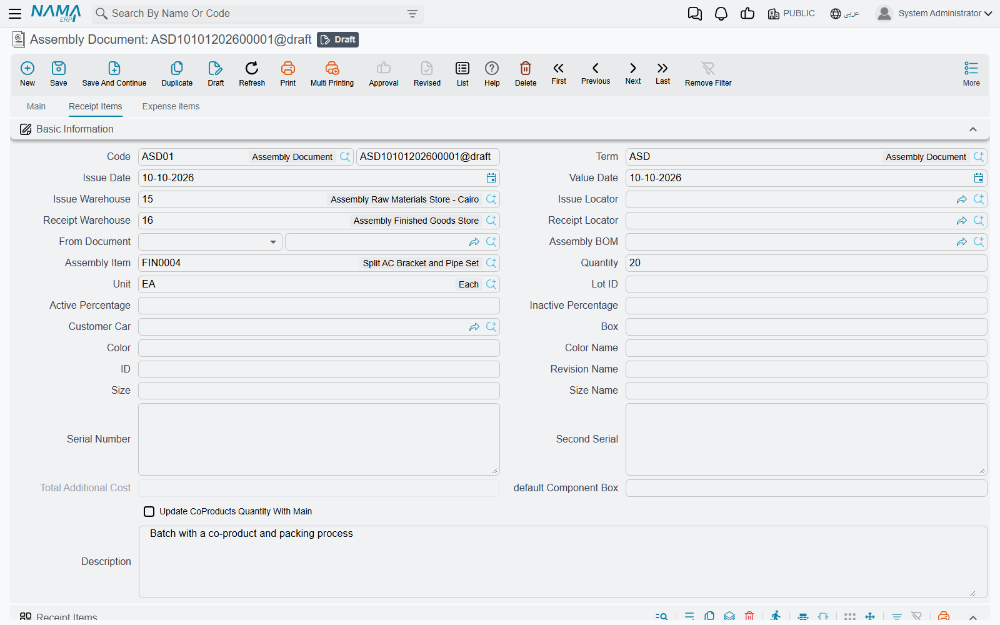
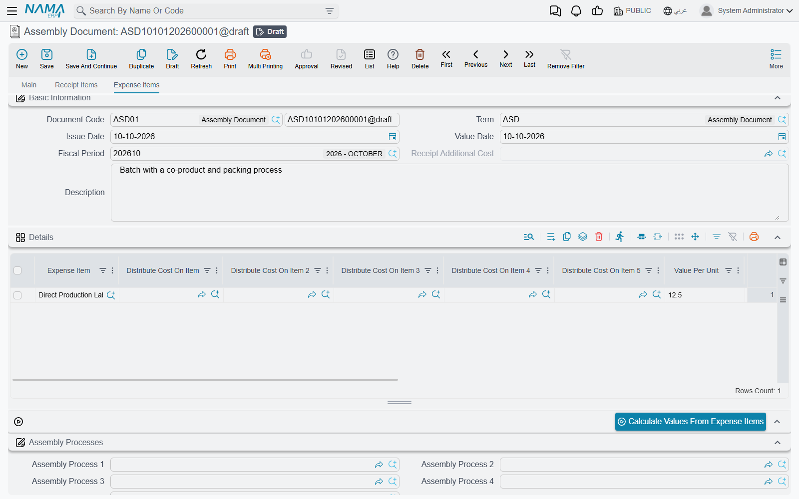
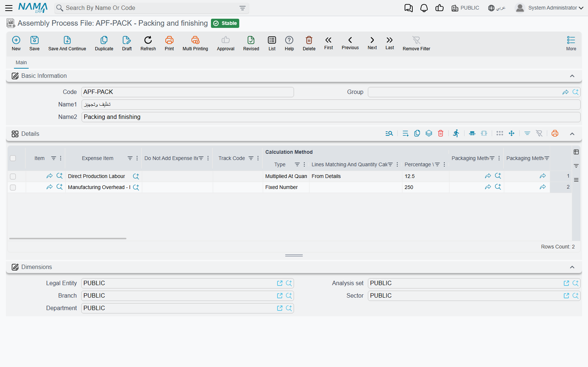

# Assembly Requests & Assembly Documents

A customer orders 20 DT-500 desktops. The workshop takes 20 cases, 20 motherboards, 40 memory sticks and 20 drives off the shelf and, a few hours later, puts 20 boxed PCs back on it. The **Assembly Document** records exactly that: one document that takes the components out of stock, puts the finished product in, and moves the cost from the first to the second — a PC costs what went into it, plus whatever it cost to put together.

This page walks through the Assembly Document from top to bottom, then the Assembly Request that can come before it, how cost is split when one assembly yields several products, how expenses are charged, and how the same document takes a product apart again.

## Where to find them

| Screen | Menu path | Arabic name on screen |
|---|---|---|
| Assembly Document | Inventory → Assembly Documents → Assembly Document | المخازن ← التجميع ← سند تجميع |
| Assembly Request | Inventory → Assembly Documents → Assembly Request | المخازن ← التجميع ← طلب تجميع |
| Assembly Process File | Inventory → Assembly Documents → Assembly Process File | المخازن ← التجميع ← ملف عملية تجميع |

## The Assembly Document, step by step

1. **Pick the book and Term.** The term decides which documents the assembly generates (see [What saving creates](#What-saving-creates)) and how its quantities and costs behave.
2. **Pick the Assembly BOM** (*طريقة التجميع*). The header fills from the recipe: **Assembly Item**, its unit, **Issue Warehouse** and **Issue Locator**, **Receipt Warehouse** and **Receipt Locator**, and the variant. The **Issued Items** grid (*الأصناف المسحوبة*) fills with the components, and the BOM's by-products are added to **Receipt Items**. You can also leave the BOM empty and type the components yourself.
3. **Enter the Quantity** to assemble — 20. Every issued line is recalculated: a line that needs 2 per PC becomes 40. The column pair **Quantity For Assembly Item** shows the per-unit recipe; **Total Qty** is what will actually be issued.
4. **Check the Issued Items.** Change an item, a quantity, a lot or a box as the work really happened. The issue warehouse on the header is written onto every line when you save.
5. **Check the Receipt Items tab** (*الأصناف الموردة*) if the assembly gives off more than the main product (below).
6. **Add expenses** on the **Expense items** tab if you want labour or overhead carried into the cost (below).
7. **Save.**

A few header fields change the arithmetic:

- **Actual Receipt Quantity** — when you planned 20 but only 19 came out good, enter 19 here. The issued quantities are then recalculated from 19 unless the term has **Do Not Affect Issued Qty By Actual Receipt Qty**.
- **default Component Box** — the box written on every issued line that has none.
- **Production Date** / **Expiry Date** — for lot-tracked finished items. If the finished item uses lots, **Lot ID** is required.

::: info Quantities that should not be multiplied
If your people type the total quantity of each component rather than a per-unit recipe, switch on **Do Not Multiply Quantities In Assembly Doc** in the [Supply Chain configuration](../configuration/documents-and-details-configuration.md). The issued quantities are then saved exactly as typed.
:::

## What saving creates

The assembly document never touches stock itself. On save it generates ordinary documents and lists them in its **Stock Documents** grid (*السندات المخزنية*):

| Generated document | Lines | Book and term come from the assembly term's **Effect** tab |
|---|---|---|
| **Stock Issue** | the Issued Items, from the issue warehouse | **Issue Items Book** / **Issued Items Term** |
| **Stock Receipt** | the Assembly Item plus every Receipt Items line, into the receipt warehouse | **Received Items Book** / **Received Items Term** |
| **Receipt Additional Cost** | the expense lines, when there are any | **Additional Cost Document Book** / **Additional Cost Document Term** |
| a second **Stock Issue** | the received lines again, straight back out of the receipt warehouse | **Finished Product Issue Book** / **Finished Product Issue Term** — only when both are filled |

The four issue and receipt fields are required on an assembly term. They must also be system books and terms, unless **Allow Non System Issue And Receipt Term And Book In Assembly Document Term Config** is on in the [Supply Chain configuration](../configuration/documents-and-details-configuration.md).

Editing the assembly document updates these documents; deleting it deletes them. Like every stock document, their quantity and cost effects are processed in the background as business requests — the receipt is costed once the issue's cost is known.

### The term's Effect tab

Besides the books and terms, the **Effect** tab (*التأثير*) of the assembly term holds the options that shape the assembly:

| Option | What it changes |
|---|---|
| **Distribute Material Cost By Total Average Sales Price Not By Quantity** | Splits the component cost between received items by sales value instead of quantity. |
| **Calculate BOM Quantity From CoProducts** | An issued line tied to a received item (its **Affect Only Cost Of Assembled Item** names that item) takes its quantity from that item's quantity in Receipt Items instead of the header Quantity. |
| **Spread Issue Lines When coproducts Quantity Changes** | Re-fills the issued lines from the BOM when a Receipt Items quantity changes. |
| **Use Planned Details For Cost Calculation** | Stores the planned components of each received item (the **Planned Issued Items** list) and splits cost by that plan. |
| **Calculate CoProducts From Issued Item Assembly BOM** | Turns on [disassembly](#Disassembly). |
| **Allow Issue And Receipt The Same Item In The Same Assembly Document** | Lifts the rule that one stock line cannot be both issued and received. |
| **Prevent Saving If Co-Products Not In Assembly Operations** | Refuses a received item that none of the document's assembly process files covers. |
| **Distribute Details Line Cost On CoProduct Line From Assembly BOM Only** | Sends each issued line's cost only to the received line it was generated for (matched by **Cost Line ID**). |
| **Prevent Save Without IssuedItems If Using BOM** | Refuses a document that names a BOM but has no issued items. |
| **Calculate Average Sales Price From DisAssembly Issue Cost** | Fills the received items' Average Sales Price from the issue cost of the document in **DisAssembly Document**. Needs the first option on. |
| **Do Not Affect Issued Qty By Actual Receipt Qty** | Keeps issued quantities tied to Quantity even when Actual Receipt Quantity differs. |

Every option is also listed on [Document-Specific Options](../document-terms/doc-term-document-specific.md#Assembly--Multi-Assembly).

## Receipt Items — more than one thing comes out

Many assemblies yield more than one product. Roasting 100 kg of green coffee gives 360 bags of roasted coffee, 10 kg of chaff that a farm buys, and a sample bag for the lab. The **Receipt Items** tab lists everything received besides the header's Assembly Item, each line with its own variant, dates and cost settings. All of them are received into the header's Receipt Warehouse and Receipt Locator — saving writes those onto every receipt line.

Lines come from the BOM's Coproducts grid when you pick the BOM. With **Update CoProducts Quantity With Main** ticked, their quantities follow the quantity you assemble; without it they are copied as fixed quantities. A Receipt Items line can also carry its own **Assembly BOM** — the components for that product are then added to Issued Items — and a **Packaging Method** and **Assembly Alternative Material** (see [Assembly BOMs, Components & Packaging Methods](./assembly-boms-and-components.md)).

### How the cost is split

When the Stock Receipt is costed, the total cost of everything issued is shared out among the received lines in this order:

1. Issued lines that belong to one product are set aside for it: packing materials generated for a receipt line go to that line, and a line with **Affect Only Cost Of Assembled Item** goes only to the item named there. (That column appears when **Show Affect Only Cost Of Assembled Item** is on in the Supply Chain configuration.)
2. Lines with **Cost Type** *Fixed Cost* (*تكلفة ثابتة*) receive a fixed amount — and the amount is the number typed in the **Cost Percentage** column. On these lines that column holds money, not a percentage.
3. Lines with **Cost Type** *No Cost* (*بدون تكلفة*) receive nothing.
4. *Normal* lines with a **Cost Percentage** share that percentage of what is left after step 2.
5. Whatever remains is split between the *Normal* lines without a percentage — by quantity, or by **Total Average Sales Price** when the term distributes by average sales price.

Expense lines are added on top, through the Receipt Additional Cost document.

**Example.** The green coffee issued cost 10,000. Chaff is *Fixed Cost* with 50 in Cost Percentage; the lab sample is *No Cost*; the 360 bags are *Normal* with no percentage. The chaff is received at 50, the sample at 0, and the bags at 9,950 — 27.64 a bag. Had the bags been split into a premium blend at 30% and a house blend with no percentage, the premium blend would take 2,985 (30% of 9,950) and the house blend the remaining 6,965.

## Expense items and assembly process files

The **Expense items** tab (*بنود مصروفات*) carries labour, energy or any other cost you want inside the product's cost. Each line names an **Expense Item**, a **Value Per Unit** and **Total Units**, the amount, the credit **Account**, and optionally up to five **Distribute Cost On Item** fields that limit the expense to particular received items. On save these lines become a **Receipt Additional Cost** document that adds their value to the received items' cost.

**Calculate Values From Expense Items** (*حساب القيم من بنود المصروفات*) fills each line's value from the rates defined on its expense item for the document's value date — per issued quantity or per received quantity, as the expense item says.

For expenses that follow a rule, use **Assembly Process Files** (*ملف عملية تجميع*) instead of typing them. Name up to five in **Assembly Process 1** to **5** on the Expense items tab. Each line of a process file says:

- **Expense Item** — what to charge.
- which lines it applies to: **Calculation Method | Lines Matching And Quantity Calculation** — *From Details* (the issued items, packing materials excluded) or *From CoProducts* (the received items, *Normal* cost type only) — narrowed by an **Item**, item section, brand, category and class fields, and, for From CoProducts, **Packaging Method 1** to **5**;
- how much: **Calculation Method | Type** — *Fixed Number* (charged once), *Multiplied At Quantity* (the value times the total quantity of the matching lines), or *Percentage From Other Expense Items* (a percentage of the total of **Expense Item 1** to **20** on the same document); the number goes in **Calculation Method | Percentage \ Fixed Value**;
- **Do Not Add Expense Item When** — *Always Add*, *If Found Previous In Line In Current Process*, or *If Found Before In Any Line*, to stop the same expense being charged twice;
- **Use Only With Assembly Process** — the line applies only when that other process is also on the document;
- **Copy Item To Distribute Cost On Item Field** — with From CoProducts, one expense line per received item, each limited to its item.

::: warning Lines are rebuilt on save
As soon as a document names an assembly process, its expense lines are recalculated from the process files on every save, and lines typed by hand are replaced. A process-file line whose **Lines Matching And Quantity Calculation** is left empty never matches anything.
:::

## Disassembly

The same document takes a product apart. A PC comes back and is stripped for parts; a pallet of mixed goods is broken into its contents.

1. On the term's Effect tab, switch on **Calculate CoProducts From Issued Item Assembly BOM**.
2. In **Issued Items**, enter the item being taken apart and, in the **Assembly BOM For Issued Items** column, the BOM that describes it. The BOM must be the recipe of that same item.
3. Save. The **Receipt Items** grid is rebuilt from the BOM's details: one line per component, its quantity scaled to the quantity issued, received into the Receipt Warehouse, and carrying the BOM line's **Cost Type**, **Cost Percentage** and **Average Sales Price** — so the cost of the PC is split between its parts by the same rules as above.

With this option on, Receipt Items is rebuilt on every save, so lines typed there by hand are replaced. The header Assembly Item can stay empty — an assembly document needs either an assembly item or receipt items, not both.

**DisAssembly Document** (*سند الفك*) on the header points at an earlier assembly document; with **Calculate Average Sales Price From DisAssembly Issue Cost** on, the received items' Average Sales Price is taken from that document's issue cost per item.

## The Assembly Request

The **Assembly Request** (*طلب تجميع*) has the same screen as the Assembly Document — header, Issued Items, Receipt Items, Expense items — and the same recipe-filling behaviour, but it generates no stock documents: nothing is issued or received. (If its term's **Reservation** tab has **Reserve** ticked, it reserves its items instead.) Use it as the plan: raise it from a sales order through **From Document**, agree the quantities, and then create the Assembly Document **From Document** the request. An assembly request can also be created from another request, an assembly document or an Item Cutting Document.

The request's term is an assembly term too, but the issue and receipt books and terms are not required on it.

## Buttons on these screens

| Button | Where | What it does |
|---|---|---|
| **Collect Available Quantities For Inserted Lines** (*تجميع الكميات المتاحة للسطور المدخلة*) | More menu, Assembly Document and Assembly Request | Asks **Collect By** — Box, Color, Size, Revision or Lot — and **Clear Existing Data**, then fills that dimension on each issued line from the stock actually available in the header warehouse, splitting a line over several lots or boxes when one is not enough. **Clear Existing Data** first empties the values already entered. |
| **Update Expiry Dates from Lot Code** (*حساب تواريخ الصلاحية من كود الشحنة*) | More menu, Assembly Document and Assembly Request | Fills production, expiry and retest dates on the issued lines from their lot. |
| **Calculate Values From Expense Items** (*حساب القيم من بنود المصروفات*) | Expense items tab | Recalculates the expense lines from their expense items' rates. |

## Messages you may see

| Message | Why | What to do |
|---|---|---|
| *Must enter co products lines or assembly item* — «يجب إدخال الاصناف المورده او الصنف الرئيسي» | Neither an Assembly Item nor a Receipt Items line was entered — nothing would be received. | Pick the BOM or the Assembly Item, or add receipt lines. |
| *Item {0} does not contain uom {1}* — «الصنف {0} لا يحتوي على الوحدة {1}» | A unit on an issued line's Assembled Item Quantity, or on a receipt line, is not one of that item's units. | Pick one of the item's primary or secondary units. |
| *Cannot save without issued items when using bom* — «لا يمكن الحفظ بدون أصناف مسحوبة عند إستحدام طريقة تجميع» | The document names a BOM, Issued Items is empty, and the term has **Prevent Save Without IssuedItems If Using BOM**. | Fill the issued items (re-pick the BOM), or clear the option on the term. |
| *Could not find co product line with cost line id {0}* — «لا يوجد سطر في الاصناف الموردة بمُعرف تكلفة {0}» | With **Distribute Details Line Cost On CoProduct Line From Assembly BOM Only** on, an issued line's **Cost Line ID** matches no receipt line. | Correct the Cost Line ID, or add the missing receipt line. |
| *Cost line id {0} is repeated at line {1}* — «معرف التكلفة {0} مكرر في السطر {1}» | Two receipt lines share a Cost Line ID, so a cost could not tell which one it belongs to. | Give each receipt line its own Cost Line ID. |
| *Assembly Processes do not contain the Co-Product {0}* — «لا تحتوى عمليات التجميع على الصنف المورد {0}» | The term has **Prevent Saving If Co-Products Not In Assembly Operations**, and no From CoProducts line of the document's assembly process files names this received item. | Add the item to a process file line, or remove it from Receipt Items. |
| *The item {0} at line {1} - document {2} - {3} can not be issued and receipted from the same assembly document* — «الصنف {0} في السطر رقم {1} - في المستند {2} - {3} لا يمكن صرفه وتوريده من نفس سند التجميع» | The same item, with the same warehouse, locator, lot, box, size, colour and revision, is both issued and received. Cost cannot flow out of and into one stock line in one document. | Receive it into a different warehouse, locator or lot, split the work into two documents, or switch on **Allow Issue And Receipt The Same Item In The Same Assembly Document**. |
| *Please fill additional cost doc book and term in the term {0}* — «يرجي ملأ دفتر وتوجيه التكاليف الإضافيه في التوجيه {0}» | The document has expense lines, so it must generate a Receipt Additional Cost, but its term names no book and term for it. | Fill **Additional Cost Document Book** and **Additional Cost Document Term** on the term's Effect tab. |
| *Quantity {0} in line {1} must equal quantity {2} in assembly alternative material document {3}* — «الكمية {0} فى السطر {1} يجب أن تساوى الكمية {2} فى سند خامات التجميع البديلة {3}» | A receipt line uses an Assembly Alternative Material record, but its quantity differs from that record's Quantity. | Set the line's quantity to the record's Quantity, or use a different record. |
| *Affect only cost of assembled item {0} not found in assembly item or receipt items* — «التأثير فقط على تكلفة الصنف المجمع {0} غير موجود بالصنف المجمع او الاصناف الموردة» | An issued line's **Affect Only Cost Of Assembled Item** names an item that is not being received. | Pick the Assembly Item or one of the Receipt Items, or clear the column. |
| *Expense Item {0} can not be percentage of it is self* — «لا يمكن ليند المصروف {0} ان يكون نسبة من نفسه» | An Assembly Process File line makes an expense a percentage of a list (Expense Item 1–20) that includes itself. | Remove the expense item from its own list. |
| *Option {0} can be activated only with value {1} of field {2}* — «الأوبشن {0} يجب تقعيله مع القيمة {1} للحقل {2}» | On an Assembly Process File, **Copy Item To Distribute Cost On Item Field** is ticked on a line that is not *From CoProducts*. | Set the line to From CoProducts, or untick the option. |
| *Packaging method files are added only with value {0} in field {1}* — «لا يمكنك استعمال ملفات طرق التعبئة مع القيمة {0} للحقل {1}» | An Assembly Process File line names packaging methods but is not *From CoProducts*. | Set the line to From CoProducts, or clear the packaging methods. |
| *To use field {0} you must select field {1}* — «لاستخدام الحقل {0} يجب تفعيل الحقل {1}» | On the assembly term, **Calculate Average Sales Price From DisAssembly Issue Cost** is on without **Distribute Material Cost By Total Average Sales Price Not By Quantity**. | Switch on the second option too, or clear the first. |
| *This Book is not system* — «الدفتر يجب أن يكون نظامي» / *This Term is not system* — «توجيه المستند يجب أن يكون نظامي» | An issue or receipt book or term on the assembly term is not a system one. | Pick system books and terms, or switch on **Allow Non System Issue And Receipt Term And Book In Assembly Document Term Config**. |
| *You must enter collect by dimension* — «يجب عليك إدخال تجميع علي» | **Collect Available Quantities For Inserted Lines** was run with **Collect By** empty. | Choose a dimension and run it again. |
