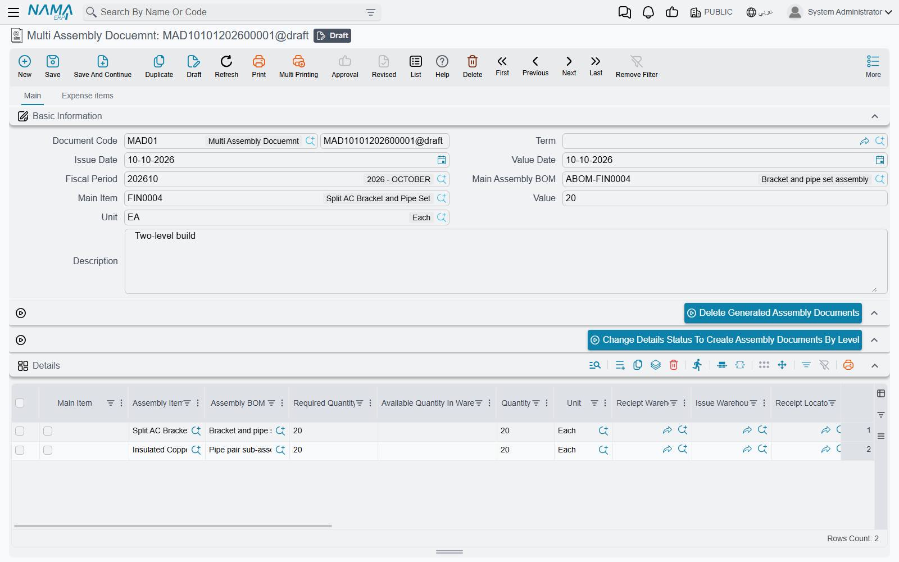
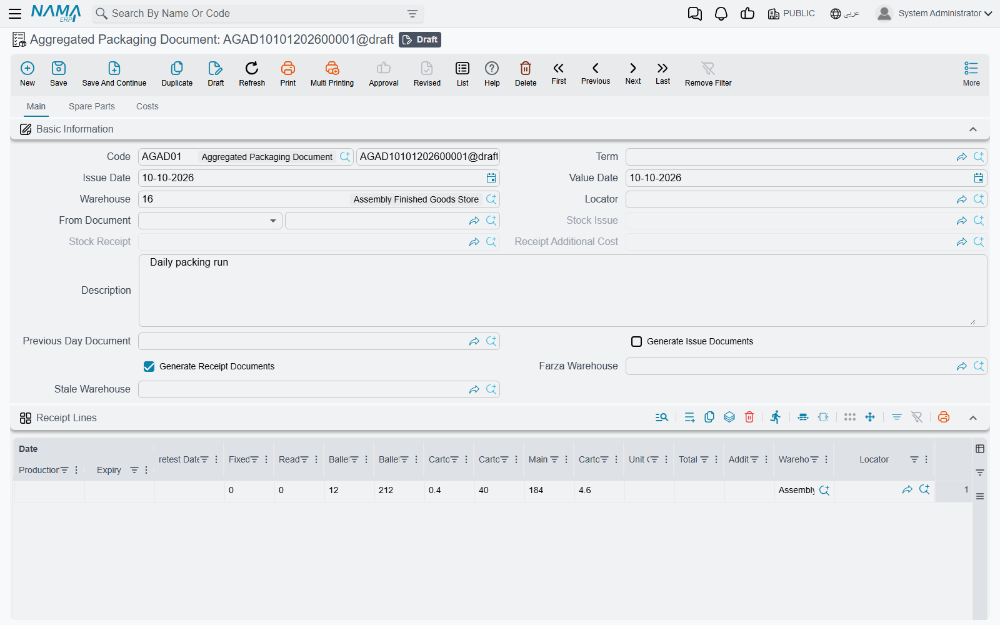

# Multi-Level and Aggregated Assembly

A single Assembly Document builds one product from its components. Two documents exist for when that is not enough:

- the **Multi Assembly Document** (*سند تجميع متعدد*), for a product whose components are themselves assembled — it works out every level and generates one Assembly Document per sub-assembly;
- the **Aggregated Packaging Document** (*سند تعبئة متعدد*), for a packing line that turns bulk material into cartons on pallets all day long, with sorted grades and waste, recorded once per day.

Both drive the ordinary assembly machinery described in [Assembly Requests & Assembly Documents](./assembly-documents-and-requests.md); read that page first.

## The Multi Assembly Document

**Inventory → Assembly Documents → Multi Assembly Docuemnt** (*المخازن ← التجميع ← سند تجميع متعدد*). The menu spells it *Docuemnt*.

A workstation, **WS-900**, is built from a DT-500 desktop, a monitor and a keyboard; the DT-500 is itself built from a case, a motherboard and memory. In the WS-900's Assembly BOM, the DT-500 line has **Sub Assembly BOM** set to the DT-500's BOM. That link is all the Multi Assembly Document needs.

### Filling the details

There are two ways in.

**One product.** Enter **Main Assembly BOM**, **Main Item** and **Main Quantity** in the header — picking the BOM fills the item and its unit. The **Details** grid fills with one line for the WS-900 itself and one line for every sub-assembly found by following the Sub Assembly BOM links down the tree: 10 WS-900 means a line for 10 WS-900 and a line for 10 DT-500. Each line carries its BOM, quantity, issue and receipt warehouses (from that BOM) and its level.

**Several products.** Fill the **Main Items** grid — one line per finished product, each with its BOM, **Required Quantity** and **Available Quantity In Warehouse** — and press **Spread Main Items** (*فرد السطور الرئيسية*). Every main item is expanded the same way, and lines for the same item, unit, warehouses and level are merged, so a DT-500 needed by two different products appears once with the combined quantity. Pressing it again keeps the dates, dimensions, status and generated document of lines that already existed.

On either grid, **Quantity** is worked out as **Required Quantity** minus **Available Quantity In Warehouse**, never below zero — if 3 DT-500 are already on the shelf, only 7 are built.

### What saving does

On save, every Details line with a quantity becomes an **Assembly Document** — created the first time, updated after — using the **Assembly Document Book** and **Assembly Document Term** on the multi-assembly term. The generated document is linked in the line's **Assembly Document** column, and its issued items are filled from the line's BOM.

::: warning No book and term, no documents
If the multi-assembly term has no Assembly Document Book or Assembly Document Term, the document saves normally but generates nothing. Fill both on the term first.
:::

Three settings control which lines generate and how:

- **Create Document For Lines Which Have Status** (*إنشاء سند التجميع للسطور التي حالتها*), on the term — only lines whose **Status** equals this value generate a document. The statuses are *Initial*, *Planned*, *Finished* and *Other 1–3*. Leave it empty and every line generates.
- **Save As Draft** on a line — its assembly document is saved as a draft, as long as it has never been committed. **Save All Assembly Documents As Drafts** on the term ticks it on every line.
- The **Expense items** tab — each line names an **Item**; it is copied to the generated document of every Details line for that item, with Total Units set to that line's quantity.

When the Supply Chain configuration has **Show Final Materials In Multi Assembly Doc** on, a **Final Materials** grid shows the raw materials the whole tree consumes — every BOM line that is not itself a sub-assembly, merged across levels. **Use Required Quantity For Final Materials** on the term bases it on Required Quantity rather than Quantity.

Removing a Details line deletes its generated assembly document on the next save; deleting the multi-assembly document deletes them all.

### Building level by level

A WS-900 cannot be assembled until the DT-500s it needs are in stock. **Change Details Status To Create Assembly Documents By Level** (*تغيير حالة السطور و إنشاء سندات التجميع حسب المستوى*) does this in order: it takes the deepest level whose lines do not yet have the term's status, sets their status, saves the document — generating those assembly documents — and waits until their stock effects are processed before moving up to the next level. It is meant for terms with **Create Document For Lines Which Have Status** set.

**Delete Generated Assembly Documents** (*حذف سندات التجميع المنشأة*) undoes this in the opposite order, starting from the top level: it asks you to confirm (**Confirm Delete Records**), then deletes the generated documents level by level and clears their lines' status.

## The Aggregated Packaging Document

**Inventory → Assembly Documents → Aggregated Packaging Document** (*المخازن ← التجميع ← سند تعبئة متعدد*).

This document was built for packing lines that weigh their output: bulk material goes into cartons, cartons go onto pallets (the screen says *ballets*), some product is sorted out as a lower grade, and some is lost. It records a day's work in one document and generates one Stock Issue and one Stock Receipt for it.

### The recipe for packing

The Assembly BOM of a packed product uses four columns that only this document reads:

- **Main Material** — the bulk material, measured by weight. One line per BOM.
- **Dependent On Carton Count** — packing material used per carton.
- **One Per Ballet** — material used once per pallet, i.e. once per document line.
- **For Main Materials** — material that depends on the quantity of main material actually issued.

### The Main tab

The header has the issue **Warehouse** and **Locator**, a **Farza Warehouse** for sorted grades, a **Stale Warehouse** for waste, and **Generate Issue Documents** / **Generate Receipt Documents** (the latter on by default). The generated **Stock Issue**, **Stock Receipt** and **Receipt Additional Cost** appear in the header once saved.

Each line of **Receipt Lines** (*سطور الصادر*) is one pallet of a finished product: its **Assembly BOM**, item, quantity in cartons, and the weights — **Ballet Empty Weight**, **Ballet Gross Weight**, **Carton Empty Weight** — plus **Ready Made Cartons**, cartons that were already packed and are only being palletised. On save the system works out:

- **Carton Count** = quantity − Ready Made Cartons;
- **Main Material Weight** = Ballet Gross Weight − Ballet Empty Weight − Carton Empty Weight × Carton Count;
- **Carton Net Weight** = Main Material Weight ÷ Carton Count.

A pallet of 50 cartons, 5 of them ready-made, weighing 520 kg gross on a 20 kg pallet with 0.5 kg cartons, gives 45 cartons, 477.5 kg of material and 10.61 kg per carton.

Tick **Move To Next Day Document** on a pallet that is not finished. Name today's document as the **Previous Day Document** of tomorrow's, and the pallet appears there in **Lines from Previous Day Document**, counted on that day instead.

**Farza** (*الفرزات*) lists the sorted grades received into the Farza Warehouse, and **Stale** (*الهالك*) is filled on save: for each main material, whatever was issued beyond what the pallets account for is received into the Stale Warehouse as waste. The default dimensions of both come from **Farza Dimensions** and **Stale Dimensions** on the term.

### The Spare Parts tab — what gets issued

The materials to issue sit on the tab titled **Spare Parts** (*قطع غيار*). **Calc Materials** (*حساب الخامات*) fills it from the pallets' BOMs: the main material by total Main Material Weight, carton-dependent lines by Carton Count, once-per-pallet lines by the number of lines, and everything else by quantity. Ready-made cartons are issued as the finished item itself. **Calculate Main Materials Dependent Data** (*حساب مستلزمات الخامات الرئيسية*) then adds the For Main Materials lines from the main material quantity on the tab. Both need the document saved first.

**Collect Material Lots** (*تجميع الشحنات للخامات*) and **Collect Material Boxs** (*تجميع صناديق الخامات*) fill the lot or box on each material line from what is available in the header warehouse, asking first whether to **Clear Existing Data**. All four buttons are on the Spare Parts tab and in the More menu; the two Calc buttons are also on the Main tab.

### The Costs tab

**Fixed Costs** gives a fixed cost per unit of main material, optionally per revision, colour and size; the term's **Fixed Cost Revisions** pre-fills one row per revision. A pallet whose main material has a fixed cost is costed at that rate for its main material, and Farza lines are costed at the fixed cost of their item. The expense lines become a Receipt Additional Cost; with **Automatically Calculate Additional Costs** on the term, they are filled on save from the expense items whose main material is used in the document, with Total Units equal to the quantity of that material's pallets.

The Stock Issue is generated from the Spare Parts grid with the term's **Stock Issue Document Book** / **Term**; the Stock Receipt from Receipt Lines, previous-day lines, Farza and Stale with **Stock Receipt Document Book** / **Term**; the Receipt Additional Cost with **Additional Cost Document Book** / **Term**. Once the issue is costed, the material cost is distributed to the pallets in proportion to their planned share of each material, and the receipt is updated with the result.

## Messages you may see

| Message | Why | What to do |
|---|---|---|
| *Assembly Bom Can not be empty in line {0}* — «لايمكن ترك طريقة التجميع فارغة» | A Details line of the Multi Assembly Document has no Assembly BOM. | Fill the BOM on that line. The Arabic text does not repeat the line number. |
| *The item {0} at line {1} is not included in the grid* — «الصنف {0} في السطر {1} غير موجود في تفاصيل بنود المصروفات» | An expense line of the Multi Assembly Document names an item that no Details line assembles, so there is nothing to charge it to. | Change the expense line's item, or add that item to Details. |
| *Can not handle more than 10 levels of assembly bom recursion, most probably there is a cyclic dependency.* | Following the Sub Assembly BOM links went more than ten levels deep — almost always a BOM that leads back to itself. This message has no Arabic translation. | Find the BOM whose Sub Assembly BOM points back up the tree and correct it. |
| *You should activate option {0} in supply chain configuration to activate option {1}* — «يجب أن تختار الأوبشن {0} في إعدادات الSupply Chain  لتفعيل الأوبشن {1}» | A quantity-tracking option was ticked on the multi-assembly term while the Supply Chain configuration does not keep quantity-tracking entries. | Turn on the named option in the Supply Chain configuration first, or untick the term option. |
