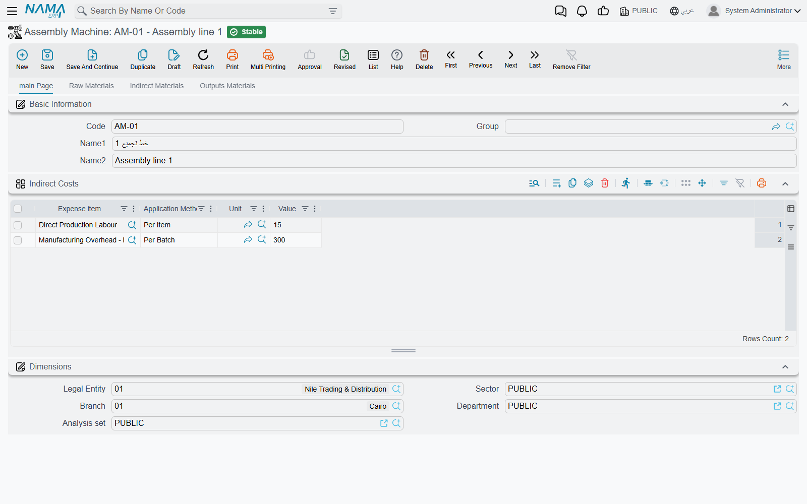
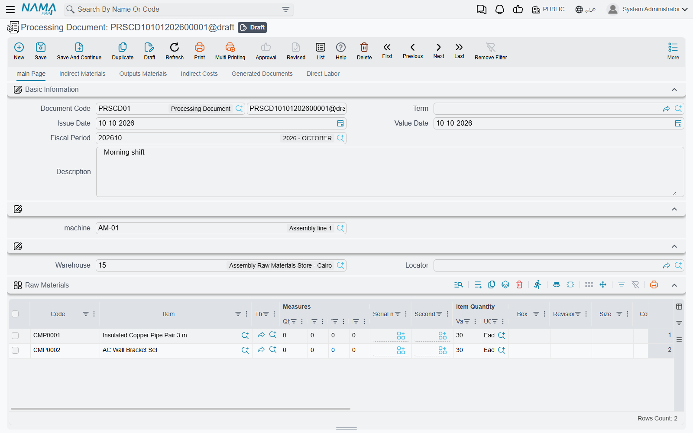

# Processing Documents & Assembly Machines

Some work is better described by the machine than by the recipe. A grinding mill takes in raw beans, burns through filters and lubricant, turns out ground coffee in two grinds, and costs so much an hour to run. Every run looks the same; only the quantities change. The **Assembly Machine** (*ماكينة تجميع*) describes the machine once, and each run is a **Processing Document** (*سند معالجة*) that starts from it.

| Screen | Menu path | Arabic name on screen |
|---|---|---|
| Assembly Machine | Inventory → Assembly Documents → Assembly Machine | المخازن ← التجميع ← ماكينة تجميع |
| Processing Document | Inventory → Assembly Documents → Processing Document | المخازن ← التجميع ← سند معالجة |

## The Assembly Machine

The machine file holds the standard version of a run, tab by tab:

- **main Page** — the **Indirect Costs** grid: each line an expense item, an **Application Method**, a **Unit** and a **Value** — "electricity, Per Item, kg, 0.15".
- **Raw Materials** — the warehouse and locator raw materials are issued from, and the standard raw-material lines.
- **Indirect Materials** — the warehouse and locator for consumables (filters, lubricant, packing film), and their lines.
- **Outputs Materials** — the warehouse and locator outputs are received into, and the standard output lines.

## The Processing Document

### Starting from the machine

Pick the **machine** (*الالة*) on the main page, and the document fills from the machine file: the three warehouse and locator pairs, the raw-material, indirect-material and output lines, and the indirect costs — each machine value copied as both **Standard Value** and **Value**, so you can change the actual value and still see the standard next to it. Then adjust the quantities to what this run really used and produced.

The tabs:

| Tab | What goes there |
|---|---|
| **main Page** (*الصفحة الرئيسية*) | the machine, the raw-materials **Warehouse** and **Locator**, and the **Raw Materials** grid |
| **Indirect Materials** (*المواد الخام المساعدة*) | **Indirect Material Warehouse**, **Indirect Materials Locator**, and the consumables with their **Quantity PerUnit** and **Application Method** |
| **Outputs Materials** (*المخرجات*) | **Reciept Warehouse**, **Receipt Locator**, and the outputs, each showing its **Total Indirect Costs** |
| **Indirect Costs** (*التكاليف الغير مباشرة*) | the machine's costs for this run |
| **Generated Documents** (*المستندات المنشأه*) | the stock documents the run created |
| **Direct Labor** (*العمالة المباشرة*) | who worked on the run, and when |

The header warehouses are written onto every line of their grid when you save.

### What is calculated

- **Total Processed Quantity** (on the Indirect Materials tab) is the total quantity of all outputs.
- An indirect material with a **Quantity PerUnit** gets its quantity from it: *Per Item* multiplies it by Total Processed Quantity; *Per Batch* uses it as it stands. A filter used once per run is Per Batch 1; film at 0.02 m per bag is Per Item 0.02.
- An indirect cost line's **Total Quantity** is the total of the outputs in its **Unit** — or of all outputs when Unit is empty. **Total Cost** is Value × Total Quantity for *Per Item*, or Value alone for *Per Batch*. 1,200 kg of output at 0.15 per kg is 180 of electricity.
- Each output's **Total Indirect Costs** is its share of those costs, by quantity, among the outputs in the cost's unit.

### What saving creates

On save the processing document generates, and lists on **Generated Documents** with their **Type**:

| Generated document | From | Book and term on the processing term |
|---|---|---|
| Stock Issue | Raw Materials | **Materials Issue Book** / **Materials Issue Term** (group *Raw Materials*) |
| Stock Issue | Indirect Materials | the two fields of group *Indirect Materials* — both labelled **Indirect Materials Issue Book** in English; the second is the term (*توجيه المواد الخام المساعدة*) |
| Stock Receipt | Outputs Materials | **Received Items Book** / **Received Items Term** (group *Outputs Materials*) |

When the issues are costed, their cost is passed to the outputs. Materials and outputs are matched by **Box**: an output receives the cost of the materials issued with the same box value, split by quantity among the outputs sharing that box, and the cost of materials whose box matches no output is spread over all outputs by quantity. If you do not use boxes, all the material cost is simply shared by quantity.

The indirect costs also produce a journal entry, processed as a business request, when the processing term's **Effect** tab (*التأثير*) has both its **Debit** and **Credit** sides set — typically a cost-of-production account against the accounts that carry electricity, depreciation and so on. Without both sides, no entry is made.

## Direct labour

The **Direct Labor Lines** grid records each **Employee** with a **From** and **To** date and time; **Net Time** is worked out from them. Two buttons on the grid make it a time clock: stand on a line and press **Start** (*بدء*) to stamp the current date and time as its start, or **End** (*إنهاء*) to stamp its end. With **Fill From Date With Line Insertion** and **Fill From Time With Line Insertion** ticked, a new line starts with the current date and time already filled.

## Related pages

- [Assembly Requests & Assembly Documents](./assembly-documents-and-requests.md) — the recipe-driven alternative
- [Inventory Costing & Revaluation](../inventory-costing.md)
