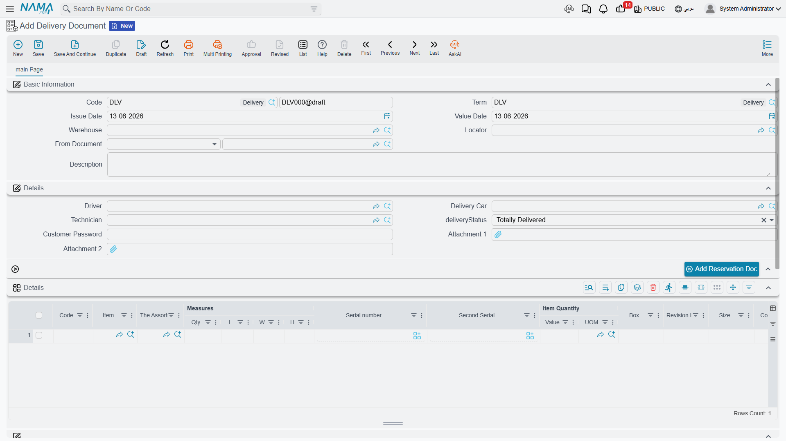
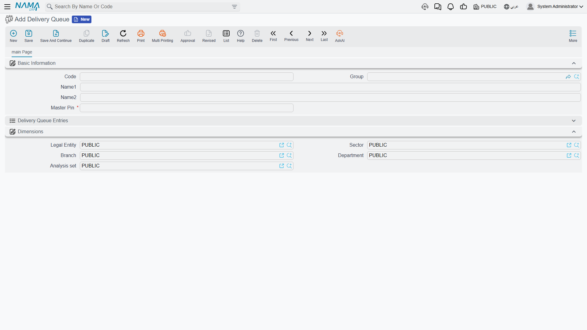

# Delivery & Loading

Between confirming the sales order and issuing the invoice lies the physical stage: preparing the goods, loading them, getting them to the customer, and obtaining proof of receipt. This guide gathers the documents and configuration that manage this final journey - from the warehouse shelf to the customer's door.

## Preparation: Picking Items (Pick)

Before goods can leave, they must be gathered from their locations in the warehouse. **Pick Rules (PickRules)** determine how the system selects what to pick and from where: oldest first (FIFO), nearest expiry (FEFO), nearest location, or the right batch. A pick list is generated that guides the warehouse worker to the items and their locations in the optimal sequence through the aisles, reducing errors and speeding preparation.

## Loading: Consolidating the Shipment (LoadingDocument)

The **Loading Document** records the consolidation of several deliveries into a single load (truck or shipment): it groups them by route, driver, or vehicle, tracks loading status and vehicle capacity, and links the source orders/invoices to the shipment. This creates a logical "staging area": the goods are no longer in normal storage (not sold to others) and not yet delivered (still in your inventory), but ready on the loading dock organized by shipment.

When you need to cancel a shipment and return its goods to storage, the **Loading Cancellation** (LoadingCancellationDoc) handles it.

## Delivery and Proof of Receipt (DeliveryDocument)

The **Delivery Document** records that items were loaded onto the vehicle, delivered to the customer, and signed for, so they left your custody. The document tracks delivery status (pending, delivered, partial, cancelled), the driver and vehicle per line, and may support delivery confirmation with a customer password. It's the **proof of delivery** document - vital if the customer later claims non-receipt. Each delivery is also numbered via the **Delivery Number** (DeliveryNumber) to ease tracking within queue management.

When a delivery fails or needs to be cancelled and the goods returned, the **Delivery Cancellation** (DeliveryCancellationDoc) handles it, reversing the delivery's effect and returning the goods to available stock.

::: tip Delivery and Reservation
Delivery integrates with the [Reservation System](./reservation-system-guide.md): when delivering goods reserved for an order, the reservation is released and they move from "reserved" to actually "out."
:::

## Delivery Queues: Organizing Distribution (DeliveryQueue)

In delivery-intensive businesses (restaurants, distribution, e-commerce), delivery needs deeper organization. The **Delivery Queue** manages routing deliveries and assigning them to drivers with priority rules (urgent, time-sensitive, by region), and configures automatic assignment logic and verification limits.

The system is completed by three configuration files:
- **Delivery Queue Configuration** (DeliveryQueueConfiguration): queue operation criteria, service levels, time windows, and priority and auto-assignment rules.
- **Delivery Driver Config** (DeliveryDriverConfig): the driver's capabilities, authorized vehicle types, geographic zones, and certifications (such as refrigerated transport).
- **Delivery Organization** (DeliveryOrganization): the organizational structure for delivery operations, linking zones to branches/warehouses.

## The Full Picture

Imagine a sales order ready for fulfillment:
1. **Preparation**: a pick list is generated per its rules, and the worker gathers items from their locations.
2. **Loading**: the loading document consolidates several deliveries into the route truck, and the goods move to the loading dock.
3. **Routing**: the delivery queue assigns the shipment to an appropriate driver and vehicle by region and priority.
4. **Delivery**: the driver delivers, the delivery document is recorded with proof of receipt, the reservation is released, and the goods leave your inventory.
5. **Invoicing**: the [Sales Invoice](./sales-journey.md) is issued to complete the financial transaction.

## Next Steps

- [The Sales Journey](./sales-journey.md) - where delivery fits in the sales cycle
- [Reservation System Guide](./reservation-system-guide.md) - reserving stock before delivery
- [Moving Stock Between Warehouses](./moving-stock.md) - internal transfers before picking
