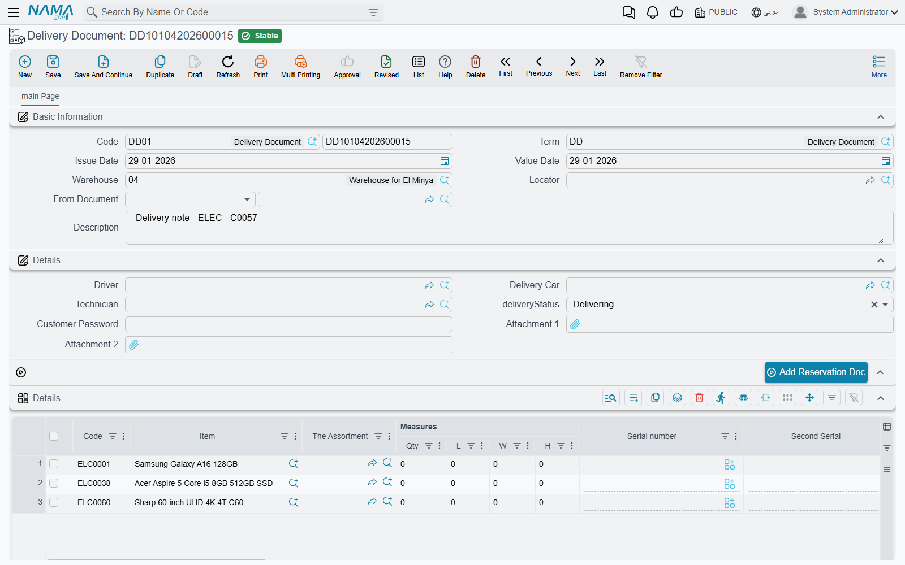
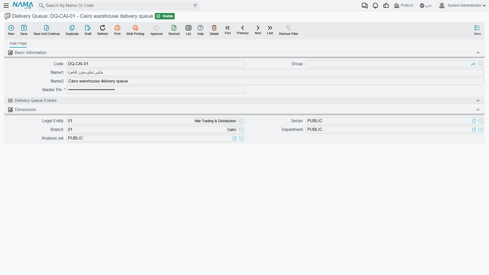

# Delivery & Loading

Between confirming the sales order and issuing the invoice lies the physical stage: preparing the goods, loading them, getting them to the customer, and obtaining proof of receipt. This guide gathers the documents and configuration that manage this final journey - from the warehouse shelf to the customer's door.

## Preparation: Picking Items (Pick)

Before goods can leave, they must be gathered from their locations in the warehouse. **Pick Rules (PickRules)** determine how the system selects what to pick and from where: oldest first (FIFO), nearest expiry (FEFO), nearest location, or the right batch. A pick list is generated that guides the warehouse worker to the items and their locations in the optimal sequence through the aisles, reducing errors and speeding preparation.

## Loading: Consolidating the Shipment (LoadingDocument)

The **Loading Document** records the consolidation of several deliveries into a single load (truck or shipment): it groups them by route, driver, or vehicle, tracks loading status and vehicle capacity, and links the source orders/invoices to the shipment. This creates a logical "staging area": the goods are no longer in normal storage (not sold to others) and not yet delivered (still in your inventory), but ready on the loading dock organized by shipment.

When you need to cancel a shipment and return its goods to storage, the **Loading Cancellation** (LoadingCancellationDoc) handles it.

## Delivery and Proof of Receipt (DeliveryDocument)

The **Delivery Document** records that items were loaded onto the vehicle, delivered to the customer, and signed for, so they left your custody. The document tracks delivery status (pending, delivered, partial, cancelled), the driver and vehicle per line, and may support delivery confirmation with a customer password. It's the **proof of delivery** document - vital if the customer later claims non-receipt.

When a delivery fails or needs to be cancelled and the goods returned, the **Delivery Cancellation** (DeliveryCancellationDoc) handles it, reversing the delivery's effect and returning the goods to available stock.

::: tip Delivery and Reservation
Delivery integrates with the [Reservation System](./reservation-system-guide.md): when delivering goods reserved for an order, the reservation is released and they move from "reserved" to actually "out."
:::

## Delivery Queues: Organizing Distribution (DeliveryQueue)

In delivery-intensive businesses (restaurants, distribution, e-commerce), delivery needs deeper organization. The **Delivery Queue** manages routing deliveries and assigning them to drivers with priority rules (urgent, time-sensitive, by region), and configures automatic assignment logic and verification limits.

The system is completed by three configuration files:
- **Delivery Queue Configuration** (DeliveryQueueConfiguration): queue operation criteria, service levels, time windows, and priority and auto-assignment rules.
- **Delivery Driver Config** (DeliveryDriverConfig): the driver's capabilities, authorized vehicle types, geographic zones, and certifications (such as refrigerated transport).
- **Delivery Organization** (DeliveryOrganization): the organizational structure for delivery operations, linking zones to branches/warehouses.

## Actions on this screen

**On the Delivery Document:** **Add Reservation Doc** — asks you to pick a reservation document and pulls its lines into the delivery, so what was reserved is what gets delivered without re-keying it. If the document's term has *Consider Satisfied Quantities In From Doc* switched on, the already-satisfied quantities are taken into account rather than delivered twice; and an empty first line with no item on it is dropped rather than left behind.

## The Full Picture

Imagine a sales order ready for fulfillment:
1. **Preparation**: a pick list is generated per its rules, and the worker gathers items from their locations.
2. **Loading**: the loading document consolidates several deliveries into the route truck, and the goods move to the loading dock.
3. **Routing**: the delivery queue assigns the shipment to an appropriate driver and vehicle by region and priority.
4. **Delivery**: the driver delivers, the delivery document is recorded with proof of receipt, the reservation is released, and the goods leave your inventory.
5. **Invoicing**: the [Sales Invoice](./sales-journey.md) is issued to complete the financial transaction.

## Messages you may see

| Message | Why | What to do |
|---|---|---|
| *System password can not be manually changed in delivery document {0}* — «لا يمكن تغيير كلمة سر النظام يدويا في سند توصيل {0}» | The delivery document already carries a system-generated password and the saved value was typed over. The password is the proof of delivery, so only the system may set it. | Restore the password the system produced — reload the document without saving — and record the customer's password in the customer password field instead. |
| *The provided password does not match system generated password* — «كلمة السر لا تطابق كلمة السر التي انشأها النظام» | The term requires a password on delivery, and the password typed in the customer password field is not the one the system generated. | Ask the customer for the code again — it is the one sent with the shipment — and retype it. |
| *Delivery status can not be modified to delivered unless you provide the correct password* — «لا يمكن تعديل الحالة إلى ( تم التوصيل ) إلا بإدخال كلمة السر الصحيحة» | The status is being set to *Delivered* while the customer password is missing or does not match. That is the point of the password: nobody can mark a shipment delivered without the customer's code. | Enter the customer's password, then set the status. If the customer lost the code, the term option **Delivery State Requires Password** is what makes it mandatory. |

## Next Steps

- [The Sales Journey](./sales-journey.md) - where delivery fits in the sales cycle
- [Reservation System Guide](./reservation-system-guide.md) - reserving stock before delivery
- [Moving Stock Between Warehouses](./moving-stock.md) - internal transfers before picking
