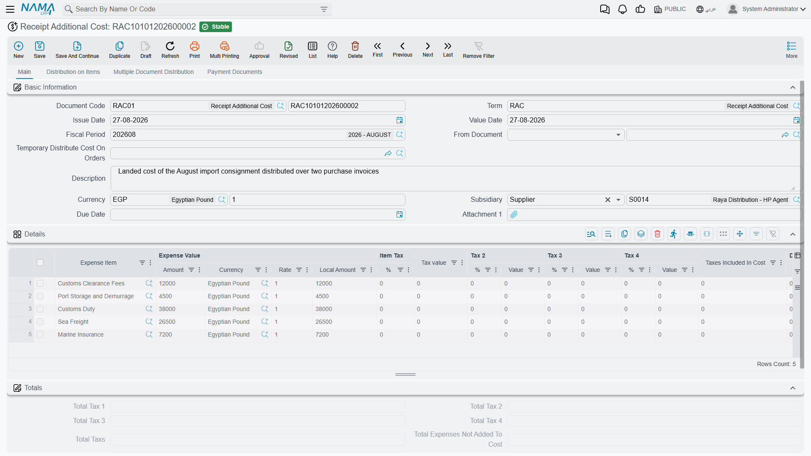
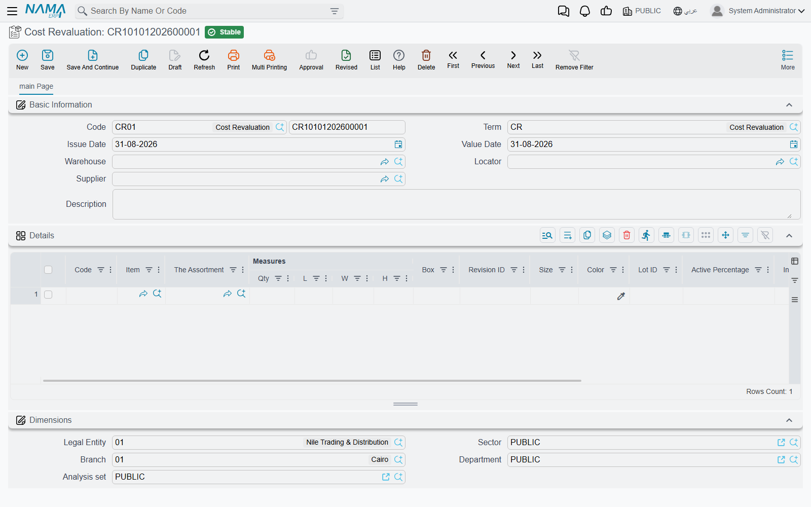

# Inventory Costing & Revaluation

Inventory quantity is only half the truth; the other half is its **value**. This guide gathers the documents that adjust your inventory's cost: distributing additional charges across receipts, revaluing cost, and freezing cost at period close.

## How the System Tracks Cost

The system keeps each item's cost and updates it with every movement according to the adopted costing method - such as **First In First Out (FIFO)**, **moving average cost**, and **last purchase cost**. Each receipt adds to the cost layers and each issue takes from them the same way, so cost of goods sold and inventory value stay consistent.

That work does not happen inside the save. Saving a stock document raises an **inventory transaction request**, and the costing runs when that request is processed, moments later. It is why a freshly saved issue can show no cost yet, and why a costing question is often really a processing question: the request is queued, or it failed. [Business Requests](/platform/background-processing/business-requests) is where you look at it, and [Costing Configuration](/modules/supplychain/configuration/costing-configuration) covers what the system does with a receipt whose own cost has not been settled yet — the usual reason an issue comes out at zero.

But reality imposes cases where this automatic tracking needs intervention: freight charges that arrive after the receipt, a market value that drops, or a monthly close at which cost must be fixed. Those are the cases this page covers.

## Additional Costs on Receipts (ReceiptAdditionalCost)

The supplier's item price isn't the whole true cost. There's freight, insurance, customs, clearance, and commissions. The **Additional Cost** document distributes these charges across the receipt's items to arrive at the true **landed cost**.

### How It Works

You link the document to the relevant receipt (or purchase order), then enter the charge lines. The system distributes them across the items on a basis you choose - by value, by weight, by quantity, or manually. The result is that each item's cost rises by its fair share of the charges, so inventory value - and therefore cost of sale - reflects the true cost, not the supplier price alone.

The document supports automatic, manual, and calculated lines, and supports scheduling payment of external charges via scheduling templates, linking charges to their payees over time.

::: tip Additional Costs and Letters of Credit
In imports via letters of credit, the LC charges (freight, insurance, customs, bank commissions) are accumulated and loaded onto the goods within the LC path. See [Letters of Credit](./letters-of-credit.md).
:::

## Cost Revaluation (CostRevaluation)

Sometimes the quantity is right but the **value** needs adjusting. The **Cost Revaluation** document changes items' cost without changing their quantities - no physical movement, accounting effect only.

Use cases:
- **Market value decline**: electronics bought at a high price, then a newer model is released, so their value is reduced to match the market (lower of cost or market).
- **Obsolescence**: old stock that won't sell at full price, so its value is adjusted to the expected recoverable amount.
- **Correcting cost errors**: items received at the wrong cost, restored to the correct cost.

The location and quantity stay the same, and only the value balance in the books changes, with an accounting entry reflecting the value difference.

## Finished Product Pricing (FinishedProductPricing)

When you assemble or manufacture a finished product, its cost accumulates from its components. The **Finished Product Pricing** document captures this roll-up: it gathers component costs from the bill of materials (BOM) or the assembly document, allocates co-products and indirect additional costs, and arrives at the final cost of the assembled product. This document complements the [Assembly & Packaging](./assembly-and-packaging.md) path from the costing side. Full production costing (labor and overhead for production orders), however, lives in the [Manufacturing module](/modules/manufacturing/).

## Freezing Cost at Close (FrozenCostAccounts)

When you close an accounting period (month-end, for example), you don't want inventory cost changing retroactively after statements are issued. **Frozen Cost Accounts** prevents cost adjustments during a date-bounded period, preserving the stability of the numbers your financial statements were built on, and preventing late receipts or adjustments from moving the cost of a closed period.

::: tip Preventing the Use of Specific Batches
Alongside freezing cost, the system lets you **prevent using a batch** during a period (for example a batch under recall or quarantine), so that batch can't be issued until the prevention is lifted - a quality-control tool that intersects with cost by preventing movement of stock that shouldn't be sold.
:::

## Actions on these screens

**On the Receipt Additional Cost:** **Collect Items** fills the cost lines from the receipt, letter of credit or shipment named on the header, so the cost is spread over what actually arrived; **GeneratePayments** splits the document's value into an instalment schedule, asking for the number of payments, the period and its unit, the start date, a grace period, down / first / second / last payment values and a rounding mode.

**On the Finished Product Pricing:** **Collect Materials** fills the materials grid from the products being priced and the document's term; **Recalculate Materials Qty** re-derives those material quantities after the product quantities change; and **Collect CoProducts**, on the details page, fills the co-products grid from the products.

## Best Practices

::: tip Practical Tips
**Distribute additional costs before close**: Enter freight and customs charges on the receipt as soon as they're available, so inventory cost reflects reality before cost of sales is computed.

**Document the reason for revaluation**: Every revaluation needs a clear justification (market drop, obsolescence, correction) for audit and compliance purposes.

**Freeze cost right after close**: Enable freezing as soon as the period's statements are approved to prevent any later movement of their numbers.

**Review landed cost periodically**: Compare actual landed cost to expected to catch supplier or freight deviations early.
:::

## Messages you may see

| Message | Why | What to do |
|---|---|---|
| *No items found to distribute the additional cost on* — «لا توجد أصناف لتوزيع التكاليف الإضافية عليها» | The receipt, order or shipment named on the Additional Cost header carries no item lines for the charges to be spread over, and the document's term does not allow an empty system distribution grid. | Point the header at a document that really has item lines and run **Collect Items** again, or — if an empty distribution grid is intended — enable the term's *Allow Empty Sys Distribution Lines* option. |
| *You can only use One Assembly Document per Receipt Additional Cost Document* — «يمكنك استعمال سند تجميع واحد فقط فى سند تكاليف إستلام إضافية» | The document lists more than one costed document and one of them is an assembly document. | Give the assembly document an Additional Cost document of its own and enter the remaining charges on a separate document. |
| *You Can Not have more than One Document Type in Receipt Additional Cost documents* — «لا يمكنك استعمال أكثر من نوع مستند فى سند تكاليف إستلام إضافية» | The costed documents listed on this document are of different types — a receipt and a shipment, for example. Purchase orders and purchase invoices count as one type. | Split the charges so each Additional Cost document distributes over one document type only. |
| *Line {0} has a different costed document {1} than expected {2}* — «السطر رقم {0} مرتبط بمستند تكلفة مختلف {1} عن المستند المتوقع {2}» | A manual or system cost line names a costed document other than the one on the header. | Clear the costed document on that line so it follows the header, or change it to the header's document. |
| *You can not use the order {0} as from doc for invoice {1} because it was used before with the invoice {2} and the order was found in the receipt additional cost {3}* — «لا يمكن إستخدام المستند {0} كبناءا علي للفاتورة {1} لانه استخدم من قبل الفاتورة {2} ووجد في مستند تكاليف الإستلام الإضافية {3}» | Raised while saving a purchase invoice built on an order whose charges were already distributed by an Additional Cost document against a different invoice. One order's costs cannot follow two invoices. | Either build the invoice on the order that is still free, or open the Additional Cost document and repoint it at the invoice you are saving. |
| *FIFO is not supported for Cost Revaluation* — «التكلفة فيفو لا تدعم إعادة تقييم المخزون» | The costing method in Supply Chain configuration is First In First Out. Cost Revaluation works only with the other costing methods. | Adjust value through a document the costing method supports (a stock adjustment, or an Additional Cost document on the receipt) instead of Cost Revaluation. |
| *You can not choose assembly BOM {0} twice in products lines* — «لا يمكن إختيار طريقة التجميع {0} مرتين فى سطور المنتجات» | A product line on Finished Product Pricing names the same assembly method in two of its semi-finished assembly slots. | Name each assembly method once on the line. |
| *You can not choose BOM {0} twice in products lines* — «لا يمكن إختيار مكونات المنتج {0} مرتين فى سطور المنتجات» | A product line on Finished Product Pricing names the same bill of materials in two of its semi-finished slots. | Name each bill of materials once on the line. |
| *Legal entity can not be PUBLIC* — «لا يمكن أن تكون الشركة عام» | Frozen Cost Accounts was saved with the legal entity left public (shared across companies) or set to a composite one. Freezing cost has to name one real company. | Choose a single legal entity, and make one record per company if you are freezing several. |
| *User {0} is not authorized to perform this action* — «المستخدم {0} غير مسموح له باتخاذ هذا الإجراء» | Frozen Cost Accounts may only be saved by `admin` or by a user whose settings allow editing frozen cost accounts. | Ask an administrator to save the record, or have that allowance added to your user's settings. |
| *You have disabled cost effect on the legal entity {0} from {1} to {2}. Please make sure you intended this* — «لقد قمت بإيقاف تأثير التكاليف على شركة {0} من {1} إلى {2}. برجاء التأكد من ذلك» | A warning rather than a refusal — it appears on every Frozen Cost Accounts save, restating the company and the date range in which cost will no longer move. | Read back the dates and the company; if they are right, confirm and the record saves. |

## Next Steps

- [Receiving Stock](./receiving-stock.md) - where inventory cost begins
- [Stock Taking](./stock-taking.md) - reconciling quantities before fixing values
- [Assembly & Packaging](./assembly-and-packaging.md) - building products and rolling up their costs
- [Letters of Credit](./letters-of-credit.md) - import costs via letters of credit
