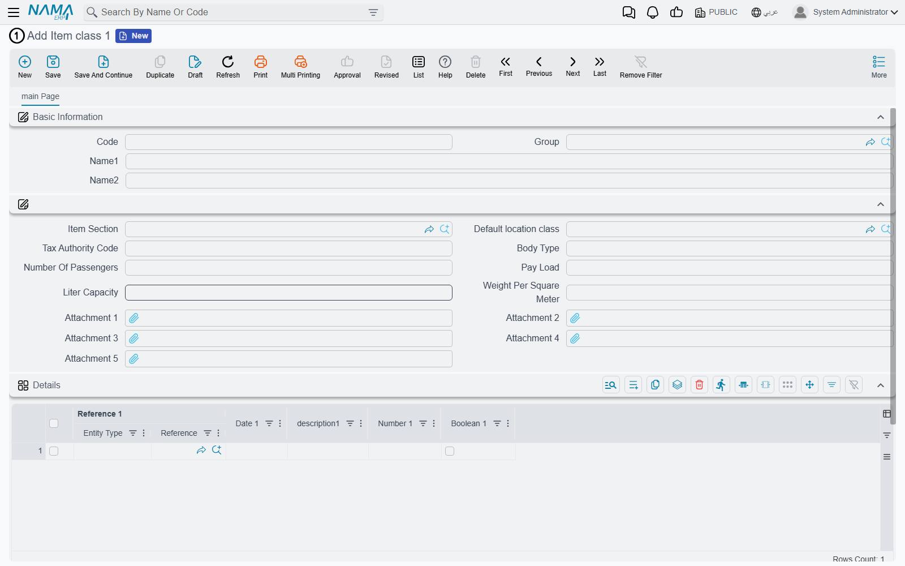
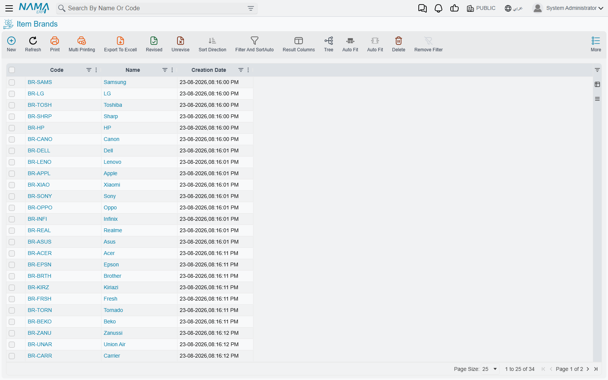
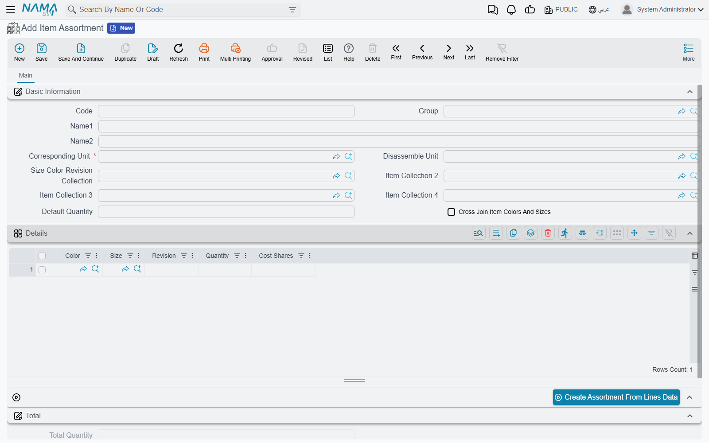

# Item Classification Files

Ask two people to organise the same catalogue of five thousand items and you will get two different answers. One will group by what the thing *is* — raw material, finished goods, spare parts. The other will group by who sells it, or which supplier it comes from, or which shelf it lives on. Both are right, and a real business needs all of them at once, because the purchasing report, the sales commission scheme and the stocktake each slice the catalogue differently.

That is why item classification is not one field. It is a set of small master files, each holding the values for one way of slicing the catalogue, which you then attach to items.

## Item Class 1 to 10: the Ten Slots

**Item Class 1** through **Item Class 10** (*Inventory → Master Files → Item class 1* … *Item class 10*) are the main classification mechanism. Ten independent, empty slots, and you decide what each one means.

A pharmaceutical distributor might use Class 1 for therapeutic category, Class 2 for the manufacturer, Class 3 for storage requirement (cold chain or ambient) and leave the rest empty. A clothing retailer might use Class 1 for department, Class 2 for the fabric, Class 3 for the age group. Nothing in the system assumes what any of them mean.

Each slot is its own master file, so the values in Class 1 are separate from those in Class 2, and the ten can be filled independently on any item.

::: tip Why the item classes matter more than they look
The ten class slots are what almost everything else in supply chain matches on. When you set up a rule that applies to a group of items rather than one item — pricing rules, storage allocation, item relations, bulk item creation — the selector offered is **Class 1–10**.

The [Multiple Item Creator](./item-maintenance.md) is the clearest illustration: its generation grid multiplies by Class 1 to Class 10 and nothing else. If you are setting up a new implementation and wondering which classification to invest effort in, this is the answer.
:::

::: warning Item Category is superseded
Items also carry **Item Category 1** to **Item Category 5**, fed by the **Item Category** file (*Inventory → Master Files → Item Category*). The screen still ships and is still on the menu, so you will find it and existing databases still hold values in it.

The item classes have superseded it. New implementations should classify with **Class 1–10** and leave the category slots alone; the classes are what the rules, generators and selectors across the module are built around. Categories appear in a few places as reference fields, but they are not where the system's classification logic lives.
:::

## Section and Brand

Two more classification files stand outside the numbered slots because they have a fixed meaning.

**Item Section** (*Inventory → Master Files → Item Section*) is the broadest grouping — the department or division a product belongs to.

**Item Brand** (*Inventory → Master Files → Item Brand*) records the make. It matters more than it sounds: brand is one of the selectors offered when you write a rule that should apply to a range of products, so "everything by this manufacturer" is a single line rather than a list of items.

## Colours and Sizes

Some items are not one thing. A shirt is a shirt in eight colours and five sizes, and you do not want forty item cards for it. In Nama ERP a single item can carry colour and size as *dimensions*: one item, with balances, costs and prices tracked per colour and size combination.

Four master files support this:

| File | What it holds |
|---|---|
| **Item Color** (*Inventory → Master Files → Item Color*) | The colours themselves |
| **Item Size** (*Inventory → Master Files → Item Size*) | The sizes |
| **Item Color Classification** (*Inventory → Master Files → Item Color Classification*) | Groups of colours, for organising a long colour list |
| **Item Size Classification** (*Inventory → Master Files → Item Size Classification*) | The same for sizes |

Whether an item uses them at all is decided by the **Has Colors** and **Has Size** switches on the item, and how strictly they are enforced comes from the item's configuration profile — see [Creating and Maintaining Items](./item-maintenance.md).

## Item Revision File

**Item Revision File** (*Inventory → Master Files → Item Revision File*) defines a revision — a model year, a version, a formulation. Like colour and size, a revision is a dimension an item can be tracked by, so one item can hold stock of the 2025 and 2026 versions separately.

A revision is more than a code. Each one is classified in its own right — it carries an **Item Brand**, an **Item Section**, **Class 1–10** and **Item Category 1–5** — which means a revision can be found and reported on the same way an item can. It also carries its own **Colors Lines** and **Size Lines** grids, each of which can nominate a **Default**. That is how a revision says which colours and sizes it is actually available in, rather than inheriting every colour the item has ever been made in.

## Building the Matrix: Size Color Revision Collection

Listing colours and sizes is easy. The tedious part is the combinations, and that is what **Size Color Revision Collection** (*Inventory → Master Files → Size Color Revision Collection*) is for.

The screen has two tabs, and the second is where the work happens. On the **Size And Colors** tab you fill three simple grids — **Colors Lines**, **Size Lines**, and **Revisions** (each naming an Item Revision File). Then you press **Generate Item Color Size**, and the matrix is built for you: every colour paired with every size, written into the **Details** grid on the first tab.

Four colours and five sizes become twenty rows without anyone typing twenty rows. You can then prune the combinations that do not exist — if the shirt is not made in extra-large green, delete that row.

The finished collection is attached to items through the **Size Color Revision Collection** field, which appears on the item card and on both the Item Opening Request and the Multiple Item Creator. So the matrix is defined once and reused across every item that shares it.

## Selling a Mix as One Thing: Item Assortment

An assortment is a pre-packed mix sold as a single unit. A carton of shirts holding two smalls, three mediums and one large is one thing to the customer and to the price list, but six garments to the warehouse.

**Item Assortment** (*Inventory → Master Files → Item Assortment*) describes exactly that. The **Details** grid lists what is inside — a **Color**, a **Size**, a **Revision**, a **Quantity**, and **Cost Shares** for splitting the assortment's cost across its contents — and **Total Quantity** adds it up.

Two fields in the header make the packing and unpacking work:

- **Corresponding Unit** is the unit the assortment is traded in — the carton.
- **Disassemble Unit** is what it breaks down into — the individual garment.

Filling the grid by hand is optional. Set **Cross Join Item Colors And Sizes**, and the assortment is taken as every combination of the colours and sizes in use on the item. Alternatively **Create Assortment From Lines Data** builds the contents from the combinations of what you have entered in the lines. The header can reference up to four collections, so an assortment can draw on more than one matrix.

Assortments also appear on the unit grids of the Item Opening Request and the Multiple Item Creator, in a column named **The Assortment**, so an item can be set up to trade in assortment units from the moment it is created.

## Where the Other Classification Files Live

Two files that sound as though they belong here are documented elsewhere, because the menu puts them elsewhere and so does their purpose:

- **Material Classification** sits under *Sales → Master Files* and is covered in [Specialized Scenarios](./specialized-scenarios.md).
- **Season** and **Update Seasons Document** sit under *Sales → Prices And Offers*. They classify by trading period rather than by product nature, which puts them alongside [Pricing, Offers and Coupons](./pricing-offers-and-coupons.md) rather than here.
