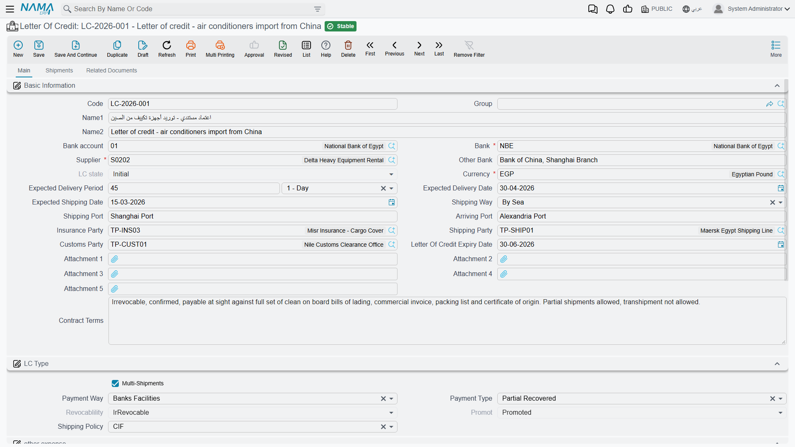
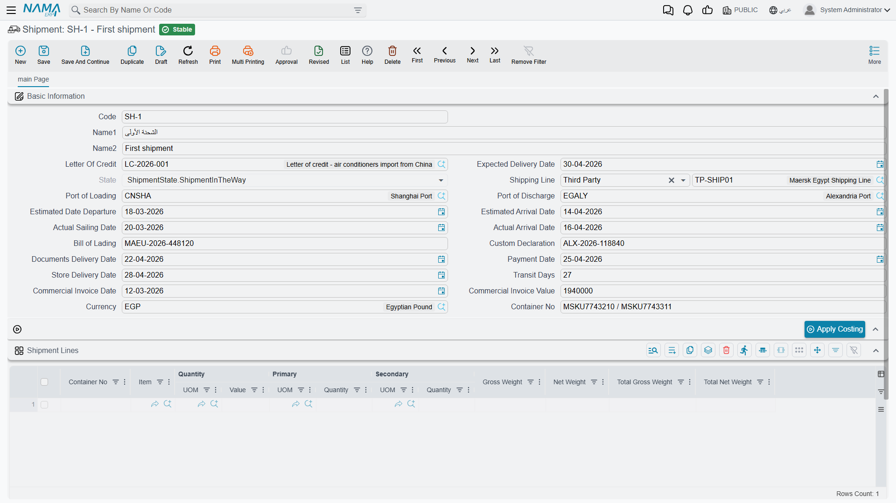

# Import Letters of Credit

When you import goods from a supplier abroad, both parties need a guarantee: the supplier wants assured payment, and you want assured conforming shipment. The **Letter of Credit (LC)** is the banking instrument that reconciles the two, and the system manages its full cycle - from opening to shipments to costs.

::: info The banking side of the LC
This page covers import management (shipments, costs, and landed cost). For the purely banking side — reserving the facility limit, opening fees, and ledger postings — see the [Bank LC in Accounting](../accounting/bank-letters-of-credit.md).
:::

## What Is a Letter of Credit?

It's an undertaking by your bank to pay the supplier the value of the goods once they meet agreed conditions (conforming shipping documents within a set deadline). Instead of wiring money directly to a distant supplier you've never dealt with, the bank stands as a trusted intermediary protecting both parties.



## The LC File (LetterOfCredit)

The **Letter of Credit** is the master file linking the supplier, bank, shipment details, and terms: the payment type (prepaid or deferred), the shipment policy and LC shape (sight or usance), the LC value and expiry date, the shipping ports, and the insurance, customs, and shipping parties. It supports multiple shipments with expected delivery periods, and stores attachments and the associated proforma invoices.

## The Opening Cycle

```
LC Request → Opening Request → Opening Document → Shipments → Costs & Expenses
```

- **LC Request** (LetterOfCreditRequest): starts the workflow with a down-payment percentage and supplier details, with status tracking for the LC.
- **Opening Request** (LCOpeningRequest): the pre-opening stage that prepares for establishing the LC at the bank.
- **Opening Document** (LCOpeningDoc): finalizes the opening with a bank account, opening commission, and value confirmation, distributes the down payment and commission as additional costs, creates the necessary accounting entries, and links to the expense document to track LC costs across its cycle.

## Shipments (LCShipment)



The **LC Shipment** tracks the dispatch of goods under the LC: container, bill of lading, and customs documents, expected vs. actual dates and transit days, the commercial invoice with its currency and shipment lines, and shipping-line assignment and port routing. Linked to it at the document level are:
- **LC Proforma Invoice** (LCProformaInvoice): a proforma invoice before shipment that defines the items and prices, with support for deferred payment scheduling.
- **LC Shipment Proforma Invoice** (LCShipmentProformaInvoice): issued upon shipment execution, with lines keyed to the actual shipment quantities.

## Costs and Expenses

The cost of imported goods isn't just their price; it includes insurance, freight, customs, commissions, and financing. The **LC Expense Document** (LcExpenseDocument) accumulates these and loads them onto the goods, supporting manual, calculated, and scheduled-payment lines, and integrating with the accounting setup for multiple taxes. The **LC Cost Document** (LCCostDoc) is available for additional cost tracking. This brings you to the true **landed cost** of the imported goods - an extension of the [additional costs](./inventory-costing.md) concept.

## Event Log (LCAction)

Throughout the LC's life, administrative events arise: amendments, notifications, claims, and releases. The **LC Action** document records them with their types, attachments, and shipment links, forming a complete audit trail of the LC lifecycle.

## Actions on these screens

The letter-of-credit documents are mostly created from one another, and the buttons are how that chain is walked.

**On the Letter of Credit Request:** **Create Letter Of Credit** — builds the letter of credit itself from the request, carrying the arriving port, the bank account and the rest of the request's terms over, and opens it as a new record.

**On the LC Opening Request:** **Accept** and **Reject** set the request's status. Neither works on a request that has already been processed — the screen says so and nothing changes.

**On the Letter of Credit:**

- **Create LC Opeining Doc** — creates the opening document, pre-filled with the credit's supplier and bank account.
- **Create LC Cost Doc** — creates the costing document for the credit, carrying its code and names.
- **Apply Costing** — spreads the costs gathered so far onto the goods, which is what turns the credit's expenses into item cost. The **LC Shipment** carries the same button for a single shipment.

**On the LC Cost Document:** **Collect Item Expenses** — reads the letter of credit, or the single shipment, named on the header and fills the grid with the expenses recorded against it, so you cost from what was actually spent rather than re-typing it.

**On the LC Expense Document:** **Collect Items** fills the expense lines from the credit and shipment on the header, and **GeneratePayments** splits the value into an instalment schedule. **GeneratePayments** is also on the LC Proforma Invoice and the LC Shipment Proforma Invoice.

## The Full Picture

1. You agree with a foreign supplier, so you create the **LC Request** then the **Opening Request**.
2. The bank opens the LC via the **Opening Document**, and the down payment and commission are loaded as costs.
3. The supplier ships the goods, so the **Shipment** is recorded with its documents and invoice.
4. Insurance, freight, and customs charges accumulate in the **Expense Document** and are loaded onto the goods.
5. The goods arrive and are received into inventory at their full landed cost, with any events recorded via the **Action Log**.

## Messages you may see

| Message | Why | What to do |
|---|---|---|
| *The letter of credit {0} is not multi shipment* — «الإعتماد المستندي {0} ليس متعدد الشحنات» | An LC Shipment was saved against a credit whose *Multi Shipments* option is off, so the credit expects the goods in one consignment recorded on the credit itself. | Turn *Multi Shipments* on in the letter of credit if the goods really arrive in stages, or record the arrival on the credit instead of opening a shipment. |
| *Can Not Handel Closed Letter Of Credit* — «لا يمكن التعامل مع اعتماد حالته مغلقة» | The credit named on an LC Action, Opening Request, Opening Document or LC Proforma Invoice is still in its initial state or already closed, and neither state accepts new documents. | Advance the credit past its initial state before recording documents against it; if it is closed, record the event on a live credit or reopen this one. On the proforma invoice, the Supply Chain option *Allow Editing In Lc Proforma Invoice And Lc Expense Document* lifts the block. |
| *You can not leave both the letter of credit in the header and the shipment and letter of credit lines empty* — «لا يمكنك ترك الإعتماد المستندي في الرأس او في تفاصيل الشحنات والإعتمادات فارغا» | An LC Expense Document names no credit on its header and has no shipment-and-credit lines either, so there is nothing for the expenses to attach to. | Name the credit on the header, or fill the shipments and letters of credit grid. |
| *The letter of credit {0} is not included in this document* — «الاعتماد {0} غير موجود بهذا السند» | A manual expense line names a credit that is neither on the header nor among the document's shipment-and-credit lines. | Change the line to one of the credits the document covers, or add that credit to the shipments and letters of credit grid. |
| *The shipment {0} is not included in this document* — «الشحنة {0} غير موجودة بهذا السند» | A manual expense line names a shipment that is neither on the header nor among the document's shipment-and-credit lines. | Change the line to one of the shipments the document covers, or add that shipment to the grid. |
| *There is no invoice for this letter of credit {0}* — «لا توجد فاتورة لهذا الإعتماد {0}» | Expenses are being loaded onto a credit that has no LC Proforma Invoice, so there are no item values to distribute over. | Create the proforma invoice for the credit first, then save the expense document. |
| *The letter of credit {0} must have shipments* — «الإعتماد المستندي {0} يجب ان يدخل له شحنة» | The credit is marked *Multi Shipments*, so every expense line has to say which shipment it belongs to, and this one leaves the shipment empty. | Fill the shipment on the line — one line per shipment the charge is split across. |
| *You can not use the same letter of credit for the same shipment more than one time* — «لا يمكنك استخدام نفس الإعتماد المستندي لنفس الشحنه أكثر من مرة» | The same credit-and-shipment pair appears twice in the shipments and letters of credit grid (the header's own pair counts as one of them). | Delete the duplicate row and put the whole charge on one line. |
| *The shipment {0} does not belong to the letter of credit {1}* — «الشحنة {0} لا تنتمي للإعتماد المستندي {1}» | A header or a grid line pairs a shipment with a credit other than the one the shipment was opened under. | Pick a shipment that belongs to that credit, or correct the credit on the line. |
| *The Shipment {0} is not included in proforma invoice* — «الشحنة {0} غير مدرجه بفاتورة مبدئية» | The shipment on the expense document's header is not referenced by any LC proforma invoice line, so its items and values are unknown. | Add the shipment's items to the credit's proforma invoice before charging expenses to it. |
| *The Shipment {0} is not included in lc shipment proforma invoice* — «الشحنة {0} غير مدرجه بفاتورة مبدئية للشحنة» | The same check with the Supply Chain option *Use Proforma Invoice Per Shipment* switched on: the system now looks for an LC Shipment Proforma Invoice for this shipment and finds none. | Issue the LC Shipment Proforma Invoice for that shipment, then save the expense document. |
| *LC state for letter of credit {0} is closed* — «حالة الإعتماد المستندي {0} مغلقة» | An LC Expense Document was saved against a closed credit while the Supply Chain option *Allow Editing In Lc Proforma Invoice And Lc Expense Document* is off. | Charge the expense to a credit that is still open, or have the option enabled if late charges on closed credits are normal for you. |
| *Can not save because all items in proforma invoice: {0} are of type service* — «لا يمكن الحفظ لأن كل الأصناف في الفاتورة المبدئية: {0} من نوع خدمي» | Expenses can only be loaded onto stock items, and every line of the credit's proforma invoice is a service item — there is no goods value to carry the cost. | Charge those services directly through an accounting document; keep the LC expense document for credits that bring in stock items. |
| *No stock receipts found for the LC {0}* — «لا يوجد اي توريد مخزني للاعتماد المستندي {0}» | The LC Cost Document costs what actually arrived, and no saved stock receipt yet references this credit (or the shipment named on the header). | Receive the goods first, then cost the credit. If the receipt exists, check it names the credit or shipment as its invoice. |
| *Can not edit the proforma invoice {0} for the letter of credit {1} because of the expense document {2}* — «لا يمكن تعديل الفاتورة المبدئية{0}للاعتماد المستندى {1} بسبب سند الصرف {2}» | Expenses have already been distributed over this proforma invoice's values, so changing it would leave the distributed cost wrong. | Reverse or delete the expense document named in the message, change the proforma invoice, then re-enter the expenses — or have the Supply Chain option *Allow Editing Proforma Invoice After Expense Docs* enabled. |
| *The shipment {0} has another proforma invoice {1}* — «الشحنة {0} لها فاتورة مبدئية أخرى {1}» | A shipment carries one LC Shipment Proforma Invoice only, and the message names the one already saved for it. | Amend the existing proforma invoice instead of issuing a second one. |

## Next Steps

- [The Purchasing Journey](./purchasing-journey.md) - local vs. import purchases
- [Inventory Costing & Revaluation](./inventory-costing.md) - loading additional costs onto goods
- [Receiving Stock](./receiving-stock.md) - receiving imported goods into inventory
