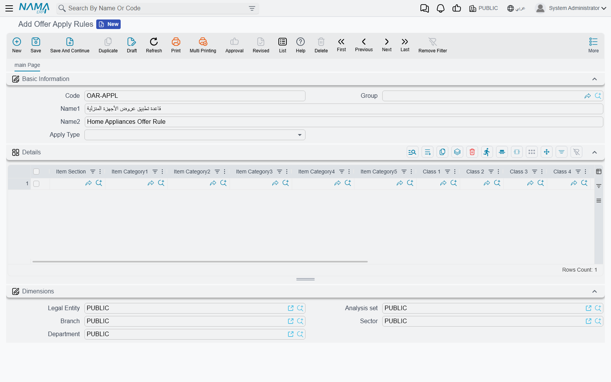

# Offer Apply Rules

An **Offer Apply Rule** is a named, reusable filter that tells an invoice-level promotion which lines of a document it is actually about. Offers, coupons and free-item awards are all defined against the document as a whole — a discount on the invoice total, a gift once the basket passes a value — but the promotion the client has in mind is usually narrower than that: *ten per cent off, but only the coffee machines count*, or *a free mug once the customer has bought two hundred pounds' worth of anything except tobacco*. Rather than repeat that item filter on every offer line that needs it, you describe it once on this screen and point the offer lines at it.

::: info What this page is not
The catalogue of promotions the system can run — price lists, item discounts, free items, coupons, post-sales rebates — is in [Pricing, Offers & Coupons](./pricing-offers-and-coupons.md). This page is about the small screen those promotions borrow when they need to be aimed at part of a basket rather than all of it.
:::

## What a rule carries, and what it deliberately does not

A rule is thin on purpose. It has a **Code**, a **Group**, an Arabic and an English name, an **Apply Type**, and a **Details** grid. That is the entire screen.

What is missing matters just as much. There are no dates, no customer, no discount percentage and — this is the one that surprises people — **no priority**. All of that stays on the offer or the coupon that uses the rule. A rule is a description of a set of lines, not a promotion. The same rule can be attached to a summer offer and to a winter one, and it behaves identically in both.

The **Dimensions** group at the foot of the screen (**Legal Entity**, **Analysis set**, **Branch**, **Sector**, **Department**) is the ordinary master-file scoping that every file in the system carries. It governs who may see and use the record; it takes no part in deciding which document lines match.

## Describing the lines: the Details grid

Each line of the **Details** grid is one specification of "lines like this". A line offers three kinds of column:

| Columns | What they match on |
|---|---|
| **Item Section**, **Item Category1** to **Item Category5**, **Class 1** to **Class 10**, **Item Brand** | the classification values recorded on the item card |
| **Item** | one specific item |
| **Department**, **Analysis set**, **Branch**, **Sector**, **Legal Entity** | the dimensions recorded on the item card |

Reading a single grid line, every column you fill is a condition and they all have to hold at once. **Item Brand** = Bosch together with **Item Section** = Appliances matches Bosch appliances, and nothing else.

Reading the grid as a whole, each line stands on its own, so adding lines widens the net rather than narrowing it. A rule that should cover two brands needs two lines, one per brand.

::: warning The dimension columns read the item card, not the invoice
The five dimension columns on a grid line are compared against the dimensions stored **on the item itself**, not against the branch or sector of the document being priced. Putting **Branch** on a grid line therefore means "items that belong to this branch", not "when selling from this branch". If the promotion is meant to be restricted by where the sale happens, that belongs on the offer's own dimensions, not here.

A dimension column set to the system's general catch-all dimension value counts as blank and filters nothing.
:::

::: tip A blank grid line vanishes on save
A grid line where every single column is empty is dropped silently when the record is saved. If that leaves the grid with nothing in it, the save is refused, because a rule with no lines has nothing to say — **Details** is required.
:::

## Apply Type: three ways to read the same grid

The **Apply Type** field decides how the grid is interpreted, and it changes the meaning of the rule completely.

| Apply Type | How the grid is read | Reach for it when |
|---|---|---|
| **Include (Any Applicable Line)** | A document line qualifies when it matches **at least one** grid line. | you are listing what the promotion is about — the everyday choice |
| **Exclude (Not Applicable Line)** | A document line qualifies when it matches **none** of the grid lines. | the promotion covers nearly everything and you only need to name the exceptions |
| **All Lines Applicable** | Every grid line must be matched by **some** line on the document. If that holds, the whole document qualifies; if even one grid line goes unmatched, nothing on the document does. | the promotion is a reward for buying a combination |

The third type is the one that catches people out, because it is not a per-line test at all — it is a gate on the document. Give it two grid lines, one for printers and one for cartridges, and the offer stays dormant until an invoice contains both. The moment it does, every line on that invoice counts as matching: the printer, the cartridge, and the paper and cables that were never mentioned in the rule. Include and Exclude, by contrast, sort the document line by line and leave the rest of the basket alone.

::: info Free lines never count as matches
Lines the system has already added to the document as free or gift lines are skipped when a rule is evaluated. A gift never helps the customer reach the threshold that would earn the next gift.
:::

## Where a rule gets attached

A rule does nothing on its own; something has to pick it up. Four fields ask for one.

| Screen | Field | What the rule decides there |
|---|---|---|
| **Sales Offer** → **Invoice Offers** tab → **Invoice Discounts** grid (*Sales → Prices And Offers → Sales Offer*) | **Applied On** | which lines' total is measured against the discount's invoice-value band — and whether the discount survives at all |
| **Sales Offer** → **Invoice Offers** tab → **Coupons For Invoice Value** grid | **Applied On** | which lines' total is measured against the band that decides whether a coupon is issued |
| **Sales Offer** → **Invoice Offers** tab → **Free Items On Invoice Value** grid | **Applied On** | which lines' value earns the free item, and across which lines the gift's cost is spread afterwards |
| **Discount Coupon** and **Discount Coupon Book** (*Sales → Prices And Offers → Discount Coupon*) | **Discount Apply Rules For Lines** | which lines the coupon's percentage is written onto |

On the **Invoice Discounts** grid, **Applied On** accepts either an Offer Apply Rule or a **Pricing Range**. The two are alternatives in the same field: a Pricing Range there filters by quantity band rather than by item classification.

Two switches nearby only make sense in company with a rule:

- **Discount Basis From Total Of Only Matched Lines**, on the invoice-discount line, changes what a multiple-of-value discount counts. Instead of counting multiples on the whole invoice, it counts them on the total of the matching lines. The system refuses to save an offer that has this switch on with **Applied On** left empty, and says so in as many words.
- **Sales In Other Invoices Policy**, on the coupon line, is mutually exclusive with **Applied On**. That policy widens the measurement to the customer's other invoices in the same month or year, which is a different question from *which lines of this invoice*, and a line that tries to do both is rejected on save.

### On a Discount Coupon

The coupon's **Discount Apply Rules For Lines** changes where the coupon lands. Ordinarily a coupon is converted into a single header discount for the whole invoice. Fill the rule in together with **Invoice discount apply on** — the discount slot the value is written into — and the coupon's percentage is stamped onto each matching line individually instead, leaving the rest of the invoice untouched. If the rule matches nothing on that invoice, the coupon simply does not apply.

Three conditions come with it, and the screen enforces all three:

- The coupon has to be a percentage coupon. A value coupon carrying a rule is refused on save.
- Filling either **Discount Apply Rules For Lines** or **Invoice discount apply on** makes the other one required — they are only meaningful as a pair.
- The **Discount Coupon Book** carries the same pair, with the same validations, and passes both settings down to the coupons it produces.

## Where the rule sits when several offers compete

This is the part worth understanding, because it is where the support call usually starts: the client has three offers that all look as though they should apply, and only one of them reaches the invoice.

Arbitration between competing promotions is **not** the rule's job. The rule is a filter, and it runs late. When the system prices a document, invoice-level discounts are settled in this order:

1. **Gather the candidates.** Every invoice-discount line from every offer whose header fits the document is collected: the offer's date window, its customer or customer class, its invoice classification, its dimensions, its price classifiers, its security capability, its subsidiary. Apply rules play no part in this step — a line becomes a candidate on the strength of the offer's header, whatever its rule says.
2. **Drop the candidates that yield to a stopper.** A candidate flagged **Consider Stop Other Discounts When Applying Coupon** is discarded if the document already carries an offer that stops other discounts.
3. **Apply the strongest stopper's priority.** When **Prioritized Stop Other Discounts Across Offer Types** is on in the supply-chain configuration, the system looks up the strongest priority among all offer lines flagged **stop other discounts** — of any kind, item discounts included — and discards every candidate ranked weaker than that.
4. **Let stoppers remove what stands behind them.** Working through the remaining candidates in priority order, a line flagged **stop other discounts** removes every candidate from a *different* offer that sits behind it.
5. **Filter by employee.**
6. **Now the apply rule runs.** For each surviving candidate that has one: if the rule matches no line of the document, the candidate is discarded outright. If it matches some, the candidate stays — but its minimum and maximum invoice-value band is re-measured against the **total of the matching lines only**, instead of the invoice total. A candidate with no rule keeps being measured against the whole document.
7. **Sort and accumulate.** What is left is sorted by **Priority**, then by the order of the lines inside their offer, and each surviving line contributes its own discount.

Two conclusions follow, and they answer the two questions people actually ask.

::: tip The lower number wins, and offers stack by default
**Priority** is a rank, not a weight: the smaller the number, the stronger the offer. Nothing in the sequence above picks a single winner — the discounts that survive **add up**. Promotions only exclude one another when somebody has ticked a stopper switch (**stop other discounts**, **Ignore Item Offers**, **Consider Stop Other Discounts When Applying Coupon**), and even then the exclusion is settled by priority rather than by which offer happened to be found first.
:::

::: warning An apply rule never breaks a tie
Because the rule runs at step 6, all it can ever do is remove a candidate or change the value that candidate is measured against. It cannot make a weaker offer beat a stronger one, and two offers pointing at the same rule are still separated by their priorities alone. When a client expects "the more specific offer should win", that expectation has to be written as a priority on the offer. The rule will not deliver it.
:::

The free-item and coupon grids use the rule in the same spirit: it decides which lines count toward the threshold, never which of two competing offers is the better one.

## When no rule is attached

Leaving **Applied On** empty is the normal case, and it means *the whole document*. The invoice-value band is measured on the invoice total, the free item is earned on the invoice total, and the coupon becomes a single header discount. Nothing is switched off by the absence of a rule and no default rule is substituted — a promotion without a rule is simply a promotion about everything.

That is also the shape of the fix when an offer stops working the day somebody attaches a rule to it. Clearing the field restores the whole-document behaviour; and before blaming the offer, it is worth opening the rule and checking that its grid really does match something on the documents the client is testing with. A rule that matches nothing removes its offer entirely rather than quietly falling back to the whole invoice.

## Next Steps

- [Pricing, Offers & Coupons](./pricing-offers-and-coupons.md) — the promotions that borrow these rules
- [Item Classification Files](./item-classification-files.md) — the sections, categories, classes and brands the grid filters on
- [Sales and Offers Configuration](./configuration/sales-and-offers-configuration.md) — the module settings that govern priorities and stoppers
- [The Sales Journey](./sales-journey.md) — where the priced document is created
