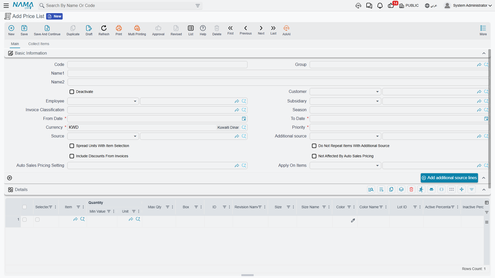
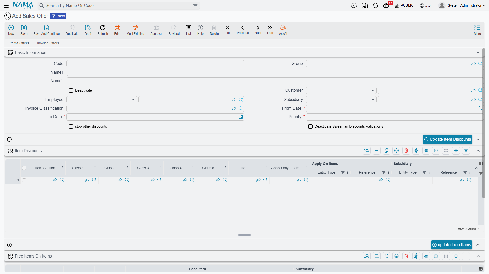

# Pricing, Offers & Coupons

The price a customer pays isn't a single number, but the result of several layers: a price list, a quantity discount, a promotional offer, and maybe a coupon. This guide gathers the supply-chain pricing tools and explains how they stack.

::: info Integration with the Invoicing Module
The shared document-level discount, offer, and loyalty-point mechanics are documented in the [Invoicing module](/modules/invoicing/) (the discounts, offers, and reward-points guides). This page focuses on the supply-chain-specific pricing entities and refers to those guides where they intersect, to avoid duplication.
:::

## Sales Price Lists (SalesPriceList)

The **Sales Price List** is the backbone of pricing: it sets each item's price for a specific customer segment, period, and currency. You can have multiple lists (retail, wholesale, VIP customers, promotions), and each list has an effective date range and a priority that prevents conflicts when more than one list overlaps. When creating an invoice, you choose the appropriate list and the system fills prices automatically.

### Quantity-Based Pricing (PricingRange)

The **Pricing Range** enables tiered prices by quantity: 1-10 pieces at one price, 11-50 at a lower price, and above that even lower - automatically rewarding larger purchases.

### Automatic Pricing (AutoSalesPricing)

Instead of setting the sales price manually, **Automatic Pricing** computes it from cost plus a profit margin (default, minimum, and maximum). When cost changes, the price is recalculated while respecting the margin policy. Its global behavior is configured via the **Auto Sales Pricing Setting** (AutoSalesPricingSetting).

### Pricing in Points (SalesPriceInPoints)

For loyalty programs, the **Sales Price in Points** lets you price items in points redeemable instead of (or alongside) money.

## Offers and Free Items (SalesOffers)

**Sales Offers** are the promotion engine: a percentage or amount discount, free items, or incentives based on invoice value or a minimum cart. You can target them with filters (invoice classification, customer, sector) and link them to a season so they activate automatically in its period.

And the **Free Item Group** (FreeItemGroup) lets you offer several free items as a single bundle within the offer, with repeat rules and policies configured.

## Post-Sales Offers (PostSalesOffer)

Some incentives aren't granted at the time of sale but afterward (incentives, retroactive discounts, rebates). The **Post-Sales Offer** defines the program and its conditions via the **Post-Sales Offer Config** (PostSalesOfferConfig), and the customer claims their entitlement via the **Post-Sales Offer Claim** (PostSalesOfferClaim), which is reviewed, approved, and affects the customer's balance. There's also the **Periodic Monthly Offer** (PeriodicMonthlySalesOffer) that generates its incentives monthly via a periodic calculation.

## Coupons (DiscountCoupon)

The **Discount Coupon** is a targeted promotion tool: a discount value, item scope, usage limits, validity, and customer eligibility. Coupons are organized into:
- **Coupon type** (DiscountCouponType): a category that governs its rules (store, online, seasonal).
- **Coupon book** (DiscountCouponBook): a collection of coupons for a promotional campaign and its distribution.
- **Coupon coding method** (SalesCouponsCodingMethod): the code format, its generation algorithm, and uniqueness validation.

At the point of sale, the coupon is applied via the **Coupons Sales Order** (CouponsSalesOrder), and its reversal on a return is handled via the **Coupons Sales Order Return** (CouponsSalesOrderReturn).

## Price Voting (PriceVotingDoc)

In organizations that require approval of price changes, the **Price Voting Document** provides a workflow: new prices are proposed and presented to approvers for a vote before taking effect, with their record kept in the **Price Voting File** (PriceVotingFile) as an audit trail of pricing decisions.

## How the Layers Stack

When pricing an invoice line, the system applies the layers in order: the base price from the **price list** (or **automatic pricing**), then a **quantity range** adjustment, then eligible **offers**, then a **coupon** if present, while respecting the **minimum price** defined on the item. Understanding this order explains the final price the customer sees.

## Next Steps

- [The Sales Journey](./sales-journey.md) - where these prices are applied to orders and invoices
- [Understanding Inventory Items](./understanding-items.md) - minimum price and automatic pricing on the item
- [Invoicing module](/modules/invoicing/) - document-level discount, offer, and loyalty mechanics
