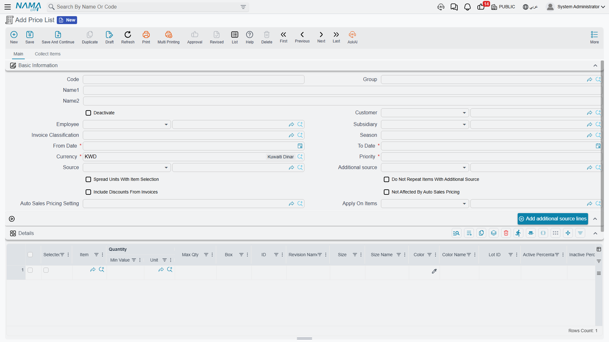
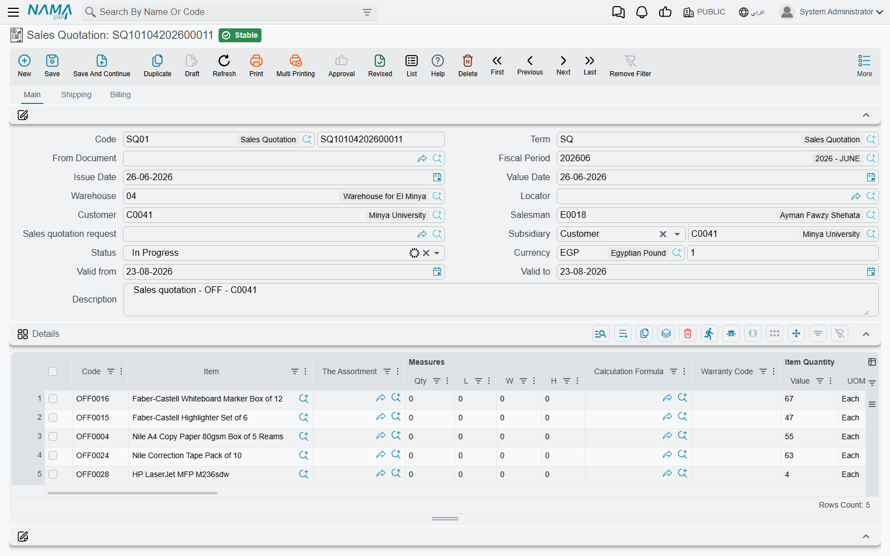

# Pricing, Offers & Coupons

The price a customer pays isn't a single number, but the result of several layers: a price list, a quantity discount, a promotional offer, and maybe a coupon. This guide gathers the supply-chain pricing tools and explains how they stack.

::: info Integration with the Invoicing Module
The shared document-level discount, offer, and loyalty-point mechanics are documented in the [Invoicing module](/modules/invoicing/) (the discounts, offers, and reward-points guides). This page focuses on the supply-chain-specific pricing entities and refers to those guides where they intersect, to avoid duplication.
:::

## Sales Price Lists (SalesPriceList)

The **Sales Price List** is the backbone of pricing: it sets each item's price for a specific customer segment, period, and currency. You can have multiple lists (retail, wholesale, VIP customers, promotions), and each list has an effective date range and a priority that prevents conflicts when more than one list overlaps. When creating an invoice, you choose the appropriate list and the system fills prices automatically.

### Quantity-Based Pricing (PricingRange)

The **Pricing Range** enables tiered prices by quantity: 1-10 pieces at one price, 11-50 at a lower price, and above that even lower - automatically rewarding larger purchases.

### Automatic Pricing (AutoSalesPricing)

Instead of setting the sales price manually, **Automatic Pricing** computes it from cost plus a profit margin (default, minimum, and maximum). When cost changes, the price is recalculated while respecting the margin policy. Its global behavior is configured via the **Auto Sales Pricing Setting** (AutoSalesPricingSetting).

### Pricing in Points (SalesPriceInPoints)

For loyalty programs, the **Sales Price in Points** lets you price items in points redeemable instead of (or alongside) money.

## Offers and Free Items (SalesOffers)

**Sales Offers** are the promotion engine: a percentage or amount discount, free items, or incentives based on invoice value or a minimum cart. You can target them with filters (invoice classification, customer, sector) and link them to a season so they activate automatically in its period.

And the **Free Item Group** (FreeItemGroup) lets you offer several free items as a single bundle within the offer, with repeat rules and policies configured.

## Trading Seasons (Season)

Both of the screens above want a **From Date** and a **To Date**, and in a business that runs on seasons you end up typing the same pair of dates into dozens of records: every price list for the summer collection, every offer that runs alongside it, every points price. Get one of them wrong by a day and that one record quietly behaves differently from all the others.

The **Season** (*Sales → Prices And Offers → Season*) is there to stop that. It is a small master file — a code, a name, a **From Date** and a **To Date** — that gives a trading period a name you can point at. "Summer 2026" gets defined once.

What it then does is deliberately narrow, and worth stating precisely: **choosing a season fills the record's own dates from it.** On a **Sales Price List**, a **Sales Offer** or a **Sales Price in Points**, picking the season copies its From and To dates into that record's From Date and To Date the moment you choose it — and again every time the record is saved. Push the season's end date out by a week and every record pointing at it follows on its next save.

::: warning The season wins over dates you type
Because the copy happens on every save and not only when you pick the season, you cannot keep a season on a record and override its dates by hand — your dates are simply replaced. If one price list genuinely needs a different window from the rest of the season, leave its **Season** empty and type the dates instead.
:::

Seasons also turn up as an ordinary grouping field on the **Sales Forecast** and the **Purchase Forecast**, where they label figures by trading period without driving any behaviour.

### Putting Items in a Season: the Update Seasons Document (UpdateSeasonsDoc)

A season on a price list dates the list. It says nothing about *which products belong to the season* — and for a clothing retailer, "what is in the summer collection" is a real question that outlives any one price list.

The **Update Seasons Document** (*Sales → Prices And Offers → Update Seasons Document*) records the answer. It is a document rather than a master file: it has a book and a code, a **Term**, an **Issue Date**, a **Value Date** and a **Fiscal Period**, so a season assignment is numbered, dated and attributable in a way an edited master file is not.

Its body is a **Seasons** grid with one line per assignment — the **Item**, the **Season**, and a **From Date** and **To Date** for the assignment itself. Above the grid sit four header fields carrying those same four names, and they behave in a way that catches people out.

::: warning The header overwrites the grid, it does not merely default it
An **Item**, **Season**, **From Date** or **To Date** filled in on the header is written onto *every* line of the grid on each save, replacing whatever the line held. That makes the header the fast way to do the common job — put four hundred items into one season by naming the season once and listing the items — but it also means a document that mixes seasons has to leave the header **Season** empty, or every line will come out carrying the header's season.
:::

Processing the document produces no stock movement and no accounting entry; what it produces is the record of the assignments. The place you read them back is the item itself: the item card's prices page carries a **Related Seasons** list showing every season that item has been put into, with the dates and the document each assignment came from. Correcting an assignment therefore means raising another document, and the item's list keeps the trail.

## Post-Sales Offers (PostSalesOffer)

Some incentives aren't granted at the time of sale but afterward (incentives, retroactive discounts, rebates). The **Post-Sales Offer** defines the program and its conditions via the **Post-Sales Offer Config** (PostSalesOfferConfig), and the customer claims their entitlement via the **Post-Sales Offer Claim** (PostSalesOfferClaim), which is reviewed, approved, and affects the customer's balance. There's also the **Periodic Monthly Offer** (PeriodicMonthlySalesOffer) that generates its incentives monthly via a periodic calculation.

## Coupons (DiscountCoupon)

The **Discount Coupon** is a targeted promotion tool: a discount value, item scope, usage limits, validity, and customer eligibility. Coupons are organized into:
- **Coupon type** (DiscountCouponType): a category that governs its rules (store, online, seasonal).
- **Coupon book** (DiscountCouponBook): a collection of coupons for a promotional campaign and its distribution.
- **Coupon coding method** (SalesCouponsCodingMethod): the code format, its generation algorithm, and uniqueness validation.

At the point of sale, the coupon is applied via the **Coupons Sales Order** (CouponsSalesOrder), and its reversal on a return is handled via the **Coupons Sales Order Return** (CouponsSalesOrderReturn).

## Price Voting (PriceVotingDoc)

In organizations that require approval of price changes, the **Price Voting Document** provides a workflow: new prices are proposed and presented to approvers for a vote before taking effect, with their record kept in the **Price Voting File** (PriceVotingFile) as an audit trail of pricing decisions.

## Actions on these screens

Pricing screens are built around two moves: fill the lines from somewhere, then push a header value or a calculation down onto them.

**On the Sales Price List:**

- **Collect Items** — fills the lines from the item-collection criteria on the header instead of item by item.
- **Update Details** — stamps header values onto every line, asking one Yes/No at a time which to push: from date, to date, analysis set, legal entity, branch, department, sector, customer, invoice classification, and price classifiers 1 to 5.
- **Update Prices** — recalculates through the price-updater rules on the header: a source field, up to four destination fields, and up to five updaters, applied to all lines or only the selected ones. It refuses when the list has no lines, or when no updater is filled in.
- **calculate Price from Average Cost** — fills the destination price field from each item's average cost rather than from another price field.
- **Add additional source lines** — appends the lines of the price list named as the **additional source**, optionally carrying invoice discounts across and skipping items the list already holds.
- **Spread Selected Line Data** — expands the line you are standing on across the item's units, revisions, sizes and colours, following the spread switches on the header.

The **Purchase Price List** and the **Vendor Discount** carry the same **Update Details**, which asks about the supplier rather than the customer.

**On the Sales Offers screen** each grid has its own update button, because each grid has its own validity window:

- **Update Details** — pushes the header's dates, dimensions, customer, invoice classification and price classifiers onto the item-discount lines, again as a list of Yes/No questions.
- **Update Details From Time To Time** — a narrower one: it copies only the header's **from time** and **to time** onto every discount line, which is what an offer tied to certain hours of the day needs.
- **update Free Items**, **Update Invoice Discounts** and **Update Invoice Offers** — the same stamping, aimed at the free-items grid, the invoice-discount grid and the invoice-offers grid respectively.
- **Update Coupons** and **Update Lines** — for the coupons grid and the offers-on-item-count grid; these ask about three things only: from date, to date and priority.
- **Update Discounts Values - Percentages** — the price-updater engine again, this time writing discount values and percentages onto the item-discount lines.

**On the Periodic Monthly Sales Offer Calculation:** **Calculate Data** works out each candidate customer's figures, and **Generate Offers** then creates the offers themselves. Both need the document saved.

**On the Price Voting File:** **calculate Suggested Prices** collects what the voters suggested (the file must be saved first), and **Update Agreed Price** fills the agreed price on every line from the **agreed price source** chosen on the header — the highest suggested price, the lowest, the average, and so on.

**On the Item Voting File:** **Collect Doc Lines** pulls in the voting documents and their lines. **update Items** — on both the file and the individual Item Voting Doc — writes the voting result back onto the items themselves, and needs the record saved.

**On the Discounts Re-Calculation Document and the Discount Update:** **Collect** gathers the invoices to work on — by supplier and date range on the first, by collected invoice type and sector/branch ranges on the second — and **Apply** then writes the recalculated discounts back to those invoices. **Apply** needs the document saved.

## How the Layers Stack

When pricing an invoice line, the system applies the layers in order: the base price from the **price list** (or **automatic pricing**), then a **quantity range** adjustment, then eligible **offers**, then a **coupon** if present, while respecting the **minimum price** defined on the item. Understanding this order explains the final price the customer sees.

## Next Steps

- [The Sales Journey](./sales-journey.md) - where these prices are applied to orders and invoices
- [Understanding Inventory Items](./understanding-items.md) - minimum price and automatic pricing on the item
- [Invoicing module](/modules/invoicing/) - document-level discount, offer, and loyalty mechanics
