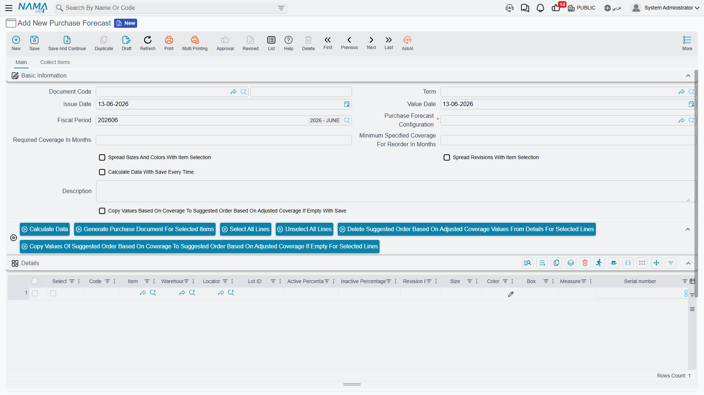

# Purchase Forecast

The best purchase is the one made before you run out, not after. **Purchase forecasting** turns the purchasing department from reactive ("out of stock! order now!") to proactive ("it'll run out in three weeks, so let's order now with standard delivery and better prices").

## Why Forecast?

Reactive buying is expensive: rush shipping, higher prices, and stockouts that halt production or lose sales. Forecasting gives you advance visibility of demand, so you buy in economical quantities, negotiate better prices, account for lead times, and avoid both stockouts and overstock.

## The Purchase Forecast Document (NewPurchaseForecast)

The **Purchase Forecast** document is the tool you use to estimate future demand for each item over an upcoming period. The estimate is based on a quantity source you choose, then it suggests purchase quantities after deducting what's available in stock and what's actually required.

You can narrow the forecast's scope by item, brand, or date range, and set the lookback period (the historical span over which consumption is measured).

## Quantity Sources: On What Basis Do We Forecast?

The forecast's power is in its data source. The system supports more than one source, and they can be blended:

- **Sales history**: use the past selling rate to predict upcoming demand - best for distribution and retail items. The rules for extracting sales are configured via the **Sales Source Config** (PFSalesSourceConfig): date range, item filters, and the invoice types included or excluded.
- **Other quantity sources**: via the **Quantity Source** (PFQuantitySource), the forecast can be fed numbers from other sources (such as production plans or manual entry), not from sales alone.

## Forecast Configuration (PurchaseForecastConfig)

The **Purchase Forecast Configuration** gathers the calculation criteria in one place: the adopted sources, seasonality factors, demand multipliers, and how to handle available and reserved stock. Setting this up once makes generating forecasts later consistent and fast.

::: tip Combine the Forecast with Lead Times
The forecast alone tells you "how much" you'll need, but the item's **lead time** (defined on the [item card](./understanding-items.md#Purchase-Configuration)) tells you "when" to order. Combine the two to order at the timing that ensures goods arrive just before you run out.
:::

## From Forecast to Purchase Order

The forecast isn't an end in itself, but a prelude to purchasing. After generating and reviewing the forecast, its suggestions become [purchase requests or orders](./purchasing-journey.md), closing the loop from anticipating the need to fulfilling it. This makes purchasing data-driven rather than guesswork.

## Next Steps

- [The Purchasing Journey](./purchasing-journey.md) - turning the forecast into actual purchase orders
- [Understanding Inventory Items](./understanding-items.md) - where lead times and safety stock are set
- [Stock Taking](./stock-taking.md) - inventory accuracy is the basis of forecast accuracy
