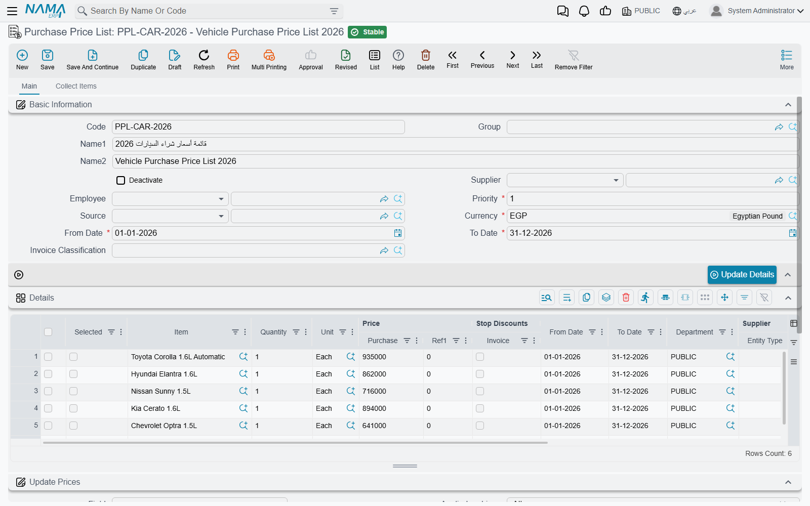
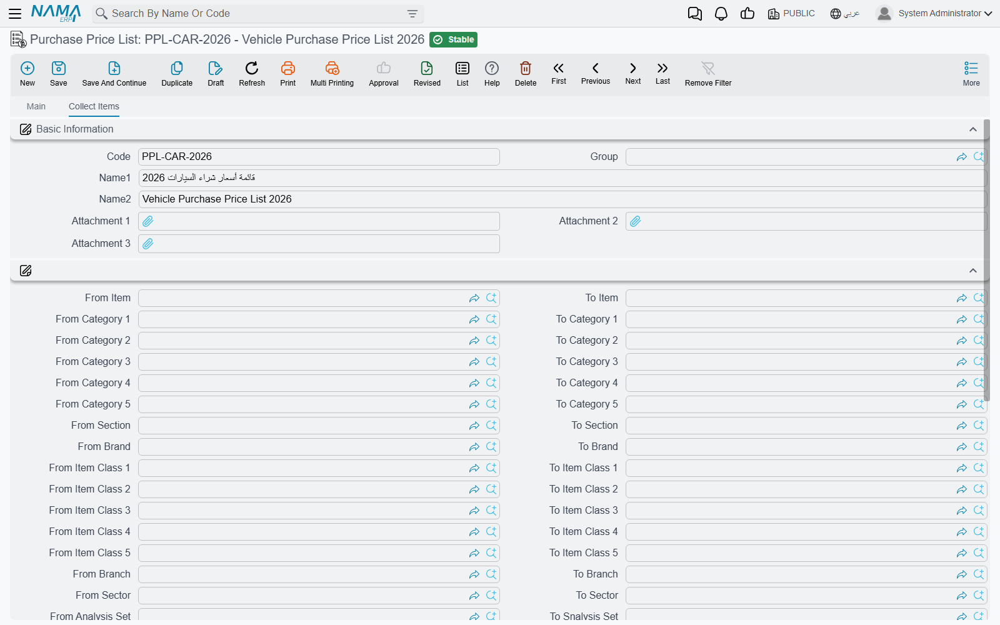
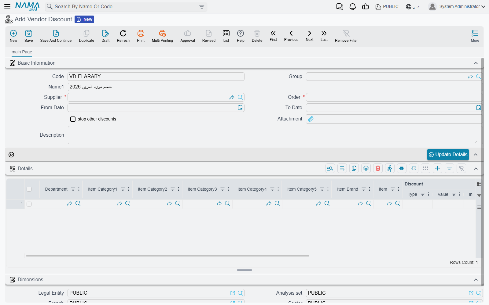

# How a Purchase Price Is Decided

Every purchase order and purchase invoice line needs a unit price, and in most companies nobody types it by hand: the figure arrives from a **Purchase Price List**, gets cut down by a **Vendor Discount** agreement, and either of those can be narrowed to one kind of document by an **Invoice Classification**. This page follows that figure from the agreement you signed with the supplier to the number that appears on the line, and spells out exactly what has to line up for each screen to take effect.

The selling side of the same story — sales price lists, offers, coupons — is covered in [Pricing, Offers & Coupons](./pricing-offers-and-coupons.md). The buying side is deliberately smaller and behaves differently in several places, and those differences are where most of the surprises live, so they are called out as we go.

## The Order in Which a Price Is Worked Out

Saving a purchase document re-prices every line that carries an item and is not marked as a free line. Each line goes through the same four steps, in this order.

**1. Is the system allowed to price this line at all?** The document's **Term** carries **Reapply Price List on Save**, which is on out of the box. Leave it on and every save re-fetches the price; turn it off and whatever the buyer typed survives the save untouched. This one switch is the difference between "the price list is the truth" and "the price list is a suggestion".

**2. Look for a purchase price list line.** The system searches the live lines of every purchase price list for one that fits this supplier, this item, this date and this quantity. If one is found, its **Price** becomes the line's unit price and its **Price | Ref1** becomes the reference price — both converted if the list quotes a different unit from the one being bought. A price given per carton is divided down correctly when you buy in pieces.

**3. If nothing matched, fall back to the last price you paid.** With **Use Last Purchase Price** switched on in supply chain configuration, the line takes the unit price from the most recent processed purchase invoice for the same item and supplier — the newest by value date, ignoring lines priced at zero. With that switch off, and no price list line, the line simply ends up at zero. The "Consider …" switches that make that search stricter are described in [Pricing & Price Lists Configuration](./configuration/pricing-and-price-lists.md).

**4. Apply the vendor discounts.** With **Apply Discounts** on the term (also on by default), every vendor discount line that fits the supplier, item and date is applied into the eight discount slots on the purchase line.

::: warning A price list line can switch the discounts off for its own item
Each purchase price list line carries a **Stop Discounts | Invoice** tick. When it is on and that line is the one that priced the document, step 4 is skipped entirely for that item — no vendor discount reaches it. Discounts the buyer typed by hand on the line are left alone; only the automatic ones are suppressed. It is the cleanest way to say "this item is already at its agreed net price, do not discount it again".
:::

## The Purchase Price List

**Purchase Price List** (*Purchases → Master Files → Purchase Price List*) is the supplier-side twin of the sales price list: a dated, prioritised set of agreed buying prices. In practice one list is one agreement — the catalogue a supplier sent you for this season, the tender you won, the rates a haulier quoted for the year.

The header says who and when the list is for:

| Field | What it settles |
|---|---|
| **Supplier** | The supplier the list belongs to. It accepts either one supplier **or a whole Supplier Class**. Leave it empty and the list applies to every supplier. |
| **From Date** / **To Date** | The window the prices are valid in. Both are required. |
| **Currency** | Required; records the currency the prices are expressed in. |
| **Priority** | Decides which list wins when more than one covers the same item — see below. |
| **Employee** | Optional; restricts the list to one buyer. It accepts an Employee, an Employee Department, an Employee Group, a Job Position, an Organization Position or a group. |
| **Invoice Classification** | Optional; restricts the list to documents carrying that classification. |
| **Source** | Where the list came from — another price list, a purchase or sales document, or a price voting file. Picking one immediately fills the grid; see below. |
| **Deactivate** | Retires the list without deleting it. |

Then the **Details** grid holds one row per priced item: the **Item**, a **Quantity** and **Unit**, the **Price** and **Price | Ref1**, its own **From Date** and **To Date**, and — where you want a row to be narrower than the header — its own **Supplier**, **Invoice Classification**, **Department**, price classifiers, and **Size**, **Colour** and **Revision**.

::: info The header overwrites the lines when you save
Saving the list copies the header's dates, dimensions, supplier, invoice classification and price classifiers down onto every line, replacing whatever was there. That is what makes a list of two hundred rows manageable: you set the window once. If you need per-row values to survive, switch on **Do not Update Lines From Price List Header** in supply chain configuration — but note that even then the header's supplier and invoice classification are still pushed down; only the dates and dimensions are left to the lines.
:::

### What Has to Match Before a Line Is Used

A price list line is only considered when **every one** of these is true of the document line being priced:

| Condition | The detail that catches people out |
|---|---|
| **Supplier** | The line's supplier is the document's supplier, **that supplier's class**, or empty. Empty means "any supplier". |
| **Item** | An exact item match. There is no matching by item class, category, brand or section — unlike the sales price list, a purchase price list prices one item per row. |
| **Dates** | The document's **Value Date** — not its issue date — sits inside the line's **From Date** and **To Date**. |
| **Quantity** | The line's **Quantity** is a *from this quantity upwards* threshold: it must be less than or equal to the quantity being bought. Leave it empty and the row always qualifies. |
| **Unit** | Ignored unless **Must Match Line Uom With Sales Price List Uom In Purchase While Searching For Price** is switched on in [Purchasing Configuration](./configuration/purchasing-configuration.md); otherwise the price is converted between units. |
| **Invoice Classification** | Empty on the line, or equal to the document's. A document with no classification only matches lines with no classification. |
| **Price Classifier 1–5** | Same rule, for each classifier that is switched on in configuration. |
| **Dimensions** | Legal Entity, Analysis set, Branch, Sector and Department: each is empty on the line, or equal to the document's. |
| **Size, Colour, Revision** | If filled on the line, they must equal what the document line carries. Empty means "any". |
| **Employee** | If the list names an employee target, the document's buyer must match it. A list restricted to an employee never matches a document that has no buyer on it. |

Two of those deserve a note of their own. The **buyer** the system compares against is the document's purchases man only when **Use Sales Man For Price Lists** is switched on in global configuration; otherwise it is the employee of whoever is logged in — so the same document can price differently for two users.

And the **empty means any** rule is what makes lists practical. A row that names no supplier, no classification and no dimensions is a catalogue price available to everybody; you narrow it one field at a time.

::: tip When the expected list did not apply
Work down the table above in order. In real cases the culprit is almost always one of three things: the value date fell outside the window, the line's quantity threshold was above the quantity ordered, or the document carries an invoice classification (or a dimension) that the price list line does not.
:::

### Priority, and Why Two Lists Can Refuse to Save

When several lines survive the test, the one from the list with the **lowest Priority number** wins. Priority lives on the header, so it is a property of the whole agreement, not of a row.

That has a direct consequence for quantity breaks. A tier at 100 units and a tier at 1 unit both qualify when you buy 150, and they carry the same priority if they sit in the same list. The dependable way to build tiers is therefore **one list per tier**, with the larger quantity given the lower priority number: the 100-unit list is consulted first, and when you only buy 10 it does not qualify at all, so the 1-unit list takes over on its own.

Priority also governs a validation that surprises people the first time they meet it. Unless **Allow Repeating Offer and Price Lists Priority** is switched on in supply chain configuration, no two saved purchase price lists at the **same priority** may hold the same combination of item, unit, quantity, size, colour, revision and measures. Save the second one and you are told *"This line is found in Price List … line number …"*. Note what is **not** part of that comparison: supplier, dates, dimensions and classification. Two lists for two different suppliers still collide if they share a priority and price the same item — so give every agreement its own priority number and the problem disappears.

Within one list the same combination may not be repeated either, and a line whose item is not marked **Purchasable** on its item card is refused.

### Filling the Lines Without Typing Them

Four tools sit on the screen, and between them they cover most of the ways a list actually gets built.

**Source** is the quickest. Point the header's **Source** at another purchase or sales price list, at a purchase order or invoice, or at a price voting file, and the grid is filled from it at once: one row per item, carrying the price that document or list held. Use it when a supplier sends this year's catalogue as a variation on last year's.

**Collect Items** lives on the **Collect Items** page. Fill in any of the from/to ranges — item code, category 1 to 5, item class 1 to 5, section, brand, and the item's own branch, sector, analysis set and department — and press it; every item in range becomes a line, priced at nothing and carrying the item's own **default purchase unit**. It refuses to run until at least one range is filled, which is a mercy: the alternative is collecting the entire item master.

**Update Details** stamps header values down onto every line without waiting for a save. It asks one Yes/No question at a time — from date, to date, the five dimensions, the supplier (the question is labelled **Update Customer**, but on a purchase list it writes the supplier), the invoice classification, and price classifiers 1 to 5.

**Update Prices** is the calculator. The **Update Prices** block on the header holds a source **Field**, an **Applied on Lines** choice (all lines, only the ones ticked in the **Selected** column, or only the ones not ticked), and up to five operations. Each operation adds, subtracts, multiplies or divides by a value or a percentage, with its own rounding type and rounding value, and they run in sequence — the output of operation 1 feeds operation 2, and so on. On a purchase list the result always lands in the single **Price** column, whichever field name the selector shows, because a purchase line has only one price. **calculate Price from Average Cost** does the same job from a different starting point: it fills the price of every affected line from the item's own average cost rather than from another price.

::: info Both price buttons are called "Update Prices" in English
The button under the calculator block and the entry in the **More** menu carry the same English name. The Arabic screen distinguishes them (*تحديث الأسعار* against *تغيير الأسعار*). The one described above is the button on the page itself, directly under the operations.
:::

### Retiring a List

Do not delete a price list that has been used — tick **Deactivate** instead. Saving a deactivated list withdraws all of its live pricing rows in one step, so it stops matching immediately, while the record itself stays for anyone who later asks what you were paying in March.

## Vendor Discount

**Vendor Discount** (*Purchases → Master Files → Vendor Discount*) records the other half of a supplier agreement: not the price, but what comes off it. One record is one supplier's discount arrangement, and the **Supplier** and **Order** fields on it are both required.

The reason this is a screen of its own, rather than a column on the price list, is that supplier discounts stack. A distributor gives you 8% as a trade discount, another 2% for settling within ten days, and 5% on one brand for the quarter — three separate agreements, negotiated at different times by different people, that all have to land on the same invoice line without anyone recalculating them by hand. So a purchase line carries **eight** discount slots, and each discount line says which slot it belongs in.

The header is short: **Supplier**, **Order** (the priority), **From Date** and **To Date**, a **stop other discounts** tick, an **Attachment** for the signed agreement, and the dimensions. As on the price list, the header's dates are pushed onto every line when you save, and lines inherit the header's dimensions where they are empty.

Each row of the **Details** grid describes one discount:

| Column | What it holds |
|---|---|
| **Item** or **Item Category1–5** and **Item Brand** | What the discount is for. These are mutually exclusive: choosing an item clears the categories, and choosing a category clears the item. |
| **Discount \| Type** | **Composite Percentage**, **Fixed Percentage**, or **Value** for a flat amount off the unit price. |
| **Discount \| Value** | The percentage or the amount. A percentage above 100 is refused. |
| **Discount \| In** | Which of the eight slots the result is written into — **Discount 1** through **Discount 8**. |
| **Discount \| Calc. From** | What the percentage is taken of: **Automatic** (the running price after everything applied so far), **Total** (the original unit price), **Ref1 Price**, or **Net After Discount 1** to **Net After Discount 7**. Disabled when the type is **Value**, which needs no base. |
| **Active** | The row's on/off switch. A row that is not ticked is ignored. The screen ticks it for you as soon as you pick an item or a category. |
| **Department**, **From Date**, **To Date** | Narrow the row further. |

### What Has to Match

The test is looser than the price list's in one way and much stricter in another:

| Condition | The detail that catches people out |
|---|---|
| **Supplier** | An **exact** supplier match, taken from the header. Unlike the price list, there is no supplier-class matching and no "empty means everybody" — a vendor discount always belongs to exactly one supplier. |
| **Item** | Empty on the row, or equal to the item. |
| **Item Category 1–5**, **Item Brand** | Each is empty on the row, or equal to the item's own value. This is how one row covers a whole range. |
| **Dates** | The document's value date sits inside the row's window. |
| **Dimensions** | Each dimension on the row is empty, or equal to the document's. |

Item classes 1 to 10 are **not** part of this test. If your item classification is built on item classes rather than categories, a vendor discount cannot target it directly, and you will need a row per category or per item instead. [Item Classification Files](./item-classification-files.md) explains the difference between the two schemes.

### The Order Lines Are Applied In, and How They Combine

All the matching rows across all the supplier's vendor discount records are gathered and sorted by **Order**, and then three things happen.

First, **stop other discounts** is honoured. Walking the sorted list, the first record with that tick set keeps all of its own rows — and every row belonging to a *lower-priority record* after it is dropped. It is the way to say "this agreement supersedes everything below it" without deleting the older records.

Second, rows that are not **Active** are dropped.

Third, what remains is sorted by slot (Discount 1 first, Discount 8 last), then by **Order**, then by row number, and applied in that sequence. Because each row's **Calc. From** can name the net after an earlier slot, the sequence is what makes cascading agreements come out right.

::: tip Two rows in the same slot do not simply add up
The **Discount | Type** decides how they combine. Two **Composite Percentage** rows of 10% and 5% in slot 1 give **14.5%**, because the second is taken off what is left after the first. Two **Fixed Percentage** rows of 10% and 5% give a straight **15%**. That is the whole difference between the two types, and it is the usual explanation when a buyer insists the invoice is a few pounds out.
:::

Discounts the buyer typed into slots that no vendor discount row touched are left exactly as typed — the automatic rows fill their own slots and nothing else.

::: warning One priority per supplier
Two vendor discount records for the same supplier may not share the same **Order**. Saving the second one is refused. Give each agreement its own number, in the sequence you want them applied.
:::

The term switches that turn all this off — **Apply Discounts**, and **Do Not Use Vendor Discount 1** to **7** for suppressing one slot at a time — are documented on [Document Term: Pricing, Taxes & Discounts](./document-terms/doc-term-pricing-taxes-discounts.md).

## Invoice Classification

**Invoice Classification** (*Purchases → Settings → InvoiceClassification* — the English screen title really is written as one word) is a small master file with a large reach. It is a free-form tag you put on a document to say what *kind* of transaction it is: local against imported, capital against consumable, project against stock, taxable against exempt.

On its own it does nothing. Its value is that so many other screens can be filtered by it — purchase price lists and their individual lines, sales price lists, offers, pricing ranges, item relations, forecasts, the point-of-sale registers, and the criteria of report definitions. Tag your imported purchases with a classification, build one purchase price list restricted to that classification, and the imported prices apply to imported purchases and to nothing else. Without the classification you would need a separate supplier, a separate dimension, or a separate item.

The screen holds only two settings beyond the name:

**Classify to** limits the classification to one document type. Leave it empty and the classification can be used anywhere; set it to Purchase Invoice and it appears only in the classification picker of purchase invoices. The picker on every document honours this, so the list a buyer sees is already filtered down to the classifications that are legal there.

::: warning A restricted classification is dropped when a document is generated from another
Generate a purchase invoice from a purchase order and the order's classification is carried across — but only if that classification is unrestricted or is set to classify purchase invoices. If it was tied to purchase orders, the new invoice comes out with no classification at all, and nothing is shown on screen to say so. If you want a classification to survive a document chain, leave **Classify to** empty.
:::

**Price List Default Price** chooses which of a price list line's several price columns becomes the unit price — minimum, maximum, default, custom, or one of the numbered tiers. This is a **selling**-side setting: a purchase price list line carries a single **Price**, so there is nothing for it to choose between. It matters when the same classification is used on sales documents, where it takes its place in the precedence chain described in the [Supply Chain FAQ](./supply-chain-faq.md), and it is one of the reasons the same classification file is reachable from both the Sales and the Purchases menus.

## Making the Buyer Live With the Agreed Price

Everything above prices the line; none of it stops a buyer from typing over the result. Two settings on the document term do, and they work as a pair.

Switch **Reapply Price List on Save** **off** and **Force Price List** **on**, and the purchase invoice stops re-pricing itself but starts checking itself. Every line is looked up in the price lists at save time, and the save is refused if the typed price is not the price the list holds, or if the item has no purchase price list line at all. **Do Not Check Items Without Price List (With Force Price Lists Option)** relaxes the second half only: items with no list are allowed through, priced as typed, while items that do have a list must still match it.

Leave **Reapply Price List on Save** on and the question never arises — the typed price is simply replaced on every save.

## Where the Related Settings Live

- [Purchasing Configuration](./configuration/purchasing-configuration.md) — the unit-matching rule and the rest of the purchasing switches.
- [Pricing & Price Lists Configuration](./configuration/pricing-and-price-lists.md) — the last-purchase-price fallback and the price list behaviour switches.
- [Document Term: Pricing, Taxes & Discounts](./document-terms/doc-term-pricing-taxes-discounts.md) — the per-term price strategy.
- [The Purchasing Journey](./purchasing-journey.md) — where the priced line ends up.
- [Units of Measure](./units-of-measure.md) — how a price quoted per carton reaches a line bought in pieces.
- [Inventory Costing](./inventory-costing.md) — what happens to that price once the goods are received.
