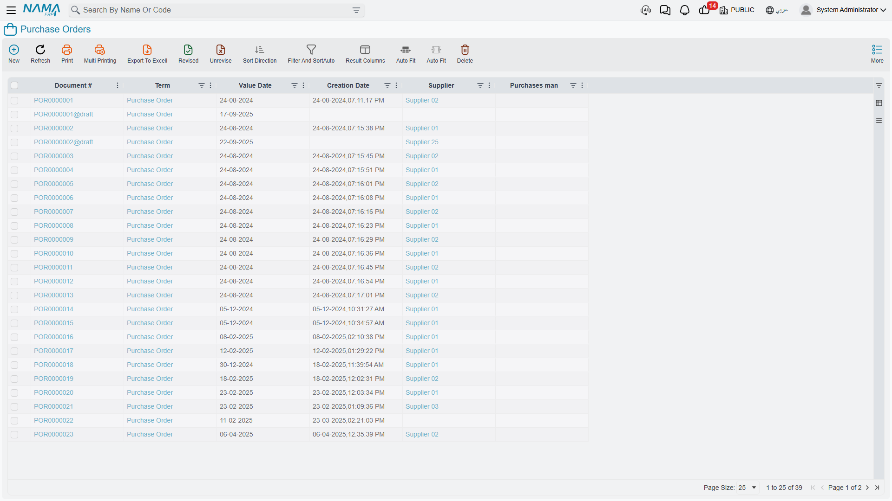
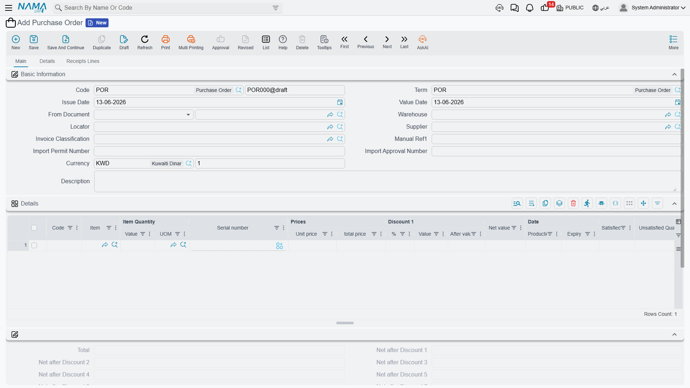

# The Purchasing Journey

Let's follow the complete story of how items get purchased - from "we need something" to "it's in our warehouse and we've paid for it." This journey involves many people, documents, and decisions. Understanding the flow helps you know which document to use when.

## The Full Picture

Before diving into details, here's the typical purchase path:

```
Need → Request → Quotations → Comparison → Purchase Order → Receipt → Invoice → Payment
```

Not every purchase passes through every step (sometimes you jump straight to the purchase order), but understanding the full path helps you choose the right level of process for each case.



## Step One: Identifying the Need

Every purchase begins with a need. Someone in your organization realizes they need something.

### Item Request (ItemRequest)

The **Item Request** is the starting point. Think of it as a formal "shopping list" that says: "we need 500 kg of steel, 200 nails, and 50 liters of paint for the production line next week." It includes the requested items and their quantities, when they're needed, the reason (production order, project, stock replenishment), and the urgency.

These requests are created by production planners, department heads, project managers, and warehouse keepers. They then pass through an approval workflow where managers review necessity, budget compliance, whether some is already in stock, or whether to consolidate with other requests.

### Consolidating Requests (ConsolidatedPurchaseReq)

Multiple small requests can be consolidated. The **Consolidated Purchase Request** gathers different departments' needs by supplier, by category, or by urgency. Why consolidate? Because it reduces shipping costs, raises negotiating power (larger orders = better prices), reduces administrative overhead, and simplifies supplier management.

## Step Two: Getting Quotations

Now you know what you need. It's time to find out who can supply it and at what price.

### Quotation Request (PurchaseQuotationRequest)

The **Purchase Quotation Request** is sent to potential suppliers asking: Can you supply these items? At what price? In what delivery timeframe? On what payment terms? It's usually sent to several suppliers (3-5 is common) to get competitive prices, including clear item specifications so everyone quotes on the same thing.

### Receiving Quotations (PurchaseQuotation)

Suppliers reply with their quotes, recorded as **Purchase Quotation** documents. Each captures the offered prices per item, the promised delivery time, payment terms, a validity period, and any notes. The reality is that not all suppliers reply on time, some prices are high, and some quotes have hidden conditions - which is where comparison helps.

### Comparing Quotations (PurchasePriceComparing)

The **Purchase Price Comparing** document places all quotes side by side for analysis:

| Item | Supplier A | Supplier B | Supplier C | Delivery A | Delivery B | Delivery C |
|------|-----------|-----------|-----------|-----------|-----------|-----------|
| Steel | 2.50/kg | 2.30/kg | 2.60/kg | 5 days | 7 days | 3 days |
| Nails | 0.10/pc | 0.12/pc | 0.09/pc | 5 days | 7 days | 3 days |

**Decision factors beyond price:** quality (cheapest isn't always best), reliability (do they deliver on time?), payment terms (the difference between 30 and 60 days of credit affects cash flow), existing relationships, and service and support. The document supports an approval workflow to approve the chosen supplier.

## Step Three: Issuing the Purchase Order (PurchaseOrder)

After comparing quotes, choosing the supplier, and getting approval, it's time for the formal order! The **Purchase Order** is the document that says: "Dear supplier, please supply these items on these terms."

What makes it formal? It's a commitment between both parties, specifying the items and quantities, the agreed prices, delivery terms (where and when), payment terms (when and how), and an order number that's a reference for you and the supplier. It includes your details (company, delivery address, billing address, contact), the supplier's details, item lines with descriptions, quantities, units, and prices, terms (delivery date and location, shipping method, currency, tax handling), and totals (subtotal, discounts, taxes, grand total).



### The Proforma Alternative (ProformaPurchaseInvoice)

Sometimes you need a not-quite-binding purchase order - perhaps for budget approval, preliminary sign-off, or requesting a letter of credit. Use the **Proforma Purchase Invoice** for these "semi-formal" orders not yet committed.

### After Sending the Order

Once sent, the supplier confirms receipt, the order enters an "open" state, and you await delivery while the system tracks: what's been received? What's still pending? You can track the order's status: open (nothing received), partially received, fully received, cancelled.

## Step Four: Receiving the Goods

The truck has arrived! Time to receive what you ordered. Physically: the truck delivers the goods, the receiving clerk counts and inspects them, compares the received quantity to the packing list, and the packing list to the purchase order. In the system: you create a stock receipt linked to the purchase order, enter the actually-received quantities, and record any discrepancies.

**Common discrepancies:** ordered 100 but received 95 (shortage), or received 105 (surplus), or received the wrong item, or damaged items, or the correct quantity with wrong specifications. Each case needs handling: accept partial and wait, accept all, reject and return, or accept the good and reject the damaged. Receiving details are in [Receiving Stock](./receiving-stock.md).

For critical items, use two-step receiving via [Receipt Inspection](./quality-control.md): an initial receipt into the inspection area, then a quality check, then a final decision to accept, reject, or partially accept.

## Step Five: Receiving the Invoice (PurchaseInvoice)

After days or weeks (or sometimes with the goods), the supplier sends the **Purchase Invoice**: "I delivered these goods, pay us this amount." It includes the supplier's invoice number, its date, due date, payment terms, your purchase order reference, the received item lines with prices and taxes, and a summary of subtotal, discounts, freight, other charges, taxes, and total.

### Three-Way Matching

Best practice is to match three documents:
1. **Purchase order**: what you agreed to buy
2. **Receipt document**: what you actually received
3. **Purchase invoice**: what the supplier bills

Verify that quantities match (or differences are explained), prices match the agreement, the arithmetic is correct, and terms are as agreed. Pay only invoices that pass three-way matching; discrepancies warrant investigation and resolution.

### What the System Does

When the purchase invoice is saved (not as a draft): if no receipt was created yet, the system can create one automatically so stock increases; accounting entries are made (debit inventory asset or expense, debit recoverable input tax, credit supplier payables); and a payment schedule is created based on the payment terms with due-date reminders.

## Step Six: Payment

Eventually you pay the supplier via bank transfer, cheque, cash, or other means. The system tracks which invoices are paid, when, how much, by what method, and the remaining balance. **Payment schedules** on the invoice (a payment after 30 days, another after 60) are tracked via schedule lines, while **external payment lines** link the invoice to payment vouchers in accounting, completing the link between payables and cash/bank. (Payment and scheduling details are in the Invoicing and Accounting modules.)

## Handling Returns (PurchaseReturn)

Things can go wrong, and you need to return items. The **Purchase Return** reverses the purchase in cases of defective items arriving, wrong items shipped, failing quality inspection, or ordering excess that the supplier accepts back.

**The process:** obtain return authorization from the supplier, then create a return linked to the original purchase, issue the items from your warehouse and ship them to the supplier, await the credit note, and apply it to the payables balance. **Accounting effect:** credit inventory (reducing the asset), debit payables (reducing the liability). And if you've already paid, you may get a credit note for future purchases or a cash refund.

The path often starts with a **Purchase Return Request** (PurchaseReturnReq): the warehouse identifies the items, purchasing contacts the supplier for authorization, then the actual return is created.

## Special Scenarios and Tools

- **Import purchases**: For international purchases with their customs, freight, and payment guarantees, the path is managed via [Letters of Credit](./letters-of-credit.md) with their documents (the LC proforma invoice and shipment invoices within it).
- **Post-purchase adjustments**: When you need to adjust a purchase after the fact (a late supplier discount, a quantity correction, additional charges, a tax adjustment), the **Purchase Document Update** (PurchaseDocumentUpdate) handles it - think of it as "adjustments" to the original purchase.
- **Purchase forecasting**: To turn purchasing from reactive to proactive, see [Purchase Forecast](./purchase-forecast.md).

## Tips for Effective Purchasing

::: tip Best Practices
**Standardize requests**: Use standardized item requests with clear specifications that prevent misunderstandings and ease comparison.

**Compare before ordering**: Even with preferred suppliers, get competitive quotes periodically; markets change and relationships can become too comfortable.

**Apply three-way matching strictly**: Don't skip matching; it catches errors, prevents fraud, and ensures you pay what you should.

**Track supplier performance**: Note who delivers on time, who has quality issues, and who handles problems well - this data guides your decisions.

**Negotiate payment terms**: Price isn't everything; an extra 30 days to pay can outweigh a 2% discount if cash flow is tight.

**Communicate realistic lead times**: Under-promise and over-deliver beats the opposite.
:::

## Frequently Asked Questions

**Q: Can we create a purchase invoice before receiving the goods?**

A: Yes, but it's not recommended. Best practice is to receive first to verify, then match the invoice to the receipt. Still, invoices sometimes arrive first - the system can create the receipt automatically from the invoice.

**Q: What if the supplier bills a higher price than the purchase order?**

A: The system usually alerts you to price differences, so you either reject the invoice and contact the supplier, accept it if the difference is small and documented, or update the purchase order if prices were renegotiated.

**Q: How do we handle partial deliveries?**

A: Create a receipt for what arrived; the purchase order tracks what's still pending, and when the rest arrives you create another receipt against the same order.

**Q: What happens if we cancel a purchase order after receiving part of it?**

A: You can close the order on the remaining quantities; what was received stays received, and the system no longer waits for the balance.

## Next Steps

- [The Sales Journey](./sales-journey.md) - the mirror process for selling
- [Purchase Forecast](./purchase-forecast.md) - planning purchases proactively
- [Receiving Stock](./receiving-stock.md) - detailed receiving operations
- [Letters of Credit](./letters-of-credit.md) - import purchases
