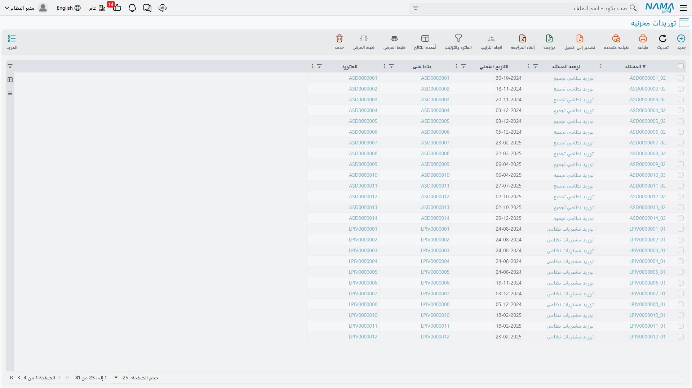
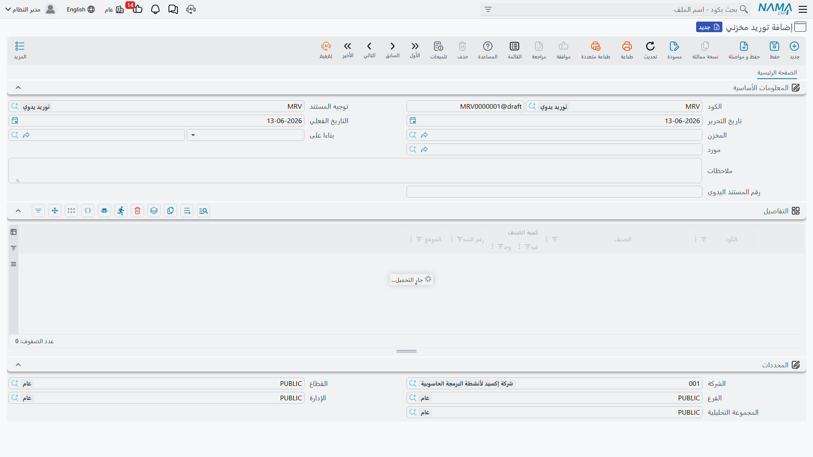

# استلام المخزون في المستودع (Receiving Stock)

المخزون لا يصل إلى مستودعك بصورة آلية - بل يصل عبر طرق متعددة ولأسباب مختلفة. لنستعرض جميع الطرق التي تدخل بها الأصناف إلى النظام داخل وحدة المخزون، وكيفية تسجيل كل سيناريو بالطريقة الصحيحة.

## مستند الاستلام: نقطة دخول المخزون

في جوهره، **التوريد المخزني** (StockReceipt) بسيط: فهو السجل الرسمي الذي يثبت أن "هذه الأصناف دخلت مستودعنا في هذا الوقت." لكن بحسب المصدر والغرض، ستستخدم أنواعًا مختلفة من مستندات الاستلام.

فكّر في الأمر كأنواع مختلفة من الأظرف لأنواع مختلفة من البريد. رسالة شخصية، ووثيقة قانونية، وطرد - كلها تُسلَّم، لكن كلًّا منها يحتاج معالجة وتتبعًا مختلفَين.

## التوريد المخزني العام: أداتك الأساسية

التوريد المخزني (StockReceipt) هو أداة الاستلام العامة داخل المخزون. استخدمه عندما تدخل الأصناف إلى المخزون من مصادر غير مرتبطة مباشرةً بفاتورة مورّد (التي لها مسارها الخاص في [رحلة الشراء](./purchasing-journey.md)).

### متى تستخدمه

إليك السيناريوهات الشائعة:

**مرتجعات داخلية**
اقترضت إدارة تقنية المعلومات 5 حواسيب محمولة للتدريب وهي تعيدها الآن. يُوثِّق التوريد المخزني عودتها إلى المخزون المتاح.

**الأصناف المكتشفة**
خلال الجرد الفعلي، اكتشفت 10 قطع لم تكن مسجلة في النظام. أنشئ توريدًا لإدخالها إلى المخزون المتتبَّع مع ملاحظة توضح أنها "وُجدت أثناء الجرد".

**الاستلام كعينات**
أرسل مورّد عينات مجانية. استلمها بتكلفة صفرية لتتبعها في المخزون دون أثر مالي.

::: info الاستلام من الإنتاج له مستنداته الخاصة
عند استلام منتجات تامة أو خردة أو مواد عائدة من الإنتاج، تُستخدم مستندات وحدة **التصنيع** (مثل تسليم المنتج واستلام الخردة) لا التوريد المخزني العام. راجع [وحدة التصنيع](/modules/manufacturing/) لتفاصيل تلك المسارات.
:::

### كيف يعمل

كل مستند استلام يحتاج:

1. **المستودع والموقع**: أين ستُودَع هذه الأصناف؟ المخزن الرئيسي؟ منطقة البضائع المعيبة؟ موقع تخزيني محدد؟
2. **الأصناف والكميات**: ما الذي يرد وبأي كمية؟ اذكر وحدة القياس - هل هي 10 صناديق أم 240 زجاجة؟
3. **معلومات التكلفة**: ما قيمة هذه الأصناف؟ أحيانًا تكون صفرًا (عينات)، وأحيانًا تُحدِّدها مباشرةً.
4. **معلومات المصدر**: من أين جاءت؟ استخدم حقول المرجع لربط المستندات معًا.

يقوم النظام بعد ذلك بـ:
- رفع كمية المخزون في الموقع المحدد
- تحديث قيمة المخزون بناءً على طريقة التسعير المعتمدة
- إنشاء القيود المحاسبية (تحميل حسابات أصول المخزون)
- تسجيل سجل الحركات
- تحديث حسابات الكميات المتاحة

إذا كانت الأصناف تحمل أرقامًا تسلسلية أو أرقام دفعات، ستُدخل تلك التفاصيل، فيتتبع النظام كل وحدة أو دفعة فردية من هذه اللحظة فصاعدًا.

### طلب التوريد المخزني (StockReceiptReq)

في المؤسسات التي تفصل بين من يطلب الاستلام ومن ينفّذه، يأتي **طلب التوريد المخزني** أولًا: يوثّق نية الاستلام (والموافقة عليها عند اللزوم)، ثم يُحوَّل إلى توريد مخزني فعلي عند وصول البضاعة.

## البداية من الصفر: الأرصدة الافتتاحية

عند التطبيق الأول لنظام Nama ERP، لديك مخزون بالفعل - لست تبدأ من الصفر. كيف تُدخل المخزون الحالي إلى النظام؟

### الاستلام الأولي (InitialReceipt)

**الاستلام الأولي** هو نوع استلام خاص يُستخدم أثناء تطبيق النظام. يُتيح لك إدخال كميات المخزون الموجودة وتحديد قيمها الحالية وتأسيس الأرصدة الافتتاحية وإنشاء القيود المحاسبية الأولية.

فكّر فيه كلقطة لمخزونك في اليوم صفر من استخدام Nama ERP. بعد الانطلاق، لن تستخدم هذا النوع من المستندات مجددًا - إنه مخصص للتهيئة الأولى فقط.

**أفضل ممارسة للانطلاق:**
1. أجرِ جردًا فعليًا شاملًا قبل الانطلاق
2. قيِّم مخزونك باستخدام طريقة التسعير التي اخترتها
3. أنشئ استلامات أولية لكل مجموعة صنف/موقع
4. تحقق من أن إجمالي قيمة المخزون يطابق سجلاتك المحاسبية
5. انطلق!

### الرصيد الافتتاحي (OpeningStockDocument)

**الرصيد الافتتاحي** مرتبط بالسابق لكنه مختلف قليلًا - كثيرًا ما يُولَّد من النظام ويمثّل المركز الافتتاحي الرسمي لأغراض محاسبية. قد لا تُنشئه مباشرةً؛ فالنظام يولّده بناءً على استلاماتك الأولية أو بيانات الترحيل.

## استلام البضائع التالفة (PurgeStockReceipt)

ليس كل ما يرد في حالة جيدة. **توريد الإتلاف** مخصص لاستلام الأصناف التالفة أو المعيبة أو المخصصة للتخلص منها.

لماذا تهتم باستلام أصناف ستتخلص منها؟ لأن:
1. **التتبع المالي**: تحتاج إلى معرفة قيمة البضائع التالفة لمطالبات التأمين أو النزاعات مع الموردين
2. **الامتثال**: الصناعات الخاضعة للتنظيم ملزمة بتتبع التخلص من مواد معينة
3. **تحليل الجودة**: فهم نسبة التالف في الواردات يساعدك على تقييم جودة الموردين

تستلم هذه الأصناف في موقع "إتلاف" خاص، ثم تُنشئ مستندات التخلص لاحقًا لإخراجها من المخزون، فيكون مسار التوثيق مكتملًا.

## التكامل مع فحص الاستلام

كثير من المنشآت لا تستلم الأصناف مباشرةً في المخزون العادي - بل تذهب أولًا إلى منطقة الفحص.

### فحص الاستلام (ReceiptInspection)

يُسجِّل مستند **فحص الاستلام** الأصناف الواصلة للفحص، فينشئ عملية استلام من خطوتين:
1. **الاستلام الأولي إلى الفحص**: تصل الأصناف وتُودَع في مخزن/موقع "تحت الفحص"
2. **القرار النهائي بعد الفحص**:
   - **قبول**: نقل إلى المخزون العادي
   - **رفض**: إنشاء مرتجع للمورّد أو نقل إلى البضائع المعيبة
   - **قبول جزئي**: قبول جزء من الكمية ورفض الباقي

يضمن هذا أن تصل إلى مخزونك المتاح أصناف موافَق على جودتها فقط. مزيد من التفاصيل في [ضبط الجودة](./quality-control.md).

::: tip التكاليف الإضافية وإعادة التقييم
عندما تحتاج إلى توزيع مصاريف شحن أو جمارك على توريد، أو إلى تعديل قيمة المخزون دون تغيير الكمية، فتلك مستندات مستقلة (التكلفة الإضافية وإعادة تقييم التكلفة) تجدها في [تكلفة المخزون وإعادة التقييم](./inventory-costing.md). وللمواد السائبة التي تُوزن على ميزان، راجع [موازين الوزن](./weight-scale.md).
:::

## معالجة التصحيحات والإلغاءات

تحدث الأخطاء. أنشأت توريدًا ثم أدركت أنه خاطئ. ماذا تفعل الآن؟

### إلغاء التوريد المخزني (StockReceiptCancellation)

مستند **إلغاء التوريد المخزني** يعكس توريدًا محفوظًا مسبقًا.

**مهم**: هذا ليس حذفًا! يبقى التوريد الأصلي في النظام مع سجله. يُنشئ الإلغاء حركة معاكسة مساوية تُعيد المخزون إلى ما كان عليه قبله.

لماذا هذا مهم؟
- **مسار المراجعة**: يمكن لأي شخص رؤية التوريد الأصلي وسبب إلغائه ووقته
- **سلامة المحاسبة**: ينشئ الإلغاء قيودًا عكسية محاسبية صحيحة
- **لا يمكن تغيير الماضي**: لا يمكنك التظاهر بأن الحركة الأصلية لم تحدث - يمكنك فقط إلغاء أثرها مستقبلًا

استخدم الإلغاء عندما تُدخَل كميات خاطئة، أو تُستلَم الأصناف في موقع خاطئ، أو يُنشأ التوريد بالخطأ (البضاعة لم تصل فعليًا).

## دورة حياة مستند الاستلام

فهم رحلة مستند الاستلام يساعدك على استخدام النظام بفاعلية:

1. **الإنشاء**: يُنشئ شخص ما مستند الاستلام. في هذه المرحلة هو مسودة - لم يحدث شيء بعد.
2. **إدخال البيانات**: الأصناف والكميات، ووجهة الإيداع، والتكلفة، ومعلومات المصدر، والأرقام التسلسلية/الدفعات إن وُجدت.
3. **المراجعة (اختياري)**: بحسب ضوابط مؤسستك، قد تستلزم التوريدات موافقة قبل الحفظ.
4. **حفظ المستند**: عند الحفظ (ليس كمسودة) تتحدث كميات المخزون والقيود المحاسبية **فورًا**.
5. **السجل التاريخي**: يصبح التوريد جزءًا دائمًا من سجل الصنف.

::: tip مسودة مقابل حفظ
- **الحفظ كمسودة**: يُخزَّن المستند دون أي أثر على المخزون أو المحاسبة. استخدمه للتحضير والمراجعة.
- **الحفظ (ليس مسودة)**: يُحدِّث المستند المخزون والمحاسبة وجميع الحسابات المرتبطة فورًا.
- أي تعديلات مستقبلية على المستندات المحفوظة تُحدِّث النظام فورًا - لا تحتاج إلى خطوة "ترحيل" منفصلة.
:::

## نصائح للاستلام الدقيق

::: tip أفضل الممارسات
**احسب كل شيء**: لا تفترض أن بوليصة الشحن صحيحة. أجرِ عدًّا فعليًا لكل توريد.

**استخدم التوريد الدُّفعي حين يناسب**: إذا وصلت 100 قطعة، لا تحتاج إلى إنشاء 100 مستند منفصل - مستند واحد بسطر لكمية 100 يكفي.

**سجِّل وقت الاستلام لا وقت تحرير المستند**: أدخل التوريدات فور وصول البضاعة. دقة المخزون تعتمد على التسجيل الفوري.

**استخدم المواقع باتساق**: ضع اصطلاحات تسمية واضحة للمواقع. رموز المواقع غير المتسقة تؤدي إلى "ضياع" المخزون.

**الانضباط في الأرقام التسلسلية**: إذا كانت الأصناف تستلزم أرقامًا تسلسلية، سجِّلها بدقة عند الاستلام. استرجاعها بعد أشهر شبه مستحيل.

**اربط مستندات المصدر**: اربط دائمًا التوريدات بمصدرها. هذا التتبع لا يُقدَّر بثمن عند التحقيق في الفروقات.
:::

## أسئلة شائعة

**س: استلمنا 100 قطعة لكن 95 منها فقط سليمة. كيف نسجل ذلك؟**

ج: خياران: (1) استلم الـ100 جميعها ثم اصرف 5 فورًا إلى موقع المعيبة، أو (2) استلم 95 في المخزون العادي و5 في موقع المعيبة ضمن مستند استلام واحد. الاختيار يعتمد على ما إذا كنت تريد إظهار كامل كمية الاستلام مطابقًا لأوراق المورّد.

**س: ماذا نفعل إذا استلمنا أصنافًا بتكلفة خاطئة؟**

ج: إذا حفظت كمسودة، صحِّح التكلفة قبل الحفظ النهائي. أما إذا حُفظ المستند نهائيًا، فيمكنك إنشاء مستند [إعادة تقييم تكلفة](./inventory-costing.md)، أو الإلغاء وإعادة الاستلام، أو قبوله والسماح للتوريدات اللاحقة بمعادلة متوسط التكلفة.

## الخطوات التالية

الآن بعد أن فهمت كيفية دخول الأصناف إلى مخزونك، تعرّف على:
- [إصدار المخزون](./issuing-stock.md) - كيف تخرج الأصناف من مستودعك
- [تحريك المخزون بين المخازن](./moving-stock.md) - التحويلات والنقل بين المواقع
- [تكلفة المخزون وإعادة التقييم](./inventory-costing.md) - التكاليف الإضافية وتعديل القيم
- [رحلة الشراء](./purchasing-journey.md) - عملية الشراء الكاملة التي كثيرًا ما تنتهي بتوريدات
