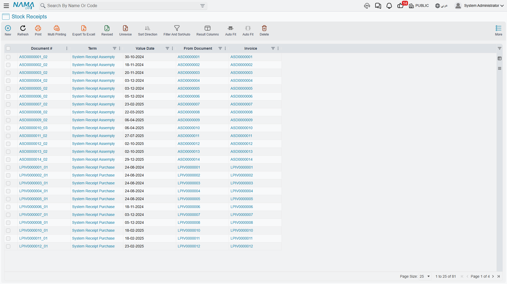
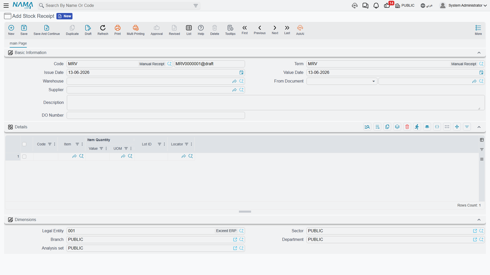

# Receiving Stock

Inventory doesn't magically appear in your warehouse - it arrives through various means and for various reasons. Let's explore all the ways items come into the system within the Inventory sub-module, and how to record each scenario properly.

## The Receipt Document: Your Inventory's Entry Point

At its core, the **Stock Receipt** (StockReceipt) is simple: it's the official record proving that "these items entered our warehouse at this time." But depending on the source and purpose, you'll use different kinds of receipt documents.

Think of them as different envelopes for different kinds of mail. A personal letter, a legal document, a parcel - all get delivered, but each needs different handling and tracking.

## The General Stock Receipt: Your Primary Tool

The Stock Receipt is the general receiving tool within inventory. Use it when items enter stock from sources not directly tied to a supplier invoice (which has its own path in [The Purchasing Journey](./purchasing-journey.md)).

### When to Use It

Here are the common scenarios:

**Internal returns**
The IT department borrowed 5 laptops for training and is now returning them. The stock receipt documents their return to available stock.

**Discovered items**
During a physical count, you discovered 10 pieces not recorded in the system. Create a receipt to bring them into tracked inventory with a note explaining they were "found during stock taking."

**Receiving as samples**
A supplier sent free samples. Receive them at zero cost to track them in inventory without a financial effect.

::: info Receipts from production have their own documents
When receiving finished products, scrap, or materials returning from production, you use the **Manufacturing** module's documents (such as product delivery and scrap receipt), not the general stock receipt. See the [Manufacturing module](/modules/manufacturing/) for those paths.
:::

### How It Works

Every receipt document needs:

1. **Warehouse and locator**: Where will these items be stored? The main warehouse? The defective goods area? A specific locator?
2. **Items and quantities**: What's arriving and how much? State the unit of measure - is it 10 boxes or 240 bottles?
3. **Cost information**: What are these items worth? Sometimes zero (samples), sometimes you specify it directly.
4. **Source information**: Where did it come from? Use the reference fields to link documents together.

The system then:
- Increases the inventory quantity at the specified location
- Updates inventory value based on the adopted costing method
- Creates accounting entries (debiting inventory asset accounts)
- Records the movement history
- Updates available-quantity calculations

If items carry serial or batch numbers, you'll enter those details, and the system tracks each individual unit or batch from that moment on.

### Stock Receipt Request (StockReceiptReq)

In organizations that separate who requests a receipt from who executes it, the **Stock Receipt Request** comes first: it documents the intent to receive (and the approval where required), then is converted to an actual stock receipt when the goods arrive.

## Starting from Scratch: Opening Balances

When you first implement NaMa ERP, you already have inventory - you're not starting from zero. How do you bring existing stock into the system?

### Initial Receipt (InitialReceipt)

The **Initial Receipt** is a special receipt type used during system implementation. It lets you enter existing inventory quantities, set their current values, establish opening balances, and create the initial accounting entries.

Think of it as a snapshot of your inventory on day zero of using NaMa ERP. After go-live, you won't use this document type again - it's meant for first-time setup only.

**Go-live best practice:**
1. Perform a comprehensive physical count before go-live
2. Value your inventory using your chosen costing method
3. Create initial receipts for each item/location group
4. Verify that total inventory value matches your accounting records
5. Go live!

### Opening Stock Document (OpeningStockDocument)

The **Opening Stock Document** is related to the previous one but slightly different - it's often system-generated and represents the official opening position for accounting purposes. You may not create it directly; the system generates it based on your initial receipts or migration data.

## Receiving Damaged Goods (PurgeStockReceipt)

Not everything arrives in good condition. The **Purge Stock Receipt** is for receiving damaged, defective, or to-be-disposed items.

Why bother receiving items you'll dispose of? Because:
1. **Financial tracking**: You need to know the value of damaged goods for insurance claims or supplier disputes
2. **Compliance**: Regulated industries are required to track the disposal of certain materials
3. **Quality analysis**: Understanding the defect rate in receipts helps you evaluate supplier quality

You receive these items into a special "purge" location, then create disposal documents later to remove them from inventory, so the documentation trail is complete.

## Integration with Receipt Inspection

Many facilities don't receive items directly into normal stock - they go to an inspection area first.

### Receipt Inspection (ReceiptInspection)

The **Receipt Inspection** document records arriving items for inspection, creating a two-step receiving process:
1. **Initial receipt into inspection**: items arrive and are placed in an "under inspection" warehouse/location
2. **Final decision after inspection**:
   - **Accept**: move to normal stock
   - **Reject**: create a return to the supplier or move to defective goods
   - **Partial accept**: accept part of the quantity and reject the rest

This ensures only quality-approved items reach your available stock. More details in [Quality Control](./quality-control.md).

::: tip Additional costs and revaluation
When you need to distribute freight or customs charges across a receipt, or adjust inventory value without changing quantity, those are separate documents (additional cost and cost revaluation) covered in [Inventory Costing & Revaluation](./inventory-costing.md). For bulk materials weighed on a scale, see [Weight Scale](./weight-scale.md).
:::

## Handling Corrections and Cancellations

Mistakes happen. You created a receipt and then realized it was wrong. What now?

### Stock Receipt Cancellation (StockReceiptCancellation)

The **Stock Receipt Cancellation** document reverses a previously-saved receipt.

**Important**: This is not a deletion! The original receipt stays in the system with its history. The cancellation creates an equal, opposite movement that returns inventory to what it was before.

Why does this matter?
- **Audit trail**: anyone can see the original receipt, why it was cancelled, and when
- **Accounting integrity**: the cancellation creates correct reversing accounting entries
- **The past can't be changed**: you can't pretend the original movement never happened - you can only cancel its effect going forward

Use cancellation when wrong quantities were entered, items were received into the wrong location, or the receipt was created by mistake (the goods never actually arrived).

## The Receipt Document Lifecycle

Understanding a receipt document's journey helps you use the system effectively:

1. **Creation**: Someone creates the receipt document. At this stage it's a draft - nothing has happened yet.
2. **Data entry**: Items and quantities, storage destination, cost, source information, and serial/batch numbers if any.
3. **Review (optional)**: Depending on your organization's controls, receipts may require approval before saving.
4. **Saving the document**: When saved (not as a draft), inventory quantities and accounting entries update **immediately**.
5. **Historical record**: The receipt becomes a permanent part of the item's history.

::: tip Draft vs. Saved
- **Save as draft**: the document is stored with no effect on inventory or accounting. Use it for preparation and review.
- **Save (not draft)**: the document updates inventory, accounting, and all related accounts immediately.
- Any future edits to saved documents update the system immediately - no separate "post" step needed.
:::

## Tips for Accurate Receiving

::: tip Best Practices
**Count everything**: Don't assume the shipping note is correct. Do a physical count for every receipt.

**Use line receiving when it fits**: If 100 pieces arrive, you don't need 100 separate documents - one document with a line for quantity 100 is enough.

**Record receipt time, not document-editing time**: Enter receipts as soon as goods arrive. Inventory accuracy depends on immediate recording.

**Use locators consistently**: Set clear naming conventions for locators. Inconsistent location codes lead to "lost" inventory.

**Serial number discipline**: If items require serial numbers, record them accurately on receipt. Recovering serials months later is nearly impossible.

**Link source documents**: Always link receipts to their source. This traceability is invaluable when investigating discrepancies.
:::

## Frequently Asked Questions

**Q: We received 100 pieces but only 95 are good. How do we record this?**

A: Two options: (1) receive all 100, then immediately issue 5 to a defective location, or (2) receive 95 into normal stock and 5 into a defective location within a single receipt document. The choice depends on whether you want to show the full received quantity matching the supplier's paperwork.

**Q: What do we do if we received items at the wrong cost?**

A: If you saved as a draft, correct the cost before final save. If the document was saved permanently, you can create a [cost revaluation](./inventory-costing.md) document, cancel and re-receive, or accept it and let subsequent receipts average out the cost.

## Next Steps

Now that you understand how items enter your inventory, learn about:
- [Issuing Stock](./issuing-stock.md) - how items leave your warehouse
- [Moving Stock Between Warehouses](./moving-stock.md) - transfers and movement between locations
- [Inventory Costing & Revaluation](./inventory-costing.md) - additional costs and value adjustments
- [The Purchasing Journey](./purchasing-journey.md) - the full purchase process that often ends in receipts
