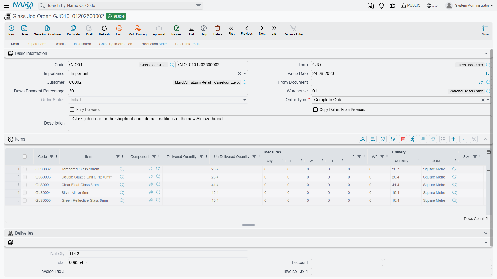

# Specialized Scenarios

The previous pages cover the core supply chain paths. But some specialized cases don't fit a page of their own: sector-specific job orders, document-automation tools, and tenders. This guide gathers them, and points to their homes when they belong to other modules.

## Glass Job Orders (Glass Job Order)

For the glass-manufacturing sector and similar process-based manufacturing, the system provides the specialized **Glass Job Order** path: from estimating the request to operational execution to delivery.

The path starts with the **Job Order Request** (GlassJobOrderReq) for cost study and quotation, then converts to the **Glass Job Order** (GlassJobOrder) that carries the bill of materials, operations, and delivery items. Operations are defined via the **Operation Map** (GlassOperationMap), and executions are recorded via **Order Execution** (OrderExecution), which tracks the responsible employee, time, and actual cost and generates material issues. Status is updated via **Job Order Status Update** (GlassJobOrderStatusUpdate), and output is delivered via **Order Delivery** (OrderDelivery) and **Order Finished** (OrderFinished). The path also supports outsourcing via **Outsource Request / Issue / Receipt** (OutsourceRequest / OutsourceIssue / OutsourceReceipt), damage documentation via **Order Damage** (OrderDamage), and expenses via **Job Order Expense** (JOrderExpense).

::: info A Specialized Sector
Glass job orders are a sector-specific sub-module; if your business isn't in this field, you won't need them. They rely on the same concepts as [assembly](./assembly-and-packaging.md) and [resources](#Resources-and-Activities) but with a dedicated order path.
:::

## Bills of Materials for Services (Service Item BOM)

A glass job order does not only cut a sheet of glass. It tempers it, drills it, polishes its edges. Each of those operations is an item in its own right — an item whose type is **Service** rather than **Stock**. But a service still consumes things: adhesive, abrasive discs, an hour on a machine, two operators standing at it.

The **Service Item BOM** (*Job Orders → Master Files → Service Item BOM*) is where that is written down, once per service. It is the reason an order execution can work out what to issue from the warehouse and what the work cost without anybody typing either figure.

The header names the service and the scale everything below is measured against:

- **Service Item** — the picker offers only items of type Service. Choosing one copies its code and name onto the record and sets **Quantity** to 1 in the item's base unit.
- **Quantity** and **Service UOM** — how much service the rest of the screen describes. Everything underneath is a ratio against this figure, so a BOM written for 10 m² is scaled on its own when an execution covers 3 m².
- **Calculation Type** — **Lot** or **Item**: whether the cost is incurred once for the whole run or rises with the quantity produced. It is also the default that new lines in the Routes grid inherit.

Underneath sit the two grids that make up the BOM proper.

**Spare Parts** is the materials list. Each line names an **Item** (stock items only), the **Material Qty** consumed, and the **Service Prod.** quantity that consumption corresponds to — "1.5 litres of adhesive per 10 m² tempered". Recording it as a pair rather than as a single per-unit figure is what lets you write the ratio in the units the shop floor actually works in.

**Routes** is the resources list — the machines and the people. Each line names a **Resource**, the **Time** it is occupied for (the time unit defaults from the resource's own rate type), and the **Resources Count**, meaning how many of them at once. The line's **Cost** is worked out for you from the resource's rate, the time and the count; it is not something you type.

::: tip Two ways to cost a service, and one switch that chooses
Leave **Direct Cost** off and the cost is built up from the Routes grid, resource by resource — the fixed-cost field beside it stays greyed out. Turn it on and the opposite happens: the Routes grid is emptied and disabled, and you type a single figure into **DirectCost** instead. Use it for services bought in at a flat price, or for anything whose cost you simply know and would rather not model.
:::

**Auto Issue** deals with the base item rather than the spare parts. With it on, recording an execution automatically adds the executed line's own item to the materials issued, alongside everything the Spare Parts grid contributes. Each piece is only issued once, so recording a second execution against the same piece does not issue it twice, and lines marked as free items are left out.

::: info One BOM per service, and the order will not save without it
Two rules work together here. Saving a second Service Item BOM for a service that already has one is refused outright. And a glass job order checks, for every service applied to a stock item on it, that a BOM exists — when one is missing the order cannot be saved, and the message names both the service and the item it was applied to. So service BOMs are something you set up before the first order, not alongside it.
:::

## Document Automation Tools

Supply chain repeatedly generates one document from another (a receipt from a purchase order, an invoice from a delivery...). The system provides tools that make this generation automatic and controlled:

- **Document Rule Set** (SCDocRuleSet): a central rules engine that triggers automatic document creation from source documents under defined conditions.
- **Extra Document Creation Rule** (SCExtraDocCreationRule): defines generating an extra document on a particular event.
- **Copier Extra Fields** (SCCopierExtraFields): determines which fields are copied when a document is derived from another, with entity-type-specific copy scripts.
- **Order Status Quantity Tracking Config** (OrderStatusQtyTrackConfig): sets order-status transitions based on received/issued quantities, automating quantity-driven workflow.
- **Delivery Configuration** (DeliveryConfiguration): defines delivery constraints, quantity relations, and consolidation criteria across orders.

These tools are for advanced users and implementation administrators who tailor system behavior without coding.

## Tenders (Tender)

When purchasing goes through a formal competition, the system provides the **Tender** (Tender): inviting suppliers to submit bids to specifications, tracking and comparing bids, and supporting weighted evaluation and selection. Standard terms and conditions for bids are defined via the **Tender Condition** (TenderCondition). This complements [The Purchasing Journey](./purchasing-journey.md) in cases that require organized competition.

## Resources and Activities

Some specialized paths (such as job orders) rely on shared master files:
- **Resource** (Resource): defines human and machine resources for job-order and manufacturing operations, with rates, periods, costs, and accounting setup.
- **Activity** (Activity): a flexible file for tracking various activities and milestones within job orders.
- **Material Classification** (MaterialClassification): classifies materials by type, grade, or source for reporting and analysis.

## Actions on these screens

**On the Glass Job Order and its request:**

- **Collect Orders** — fills the bill-of-materials lines from the customer's open orders instead of entering them again.
- **Apply** — reads the order type, the order status and the down-payment percentage on the header and applies them to the order, which is how a glass order moves from entered to actionable.

**On the Order Execution:**

- **Add Order** — asks for an order and a customer and appends that order's work to the execution lines, against the operation named on the header.
- **Collect Data** — the bulk version: it fills the lines from the ranges on the header (from/to item, from/to job order and the rest) rather than one order at a time.
- **Clear Job Orders** and **Clear Details Lines** — empty the job-orders grid and the details grid respectively, which is how you start the collection over after setting different ranges.

**On the Glass Order List:** **Collect Orders** fills the list, **View** opens what a line points at, and **Export** sends the list out as a file.

## Scenarios That Belong to Other Modules

Some specialized scenarios have their own standalone modules even though they intersect with supply chain:
- **Point of Sale (POS)**: fast retail selling has its [own module](/modules/pos/).
- **Pharmacies and medical supplies**: in the Hospital Management (HMS) module with its own paths.
- **Project site materials**: in the Contracting module.
- **Complex manufacturing**: in the [Manufacturing module](/modules/manufacturing/).

## Next Steps

- [Assembly & Packaging](./assembly-and-packaging.md) - the foundation job orders build on
- [The Purchasing Journey](./purchasing-journey.md) - tenders within purchasing
- [Supply Chain FAQ](./supply-chain-faq.md) - miscellaneous cases and questions
