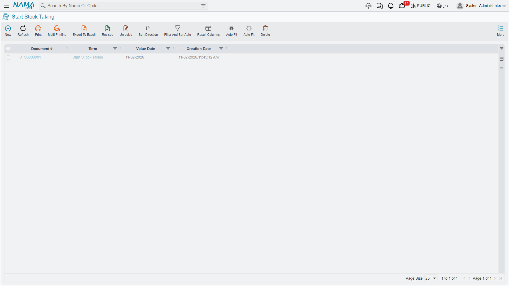
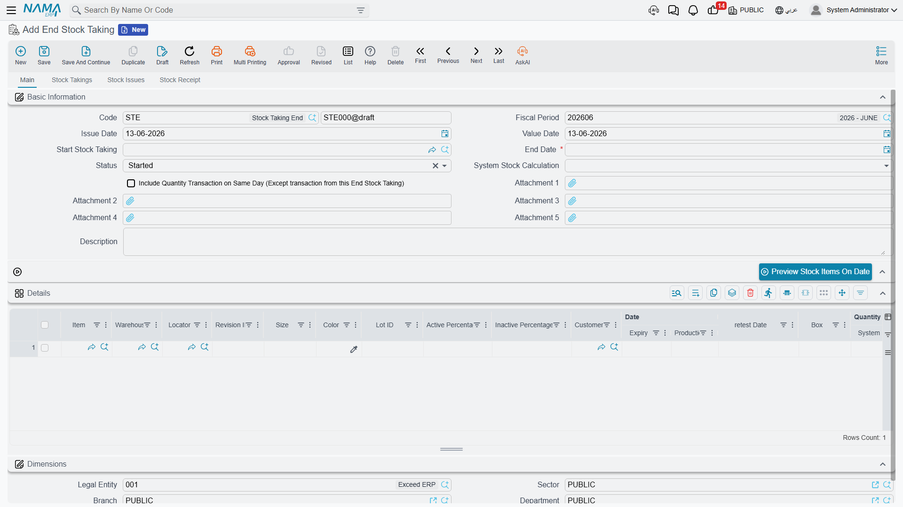

# Stock Taking

No matter how accurate your system is, one fundamental question remains: does what's in the books actually match what's on the shelves? **Stock taking** is the process by which you verify that and reconcile the differences. It's the heartbeat of confidence in your inventory numbers.

## Why Count?

Even with immediate recording of every movement, discrepancies creep in:
- Shortages, loss, or theft
- Unrecorded damage
- Transactions entered with wrong quantities or locations
- Natural loss (evaporation, drying, weight loss)
- Human error in counting or handling

Stock taking surfaces these differences and re-aligns the book balance with reality, so your decisions (purchasing, selling, pricing) stay based on correct numbers.

## The Counting Cycle: Start and End

Stock taking in NaMa ERP is built on two paired documents that define the counting window:

### Start Stock Taking (StartStockTaking)

The **Start Stock Taking** document captures a snapshot of the inventory balance at the moment counting begins. From that point:
- The expected balance for the included items is frozen as a reference for comparison
- The scope of the count is defined (warehouse, locator, item group, branch)
- You choose whether it's a comprehensive opening count or a partial cycle count

### End Stock Taking (EndStockTaking)

The **End Stock Taking** document closes the window and processes the results: it compares the physically-counted quantities to the expected balance, then **automatically generates** the necessary adjustment documents - receipts for surplus items and issues for short items - so the books return to matching reality. You can configure the calculation method and whether the count-day's transactions are included in the reconciliation.

::: tip The Counting Window
Between starting and ending the count there's a window during which counting happens. The shorter this window, the less stock moves during the count and the more accurate the reconciliation. For large warehouses, frequent cycle counts over smaller scopes are more accurate than one giant annual count.
:::

## Entering Count Results

### Stock Taking Details (StockTakingDetails)

The **Stock Taking Details** document carries the physically-counted quantities line by line, so expected is compared to actual and the difference is highlighted per item/location. This is where field count results are entered.

### Electronic Stock Taking (StockTakingElectronic)

When counting is done with barcode scanners, **Electronic Stock Taking** captures the readings electronically and feeds them straight into the counting process. This reduces manual-entry errors and speeds up counting in large, item-dense warehouses.

## Vote Counting: When More Than One Person Counts

In large warehouses, the same item may be counted by more than one person to ensure accuracy. The **voting** system handles this:

- **Voting document (ItemVotingDoc)**: each "voter" (counter) records the quantity they counted for the item at the same location.
- **Voting file (ItemVotingFile)**: gathers voting documents within a scope and period, defines the list of voters, and sets the mechanism for reaching the approved figure (consensus or average) before the difference is accepted.

The benefit: a valuable item's difference isn't accepted based on one person's count alone, but after two or more counts agree - reducing counting errors and adding control over the stock-taking process itself.

## Handling Natural Loss and Shrinkage

::: warning This Is Where Weight Losses Are Handled
Natural loss - such as meat losing weight, some materials drying, or evaporation - isn't recorded with a manual damage document; it appears as a difference during counting and is settled through stock taking. This is the system's correct way to handle weight loss and natural shrinkage, returning the book balance to match the actual weight with a proper accounting entry for the loss.
:::

Specific incidental damage (a particular event), on the other hand, is recorded through a [stock issue](./issuing-stock.md) directed to a loss account, not through stock taking.

## Best Practices for Stock Taking

::: tip Practical Tips
**Freeze movement during counting**: Reduce or stop movements in the warehouse being counted during the count period to avoid the balance changing between start and end.

**Adopt cycle counting**: Don't wait for a single annual count. Regular cycle counts over small scopes catch problems early and keep accuracy high year-round.

**Use voting for valuable items**: For high-value items, require more than one count before accepting the difference.

**Document the reason for the difference**: When settling a difference, record what the investigation revealed (a location always short? a particular shift with recording issues?) - patterns matter more than individual numbers.

**Reconcile accounting after the count**: After ending the count, verify that the inventory value in the books matches the total adjustments.
:::

## Next Steps

- [Inventory Costing & Revaluation](./inventory-costing.md) - adjusting inventory values after reconciliation
- [Issuing Stock](./issuing-stock.md) - recording incidental damage via an issue
- [Warehouses & Locators](./warehouses-and-locators.md) - organizing inventory to ease counting
