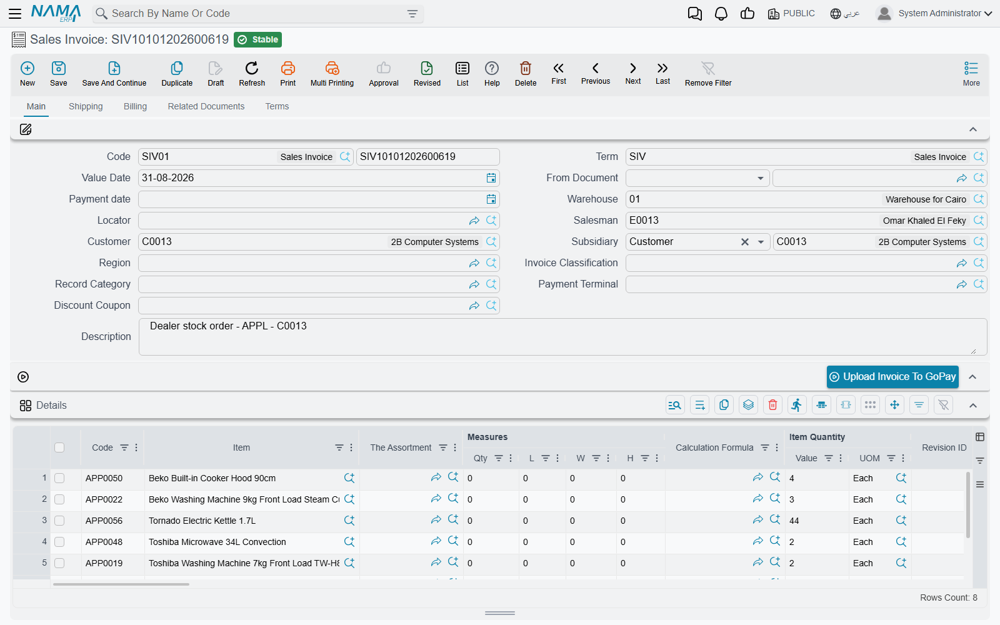
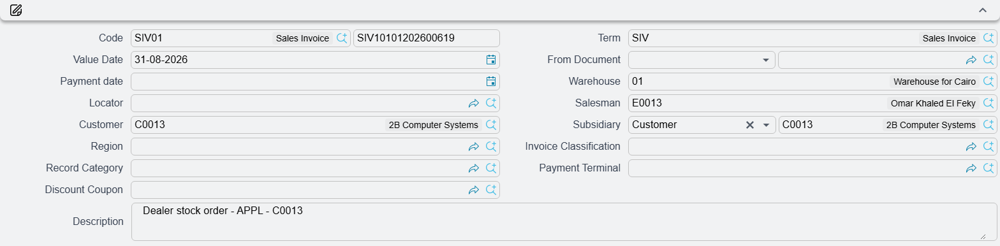
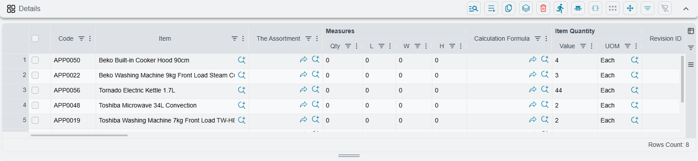
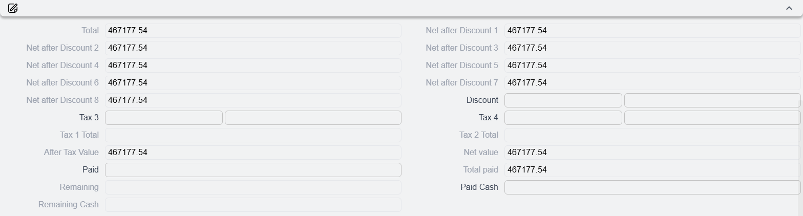
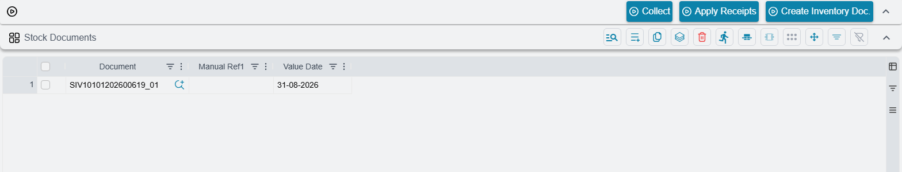
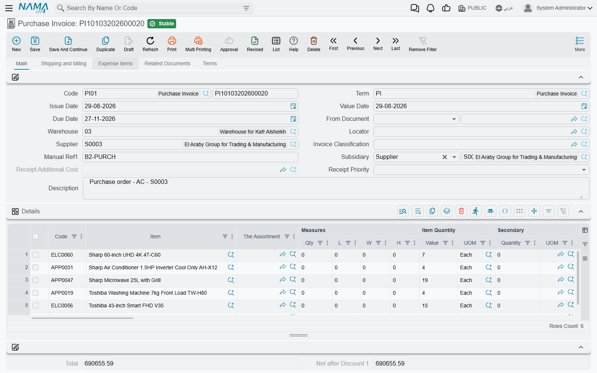

# The Anatomy of a Supply Chain Document

Every supply chain document — a sales invoice, a purchase invoice, an order, a stock receipt, an issue, a transfer — is built from the same handful of parts, and this page walks through those parts on the **Sales Invoice** and then points out where the **Purchase Invoice** differs. Learn the anatomy once and every other screen in the module stops being a wall of fields and becomes a variation on something you already know.

The journeys tell you *which* document to raise and in what order — [The Sales Journey](./sales-journey.md) and [The Purchasing Journey](./purchasing-journey.md). The [document term pages](./document-terms/) tell you which *settings* shape a document's behaviour. This page is about the third thing: the screen itself, the one a user is actually sitting in front of when they call support. The full inventory of buttons on each document is on the two journey pages, under *Actions on this screen*; what follows here is the anatomy the buttons sit in.

## Why Every Screen Looks the Same

Nama does not build each document type from scratch. Underneath, a supply chain document is always the same shape: a **header** that says who, when, in what currency and under what rules; a **lines grid** that says what and how much; a set of **dimensions** that say which part of the organisation this belongs to; and a **totals block** that adds it all up. What changes between a sales invoice and a stock transfer is which of those parts are switched on and what the fields are called.

That is why a support engineer who understands one document screen can read all of them. It is also why the same three or four questions come up again and again — "why did the price change when I picked the customer?", "why is the locator greyed out?", "what is the difference between Collect and Apply?" — regardless of which screen the caller is on.

## The Header: Who, When, Under What Rules

The header is the top block of the **Main** tab. It is small, and almost every field in it changes something further down the screen.

### The Book and the Code

The first field is a pair: **Book** and **Code**. The book is not decoration — no document can be saved without one, and it is tied to one document type, so a book made for sales invoices cannot be used on a stock issue. Its main job is to be the **numbering series** the code is drawn from: two invoices raised on the same day into different books get numbers from two independent sequences, which is exactly what a company with several branches wants. The book has also picked up a few per-stream behaviours over the years, and it can carry dimensions of its own that the document picks up when its own are empty. The full story is on [Document Books](/platform/document-books).

The **Code** itself is normally filled in for you when the document is saved.

### The Term

**Term** (توجيه المستند) is the single most consequential field on the header, and the one support asks about most. It points at a **Document Term** — a named configuration record that decides how this particular document behaves: what it copies from its source document, whether it is taxable and under which tax plan, how it tracks and reserves quantity, which accounts it hits, and which downstream documents it generates.

One document type can have many terms. A company may have one sales invoice term for local retail, another for export, another for inter-company transfers, each recording to different accounts and pricing from different lists. The term is chosen on the header, and everything the term says then applies to that document alone.

::: tip Finding out which term a document is using
Open the document and read the **Term** field on the header — it shows the term's code and name, and it is repeated in the **Basic Information** block at the top of most of the other tabs, so you never have to go back to Main to check.

To see what that term actually says, open *Basic → Settings → Document Term* and find it by code. The term's own **Document Type** field tells you which document it was written for, so a term listed against a Sales Invoice will never appear in the picker on a Purchase Invoice.

If the field is empty and the document still behaves as though it were configured, a term marked **System** is being used as the default for that document type.
:::

Changing the term on a document that already has lines is not a quiet act. The moment the term changes, every detail line is re-priced against the new term's tax plan and pricing rules. That is deliberate — the term is what the price was calculated under — but it surprises people who expected to swap a term and keep their typed prices.

### Issue Date, Value Date and the Fiscal Period

Nama separates two dates that most people think of as one.

- **Issue Date** (تاريخ التحرير) is the day the paperwork was written.
- **Value Date** (التاريخ الفعلي) is the day the transaction actually counts — the day stock moves and the day the ledger entry is dated.

The **Fiscal Period** follows from the value date, not from the issue date. If you leave the period blank, the system works it out from the **Value Date** together with the **Legal Entity** and fills it in for you. This is why back-dating a document by changing only the issue date does nothing to the accounting, and why changing the value date to a closed period is what actually gets refused. Period control itself — who may write into a period that is closing, and who may not — is on [Fiscal Period Control](/platform/fiscal-period-control-guide).

::: info The Sales Invoice shows only one of the two dates
On the shipped Sales Invoice layout the header carries the **Value Date** and no **Issue Date** and no **Fiscal Period** field — the period is always derived. The Purchase Invoice shows both dates side by side on Main, and puts the **Fiscal Period** on its **Shipping and billing** tab. Either arrangement can be changed for a client with the [screen modifier](/platform/screen-modifier/screen-modifier-overview); nothing about the underlying dates differs between the two documents.
:::

Alongside the dates sits **Payment date** (تاريخ الأستحقاق) on the Sales Invoice, called **Due Date** on the Purchase Invoice. You rarely type it: picking the customer fills it from the customer's payment period counted forward from the value date.

### The Party

The **Customer** on a sales document, the **Supplier** on a purchase document. This is more than a name on a printout — choosing it fires off a small cascade:

- The **shipping** and **billing addresses** are filled from the party's own address.
- The **Payment date** / **Due Date** is calculated from the party's payment period.
- Every detail line is **re-priced**, because the price list, the discount entitlement and the tax treatment all depend on who is buying.

Next to the party sits **Subsidiary** (الذمة). This is a general-purpose reference — it can point at a customer, a project, an employee, or another kind of party entirely — and it names the party the value is carried against in the ledger when that is not simply the customer on the header. Leave it empty and the party on the header is used. It matters more than it looks: some document terms also use the subsidiary as a filter when collecting stock documents, which is covered under [Collect and Apply](#Collect-and-Apply-the-Two-Halves-of-One-Job) below.

The Sales Invoice adds a **Salesman**; the Purchase Invoice adds a **Purchases man** and a **Contact**.

### Currency and Rate

**Currency** and **Currency Rate** travel together as one composite field. Pick a currency and the rate is fetched for you — the system looks up the exchange rate that applies to this **legal entity**, this **fiscal year** and **period**, on this **value date**. If a rate comes back that a user disputes, the answer is almost always that the exchange rate record for that date is wrong or missing, not that the invoice did something odd.

On the Sales Invoice the currency composite sits in the **Totals** group at the bottom of Main and again on the **Billing** tab. On the Purchase Invoice it sits in the **Basic Information** block of **Shipping and billing** and repeats in the totals groups.

### The Legal Entity

**Legal Entity** (الشركة) lives with the other dimensions rather than at the top of Main — on the Sales Invoice in the **Dimensions** group of the **Shipping** tab, on the Purchase Invoice in the **Dimensions** group of **Shipping and billing**. Both documents also repeat it on the **Terms** tab.

Its placement understates its importance. The legal entity is what the fiscal period is resolved against and what the exchange rate is looked up for, so a document with the wrong legal entity will quietly land in the wrong period at the wrong rate.

### The Warehouse and the Locator

**Warehouse** and **Locator** appear on the header *and* on every detail line. The header pair is the default: pick a warehouse there and the **Locator** field is filled with that warehouse's own default locator.

The **Locator** field stays disabled until a warehouse is chosen — on the header and on each line — and once a warehouse is chosen the locator picker only offers locators belonging to it. A caller who says "the locator field is dead" has simply not filled in the warehouse yet. Warehouses, locators and location classes are covered in [Warehouses and Locators](./warehouses-and-locators.md).

## The Lines Grid

The **Details** grid is where the document says what it is actually about. It is wide — wider than a screen — and the columns fall into four groups.

### The Item and the Quantity

Every line begins with **Code** and **Item**, the two halves of the item reference: type a code you know, or search by name. Then the quantity block:

| Column | What it holds |
|---|---|
| **Item Quantity — Value** and **UOM** | The primary quantity and the unit it is expressed in |
| **Secondary — Quantity** and **UOM** | The second quantity, for items that are tracked in two units at once |
| **The Assortment** | The item assortment record this line draws from |
| **Measures — Qty**, **L**, **W**, **H** | A count plus length, width and height, for items sold by physical dimension |

The primary and secondary unit systems, and why an item may carry both, are explained in [Understanding Inventory Items](./understanding-items.md) and [Units of Measure](./units-of-measure.md).

The Sales Invoice adds a **Calculation Formula** column next to the measures. It points at a named formula record, and it is what turns a count plus a length, a width and a height into a billable quantity — the difference between selling three sheets of glass and selling 4.2 square metres of it. It only takes effect on items whose card says they have a calculation formula; on every other item it is ignored.

::: info Why your quantity columns are in a different order
Supply chain configuration carries a **Quantity before Value** switch that swaps the order of the quantity's value and unit columns in every lines grid in the module. If two installations show these two columns the other way round, that setting is the reason — the fields are the same.
:::

### The Tracking Dimension Columns

The next group is the one that makes stock in Nama precise rather than approximate. Each of these columns records *which* units of the item the line is about:

**Revision ID**, **Size**, **Color**, **Lot ID**, **Box**, **Active Percentage**, **Inactive Percentage**, **Serial number**, **Second Serial**, and the sub-item column (see [Sub-Items](#Sub-Items-the-Column-With-a-Confusing-Name) below). Alongside them sit **Date — Production**, **Date — Expiry** and **retest Date**.

Whether a given column must be filled, may be filled, or must be left alone is not decided on this screen. It is decided per item by the **Item Configurations** profile, which sets an **Issue Policy** and a **Receipt Policy** for each of these dimensions and also decides whether balances and costs are tracked separately per value. That is covered in [Creating and Maintaining Items](./item-maintenance.md). The document screen simply enforces what the item's profile says, which is why the same column can be mandatory for one line and refused on the next.

### Warehouse, Locator and Dimensions on the Line

After the tracking columns come **Warehouse** and **Locator** again, this time per line, and then the organisational dimensions — **Sector**, **Branch**, **Department**, **Analysis set** — plus, on the Sales Invoice, a per-line **Subsidiary**, a per-line **Salesman** and a **Warranty Code**.

A line's warehouse is its own; it is not silently borrowed from the header at the moment you type. Picking a warehouse *on the line* fills that line's locator with the warehouse's default, exactly as the header pair does.

### Price and Value

The pricing columns run: **Prices — Unit price**, **Prices — total price**, then **Discount 1** through **Discount 8** each as a **%**, a **Value** and an **After value**, then **Item Tax %** and **Tax value** with **Tax 2**, **Tax 3** and **Tax 4** behind them, and finally **Net value**. A **Free Item** checkbox marks a line as given away, and **Line Type** records whether the line is **Normal**, a **FreeItem**, or **NormalWithFree**.

### The Columns You Cannot See

This is worth knowing before you spend ten minutes hunting: several columns are defined on the grid but shipped **hidden**. On the Sales Invoice the hidden ones include the secondary quantity pair, **Serial number** and **Second Serial**, **Sector**, **Branch**, **Analysis set**, **Item Free Share** and **Invoice Free Share**, the line **Description**, **Line Type** and the line **Attachment**. On the Purchase Invoice the hidden set is similar and also covers **Unit Cost**, **Total Cost**, **Additional Cost Value**, **Return Qty** and **Remaining**.

Hidden means hidden — there is no per-user toggle that brings them back. Making one visible is a layout change, done with the [screen modifier](/platform/screen-modifier/screen-modifier-overview), and it applies to everybody.

Something similar is true of the **price classifier** columns and header fields. Price Classifier 1 to 5 only appear at all if the matching **Use Price Classifier** switches are turned on in supply chain configuration. On an installation that has never used them, they are not hidden — they were never added to the screen.

## Dimensions: Header or Line

**Sector**, **Branch**, **Department** and **Analysis set** are the organisational dimensions — the *محددات* — that let the same chart of accounts report by division, by location and by cost centre. Nama puts them in two places on every supply chain document, and the relationship between the two is a standing source of confusion.

- The **header** carries one set, in the **Dimensions** group, alongside the **Legal Entity**.
- Every **detail line** carries its own set as grid columns.

The line values are what the movement is stamped with — but which value ends up on the line is decided by a switch you will not find on the document at all.

Supply chain configuration carries a **Sector in Details**, **Branch in Details**, **Department in Details** and **Analysis Set in Details** switch, one per dimension (see [Documents & Details Configuration](./configuration/documents-and-details-configuration.md)). The switch is what settles the argument between the header and the line:

1. **Switched off** — the header wins outright. Whatever the header carries is written onto every line on save, overwriting anything typed there. The dimension is a document-level fact and the line columns are decoration.
2. **Switched on** — the line wins. A line that carries its own value keeps it. A line that is empty falls back, in order, to the **item card's** own dimension if **Copy Sector From Item** (and its siblings, on the purchasing configuration) is on, and then to the header.

So the everyday behaviour — set it once on the header, every line follows — is what an installation with these switches off gets, and it is the common case. Turning a switch on is what lets one invoice charge three lines to three different departments.

**Legal Entity is the exception.** When the header carries a real legal entity, it is forced onto every line without asking. A supply chain document belongs to one company, full stop.

That resolution happens when the document is saved, and it is what both effects then read. The stock movement is stamped with the line's dimensions exactly as they came out of that resolution. The ledger entry looks at the line first and falls back to the header only where the line has nothing — which is why a document can look as though its dimensions came from the header when in fact they were copied down onto the lines first.

::: info Transfers are the one document that works differently
A stock transfer does not have one set of dimensions but two — a *from* set and a *to* set, each tied to its own warehouse — so it sits outside the rule above. [Moving Stock Between Warehouses](./moving-stock.md) covers it.
:::

On the Sales Invoice the line **Department** column is shipped visible and **Sector**, **Branch** and **Analysis set** are hidden. On the Purchase Invoice all four are hidden. So on a default screen most users only ever touch dimensions on the header — which is why per-line dimensions surprise people the first time they meet a document that uses them.

::: warning Dimensions can be forced to match the warehouse
The document term carries a *must be as warehouse* family of switches — one each for sector, branch, department and analysis set. When one is on, the document's dimension is forced to equal the warehouse's own, and a user who types something else will be refused rather than obeyed. If a caller insists the system "keeps changing my branch", check this first. The settings are documented on [Generation & Dimensions Configuration](./document-terms/doc-term-generation-and-dimensions.md).
:::

## The Term and the Screen: Who Decides What

Once you accept that the term is a second, invisible half of the screen, most "why did it do that?" questions resolve quickly. The division of labour is roughly this:

| The **user** decides on the screen | The **term** decides behind it |
|---|---|
| Which party, which items, how many | Whether the document is taxable at all, and under which tax plan |
| The dates and the currency | Whether the user may edit the calculated tax, or only look at it |
| Warehouse, locator, dimensions | Whether prices are forced from a price list or may be typed |
| Which discounts to apply per line | Which accounts the value is debited and credited to |
| Which source document to build from | What is copied from that source document, and whether the copied lines are then locked |
| Which stock documents to collect | Whether the collection considers contact, subsidiary and dimensions |
| Whether to press **Apply Receipts** | Whether Apply re-prices the lines, or leaves the prices alone |

Each of those term settings has a page of its own. Start at the [Supply Chain Document Terms](./document-terms/) index: [General](./document-terms/doc-term-general.md) for the term's identity, [From-Document](./document-terms/doc-term-from-document.md) for everything about building one document from another, [Pricing, Taxes & Discounts](./document-terms/doc-term-pricing-taxes-discounts.md), [Quantity Tracking](./document-terms/doc-term-quantity-tracking.md), [Reservation & Delivery](./document-terms/doc-term-reservation-and-delivery.md), [Accounting Effects](./document-terms/doc-term-accounting-effects.md), [Sub-Item](./document-terms/doc-term-sub-item.md), [Generation & Dimensions](./document-terms/doc-term-generation-and-dimensions.md) and [Document-Specific Options](./document-terms/doc-term-document-specific.md).

## Pricing, Taxes and Discounts on the Screen

### How a Line Price Is Arrived At

When a price appears on a line, it did not come from one place. The pricing engine is handed a whole bundle of context and returns a price. The bundle is: the **item**, the **quantity** and its **unit**, the **customer**, the **value date**, the **invoice classification**, the **salesman**, the **subsidiary**, **price classifiers 1 to 5**, the **from document** if there is one, and the **tax plan** the term points at.

Most of those are header fields, and that is the whole point — a price on a sales invoice is a statement about *this customer buying this quantity on this date under this classification*, not a property of the item.

The practical consequence is the one people trip over: **changing any of those header fields re-prices every line on the document**. Change the term, the value date, the customer, the invoice classification or the subsidiary, and the grid recalculates. This is not a glitch and it is not undoable by pressing the field again — if hand-typed prices matter, set the header first and the lines second.

The price lists, offers, coupons and margin rules that the engine consults are documented separately, in [Pricing, Offers & Coupons](./pricing-offers-and-coupons.md) for the sales side and [Purchase Pricing](./purchase-pricing.md) for the buying side.

### The Totals Block

Below the grid sits the money. It reads downward as a calculation, not as a list:

**Total** → **Net after Discount 1** … **Net after Discount 8** → **Discount** (a header-level percentage and value) → **Tax 3** and **Tax 4** (each a percentage and a total) → **After Tax Value** → **Net value** → **Paid**, **Total paid** and **Remaining**.

A separate **Totals** group holds the summed-up column figures — **Discount Total** through **Discount 7 Total**, and **Tax 1 Total** to **Tax 4 Total** — so you can see what each discount and tax layer contributed across the whole document.

Two things about this block catch people out. The **Discount** on the totals block is a header discount applied after the line discounts, not a summary of them. And **Remaining** is what the totals block is really for on a day-to-day basis: it is the figure the payment buttons and the receipt-voucher generation work against.

### The Billing and Shipping Tabs

On the Sales Invoice these are two separate tabs. **Shipping** carries the delivery period and date, the shipping company, the contact, the delivery status and picking priority, the full shipping address, a read-only view of the lines with their reservation and delivery quantities, and the **Dimensions** group. **Billing** carries the billing address (with a **Same shipping address** switch), the **Payment Lines** grid for cash, card and coupon tenders, a **Payment Template** and the **Payments** instalment grid, a **Payment Documents** grid for vouchers raised elsewhere, and its own totals summary.

On the Purchase Invoice the two are merged into a single **Shipping and billing** tab holding both addresses, the payment template, the instalment and payment-document grids, the totals and the dimensions.

## Sub-Items: the Column With a Confusing Name

A **sub-item** is a serialised, individually tracked unit of an item that has a master record of its own — it carries its own warehouse, locator, status and back-links to every document that touched it. The concept comes from the Service Center module, where it is used for vehicles.

That origin shows in the label. The shipped translation for the sub-item column is **Customer Car** (السياره), and that is what appears as the column heading on a supply chain document line. A support engineer looking for "sub-item" on a purchase invoice will not find it under that name.

There is no sub-item *grid* on the Sales Invoice or Purchase Invoice. The sub-item is one column in the **Details** grid, sitting with the other tracking dimensions — and it is shipped on the **Purchase Invoice** and on the stock receipt, but is **not** on the Sales Invoice's default lines grid.

What the document does with a sub-item once it is on a line is controlled by the term: whether a line of quantity three is split into three lines of one so each unit gets its own record, whether a sub-item record is created automatically from the line's data, whether the line's warehouse and locator are written onto it, and which document references are stamped into it. That is all on [Sub-Item Configuration](./document-terms/doc-term-sub-item.md). The sub-item master file itself is documented as [The Car File](/modules/servicecenter/cars-setup/car-master-file).

## Collect and Apply: the Two Halves of One Job

This is the most support-relevant pair of buttons on the whole screen, and the single most common misunderstanding is that they are two ways of doing the same thing. They are not. They are two consecutive steps, and pressing only one of them leaves the job half done.

Both live on the **Related Documents** tab, next to a grid called **Stock Documents**.

### The Problem They Solve

A distributor delivers to the same customer eleven times in a month, each delivery recorded as a stock issue. At month end the customer wants one invoice. Re-typing eleven deliveries' worth of lines into an invoice is both slow and wrong — the invoice would no longer be linked to the deliveries it bills.

**Collect** and **Apply Receipts** exist so that the month becomes one invoice in two clicks.

### What Collect Does

Press **Collect** and the system asks for a **from date** and a **to date**. It then searches for stock documents — stock **issues** on a sales invoice, stock **receipts** on a purchase invoice — that satisfy all of the following:

- they are **not already attached to an invoice**;
- they have been **saved out of draft at least once** (a draft delivery is invisible to Collect);
- their **value date** falls inside the range you gave;
- their **warehouse** matches the invoice's header warehouse, if one is set;
- their **party** matches the invoice's customer or supplier — and if the invoice header has no party, only stock documents that also have none are offered;
- they are **not** flagged **Do Not Auto Collect In Invoices** on the stock document itself.

Three more filters are optional, switched on by the term rather than by the user: **Consider Contact In Collecting Stock Documents Inside Invoices**, **Consider Subsidiary In Collecting Stock Documents Inside Invoices**, and a set of dimension filters that narrow the search to the current sector, branch, department or analysis set. If a delivery you expected to see does not appear, one of these is usually why.

Every matching document is added as a row to the **Stock Documents** grid, carrying the document reference, its **Manual Ref1** and its **Value Date**. Rows already in the grid are not duplicated. Finally, if the term has **Consider From Document When Collect Documents** switched on, any collected row whose stock document does not trace back — through its own chain of source documents — to the same source as the invoice is dropped again.

**And that is all Collect does.** It has filled a list of documents. It has not created a single invoice line, and the totals have not moved.

::: tip Collect without a date range
The Sales Invoice carries a second button in the **More** menu, **Collect Without Dates**, which runs exactly the same search with no date filter at all. Use it when you know the customer has uninvoiced deliveries but not when they were made.
:::

### What Apply Receipts Does

**Apply Receipts** reads the rows sitting in the **Stock Documents** grid — whether Collect put them there or you picked them by hand — and turns them into invoice lines. For each stock document in the grid it walks every detail line and builds a matching invoice line from it, then:

- takes the **price** from the stock document's own source document where one exists;
- **keeps a price you already typed** on a matching line in the grid rather than overwriting it, matching on the tracking dimensions the term's *Price Update With Apply Button Policy* says to consider;
- **merges similar lines** into one, if either the supply chain configuration (**Collect Similar Issue Lines In Sales** / **Collect Similar Receipt Lines In Purchase**) or the term (**Collect Stock Documents Similar Lines**) asks for it;
- **re-prices the whole set** through the ordinary pricing engine — the same one described above, with the invoice's customer, value date, invoice classification, salesman, price classifiers, subsidiary and tax plan — unless the term has **Don Not Update Price When Apply** switched on;
- recalculates the **totals block**.

The result **replaces** the contents of the lines grid.

### The Difference, in One Table

| | **Collect** | **Apply Receipts** |
|---|---|---|
| Asks you for | A from date and a to date | Nothing |
| Reads | The database, filtered by party, warehouse, dates and term options | The **Stock Documents** grid as it stands |
| Writes to | The **Stock Documents** grid | The **Details** grid and the totals block |
| Creates invoice lines | No | Yes |
| Touches prices | No | Yes, unless the term forbids it |
| Safe to press twice | Yes — existing rows are not duplicated | It rebuilds the lines from the grid |

The one-sentence version: **Collect chooses the deliveries; Apply turns them into a priced invoice.**

::: warning The button on the Sales Invoice is labelled "Apply Receipts"
On a sales invoice the action is applying stock *issues*, not receipts — but the shipped label on both the sales and the purchase side reads **Apply Receipts** (تطبيق). Do not let the wording send you looking for a different button.
:::

### When Apply Fires on Its Own

If the term has **Instantly Apply On Stock Doc Selection** switched on, you never press **Apply Receipts** at all: choosing a document in the **Stock Documents** grid runs it immediately. This is what most high-volume installations use, and it is also the explanation when a user reports that "the lines just appeared" on a screen where their colleague has to press a button.

### Create Inventory Doc: the Other Direction

Sitting beside Collect and Apply is **Create Inventory Doc.** (إنشاء سند مخزني), and it runs the whole mechanism backwards. Where Collect and Apply start from stock documents that already exist and build an invoice from them, **Create Inventory Doc.** starts from an invoice that was typed by hand and generates the matching stock issue or stock receipt from its lines.

Which direction an installation works in is a process decision, not a system one. Warehouses that ship first and bill later collect and apply; offices that invoice first and let the warehouse follow use **Create Inventory Doc.** Doing both on the same document is how you end up issuing the same stock twice.

::: info Why an invoiced delivery never shows up again
Saving the invoice stamps the invoice's reference onto each stock document in the grid, and Collect's very first filter is "not already attached to an invoice". Remove the row and save again, and the stamp is cleared and the delivery becomes collectable once more. This is also why a delivery a user swears exists can be invisible to them: it is already sitting on somebody else's invoice.
:::

## Where the Purchase Invoice Differs

Everything above holds for the Purchase Invoice. What follows is the short list of what is not the same.

**The tabs.** The Sales Invoice has **Main**, **Shipping**, **Billing**, **Related Documents** and **Terms**. The Purchase Invoice has **Main**, **Shipping and billing** (the two merged), **Expense items**, **Related Documents** and **Terms**.

**The header.** The Purchase Invoice shows **Issue Date** next to **Value Date** and puts **Fiscal Period** on Shipping and billing, where the Sales Invoice shows neither. It replaces **Customer** with **Supplier**, **Salesman** with **Purchases man**, and adds three fields the sales side has no use for:

| Field | What it is for |
|---|---|
| **Manual Ref1** (رقم المستند اليدوي) | The supplier's own invoice number — the number you will be asked for when the supplier queries the account |
| **Receipt Additional Cost** (سند التكاليف الإضافية) | Links the invoice to the document carrying freight, customs and handling costs |
| **Receipt Priority** (أولوية الاستلام) | Orders competing receipts |

**Costing columns on the lines.** The Purchase Invoice's lines grid carries **Unit Cost**, **Total Cost**, **Additional Cost Value**, **Return Qty** and **Remaining** — all shipped hidden, all about what the goods actually cost you once the extras are landed on them. The Sales Invoice has none of these; a sales line records what you charged, and the cost of what left the warehouse is worked out by the costing engine rather than typed. See [Inventory Costing](./inventory-costing.md).

**The Expense items tab.** Unique to the Purchase Invoice. It lists the **Receipt Additional Cost** documents attached to this invoice and the **Expense Items** totals — the freight, insurance, customs and handling that turn a supplier's price into a landed cost.

**Stock quantity tracking on the totals.** The Purchase Invoice's totals block adds **Executed Stock Quantity** and **Remaining Stock Quantity**, so you can see at a glance how much of what you were invoiced has actually arrived. This is the screen half of three-way matching, described in [The Purchasing Journey](./purchasing-journey.md).

**No reservation, no delivery, no payment lines.** The Sales Invoice's lines grid carries **Reservation Status**, **Reserved Quantity**, **Canceled Reserved Quantity**, **Un Reserved Quantity**, **Reservation Date**, **Reservation WareHouse** and **Reservation Locator**, and its Shipping tab tracks delivery quantities and status. None of that exists on the Purchase Invoice — you do not reserve stock you are buying. Reservation is covered in the [Reservation System Guide](./reservation-system-guide.md) and delivery in [Delivery & Loading](./delivery-and-loading.md).

The Sales Invoice also carries the **Payment Lines** grid on Main and Billing — cash, card, coupon and terminal tenders taken at the counter — plus a **Payment Terminal**, a **Discount Coupon** and a **Record Category** on the header. The Purchase Invoice records payment through the instalment and payment-document grids only.

**The Related Documents tab.** Both carry the **Stock Documents** grid with **Collect**, **Apply Receipts** and **Create Inventory Doc.**. The Sales Invoice adds two more grids there: **Generated Docs**, listing what this invoice has spawned, and **Pick Lines**, the warehouse's picking detail. The Purchase Invoice adds a **Do Not Show In Stock Docs** switch, which keeps this invoice out of the source-document picker on stock documents.

::: info One tab that is not what its name suggests
Both documents have a **Terms** tab, and it has nothing to do with the **Term** field on the header. The Terms tab holds **standard terms** — contract clauses, each with a planned end date, an end date after extension, a fulfilment date and a total extension fine. The header **Term** is the document's configuration record. Two different things, two different words in Arabic (البنود for the clauses, توجيه المستند for the configuration), and one shared English word.
:::

## After You Press Save

Saving a supply chain document is a single step, with nothing further to remember. The document is written immediately, and its effects — the inventory movement and the ledger entry — are raised as **business requests** and processed in the background. That is what makes saving instant even on a hundred-line invoice, and it is what makes a failed effect retryable rather than fatal.

When a caller says "the invoice saved but the stock did not move", the place to look is the **Business Requests** list: filter by failed status, read the message, and reprocess the row. That workflow is documented in [Business Requests](/platform/background-processing/business-requests).
