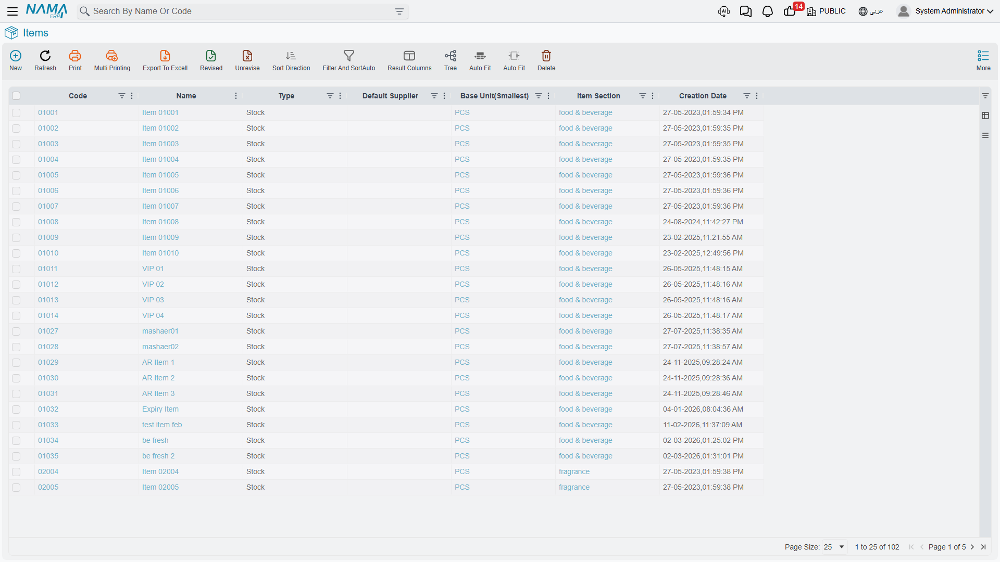
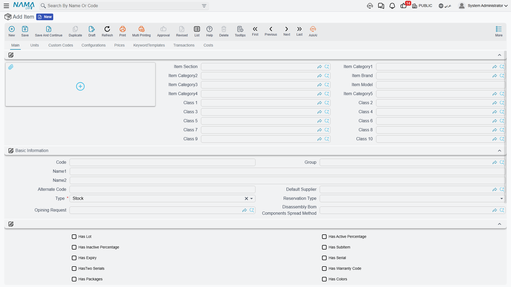

# Understanding Inventory Items

Let's talk about **Items** - the building blocks of the entire supply chain system.

## What Is an Item, Really?

In NaMa ERP, an "item" represents anything you track in your business. It could be:
- A physical product you sell (laptop, chair, juice bottle)
- A raw material you buy (steel, fabric, flour)
- A spare part for maintenance (bearing, filter)
- A service you provide (consulting hours, installation service)
- A consumable you use internally (office supplies, cleaning materials)

The beauty of the item master is that it's flexible enough to handle all these scenarios while capturing exactly the information you need for each type.



## The Item Code: Your Item's Identity

Every item needs a unique identifier - we call it the **item code**. Think of it as a person's ID number.

You have two options for how codes are assigned:
1. **Auto-numbering**: The system generates codes for you (like IT-00001, IT-00002, and so on)
2. **Manual entry**: You type your own codes (like "LAPTOP-DELL-5540" or "STEEL-REBAR-12MM")

Many organizations use manual codes because they carry meaning - you can look at "DESK-WOOD-120" and immediately know it's a wooden desk 120 cm wide. But auto-numbering guarantees you never create duplicates.

Beyond the primary code, an item can have:
- **Alternative codes** for legacy systems or different departments
- **Supplier codes** (what the supplier calls this item)
- **Customer codes** (what customers call this item)
- **Barcodes** - multiple barcodes per item when needed
- **Tax authority codes** for compliance

## Names and Descriptions: Communicating About Items

The item code is precise but not friendly. So each item has an Arabic name and an English name, plus several long-form description fields for specifications or different explanations.

Why all these descriptions? Because different people need different information. Purchasing may need technical specs, the sales team needs marketing language, and the warehouse needs handling instructions - and all of that can live in separate description fields on the same item.

## Organizing Your Items: Categories and Classifications

Imagine you have 10,000 items in your system. How do you make sense of it all? Through classification!

### Hierarchical Categories

NaMa ERP gives you five levels of categories that work hierarchically:

```
Category 1: Electronics
  Category 2: Computers
    Category 3: Laptops
      Category 4: Business Laptops
        Category 5: Dell Business Laptops
```

This hierarchy lets you:
- Run reports at any level ("show me all Electronics sales")
- Apply rules to entire categories ("all Business Laptops require serial numbers")
- Search efficiently ("find items in the Computers category")

### Additional Classification Dimensions

Sometimes hierarchical categories aren't enough. What if you also need to classify by:
- Brand (Dell, HP, Lenovo)
- Product line (Budget, Premium, Enterprise)
- Supplier source (local, imported)
- Department that uses it (IT, Admin, Production)

This is where the **ten item classifications** come in. These are independent dimensions you define however you need: you might use the first for brand, the second for product line, the third for price range, and so on.

Alongside these, the system offers ready-made classifications such as **Brand**, **Section**, and **Assortment** that you can use directly without extra setup.

::: tip Classification Strategy
Start simple! Don't try to define all ten classifications from day one. Set up the two or three you need most, and add more as your needs evolve. You can always reclassify items later.
:::

## The Unit of Measure Dilemma

Here's where things get interesting. Imagine you sell juice:
- You **buy** it by the carton (24 bottles per carton)
- You **store** it in your warehouse by the carton
- You **sell** it by the bottle
- You **report** on it by the liter for analysis

How does the system handle this? Through the sophisticated Unit of Measure (UOM) system.

### The Primary UOM System

Every item has a **base unit** - the fundamental unit for tracking inventory. In the juice example, it might be "bottle."

Then you define **conversion factors**:
- 1 carton = 24 bottles
- 1 bottle = 0.5 liters

Now you can:
- Create a purchase order in cartons
- Receive 10 cartons (the system records 240 bottles in inventory)
- Sell 50 bottles (the system issues 50 bottles, i.e. 2.08 cartons)
- Run reports in liters (the system shows 125 liters sold)

All conversion happens automatically behind the scenes! For each item you can specify a default purchase unit, a default sales unit, and reporting units - so the system picks the right unit in each document.

### The Secondary UOM System: When You Need Two Measures

Some items need **dual measurement**. A classic example is meat:
- Tracked primarily by **weight** (kilograms)
- But also by **count** (how many pieces)

You might buy "10 kg chicken (5 pieces)" and need to track both numbers independently. When you enable the second unit on the item, the system captures both measures in every transaction.

### Why This Matters

Getting units of measure right is critical because:
- Wrong conversions mean wrong inventory counts
- Wrong inventory counts mean wrong financial statements
- Wrong financial statements mean... well, you know the rest!

Take the time to set up conversions accurately, and test them with trial transactions before going live.



## Tracking Special Attributes

Different items need different tracking methods:

### Serial Numbers

For items where each unit is unique and traceable (laptops, vehicles, high-value equipment), you can enable **serial number tracking**.

Now every time you receive or issue this item, the system asks for serial numbers. You can track:
- Where did serial #12345 come from?
- Who owns it now?
- What's the warranty status?
- Has it been serviced?

Some items need **two serial numbers** - imagine an air conditioner with separate serials for the indoor and outdoor units.

### Batch/Lot Numbers

For items produced or purchased in batches (medicines, food products, chemicals), you can enable lot tracking. Each batch gets a unique lot number, so when there's a quality issue you know exactly which batch is affected and can trace every item from that batch.

### Expiration Dates

For perishable items, the system tracks expiry dates and can:
- Warn you about items nearing expiry
- Use FEFO (First Expiry First Out) to select lots automatically
- Prevent issuing expired items

### Warranty Tracking

For items with warranty coverage, the system tracks warranty periods and can alert you as they approach expiry.

## Physical Properties

The system can track physical attributes that affect storage, shipping, and handling:

- **Dimensions**: length, width, height, area, volume
- **Weight**: the item's weight (critical for shipping calculations)
- **Density**: for liquids and bulk materials

Why track this? Because:
- Your warehouse needs to know whether an item fits a standard shelf
- Carriers charge based on volumetric weight
- Production needs to know how much space materials occupy
- Capacity planning depends on physical constraints

## Colors, Sizes, and Variants

Fashion retail and many other industries need to track items in multiple variants. A T-shirt might come in:
- 5 sizes (S, M, L, XL, XXL)
- 8 colors (red, blue, green, yellow, black, white, gray, pink)

Do you create 40 separate items? No! You create a single item with size and color tracking enabled, then define the size/color matrix. Now you can:
- Buy "100 shirts (20 of each size, mixed colors)"
- Track inventory separately for "red-large" vs. "blue-small"
- Report at the style level ("total shirt sales") or the variant level ("red-large sales")

## Item Types: What Can You Do with This Item?

Every item has flags that determine how it can be used:

- **Purchasable**: this item can be bought from suppliers; otherwise the system prevents creating purchase orders for it.
- **Sellable**: this item can be sold to customers; otherwise the system prevents adding it to sales invoices.
- **Manufacturable**: this item can be produced, so the system allows creating production orders for it.
- **Returnable**: customers can return it after purchase; otherwise the system prevents sales returns.
- **Replaceable**: replacement is allowed - useful for warranty swaps or size exchanges.

These flags give you precise control. You might have:
- Raw materials (purchasable but not sellable)
- Finished products (sellable and manufacturable but not purchasable)
- Service items (sellable but not stockable)
- Consumables (purchasable but not sellable or returnable)

## Inventory Control: How Does Stock Behave?

### Safety Stock and Reorder Points

Each item can have a **safety stock** level - the minimum quantity you want to keep on hand. Dropping below it triggers a system alert.

You can set:
- **Safety stock quantity**: "never let laptop stock drop below 10 units"
- **Reorder point**: "when you reach 10 units, automatically suggest creating a purchase order"

The system also helps you identify slow-moving items via a **slow-moving period**: if an item hasn't moved in 180 days, maybe it's time to discount it or stop stocking it.

### Overdraft Policy: What Happens When You Run Out?

Reality isn't perfect. Sometimes you need to issue more than you have - perhaps an urgent customer order arrived before your scheduled delivery. The **overdraft policy** determines what happens:

- **Prevent**: never allow negative stock under any circumstances
- **Warn**: show a warning but allow the transaction
- **Allow**: go ahead, we'll track the negative balance

Different items need different policies. Critical medical supplies might prevent overdraft, while office supplies might just warn.

### Reservation: Holding Stock for Specific Purposes

The system can **reserve** items for a specific purpose:
- Can stock be reserved for a sales order? (ensures it isn't sold to someone else)
- Can it be reserved for a production order? (ensures materials are available when production starts)
- At which stage does reservation happen? (order entry, order approval, just before delivery?)

Reservations are powerful because they ensure commitments are met without physically moving stock until the last moment. For full details, see the [Comprehensive Reservation System Guide](./reservation-system-guide.md).

## Pricing: What Does It Cost? What Do We Charge?

### Cost Management

Every item has a **standard cost** (what you expect it to cost on average). But the system also tracks cost using different methods - such as First In First Out (FIFO), average cost, and last purchase cost - and you choose which method to use per item or sector.

### Sales Pricing

An item can have prices in multiple **price lists** (retail, wholesale, VIP customers, special promotions). When you create a sales invoice, you choose the appropriate price list and the system fills prices automatically. You can also enable **automatic pricing** with profit margins (default margin, minimum, and maximum), so the system recalculates sales prices when costs change while respecting your margin policy. You'll find the details in [Pricing, Offers & Coupons](./pricing-offers-and-coupons.md).

You can also set a **minimum price** to prevent salespeople from over-discounting; the system warns or prevents selling below it.

## Purchase Configuration

For items you buy, you can configure:

- **Lead time**: how long it takes from order to receipt; this affects the timing of purchase requests, dates promised to customers, and production scheduling.
- **Preferred supplier**: who you usually buy from, so the system suggests them automatically when creating purchase orders.
- **Order quantities**: the minimum order (supplier minimums), the maximum per order, and whether the system should suggest reordering automatically when stock is low.

## Accounting Integration

This is where the magic happens. Each item can carry its own accounting setup (a main inventory asset account, plus specialized accounts for different scenarios, branches, or cost centers).

When you receive purchases, the system automatically:
- Debits the inventory account
- Credits payables
- Records input taxes

When you make a sale:
- Debits cost of goods sold
- Credits inventory
- Debits receivables
- Credits sales revenue
- Records output taxes

You'll never have to create manual journal entries - the system handles all of it based on how you configured the item.

### Tax Configuration

Items can be taxable or tax-exempt, at different rates depending on the tax plan. You can even set specific exemptions if an item is exempt from certain taxes but not others.

## Manufacturing and Quality Configuration

For manufactured items you can set the production lead time, the expected yield per input unit, quality specifications, required quality checklists, and the method for disassembly into components. The Manufacturing module uses these settings to schedule production, calculate material requirements, and ensure quality standards.

On the quality side, items can have a checklist on receipt, ongoing quality-assurance requirements, and a re-test period (important for chemicals and medicines). When these are configured, the system won't allow items to move from receipt into available stock until quality checks are complete. For more, see [Quality Control](./quality-control.md).

## Custom Fields and Attachments

Every business is different. So items have custom fields (numbers, true/false flags, dates, and references to other entities) that you use however you need - maybe "shelf life in days" or "requires refrigeration." The system stores and retrieves these values for use in reports, workflows, and business rules.

Each item can also carry several attachments: product images, technical specs, safety data sheets, supplier catalogs, and usage instructions - stored with the item definition and always available when needed.

## Revisions and Version Control

In engineering and manufacturing, items can have **revisions**. Each revision has a version number, an effective date, a statement of what changed, and who approved it. This is critical when you improve a product design but need to support both the old and new versions during a transition period.

## Putting It All Together

Setting up items seems like a lot of work - and it is! But here's the thing: you do it once per item, and from that point on, hundreds of transactions flow through the system using that configuration.

A well-configured item definition means:
- Purchasing flows smoothly (the system knows the supplier, units, and accounts)
- Sales flow smoothly (the system knows the price, units, and accounts)
- Inventory is tracked accurately (the system knows serials, batches, and locations)
- Accounting is automatic (the system knows which accounts to post to)
- Reports are meaningful (the system knows categories and classifications)

::: tip Start Simple
Don't try to configure everything perfectly on your first item. Start with the basics:
1. Code and name
2. Primary unit of measure
3. Category
4. Whether it's purchasable/sellable
5. Basic accounting accounts

You can always come back later to add serial tracking, quality checklists, or automatic pricing. Get items into the system and start using them - you'll quickly learn what additional configuration you need.
:::

## Next Steps

Now that you understand items, you're ready to learn where to store them and what to do with them:
- [Warehouses & Locators](./warehouses-and-locators.md) - where your stock lives
- [Receiving Stock](./receiving-stock.md) - bringing items into your warehouse
- [Issuing Stock](./issuing-stock.md) - taking items out of your warehouse
- [The Purchasing Journey](./purchasing-journey.md) - how items enter your system
- [The Sales Journey](./sales-journey.md) - how items reach your customers
