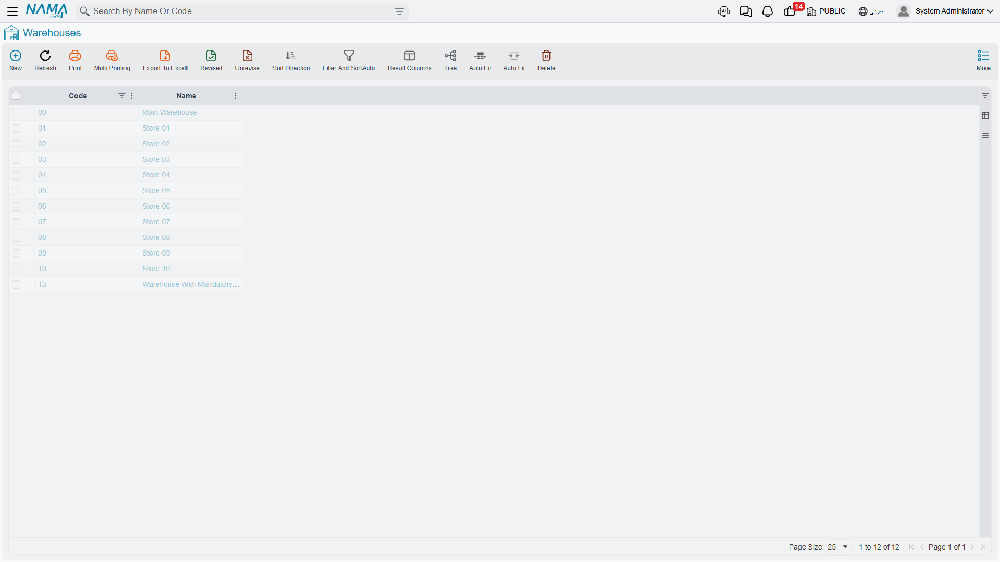
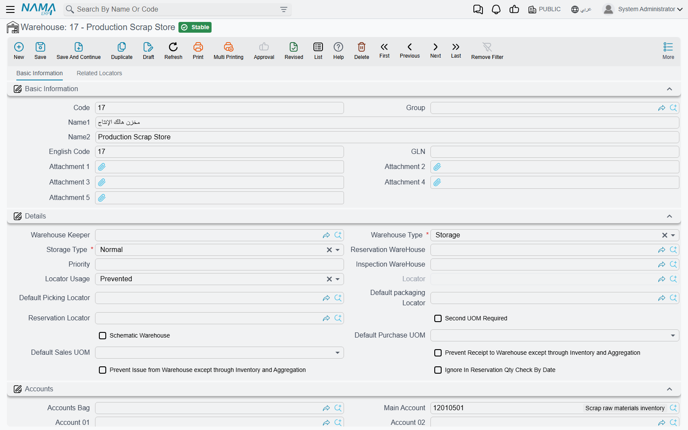

# Warehouses & Locators

You've defined your items - great. But where will you actually put them? This is where **Warehouses** and **Locators** come in. They're the spatial map of your inventory: where each item lives, how it moves, and who's responsible for it.

## The Warehouse: Your Primary Inventory Container

A warehouse in NaMa ERP isn't necessarily a building. It's any place where you want to track a separate inventory balance. It could be:
- A large physical warehouse
- A shelf in a showroom
- A mobile distribution truck
- A "goods in transit" area between two branches
- A sorting or quarantine area for goods under inspection

The simple rule: **if you want to know "how much do I have here?" independently, make it a warehouse.**

### Warehouse Types

Not all warehouses are the same. The system distinguishes several types, each with different behavior:

- **Standard warehouse**: ordinary storage for goods available to sell and issue.
- **Transit warehouse**: holds goods while they move between two locations, so they appear available at neither the sending nor the receiving side until the transfer completes.
- **Inspection/sorting warehouse**: received goods land here before approval, so they don't enter available stock until quality clears them.
- **Reservation warehouse**: dedicated to items reserved for specific customers or orders.

Choosing the right type matters because it determines when a location's stock counts toward "available to sell."

### Who's Responsible? The Warehouse Keeper and Permissions

For each warehouse you can assign a **warehouse keeper** - the employee responsible for it. This helps you:
- Route receiving and issuing tasks to the right person
- Set permissions that prevent users from transacting in warehouses outside their scope
- Maintain accountability during stock taking and reconciling differences

You can also link the warehouse to a branch and a group, set its priority (for automatic warehouse selection), and configure its own default purchase and sales units.

### Warehouses and Requirements Planning (MRP)

You can decide whether a particular warehouse is included in Material Requirements Planning (MRP) calculations. A showroom display warehouse may not be something you want counted as available for production, while your main raw-materials warehouse should be.

## Locators: Precision Inside the Warehouse

Inside a large warehouse, knowing you have "200 boxes" isn't enough - where exactly are they? Which aisle, which shelf, which pallet? This is where **Locators** come in.

A locator is a subdivision within the warehouse: aisle A, shelf 3, or a "fast-moving goods" zone. Enabling locators gives you:
- The exact location of each item
- Direction for warehouse staff straight to the pick location
- Organization of goods by movement, size, or storage requirements

### Locator Policy: Required or Prevented?

For each warehouse you set the locator policy:
- **Required**: no item can be received or issued without specifying its location - ideal for large, organized warehouses.
- **Prevented**: don't use locators at all - suitable for a small warehouse or a distribution truck.

Each locator can also prevent receiving or issuing individually (e.g. a "damaged" locator that accepts goods but prevents issuing them for sale), be linked to a specific supplier or customer when needed, and take a selection priority within automatic picking.

### Location Classes

When locators multiply, **location classes** help you group them by nature: refrigerated, frozen, high-value, quarantine... then apply rules to a whole class rather than a single locator. An item requiring refrigeration can be routed automatically to locators of the "refrigerated" class.

### Rack Quantities

For warehouses that need precision beyond the locator level, the system supports tracking quantities at the **rack** level within a single locator - useful in large distribution centers where one locator contains several racks.

## Linking Items to Warehouses

It's impractical for every item to be stored in every warehouse. So the system lets you **link items to warehouses**, defining the preferred warehouses for each item with a given priority. The benefits:
- The system automatically suggests the most appropriate warehouse on receipt or issue
- It prevents storing items in warehouses unsuited to them
- It simplifies document entry for the user

## Warehouse Groups

When the number of warehouses grows, **warehouse groups** bundle them for reporting and organization: for example a "Northern Region Warehouses" group or a "Showroom Warehouses" group. You can then pull an inventory report for an entire group at once.

## Warehouse Usage Policy

Linking items to warehouses tells the system which warehouses *suit* an item. Sometimes, though, you need the opposite kind of rule: you want to *stop* a warehouse from being used at all - in certain documents, by certain users, or during a certain period. That's the job of the **Warehouse Usage Policy**.

Picture a few everyday situations:
- A warehouse is being counted this week, so nobody should issue or receive against it until the stock take is finished.
- A seasonal showroom warehouse should only be touched by the showroom team, not by central purchasing.
- An old warehouse is being phased out: you want to block new transactions on it from a certain date forward, without deleting any of its history.

A Warehouse Usage Policy is a master file holding a grid of rules. Each line answers four questions: *which warehouse, in which documents, for whom, and when.*

| Column | What it controls |
| --- | --- |
| **For Type** (للنوع) | The document type the rule applies to - e.g. a stock issue, stock receipt, or stock transfer. |
| **Entity List** (قائمة الأنواع) | A reusable list of several document types, for when one rule should cover more than a single type. |
| **Applicable For** (مطبق على) | Who the rule targets: a specific user, a user group, a security profile, or a criteria definition. Leave it empty to apply the rule to everyone. |
| **Warehouse** (المخزن) | The warehouse - or a whole warehouse group - the rule governs. This is required. |
| **Prevent Usage** (منع الاستعمال) | Tick this to actually block the warehouse. |
| **From Date / To Date** | The period during which the rule is active. Leave both empty for an open-ended rule. |

### How a rule kicks in

The check happens the moment you save a supply chain document - not buried in a report you read later. The system looks at the document's type, the user entering it, and the document's date, then inspects both the header warehouse and the warehouse on every line. A line is blocked when a policy rule matches all of the following and has **Prevent Usage** ticked:

- its **For Type** (or entity list) includes the document's type,
- its **Warehouse** is the one being used - or that warehouse belongs to the referenced **warehouse group**,
- the document date falls inside the **From/To** window (an empty window always matches),
- and **Applicable For** matches the current user - directly, through their group or security profile, or through a matching criteria definition - or is left empty.

When all of that lines up, the save is rejected with a clear message naming the blocked warehouse, the date, and the user, so it's obvious why the document won't go through. Leaving **Applicable For** empty makes the block apply to everyone; an empty date window makes it permanent.

You'll find Warehouse Usage Policy among the supply chain master files, right next to Warehouses and Warehouse Groups.

## Taking a Batch Out of Circulation: Prevent Using Batch

A warehouse can be perfectly usable while one batch inside it is not. A lot of yoghurt reaches its expiry date. A delivery is held back until the laboratory result comes in. A supplier recalls a production run. A batch has been promised to one customer and must not be sold to anybody else. In every one of those cases the goods are still physically on the shelf and still on the books - what has to stop is people *using* them.

**Prevent Using Batch** (*Inventory → Master Files → Prevent Using Batch*) is the master file that stops them. Like the Warehouse Usage Policy above, it is a list of rules rather than a switch on the batch itself, which is what lets you quarantine a batch in one warehouse and leave the same batch usable in another.

Each line of the **Details** grid answers four questions: *which batch of which item, in which place, for how long, and who is exempt.*

| Column | What it controls |
| --- | --- |
| **Item** (الصنف) | The item whose batch is being blocked. The picker offers only items with **Has Lot** ticked, since nothing else has batches to block. |
| **Lot ID** (كود الشحنة) | The batch itself. The field suggests the lot numbers already recorded against the item you chose. |
| **Warehouse** (المخزن) | Restricts the block to one warehouse. Leave it empty and the batch is blocked wherever it sits. |
| **Locator** (الموقع) | Narrows it further to a single locator, which has to belong to the warehouse named on the same line. |
| **From Date / To Date** | The period during which this line blocks. Leave both empty and the block is permanent. |
| **Capability Types** (نوع الصلاحيات) | The one way past the block - see below. |

The **From Date** and **To Date** in the header are a convenience rather than a rule: each time you add a line they are copied into that line's own dates, and you are free to change them line by line afterwards. The dates that decide anything are the ones in the grid. (The header pair does get one check of its own - a **To Date** earlier than the **From Date** is refused.)

### When the block bites

The check runs the moment a supply chain document is saved, in the same pass as the warehouse policy described above. Every line of the document is examined, and the document's **Value Date** - not its issue date - is what the rule's date window is compared against.

A document line is refused when all of these are true at once:

- the rule names the **Item** on that line,
- the rule's **Lot ID** is the batch on that line,
- the document's value date falls inside the rule's **From/To** window (an empty window always matches),
- and the rule's **Warehouse** and **Locator** are either empty or exactly the ones on that line.

Two things about that deserve to be said plainly. First, this is a **hard block, not a warning**: the save is rejected and the Lot ID column of the offending line is flagged, so the document never comes into existence. Second, it blocks the batch **in both directions**. It is natural to assume a rule like this only stops stock going out, but the check never asks whether the line is an issue or a receipt - a stock receipt, a purchase invoice or a transfer *into* a warehouse naming that batch is refused exactly as a sale of it would be. For a recalled or expired lot that is usually what you want; it is occasionally a surprise to whoever tries to bring quarantined goods back in on a correcting document.

::: warning A rule line needs both an Item and a Lot ID
It is tempting to name the item, leave **Lot ID** empty and expect every batch of that item to be blocked. That is not what happens - a blank Lot ID matches only document lines that carry no batch at all. To stop several batches of one item, give each batch its own line.
:::

::: tip Letting one person through
**Capability Types** on a line is an exemption, not a target. Point it at a capability type and any user whose security profile grants that capability *on the document type being saved* may use the batch anyway - the quality manager entitled to move held stock, for instance, while everybody else is stopped. Leave it empty and nobody is exempt. Capability types themselves live under *Administration → Security → Capability Types*; see [Security Profile](/platform/security/security-profiles.md).
:::

Rules take effect immediately. Saving or changing a Prevent Using Batch record applies to the very next document saved, with no restart and no waiting.

## How It All Fits Together

Imagine a typical distribution center:

1. A shipment arrives and is first received into the **inspection warehouse**.
2. After quality clears it, it's transferred to the **main warehouse**, specifically to a **locator** in the appropriate aisle.
3. Items requiring refrigeration are routed automatically to locators of the **"refrigerated" class**.
4. When a sales order arrives, the system suggests the warehouse and locator based on **item-warehouse links** and **locator priorities**.
5. Goods distributed to distant branches are held in a **transit warehouse** during transport until they arrive and the transfer is received.

This spatial structure is the foundation on which all the stock movements we'll cover in the next sections operate.

## Next Steps

- [Receiving Stock](./receiving-stock.md) - bringing items into these warehouses
- [Issuing Stock](./issuing-stock.md) - taking them out
- [Moving Stock Between Warehouses](./moving-stock.md) - transferring them from one warehouse to another
- [Stock Taking](./stock-taking.md) - verifying that book and physical balances match
