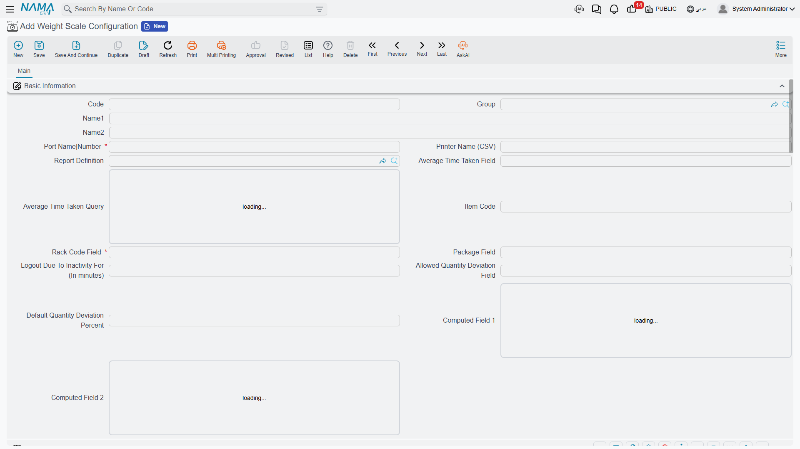

# Weight Scale

In facilities that handle bulk materials sold or received by weight - grains, concrete, aggregates, metals - the scale becomes part of the workflow. NaMa ERP connects electronic weight scales to receiving and loading stations, capturing weights directly and turning them into inventory movements without manual entry.

## Scale Configuration (WeightScaleConfig)

The **Weight Scale Configuration** is the central file that sets up scale terminals at receiving and loading stations. It configures:
- **Barcode formats**: up to five formats, each with its specifications and component parts, to read the item code, package, racks, and weight from the scale label.
- **Field mapping**: assigning field IDs for item code, package, racks, average time, and computed values.
- **Permissions**: a permissions matrix for scale operations and user roles.
- **Printing and connection**: the linked report definition, printer and port setup, and an inactivity logout timer.
- **Issue control**: stock-issue-request ordering methods and allowed quantity-deviation tolerance.

## Issue Preparation Document (WeightScalePreparationDoc)

The **Weight Scale Preparation Document** links the weight reading to the actual issue operation: it captures the weight from the scale and prepares the net quantity to be issued, so the data flows into the inventory movement without manual-entry errors. To generate these documents in quantities or batches, the **Preparation Generator** (WeightScalePrepGenerator) helps create them according to defined rules.

## How the Process Works

Imagine receiving a truck of grain:
1. The truck is weighed loaded (gross weight).
2. The load is unloaded.
3. The truck is weighed empty (tare weight).
4. The system computes the net weight automatically.
5. The **Preparation Document** captures the net value, and the corresponding inventory movement is created per the configuration.

This eliminates manual weight-entry errors and speeds up receiving and issuing at high-traffic locations.

## Next Steps

- [Receiving Stock](./receiving-stock.md) - receiving weighed bulk materials
- [Issuing Stock](./issuing-stock.md) - issuing materials by net weight
- [Understanding Inventory Items](./understanding-items.md) - items with weight measurement
