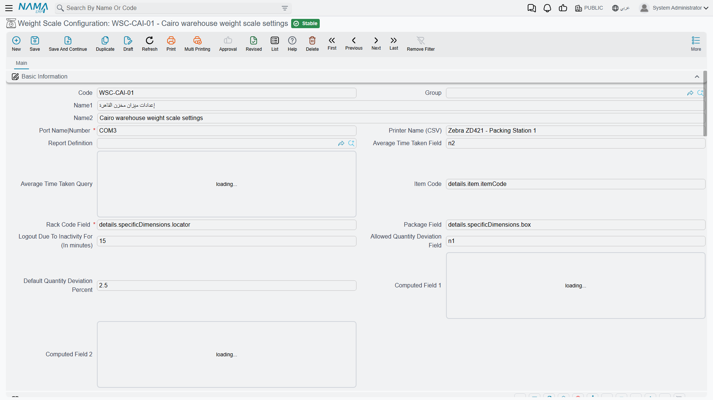

# Weight Scale

In facilities that handle bulk materials sold or received by weight - grains, concrete, aggregates, metals - the scale becomes part of the workflow. NaMa ERP connects electronic weight scales to receiving and loading stations, capturing weights directly and turning them into inventory movements without manual entry.

## Scale Configuration (WeightScaleConfig)

The **Weight Scale Configuration** is the central file that sets up scale terminals at receiving and loading stations. It configures:
- **Barcode formats**: up to five formats, each with its specifications and component parts, to read the item code, package, racks, and weight from the scale label.
- **Field mapping**: assigning field IDs for item code, package, racks, average time, and computed values.
- **Permissions**: a permissions matrix for scale operations and user roles.
- **Printing and connection**: the linked report definition, printer and port setup, and an inactivity logout timer.
- **Issue control**: stock-issue-request ordering methods and allowed quantity-deviation tolerance.

## Issue Preparation Document (WeightScalePreparationDoc)

The **Weight Scale Preparation Document** links the weight reading to the actual issue operation: it captures the weight from the scale and prepares the net quantity to be issued, so the data flows into the inventory movement without manual-entry errors. To generate these documents in quantities or batches, the **Preparation Generator** (WeightScalePrepGenerator) helps create them according to defined rules.

## How the Process Works

Imagine receiving a truck of grain:
1. The truck is weighed loaded (gross weight).
2. The load is unloaded.
3. The truck is weighed empty (tare weight).
4. The system computes the net weight automatically.
5. The **Preparation Document** captures the net value, and the corresponding inventory movement is created per the configuration.

This eliminates manual weight-entry errors and speeds up receiving and issuing at high-traffic locations.

## Actions on this screen

**On the Weight Scale Preparation Generator:**

- **Documents To Prepare** — reads the document you are on and fills its grid with the documents that are waiting to be prepared on the scale, so you pick from a real list rather than searching for them.
- **Generate Weight Scale Preparation Documents** — the generator must be saved; it then creates the preparation documents for what the grid holds.

## Messages you may see

| Message | Why | What to do |
|---|---|---|
| *You cannot delete a line whose status is Packaged* — «لا يمكن حذف سطر تم تعبئته» | A line was removed from a saved **Weight Scale Preparation Document** after it had already reached the *Packaged* status — the goods behind it have been weighed and packed. | Put the line back and save; deal with packed goods by a return or an adjustment rather than by deleting the line. |
| *Can not be deleted because line {0} status is packaged* — «لا يمكن حذف هذا المستند لان السطر {0} تم تعبئته بالفعل» | The whole preparation document is being deleted while one of its lines is *Packaged*. The message gives the line number. | The document cannot be deleted once anything on it has been packed — cancel it through the flow instead. |
| *The [Average Time Taken Field] returned {0} rows for the issue request {1}, it should return {2} rows* — «تم إيجاد عدد سطور {0} للحقل {الوقت المستغرق} في طلب الصرف المخزني {1}, ولكن ينبغي أن يوجد {2} سطر» | The **Average Time Taken Field** in the scale configuration reads a field on the issue request, and it gave back a different number of values than the request has lines, so the generator cannot pair them up. | Point the setting at a field that sits on the request's own lines, so it yields exactly one value per line. |
| *The field {Average Time Taken Query} returned {0} rows for the issue request {1}, it should return {2} rows* — «تم إيجاد عدد سطور {0} للحقل {إستعلام الوقت المستغرق} في طلب الصرف المخزني {1}, ولكن ينبغي أن يوجد {2} سطر» | The same mismatch when the average time comes from the configuration's **Average Time Taken Query** instead of a field — the query returned the wrong number of rows. | Fix the query so it returns one row per line of the issue request. |
| *The {Order By Field} returned {0} rows for the issue request {1}, it should return {2} rows* — «تم إيجاد عدد سطور {0} للحقل {الترتيب بناءاً على حقل} في طلب الصرف المخزني {1}, ولكن ينبغي أن يوجد {2} سطر» | The same mismatch on one of the sorting rules: an **Order By Field** in the configuration's ordering methods did not yield one value per line. | Use a line-level field in the ordering method, or remove that ordering line. |
| *Already prepared* — «تم التحضير بالفعل» | Every line of every issue request in the generator's grid is already attached to a preparation document, so there is nothing left to prepare. | Refresh the grid with **Documents To Prepare**; the requests you are looking at have been through the scale already. |
| *Maximum execution time for each weight preparation document is zero. Please check average execution time of issue requests Lines* — «أقصى وقت تنفبذ لسند تحضير الميزان صفر. يرجى مراجعة متوسط وقت التنفيذ لسطور طلبات الصرف» | The generator adds up the average execution time of the lines it is about to prepare and gets zero, so it has no basis on which to split them into documents. | Fill the average time — through the field or the query in the scale configuration — on the issue request lines, then generate again. |

## Next Steps

- [Receiving Stock](./receiving-stock.md) - receiving weighed bulk materials
- [Issuing Stock](./issuing-stock.md) - issuing materials by net weight
- [Understanding Inventory Items](./understanding-items.md) - items with weight measurement
