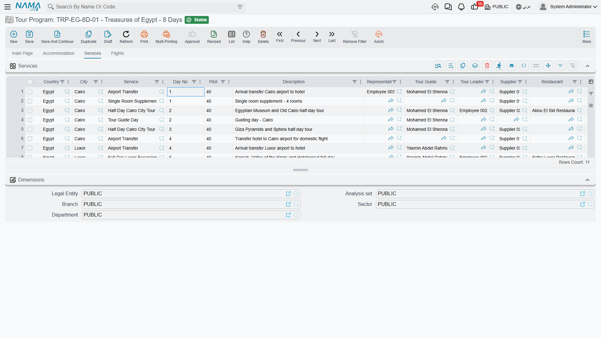
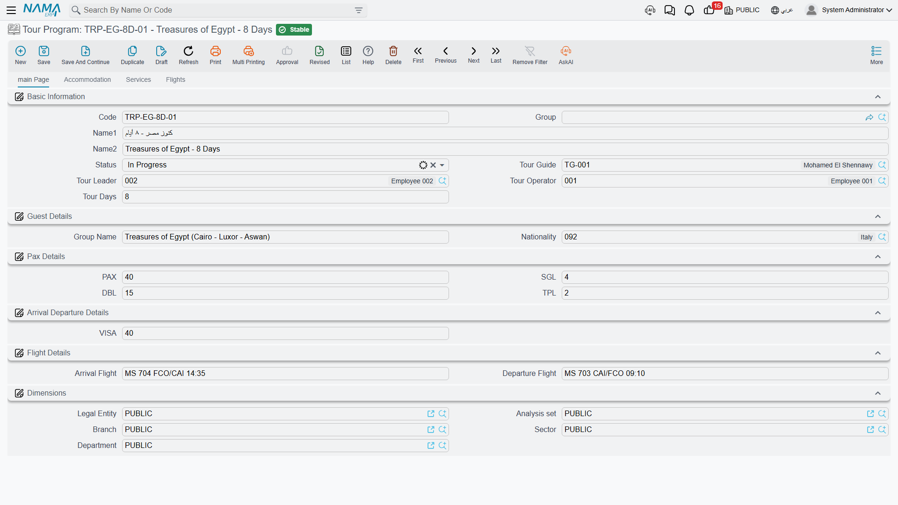
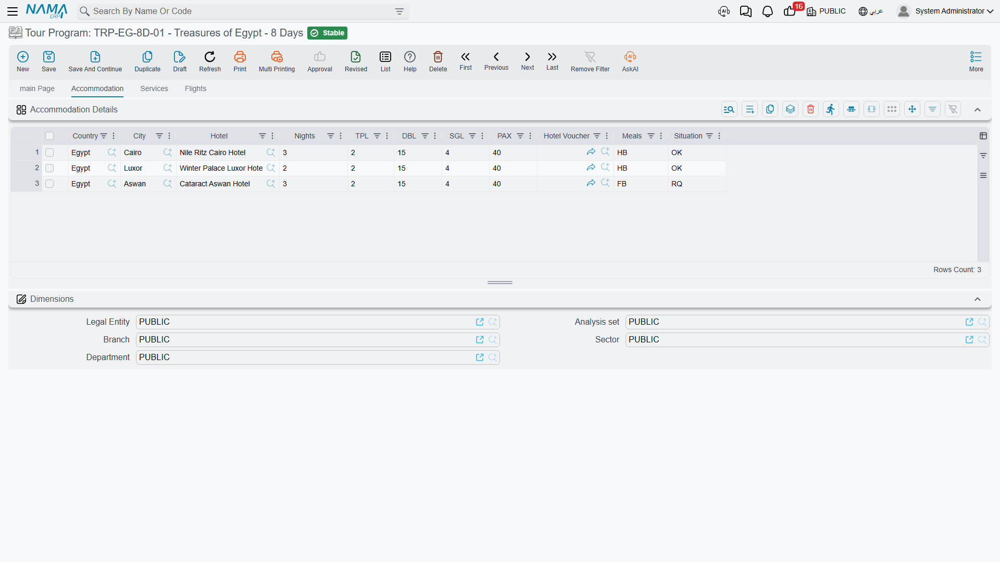
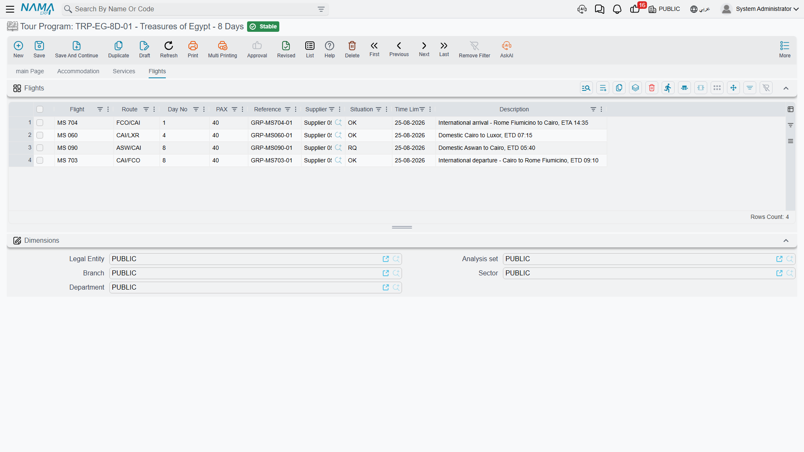

# Tour Programs

A tour operator does not invent a new trip for every group that lands at the airport. The same
"10-day Cairo – Luxor – Aswan classic" runs in March, in April and again in October, for a Spanish
group of 40 and an Italian group of 22. What stays the same is the *shape* of the trip: how many
days it lasts, which hotels for how many nights, which excursions happen on which day, which
domestic flights connect the cities.

A **Tour Program** is exactly that shape, written down once and reused for every departure. You
find it under **Travel → Master Files → Tour Program** (in Arabic
**السفر والرحلات ← الملفات ← برنامج سياحي**). It is a master file, not a document: nothing is
committed, nothing is processed, and nothing about it touches money.

::: info A program has no dates and no money
Two things you will never find on a tour program: a calendar date and a price. It says "day 4",
not "12 April"; it says "Sheraton Luxor, 2 nights", not "2 nights at 85 per room". Dates arrive
when you build a real [Tour](./tours) from it; prices arrive later still, on the
[purchase](./travel-purchase-cycle) and [sales](./travel-sales-cycle) documents.
:::

## Why day numbers instead of dates

This is the single idea the whole screen is built on, so it is worth stating plainly.

If a program carried real dates, it would be usable exactly once — for the group arriving on those
dates. By numbering the days instead ("day 1: arrive and transfer to hotel", "days 1–3: 5-star
hotel in Cairo", "day 4: fly to Luxor"), the itinerary becomes a template that fits any arrival
date. When you later create a tour for a group landing on 12 April, Nama counts forward from that
arrival: day 1 becomes 12 April, day 4 becomes 15 April, and the hotel stays chain themselves off
each other's nights.

So the rule to remember while filling the program in is: **day 1 is the arrival day, not the day
after**. A three-night Cairo stay that starts on day 1 covers days 1, 2 and 3, and the next stay
begins on day 4.

## Building a program: the header

### Basic Information (المعلومات الأساسية)

| Field | What to put in it |
|---|---|
| **Code** (الكود) | The short reference your staff will type — `CLASSIC10`, `NILE7` |
| **Group** (المجموعة) | The master group, if you classify programs into families |
| **Name1 / Name2** (الاسم العربي / الاسم الإنجليزي) | The Arabic and English names of the program |
| **Status** (الحالة) | Initial, In Progress, Finished or Canceled — see the note below |
| **Tour Guide** (المرشد السياحي) | The guide you normally run this itinerary with |
| **Tour Leader** (قائد الرحلة) | The employee who normally leads it |
| **Tour Operator** (منظم الرحلة) | The employee who owns the file. A new program starts with the employee linked to the user creating it, and you can change it |
| **Tour Days** (عدد أيام الرحلة) | How many days the whole itinerary runs — the number that decides a tour's departure date |

**Tour Days** is the most consequential field on the screen. It is what turns an arrival date into
a departure date on every tour built from this program, and Nama checks it against the
accommodation grid: the nights on all your hotel stays must add up to exactly this number before
the program will save.

::: tip Status is a label you keep for yourself
The status pick-list — **Initial**, **In Progress**, **Finished**, **Canceled** — is informational.
The system never acts on it: nothing is blocked, hidden or triggered by it, and it is copied onto
tours built from the program. Use it to mark which of your templates are live and which are
retired, and to filter the list screen when you have fifty of them.
:::

### Guest Details (تفاصيل الضيف)

**Group Name** (اسم المجموعة) and **Nationality** (الجنسية) — the defaults for the kind of group
this program is written for. A program aimed at Spanish incentive groups can carry Spain here and
save the operator from typing it on every tour.

### Pax Details

**PAX**, **SGL**, **DBL**, **TPL** — the standard group size and its room split: how many single,
double and triple rooms it normally takes. This is the typical shape of the group, not a booking.

Keep the arithmetic consistent, because a real tour insists on it: **PAX = (TPL × 3) + (DBL × 2) +
SGL**. A 40-pax group carried as 16 triples is `16 × 3 = 48` — wrong. As `10 TPL + 4 DBL + 2 SGL`
it is `30 + 8 + 2 = 40` — right. Getting it right here means every tour copied from the program
commits without a second thought.

### Arrival Departure Details (تفاصيل القيام و الوصول)

One field: **VISA** (تأشيرة) — the number of visas the group normally needs.

### Flight Details (تفاصيل الرحلات الجوية)

**Arrival Flight** (رحلة الوصول الجوية) and **Departure Flight** (رحلة القيام الجوية) — free text
for the international legs that bracket the trip, such as `MS 986` and `MS 985`. These are the
flights the group arrives on and leaves on; the *internal* legs go in the Flights grid further
down.

### Dimensions (المحددات)

The usual five: **Legal Entity** (الشركة), **Analysis Set** (المجموعة التحليلية),
**Branch** (الفرع), **Sector** (القطاع), **Department** (الإدارة) — so programs can be scoped to
the office that sells them.

## The three grids

Everything that actually happens on the trip lives in one of three grids. Read them as three
parallel timelines over the same numbered days: where the group sleeps, what it does, and how it
moves between cities.

### Accommodation Details (تفاصيل الإقامة)

One line = **one hotel stay**. Not one night — one continuous stay in one hotel. Three nights at
the Marriott Cairo is a single line with `3` in Nights.

| Column | Meaning |
|---|---|
| **Country** (الدولة) / **City** (المدينة) | Where the hotel is. Pick the country first — the city list narrows to that country, and Nama refuses a city that does not belong to the country on the line |
| **Hotel** (فندق) | The hotel master file. The search is filtered by the line's country and city, so you only see hotels that are actually there |
| **Nights** (عدد الليالي) | How many nights this stay runs. The sum across all lines must equal **Tour Days** |
| **TPL / DBL / SGL / PAX** | The room split for this stay |
| **Hotel Voucher** (قسيمة الفندق) | A link to a [hotel voucher](./travel-vouchers) |
| **Meals** (وجبات) | Free text for the meal basis — `BB`, `HB`, `FB`, `AI` — written the way your contracts write it |
| **Situation** (الموقف) | **OK**, **RQ** or **WL** — the booking's standing. Informational only |

The order of the lines *is* the order of the trip. The first line is where the group sleeps on
arrival night, the second line follows it, and so on — which is exactly how a real tour turns them
into check-in and check-out dates.

::: info The header's pax figures win
Every time you save the program, the header's **PAX**, **TPL**, **DBL** and **SGL** are written
down onto every accommodation line, and the header's **PAX** onto every service line. The header is
the single place to state group size on a program; per-line variations belong on the real tour,
where you set them line by line.
:::

### Services (الخدمات)

One line = **one service delivered on one numbered day** — a transfer, a museum entrance, a Nile
dinner cruise, a guided day in the Valley of the Kings.

| Column | Meaning |
|---|---|
| **Country** / **City** | Where the service happens, with the same country/city consistency check |
| **Service** (الخدمة) | The tour service master file |
| **Day No** (رقم اليوم) | Which day of the itinerary it falls on. `1` is the arrival day |
| **PAX** | How many people take it |
| **Description** (الوصف) | Long free text — the wording your operations staff and the supplier need |
| **Representative** (المندوب) | The employee meeting the group |
| **Tour Guide** (المرشد السياحي) / **Tour Leader** (قائد الرحلة) | Who accompanies this particular service, when it differs from the header |
| **Supplier** (مورد) | The party who provides it, when it is bought in |
| **Restaurant** (المطعم) | The restaurant, for a meal service. Its search is filtered by the line's country and city too |
| **Restaurant Voucher** (قسيمة المطعم) | A link to a [restaurant voucher](./travel-vouchers) |

The **Supplier**, **Tour Guide** and **Restaurant** columns are worth filling in carefully even
though nothing on the program screen uses them: they are the parties a real tour will later group
its purchase orders by. A service line that names who provides it becomes a purchase order line
without anybody re-typing anything.

### Flights (الرحلات الجوية)

One line = **one internal flight leg** — Cairo to Luxor on day 4, Aswan back to Cairo on day 8.

| Column | Meaning |
|---|---|
| **Flight** (الرحلة الجوية) | The flight number or description |
| **Route** (الطريق) | `CAI-LXR`, `ASW-CAI` — written the way your staff read it |
| **Day No** (رقم اليوم) | Which day of the itinerary it falls on |
| **PAX** | Seats needed |
| **Reference** (مرجع) | The airline's booking reference |
| **Supplier** (مورد) | Who you buy the seats from |
| **Situation** (الموقف) | OK / RQ / WL |
| **Time Limit** (المهلة) | The ticketing deadline |
| **Remarks** (ملاحظات) | Long free text |

## What Nama checks before it saves

Four rules, all of them the kind that catch a genuine mistake:

1. **Tour Days cannot be negative.**
2. **The nights add up.** The total of the **Nights** column across all accommodation lines must
   equal **Tour Days**. A 10-day program has to account for 10 nights of accommodation.
3. **A city must be in its country.** On accommodation and service lines alike, if you name both,
   the city has to belong to the country.
4. **Day numbers cannot be negative** on service or flight lines.

## A worked example: the 10-day classic

Here is the whole screen filled in for a real itinerary — Cairo, Luxor, Aswan, back to Cairo, ten
days.

**Header**: Code `CLASSIC10`, Name `10-Day Classic Egypt`, Tour Days `10`, PAX `40`, TPL `10`,
DBL `4`, SGL `2` (which checks out: 30 + 8 + 2 = 40), VISA `40`, Arrival Flight `MS 986`,
Departure Flight `MS 985`.

**Accommodation** — four lines, 3 + 2 + 2 + 3 = 10 nights, matching Tour Days:

| # | Country | City | Hotel | Nights | Meals |
|---|---|---|---|---|---|
| 1 | Egypt | Cairo | Marriott Cairo | 3 | BB |
| 2 | Egypt | Luxor | Sheraton Luxor | 2 | HB |
| 3 | Egypt | Aswan | Movenpick Aswan | 2 | HB |
| 4 | Egypt | Cairo | Marriott Cairo | 3 | BB |

**Services** — a handful of lines carrying day numbers:

| Day No | City | Service | PAX | Supplier / Restaurant |
|---|---|---|---|---|
| 1 | Cairo | Airport transfer in | 40 | Nile Transport |
| 2 | Cairo | Pyramids & Sphinx tour | 40 | — |
| 2 | Cairo | Lunch | 40 | Restaurant: Andrea |
| 5 | Luxor | Valley of the Kings | 40 | — |
| 10 | Cairo | Airport transfer out | 40 | Nile Transport |

**Flights** — two internal legs:

| Day No | Flight | Route | PAX | Supplier |
|---|---|---|---|---|
| 4 | MS 063 | CAI-LXR | 40 | Egyptair |
| 8 | MS 082 | ASW-CAI | 40 | Egyptair |

That program is now reusable forever. Nothing in it says *when*.

## From program to tour

The program earns its keep the moment a real group is confirmed. On a new [Tour](./tours) you enter
the arrival date, pick this program in **Tour Program**, and Nama fills the entire tour in: the
header defaults, the departure date counted from Tour Days, the four hotel stays with their
check-in and check-out dates chained one after another, and every service and flight line dated by
counting its day number forward from arrival.

For a group arriving 12 April, day 1 is 12 April, the Cairo stay runs 12 → 15 April, the Luxor
flight on day 4 lands on 15 April, and the departure date comes out at 22 April.

That copy is a one-time snapshot — the tour is yours to edit afterwards and never looks back at the
program again. The [Tours](./tours) page walks through it in detail.
