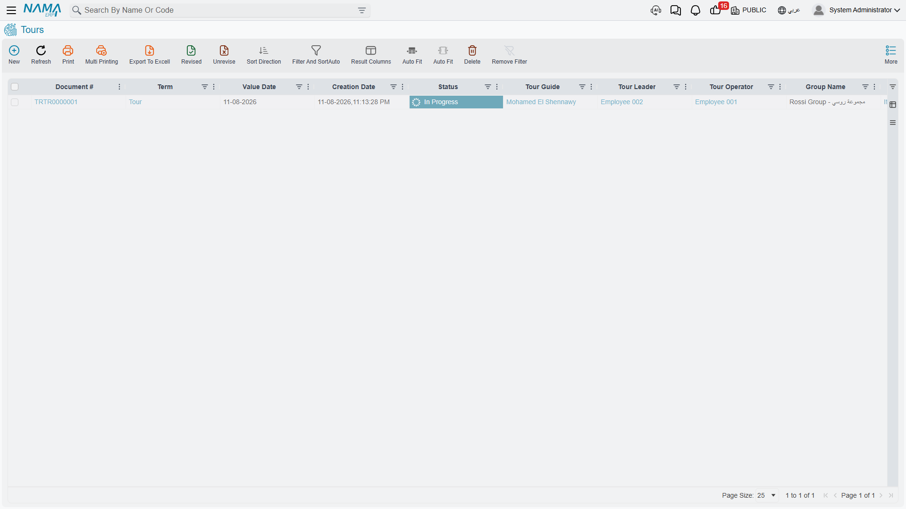
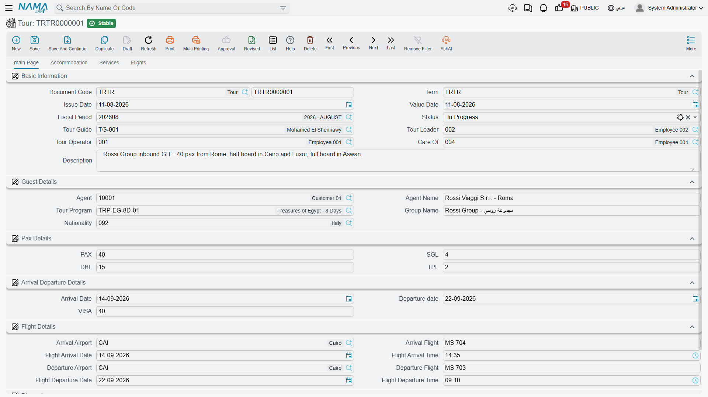
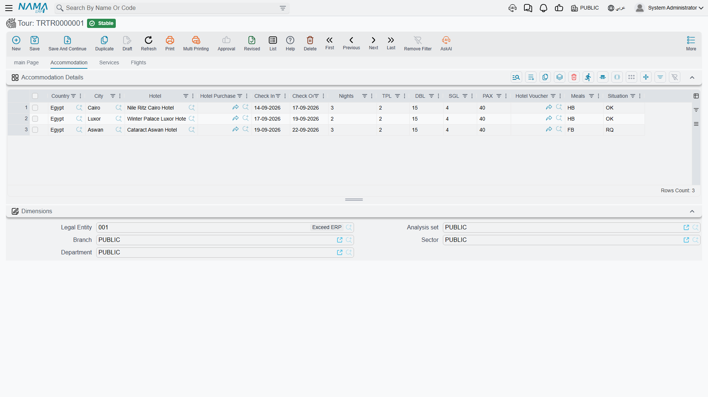
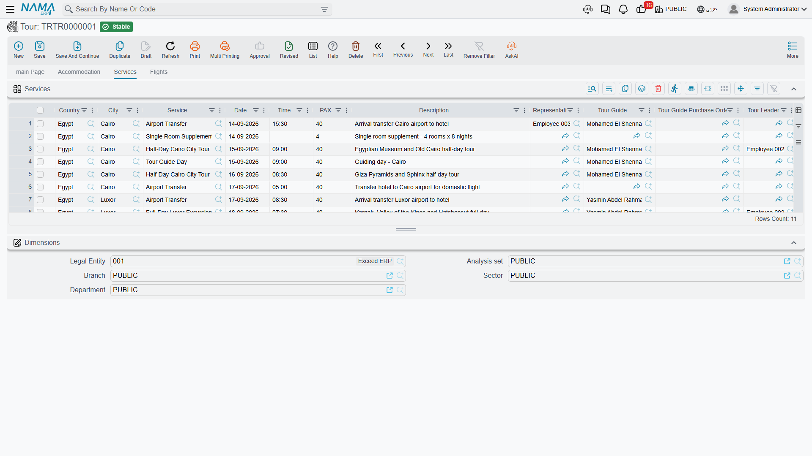
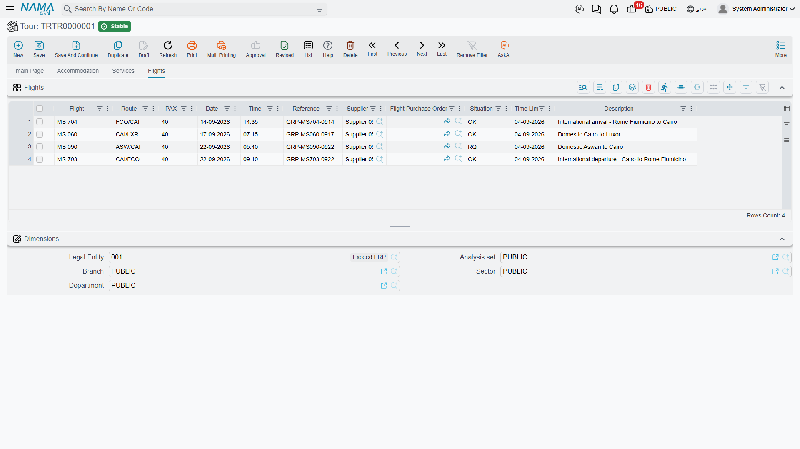
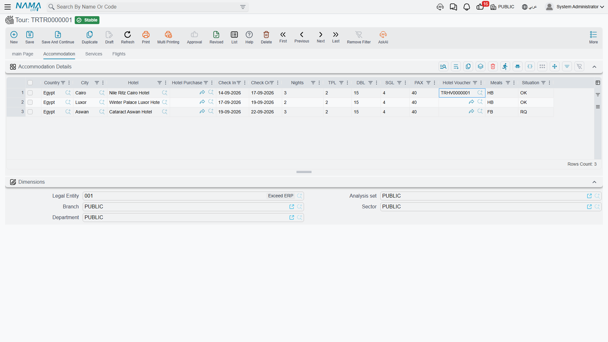

# Tours

A [tour program](./tour-programs) is the recipe. A **Tour** is the meal actually being cooked, for
a named group, on a named date.

The Barcelona agent confirms 40 Spanish travellers arriving on flight MS 986 on 12 April. They want
the 10-day classic. Somebody has to book four hotel stays with real check-in dates, hold 40 seats
on the Cairo–Luxor flight, brief a guide, arrange two airport transfers and a lunch at Andrea, and
keep all of it in one place where operations staff can see it. That one place is the tour.

You reach it from **Travel → Documents → Tour** (in Arabic
**السفر والرحلات ← المستندات ← رحلة سياحية**).

::: info A tour carries no prices at all
There is no rate, no cost, no total and no currency anywhere on a tour — not on the header, not on
any of its three grids. Saving a tour creates no journal entry, no receivable and no payable, and
touches no stock.

This is deliberate, and it is the shape of the whole module. The tour is the **operations file**:
who is coming, where they sleep, what they do, when they fly. The money is raised separately, on
the [travel purchase documents](./travel-purchase-cycle) for what you buy and the
[travel sales documents](./travel-sales-cycle) for what you sell. Keeping the two apart means the
operations desk can rearrange a hotel or move an excursion without anybody's ledger moving, and the
accounts desk can price and invoice without touching the itinerary.

The one bridge between the halves is a button, and it is described at the end of this page:
**Create Tourism Service Purchase Orders**.
:::

## The header

### Basic Information (المعلومات الأساسية)

| Field | Meaning |
|---|---|
| **Document Code** (رقم المستند) | Book and code, as on every Nama document |
| **Term** (توجيه المستند) | The [document term](./travel-document-terms). Fill it in — the purchase-order button will not run without one |
| **Issue Date** (تاريخ التحرير) / **Value Date** (التاريخ الفعلي) | The document dates. Both are carried onto any purchase orders the tour generates |
| **Fiscal Period** (الفترة) | The period the document belongs to |
| **Status** (الحالة) | Initial, In Progress, Finished, Canceled — informational, see below |
| **Tour Guide** (المرشد السياحي) | The guide running the trip |
| **Tour Leader** (قائد الرحلة) | The employee leading it |
| **Tour Operator** (منظم الرحلة) | The employee who owns the file. A new tour starts with the employee linked to the user creating it |
| **Care Of** (عناية) | The employee the agent deals with. Picking the agent fills this in from that customer's salesman, and you can override it |
| **Description** (ملاحظات) | Free text for whatever the group's file needs to say |

### Guest Details (تفاصيل الضيف)

| Field | Meaning |
|---|---|
| **Agent** (الوكيل) | The customer who sent you the group — the travel agency abroad, or the direct client. This is an ordinary Customer master file, and it is who you will later invoice |
| **Agent Name** (اسم العميل) | Free text, for when the name on the file differs from the master record |
| **Tour Program** (برنامج الرحلة) | The [program](./tour-programs) this trip is built from. Picking it fills the tour in — see the next section |
| **Group Name** (اسم المجموعة) | What operations staff call this group: `SPANISH GRP 12/04` |
| **Nationality** (الجنسية) | The group's nationality |

### Pax Details

**PAX**, **SGL**, **DBL**, **TPL** — the group size and the room split you have to book.

This is checked when the tour commits: **PAX must equal (TPL × 3) + (DBL × 2) + SGL**. For our 40
travellers, `10 TPL + 4 DBL + 2 SGL` gives `30 + 8 + 2 = 40` and the tour saves. Anything else is
rejected with a message naming both numbers, which is usually a sign that somebody changed the room
split without re-counting heads.

### Arrival Departure Details (تفاصيل القيام و الوصول)

**Arrival Date** (تاريخ الوصول), **Departure Date** (تاريخ القيام) and **VISA** (تأشيرة, the number
of visas). The departure date can never be earlier than the arrival date, and this pair of dates
becomes the window that every other date on the document is checked against.

### Flight Details (تفاصيل الرحلات الجوية)

The two international legs, in full:

| Field | Meaning |
|---|---|
| **Arrival Airport** (مطار الوصول) | The travel city the group lands at |
| **Arrival Flight** (رحلة الوصول الجوية) | Flight number, free text — `MS 986` |
| **Flight Arrival Date** (تاريخ رحلة الوصول) / **Flight Arrival Time** (وقت رحلة الوصول) | When it lands. The date must fall inside the arrival-to-departure window |
| **Departure Airport** (مطار القيام) | The city they fly out of |
| **Departure Flight** (رحلة القيام الجوية) | Flight number out |
| **Flight Departure Date** (تاريخ رحلة القيام) / **Flight Departure Time** (وقت رحلة القيام) | When it leaves, also inside the window |

### Dimensions (المحددات)

**Legal Entity** (الشركة), **Analysis Set** (المجموعة التحليلية), **Branch** (الفرع),
**Sector** (القطاع), **Department** (الإدارة) — copied onto any purchase orders the tour generates.

## Picking a tour program fills the tour in

This is the step that saves the most typing, and it behaves in a very specific way. Worth knowing
exactly.

### Enter the arrival date first

The copy is driven entirely by the arrival date, so Nama insists on having it before it will run.
Select a program with **Arrival Date** still empty and you get *"You must enter arrival date"* and
nothing is copied. Fill in the arrival date, then pick the program.

### What lands on the header

Straight copies from the program: **Tour Guide**, **Tour Leader**, **Tour Operator**, **Status**,
**Group Name**, **Nationality**, **TPL**, **DBL**, **SGL**, **PAX**, **VISA**, **Arrival Airport**,
**Arrival Flight**, **Departure Airport**, **Departure Flight**.

One field is calculated rather than copied: **Departure Date = Arrival Date + Tour Days**. A 10-day
program picked on a tour arriving 12 April sets departure to 22 April.

### What lands on the accommodation grid

Each program stay comes across with its country, city, hotel, room split, nights, meals, situation
and voucher — and then Nama gives it real dates by **chaining the stays end to end**, starting at
the arrival date:

- the first line checks in on the arrival date, and checks out `nights` later;
- the second line checks in on the day the first one checks out;
- and so on down the grid, with no gaps.

For our example arriving 12 April:

| # | Hotel | Nights | Check In | Check Out |
|---|---|---|---|---|
| 1 | Marriott Cairo | 3 | 12 April | 15 April |
| 2 | Sheraton Luxor | 2 | 15 April | 17 April |
| 3 | Movenpick Aswan | 2 | 17 April | 19 April |
| 4 | Marriott Cairo | 3 | 19 April | 22 April |

The last check-out lands exactly on the computed departure date — which is why the program insists
its nights add up to its tour days.

### What lands on the services and flights grids

Every service and flight line keeps everything the program said about it, and gains a date:

**line date = arrival date + (day number − 1)**

Day 1 is therefore the arrival day itself, day 4 is three days later. The airport transfer on day 1
falls on 12 April, the Cairo–Luxor flight on day 4 falls on 15 April, the transfer out on day 10
falls on 21 April. A line with no day number simply arrives without a date, and you set it by hand.
Times are never filled by the copy — set them yourself where they matter.

### It is a one-time copy

::: warning The tour does not stay linked to the program
Picking the program copies its contents into this tour, once, at that moment. From then on the two
are independent:

- **Later edits to the program never reach tours already created.** Change a hotel on the program
  next month and the tours you built last month keep the old hotel. That is the point — a group in
  the air must not have its itinerary rewritten under it.
- **You edit the tour freely.** Add a stay, change a hotel, move a service to a different day,
  adjust the pax on one line. Nothing pushes back to the program, and nothing overwrites your
  changes.

The **Tour Program** field stays filled in as a record of where the tour came from. Re-picking a
program replaces the grids with a fresh copy, so treat it as a restart rather than a refresh.
:::

## The three grids

### Accommodation Details (تفاصيل الإقامة)

Where the group sleeps, one line per stay.

| Column | Meaning |
|---|---|
| **Country** (الدولة) / **City** (المدينة) | Where the hotel is. The city must belong to the country |
| **Hotel** (فندق) | The hotel. Its search is filtered by the line's country and city |
| **Hotel Purchase Order** (أمر شراء فندق) | Filled in by the purchase-order button — the order raised for this stay |
| **Check In** (إدخال) / **Check Out** (إخراج) | The real dates. Both must fall inside the arrival-to-departure window |
| **Nights** (عدد الليالي) | Recalculated automatically whenever you change either date, so it always matches them |
| **TPL / DBL / SGL / PAX** | The rooms for this stay. Inserting a line — or picking a hotel on it — copies the header's figures down, and you adjust them from there |
| **Hotel Voucher** (قسيمة الفندق) | The [hotel voucher](./travel-vouchers) issued for this stay |
| **Meals** (وجبات) | Free text meal basis — `BB`, `HB`, `FB` |
| **Situation** (الموقف) | OK / RQ / WL |

### Services (الخدمات)

What the group does, one line per service.

| Column | Meaning |
|---|---|
| **Country** / **City** | Where it happens |
| **Service** (الخدمة) | The tour service |
| **Date** (التاريخ) / **Time** (الوقت) | When it happens. The date must be inside the arrival-to-departure window |
| **PAX** | How many people take it. Picking the service copies the header pax onto the line |
| **Description** (الوصف) | Long free text |
| **Representative** (المندوب) | The employee meeting the group |
| **Tour Guide** (المرشد السياحي) / **Tour Leader** (قائد الرحلة) | Who accompanies this service. Picking the service brings the header's guide and leader onto the line |
| **Supplier** (مورد) | Who provides the service |
| **Restaurant** (المطعم) | The restaurant, for a meal. Filtered by the line's country and city |
| **Restaurant Voucher** (قسيمة المطعم) | The [restaurant voucher](./travel-vouchers) for this meal |
| **Service Purchase Order** (أمر شراء الخدمة السياحية) | The order raised for the supplier |
| **Tour Guide Purchase Order** (أمر شراء المرشد السياحي) | The order raised for the guide |
| **Restaurant Purchase Order** (أمر شراء المطعم) | The order raised for the restaurant |

The three purchase-order columns are what make a service line the busiest row in the module: one
excursion can be bought from three different parties — a transport supplier, a freelance guide and
a restaurant — and each gets its own order. Name only the parties you actually owe on that line.

### Flights (الرحلات الجوية)

How the group moves between cities, one line per leg.

| Column | Meaning |
|---|---|
| **Flight** (الرحلة الجوية) | Flight number or description |
| **Route** (الطريق) | `CAI-LXR` |
| **Date** (التاريخ) / **Time** (الوقت) | When it flies, inside the arrival-to-departure window |
| **PAX** | Seats |
| **Reference** (مرجع) | The airline booking reference |
| **Supplier** (مورد) | Who you buy the seats from |
| **Situation** (الموقف) | OK / RQ / WL |
| **Time Limit** (المهلة) | The ticketing deadline — the date the seats are released if you have not issued |
| **Remarks** (ملاحظات) | Long free text |
| **Flight Purchase Order** (أمر شراء رحلة الطيران) | The order raised for these seats |

### Creating vouchers straight from a grid row

The **Hotel Voucher** and **Restaurant Voucher** columns are not just references — they are
shortcuts. Use the quick-create on the column and Nama opens a new voucher already filled in from
the row you were standing on:

- **Hotel Voucher**: guest set to the tour's agent, the pax and room split, the hotel, and the
  line's check-in and check-out dates.
- **Restaurant Voucher**: guest set to the agent, the pax, the restaurant, and the meal date taken
  from the service line's date.

::: tip Save the tour first
Create vouchers from a tour that has already been saved once. A voucher created from a saved tour
carries the tour reference back with it, so the voucher and the tour can each be found from the
other. See [Hotel & Restaurant Vouchers](./travel-vouchers) for what the vouchers do next.
:::

## Status and Situation

Two pick-lists appear on the tour, and both are **informational labels the system does not act on**.

**Status** (الحالة) on the header — **Initial**, **In Progress**, **Finished**, **Canceled**.
Nothing is blocked by it, nothing is triggered by it, and no rule stops you moving from any value
to any other. It is copied from the program when you pick one.

**Situation** (الموقف) on accommodation and flight lines — **OK**, **RQ**, **WL**, the familiar
confirmed / on request / waitlisted shorthand of the trade. Again, purely descriptive.

Because nothing depends on them, they are yours to use as reporting and follow-up tools. Agree one
meaning across the office, keep them current, then filter the tour list by status to see this
month's live files, or scan a tour for lines still sitting at `RQ` before the ticketing deadline
passes.

## What Nama checks before it commits

The validations are all about keeping the file internally consistent:

1. **PAX equals (TPL × 3) + (DBL × 2) + SGL.**
2. **Departure date is not before arrival date.**
3. **Flight arrival and flight departure dates fall between arrival and departure.**
4. **Every accommodation check-in and check-out falls between arrival and departure.**
5. **Every service date and flight line date falls between arrival and departure.**
6. **A city belongs to its country**, on accommodation and service lines.

The date-window rules only run once both the arrival and departure dates are filled in, so complete
the header before working through the grids.

## Create Tourism Service Purchase Orders

The tour records everything you owe somebody — four hotel stays, two flights, five services, a
guide's days, a lunch at Andrea — without saying what any of it costs. Turning that operational
picture into documents the accounts desk can work with is the job of one button in the **More**
menu: **Create Tourism Service Purchase Orders** (إنشاء أوامر الشراء).

Save the tour first; the button only runs on a saved document.

### What it does

It walks the tour and asks, for every booking on it, *who do we owe for this?* Then it groups those
bookings by party and raises **one Travel Service Purchase Order per party**.

It does that five times over, once for each kind of thing you buy:

| Pass | Reads | Groups by | Producing |
|---|---|---|---|
| **Hotels** | Accommodation lines | The **hotel** | One order per hotel, covering that hotel's stays |
| **Flights** | Flight lines | The line's **supplier** | One order per airline or consolidator |
| **Services** | Service lines | The line's **supplier** | One order per service supplier |
| **Tour guides** | Service lines | The line's **tour guide** | One order per guide |
| **Restaurants** | Service lines | The line's **restaurant** | One order per restaurant |

So our 10-day tour, whose Cairo group sleeps twice at the Marriott, produces a **single** Marriott
order with both stays on it — not two orders — plus one for the Sheraton, one for the Movenpick,
one for Egyptair covering both internal legs, one for Nile Transport covering both transfers, and
one for Andrea.

Each generated order is linked in both directions. It records the tour as the document it came
from, each of its lines remembers the exact tour line that produced it, and the tour line gets the
order written into its **Hotel / Service / Tour Guide / Restaurant / Flight Purchase Order** column.
You can stand on any row of any grid and jump to the order raised for it.

The order also inherits the tour's value date, issue date, fiscal period, remarks and the five
dimensions, so it lands in the right period and the right branch without anybody retyping.

### The orders arrive as a skeleton

::: info One line per booking, quantity 1, no price
The generated orders deliberately carry no money. Each order line is one booking with a quantity of
**1** and **no price** — because the tour never held a price to give it.

You then open each order and enter the agreed prices: what the Marriott charges for those room
nights, what Egyptair charges for 40 seats. That is the moment the commercial terms of the trip get
recorded, and it happens on the purchase order, where prices, taxes and payment terms belong. The
[Buying from Suppliers](./travel-purchase-cycle) page takes it from there — pricing the order,
invoicing against it, and paying the hotel.
:::

### The setup it depends on

The button reads the tour's **Term** (توجيه المستند) to know how to build each family of orders.
For every one of the five passes, the term names the **book** and the **term** the generated order
should use — a hotel purchase order book and term, a flight one, a service one, a tour guide one, a
restaurant one. A pass whose book and term are both empty is simply not run, which is how a company
that never buys guides separately keeps guide orders switched off.

Two more fields on the term matter for the two passes that are not driven by a service on the line.
An accommodation line names a hotel but no tour service, and a flight line names a supplier but no
tour service, so the term supplies a fixed one for each: **Hotel Service** (خدمة الفندق) and
**Flight Service** (خدمة رحلة الطيران). Set both to the tour services you use for room nights and
for air tickets, and every generated hotel and flight line carries the right service.

Service, tour guide and restaurant lines need no such setting — they use the service already named
on the tour line.

For the whole setup screen, see [Document Terms](./travel-document-terms).

### Re-running it

Pressing the button again does not add to what is already there — it rebuilds the orders from the
tour as it now stands. Every order the tour raised is revisited: a hotel, supplier, guide or
restaurant still on the itinerary keeps its order but has its lines written afresh from the current
bookings, and an order whose party has left the itinerary altogether is **deleted**.

That makes the sequence matter. Prices live on the purchase orders, and a rebuild rewrites the very
lines that carry them. So get the operations file right first — the hotels, the flights, the
services, the parties — press the button once the itinerary has settled, and price the orders after
that. If the itinerary really does change afterwards, expect to check the prices on every order the
rebuild touched.
