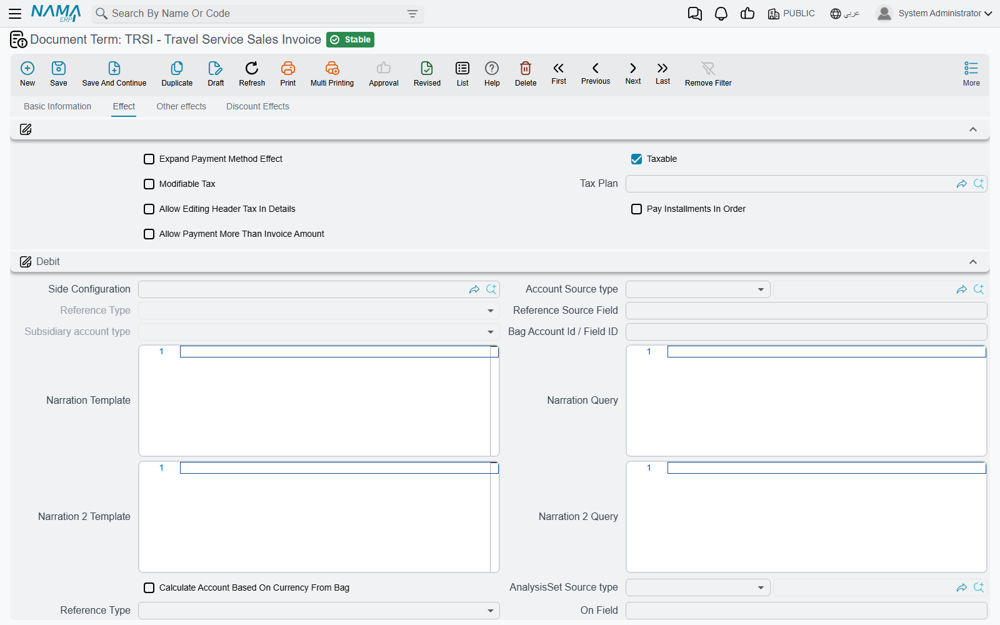
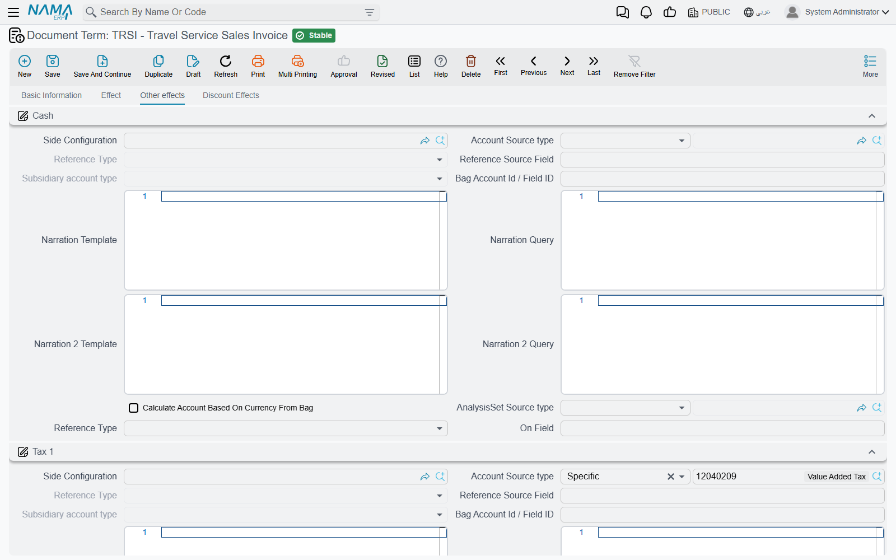
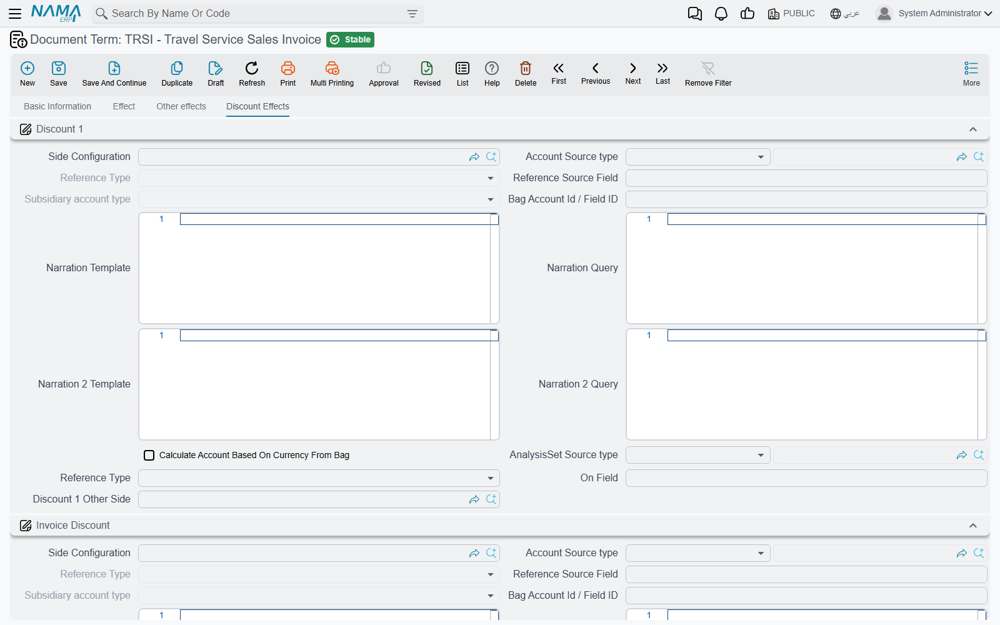
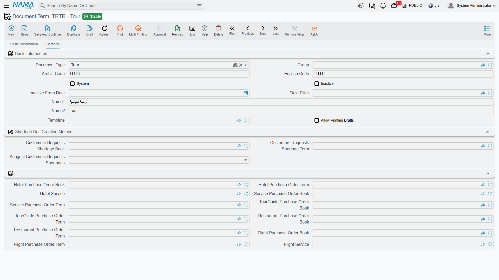

# Travel Document Terms

Open the Travel menu and you will find exactly two groups: **Master Files** and **Documents**. There
is no Settings screen, no configuration entry, nowhere to say "revenue from Nile cruises goes to
account 4102". That is not an oversight. In Travel — as everywhere else in Nama — that decision
lives on the **document term** (توجيه المستند), the field sitting right next to the document's book
on every travel document.

A Travel Service Sales Invoice knows a great deal: that it sold 40 seats on a Cairo–Luxor package to
Horizon Travel for 240,000, that 6,000 of that is discount and 33,600 is tax, that 40,000 came in on
a card. The one thing it does not know is which account any of those numbers belongs in, or how it
should behave. The term is the record that supplies both. Change the term and the same invoice
screen produces a completely different journal entry — which is precisely how one invoice screen
serves a Cairo branch and an Alexandria branch, a local-currency business and a foreign-currency
one, an inbound line and an outbound line, all at once.

Travel has just **two term shapes**:

- the **invoice term**, shared by all six financial documents — sales order, sales invoice, sales
  return, purchase order, purchase invoice and purchase return;
- the **tour term**, which configures nothing financial at all and exists only to drive the tour's
  purchase-order button.

## The invoice term

One term shape covers the whole [sales cycle](./travel-sales-cycle) and the whole
[purchase cycle](./travel-purchase-cycle). You will still create several terms — one per document
type at minimum, and usually one per branch or business line on top of that — but they all look the
same when you open them.

### An accounting side, once

Almost everything on the screen is an **accounting side**: one half of a journal entry pair. The
same block of fields appears dozens of times, so read it once here.

| Field | What it decides |
|---|---|
| Accounting Side | Whether this side is used at all, and how it behaves as a ledger side |
| Account Source type | Where the account comes from: a fixed account you name here, or a lookup that follows a reference on the document |
| Reference Type / Source Field | When the account follows the document — for example, read the account from the invoice's Customer, or from the Hotel named as Subsidiary on a purchase invoice |
| Subsidiary Account Type | Which kind of subsidiary (ذمة) the resulting ledger line is stamped with |
| Bag Account Id / Field ID | The account taken out of an account bag, for configurations built on bags |
| Calculate Account Based On Currency From Bag | Picks the bag account matching the line's currency and account type |
| Narration Template / Narration Query, Narration 2 Template / Narration 2 Query | The two description lines written on the ledger line — either a template with placeholders, or a query |
| AnalysisSet Source type, Analysis Set, Reference Type / On Field | Where the analysis set on the ledger line comes from — fixed, or read from a reference on the document |

That last group is the reason
[hotels, restaurants and tour guides carry their own accounts](./travel-master-files): a purchase
term does not name a fixed payable account, it says "read the account from whichever party is on the
document", and the Hotel, Restaurant or Tour Guide master file supplies it.

### The Effect tab — the two sides that carry the deal

The first tab holds the pair that does most of the work: **Debit** and **Credit**. Which business
meaning lands in which of the two follows the direction of the document, not your preference:

| Document | Debit group holds | Credit group holds |
|---|---|---|
| Travel Service Sales Order, Travel Service Sales Invoice | the **customer / receivable** account | the **revenue** account |
| Travel Service Sales Return | the **revenue** account | the **customer** account |
| Travel Service Purchase Order, Travel Service Purchase Invoice | the **cost / expense** account | the **supplier, hotel, restaurant or guide payable** account |
| Travel Service Purchase Return | the **payable** account | the **cost** account |

The two sides are also valued differently, and this surprises people. The party side (customer or
supplier) is booked at **what is still owed** — the line's net value minus cash taken at the
counter, minus the payment-method rows, minus any voucher row flagged not to affect the remaining.
The company side (revenue or cost) is booked at the line's **gross price, before discounts and
taxes**. That is deliberate: the discounts and the taxes each get their own pair of sides on the
other two tabs, so booking the gross price here keeps them from being counted twice.

Alongside Debit and Credit the tab carries a handful of switches:

| Option | What it does |
|---|---|
| **Shorten Ledger** | Merges identical ledger lines so one invoice with forty detail lines does not produce forty pairs of entries |
| **Tax Plan**, **Taxable**, **Modifiable Tax**, **Allow Editing Header Tax In Details** | The tax posture of the document — see below |
| **Expand Payment Method Effect** | Keeps the payment-method fee entries un-merged, so each method's fee is visible on its own ledger line |
| **Pay Installments In Order** | Forces instalments on the [Payments grid](./travel-payments-and-terms) to be settled oldest first |

::: info The term owns the tax settings, not the document
Tax Plan, Taxable, Modifiable Tax and Allow Editing Header Tax In Details all appear on the document
itself as well — and the term's values are copied onto the document **on every save**. If someone
tells you they keep switching a travel invoice to non-taxable and it keeps coming back taxable, the
answer is on the term, not on the invoice.
:::

The Effect tab closes with a **Service Fees** group: four pairs of debit and credit sides for
documents that carry service fees, each with a flag saying whether the fee is deducted, plus a
switch to skip the effect entirely when no account side has been configured for it.

### The Other Effects tab — cash and the four taxes

This tab is where the money that is not the deal itself gets its accounts.

- **Cash** — the account for money taken at the counter. It is also the fallback for payment-method
  rows: a card or wallet row books to the account named on its own **Payment Method** master file,
  and only falls back to this Cash side when the method names none.
- **Tax 1**, **Tax 2**, **Tax 3**, **Tax 4** — one group each, and each group carries both the tax
  side and its **other side**, the contra account the tax is booked against. On a sales document the
  tax lands on the credit side (output tax); on a purchase document it lands on the debit side
  (recoverable input tax). You configure the account; the direction takes care of itself.

### The Discount Effects tab — every discount level, plus the voucher rules

Travel documents carry eight line discount levels and a header discount, and each one gets its own
group here: **Discount 1** for the first line discount, **Invoice Discount** for the header
reduction, then **Discount 2** through **Discount 8**. As with the taxes, each group has its side
and its **other side**. On a sale a discount is a debit; on a purchase it is a credit.

At the bottom of the tab sits the **External Effects** grid — the one place on the term that is a
grid rather than a group. It gives payment and receipt vouchers landing in the document's
[Payment Documents grid](./travel-payments-and-terms) accounting of their own. Each row says: for
vouchers of *this type*, matching *these criteria* or *this query*, book *this debit* against *this
credit*. Leave the grid empty and the vouchers simply reduce the remaining without producing entries
of their own.

### The one consequence to remember

::: warning A side that is not defined produces nothing
The engine that builds the journal entry only builds the lines the term describes. A term with an
empty Debit and Credit produces a ledger transaction with **no lines at all** — the document
commits, it processes cleanly, no error appears anywhere, and nothing reaches the general ledger. A
term with taxes configured but no discount sides books the taxes and silently skips the discounts.

This is the single most common travel support call. A freshly created term is completely empty, so
**fill it in before the first live document is written against it**. When a document has already
been committed against an incomplete term, correct the term and then use the **Regenerate Accounting
Effects** action on the document — it re-issues the entry against the corrected configuration.
:::

### Give the orders their own terms

It is easy to assume that only invoices post. In Travel that is not so: the **Travel Service Sales
Order and the Travel Service Purchase Order carry a Term field and are processed exactly like the
invoices**, using the same term shape and the same engine. Point an order at the invoice's term and
the order will book a full receivable-and-revenue entry, and the invoice raised from it afterwards
will book it a second time.

So create separate terms for the two order documents. Most agencies want their orders to be purely
commercial documents — a booking confirmation, a supplier commitment — and an order term with its
Debit and Credit left empty gives exactly that: the order commits, carries prices, instalments and
contractual clauses, and books nothing. If instead you do want orders reflected in the ledger, give
them a term pointing at commitment accounts rather than the ones the invoice uses.

### What the invoice term does not hold

Compared with terms in other modules, this one is short — and the gaps are worth knowing:

- **No document book and no numbering rule.** Numbering comes from the document's book, exactly as
  for any other Nama document; see [Document Books](/platform/document-books).
- **No defaults.** The term sets no default customer, salesman, currency, tour service or price
  list. Whatever should be pre-filled has to come from the document book, the user's context, or
  from typing.
- **No linked-document generation.** The invoice term never creates another document. The only term
  in Travel that generates documents is the tour term, below.

## The tour term

A [Tour](./tours) carries no money at all. It records who travels, where they sleep, what they eat
and who guides them — and then, on the More menu, a single button called **Create Tourism Service
Purchase Orders** turns all of that into supplier paperwork. The tour term exists to tell that
button what to create.

It has no accounting sides, no tax settings and no numbering. It holds five book-and-term pairs and
two services:

| Setting | What it is for |
|---|---|
| **Hotel Purchase Order Book** / **Hotel Purchase Order Term** | The book and term used for the orders built from the tour's accommodation lines, one per hotel |
| **Hotel Service** | The Tour Service that stands for accommodation on those order lines |
| **Flight Purchase Order Book** / **Flight Purchase Order Term** | The book and term for the orders built from the flight lines, one per supplier |
| **Flight Service** | The Tour Service that stands for a flight on those order lines |
| **Service Purchase Order Book** / **Service Purchase Order Term** | The book and term for orders built from the service lines, grouped by supplier |
| **TourGuide Purchase Order Book** / **TourGuide Purchase Order Term** | The book and term for orders built from the service lines, grouped by tour guide |
| **Restaurant Purchase Order Book** / **Restaurant Purchase Order Term** | The book and term for orders built from the service lines, grouped by restaurant |

The button makes five passes, one per row group above, and **a pass whose book and term are both
empty is skipped entirely**. That is the control you have over what gets generated: an agency that
buys hotels and flights but settles guides on petty cash simply leaves the guide pair empty, and no
guide orders appear.

The two service fields are just as load-bearing. Accommodation lines and flight lines on a tour name
a hotel and an airline, but they do not name a Tour Service — so the hotel pass and the flight pass
take theirs from **Hotel Service** and **Flight Service** on the term. Leave either one empty and
that pass produces nothing, even with its book and term filled in, because every candidate line is
dropped for having no service. Pick something meaningful and generic, such as a Tour Service called
*Accommodation* and one called *Air Ticket*.

::: tip Fill the tour term before the first tour
Three things have to be in place before the button will produce anything. The tour needs a term at
all — without one the button refuses to run and says so. The pairs for the kinds of order you want
must be filled. And Hotel Service and Flight Service must be set if you want accommodation and
flight orders. Since the generated orders are created and committed straight away, the purchase
order terms you name here also need their own accounts configured, or the orders will process
silently and book nothing.
:::

The book and term pickers only offer books and terms belonging to the Travel Service Purchase Order,
and only ones that are still active, so there is little room to mis-select. The tour term screen also
inherits a platform group about shortage document creation that Travel does not use — leave it empty.

What happens after the button runs — how orders are grouped, priced and re-generated — is covered on
the [Tours](./tours) page.
