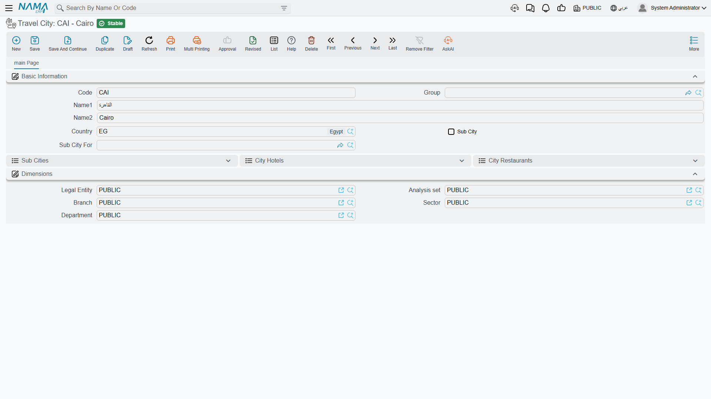
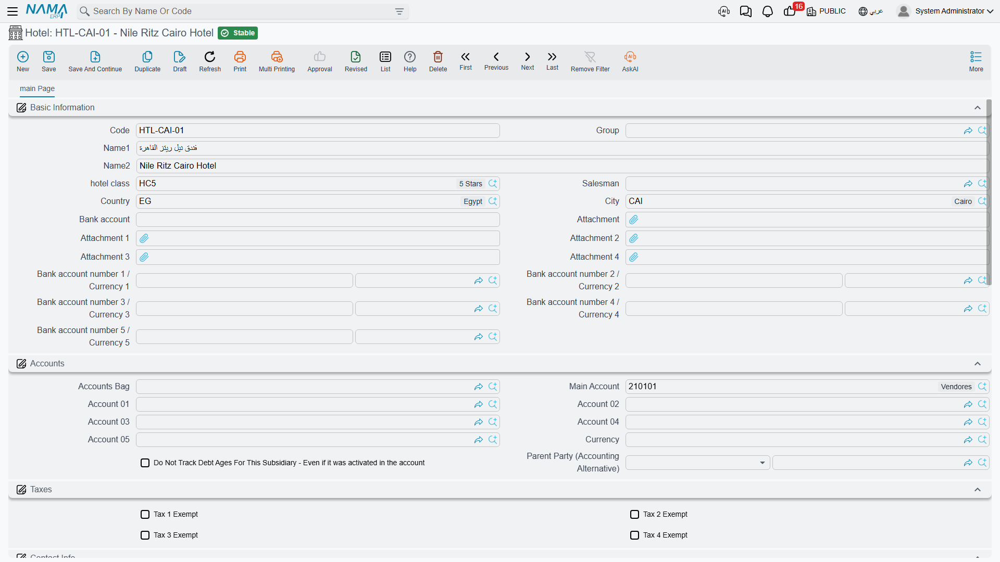
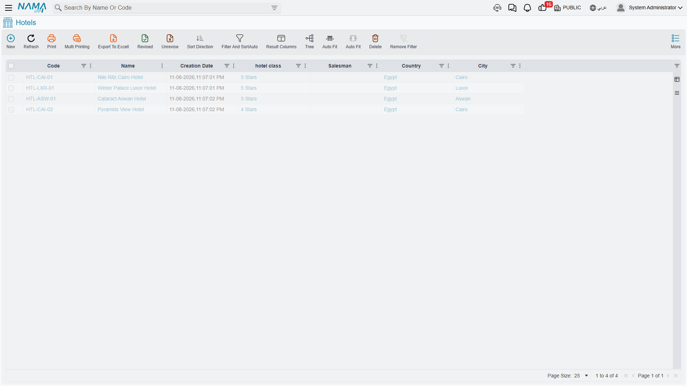
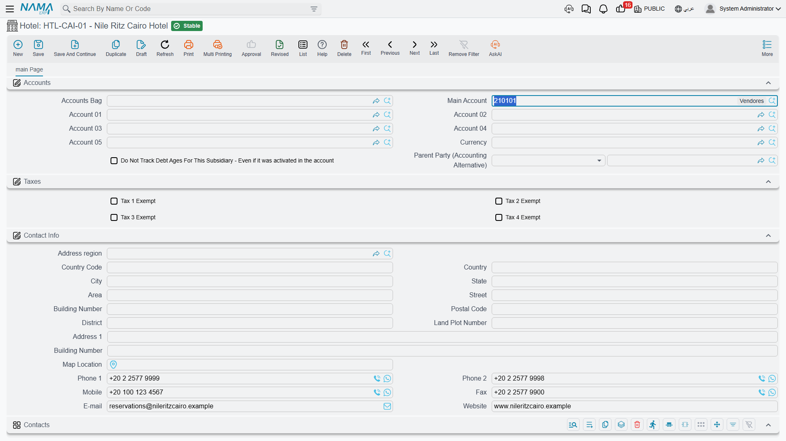
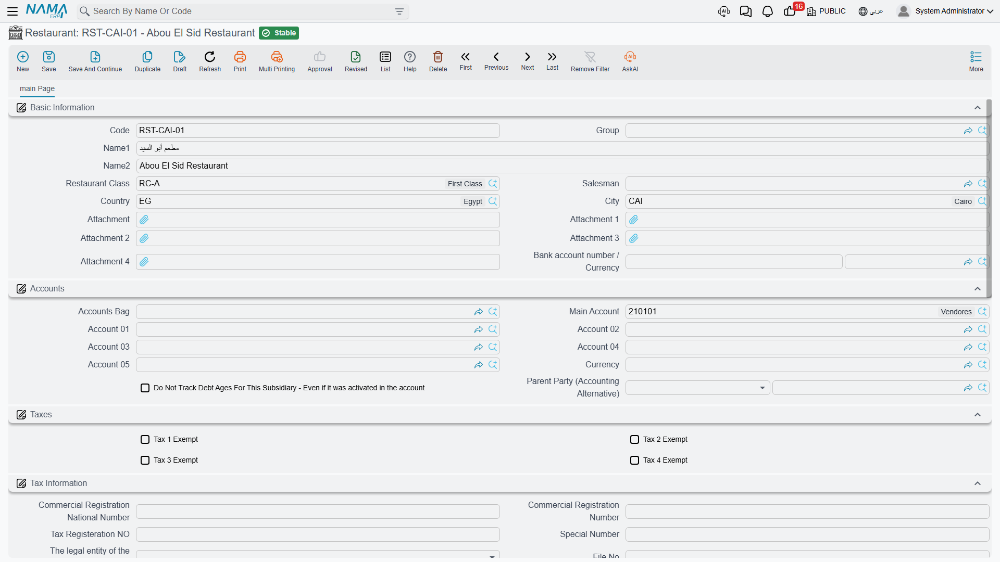
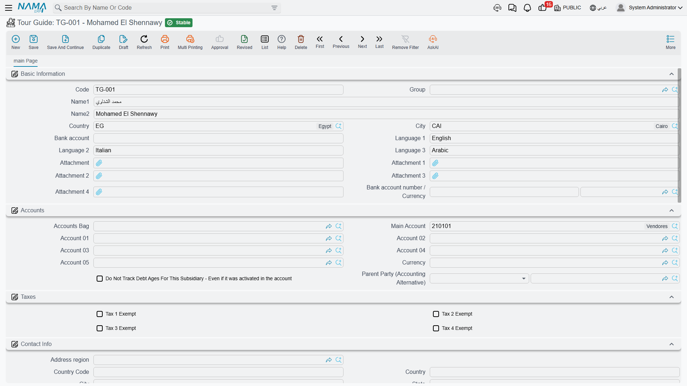
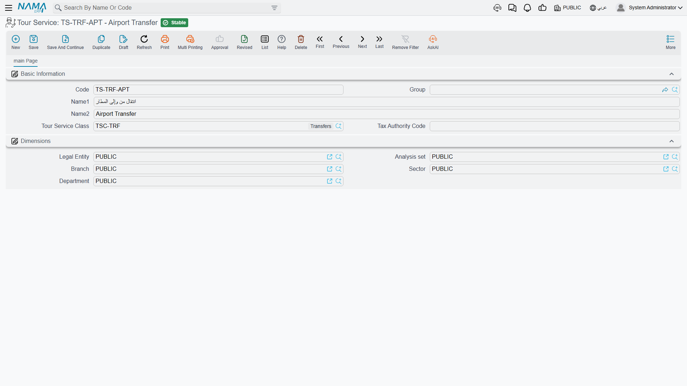

# Travel Master Files

A travel agency does not sell shirts out of a warehouse. It sells five nights in a hotel in Luxor,
a coach transfer from Cairo airport at 04:30, a licensed guide who speaks German, and lunch for
forty people at a restaurant in Giza. Before anyone can plan a tour, print a voucher or raise an
invoice, the system has to know that those hotels, restaurants, guides and services exist — and,
just as importantly, it has to know **who you owe money to** once the group has gone home.

That is the job of the **Master Files** group under the **Travel** menu. Everything in it is
reference data: nothing here creates an accounting entry, nothing moves stock, and saving any of
these records has no effect on your ledger. But every document in the module is built out of these
records, so the quality of your master files decides how much typing — and how much correcting —
you will do later.

## The order to build them in

The travel master files form a short chain of dependencies, so setting up a new agency goes fastest
if you work down it in this order:

1. **Travel Country** — the countries you operate in. Nothing depends on anything else, so start here.
2. **Travel City** — every city belongs to a country, so the countries have to exist first.
3. **Hotel Class**, **Restaurant Class**, **Tour Service Class** — three tiny lookup lists
   (5-star, 4-star; seafood, oriental; transfers, entrance tickets). They take a minute each and they
   make the hotel, restaurant and service screens much easier to fill in.
4. **Hotel**, **Restaurant**, **Tour Guide** — the parties you buy from. Each one needs a country, a
   city, a class, and its own set of accounts.
5. **Tour Service** — the things you actually sell and buy. Every invoice line in the module points
   at one of these.

Once that is done you can move on to [Tour Programs](./tour-programs), which are the reusable
itinerary templates, and from there to the [tours](./tours) you actually operate.

::: info Where Tour Program sits
**Tour Program** appears in the Master Files menu group alongside the records described here, but it
behaves like a planning document rather than a simple lookup — it carries a status, day-by-day
itinerary lines, accommodation lines and service lines. It has its own page:
[Tour Programs](./tour-programs).
:::

## What every travel master file has in common

Whatever record you open, the top block looks the same:

| Field | What it holds |
|---|---|
| Code | The record's identifier. If the group you pick has auto-coding parameters, the code is built for you and has to match them. |
| Group | The master group this record belongs to. It must be a group defined **for this record type** — a hotel group cannot be used on a restaurant — and it must be a leaf group, not a parent. If no code generator is configured, the group becomes required. |
| Name1 | The Arabic name. |
| Name2 | The English name. |

At the bottom of every screen there is a **Dimensions** block — legal entity, analysis set, branch,
sector and department — which controls who can see and use the record, exactly as it does everywhere
else in Nama.

## Travel Country and Travel City

### Travel Country

A **Travel Country** is nothing more than a name and a code: Egypt, Jordan, Saudi Arabia, Türkiye.
Its value is what hangs off it. Open a country and, below the basic information, you get three
read-only lists that fill themselves in as you build the rest of the module:

- **Cities** — every travel city recorded under this country, with its code, whether it is a
  sub-city, and which city it is a part of.
- **Country Hotels** — every hotel in the country, with its city.
- **Country Restaurants** — the same for restaurants.

So the country record doubles as a dashboard: open Egypt and you can see at a glance the eleven
cities, sixty hotels and fourteen restaurants you have on file there, without running a single
report.

Saving a country does nothing else at all — there are no validations to satisfy and no effects to
wait for.

### Travel City

A **Travel City** is a city inside one travel country. Cairo, Giza, Luxor, Aswan, Sharm El-Sheikh.
Beyond the usual code and names it carries three fields:

| Field | What it holds |
|---|---|
| Country | The travel country this city belongs to. |
| Sub City | Tick this when the record is a district or a resort area rather than a city in its own right. |
| Sub City For | The parent city. Required as soon as **Sub City** is ticked. |

Sub-cities are what let you be precise where precision matters. Sharm El-Sheikh is a city; Naama Bay
and Nabq Bay are sub-cities of it. Cairo is a city; Heliopolis, Nasr City and Zamalek are sub-cities
of it. A hotel can then be recorded in Naama Bay rather than vaguely "in Sharm", which is exactly
what the driver doing the airport transfer needs to know.

Two rules are enforced when you save:

- If **Sub City** is ticked, **Sub City For** must be filled in.
- The parent city in **Sub City For** must belong to the **same country** as the city you are saving.
  If it does not, the save is refused with a message telling you that the city must be in that
  country.

The same country rule reappears on hotels, restaurants and guides, and the system helps you obey it:
whenever you pick a country first, the city picker only offers cities of that country. And it works
in the other direction too — pick a city and the system writes its country back into the Country
field for you.

::: info Travel geography is not the address country
Nama's ordinary address block — the one you see under **Contact Info** on a hotel, and on customers,
suppliers and everything else — stores its country and city as **free text**. Anyone can type
"Cairo", "CAIRO" or "Le Caire" into it, and nothing checks the spelling.

**Travel Country** and **Travel City** are a different thing entirely: a controlled list that only
exists inside the Travel module. They are what the module filters by, groups by and validates
against. So on a hotel screen you will see a Country and a City twice — once in **Basic Information**
(the travel geography, chosen from a list) and once inside the postal address under **Contact Info**
(free text, part of the mailing address). Fill in the travel country and city carefully; that is the
pair the module actually uses.
:::

## Hotel Class and Hotel

### Hotel Class

**Hotel Class** is a plain lookup list — 5-star, 4-star, boutique, Nile cruiser — with nothing but a
code, a group and the two names. It exists so you can classify hotels and filter the hotel list by
star rating.

### Hotel

A **Hotel** record is the biggest master file in the module, and it does two jobs at once.

The first job is the obvious one: it describes a property you book rooms in.

| Field | What it holds |
|---|---|
| Hotel Class | The star rating or category, from the Hotel Class list. |
| Country | The travel country the hotel is in. |
| City | The travel city (or sub-city) the hotel is in. Must belong to the chosen country. |
| Salesman | An employee reference, also available as a filter on the hotel list. |
| Bank account | A free-text bank account. |
| Bank account number 1–5 / Currency 1–5 | Up to five bank accounts, each with its own currency — useful for a hotel that takes Egyptian pounds locally and US dollars from foreign operators. |
| Attachment 1–5 | Five attachment slots for the contract, the rate sheet, the licence, and so on. |

Below that comes a **Contact Info** block — the full postal address plus two telephone numbers,
a mobile, a fax, an email and a website — and a **Tax Information** block holding the hotel's
commercial registration number, tax registration number and related identifiers, for agencies that
run with sales tax enabled.

Then there is a **Contacts** grid, which is where the day-to-day reality of hotel bookings lives. The
Contact Info block holds one switchboard number for the property; the Contacts grid holds the actual
people you deal with:

| Column | What it holds |
|---|---|
| Name | The person's name. |
| Job Title | Reservations manager, accountant, front-office manager. |
| Mobile | Their mobile number. |
| Phone | Their direct line. |
| Fax | Their fax number. |
| Email | Their email address. |
| Address | Their address. |

Add one line for the reservations manager you send rooming lists to and another for the accountant
who chases your payments, and nobody has to hunt through old emails when a group is arriving
tomorrow.

The only rule enforced when you save a hotel is the country/city one: the city has to belong to the
selected country. Saving creates no accounting entries and no inventory movement — the hotel is
reference data, and the accounts on it are consumed later by the documents that name it.

### A hotel is an account party in its own right

This is the single most important idea in the whole Travel module, and it is what makes it different
from the rest of Nama.

In supply chain, if you buy something from a company, that company is a **Supplier**. Here, if you
buy room nights from a hotel, **the hotel itself is the party** — there is no Supplier record behind
it, and you do not need to create one. The hotel record carries its own accounting block:

| Field | What it means |
|---|---|
| Accounts Bag | A ready-made bundle of accounts applied to this hotel, so you do not have to set each account by hand. |
| Main Account | The account the hotel's balance lives under. This is the account that carries what you owe the property. |
| Account 01 – Account 05 | Five further accounts the document terms can reach for — advance payments, retentions, a separate account per branch, and so on. |
| Currency | The currency the hotel deals in. |
| Do Not Track Debt Ages For This Subsidiary | Excludes this hotel from debt-ageing analysis. |
| Parent Party (Accounting Alternative) | Another party that stands in for this one in the ledger. Useful for a chain: you book rooms with three individual properties but settle a single account with the head office. |

There is also a **Taxes** block with four exemption flags, for hotels that are not subject to one or
more of your tax types.

What does that mean in practice?

- **You owe the hotel money directly.** When a travel purchase invoice for the hotel is processed,
  the credit lands on that hotel's main account. There is no intermediate supplier.
- **The hotel's balance is a real balance in your ledger.** Wherever an accounting screen or report
  asks you to pick a party — an account statement, a payment voucher, an ageing analysis — a hotel
  can be picked, exactly like a customer, a supplier, an employee or a bank account.
- **The hotel is what you choose as the party on a travel purchase document.** On a
  [Travel Service Purchase Order or Purchase Invoice](./travel-purchase-cycle), the party you name is
  the hotel itself. The same is true line by line, so one purchase invoice can carry lines for
  different parties.
- **You pay the hotel like any other creditor**, from the ordinary payment screens, against that same
  main account.

::: tip One record, not two
Because the hotel *is* the party, there is nothing to keep in sync. Create the hotel once, give it a
main account and a currency, and it is immediately ready to be booked on a tour, printed on a
voucher, ordered from, invoiced by, and paid.
:::

Flights and other outsourced services are the exception: those genuinely do go through ordinary
**Supplier** records, because an airline or a coach company is not a hotel, a restaurant or a guide.
See [Buying from Suppliers](./travel-purchase-cycle) for how the two live side by side on the same
document.

## Restaurant Class and Restaurant

**Restaurant Class** is the same kind of small lookup list as Hotel Class — seafood, oriental,
international, Nile-boat dining — with a code, a group and the two names.

A **Restaurant** record has the same shape as a hotel and plays exactly the same role, only for meals
instead of rooms. It carries its class, country, city, salesman, five attachment slots, one bank
account number with its currency, the full Contact Info block, the Contacts grid of named people, and
the Tax Information block.

And, crucially, it carries the **same accounting block** — accounts bag, main account, accounts 01 to
05, currency, debt-age flag, parent party, and the four tax exemption flags. A restaurant is an
account party in its own right in precisely the way a hotel is: you owe the restaurant directly, its
balance is a real balance, and it is what you name as the party on a travel purchase document for
meals. No Supplier record is involved.

The one rule enforced on save is the familiar one: the city must belong to the selected country.

## Tour Guide

A **Tour Guide** is the licensed guide who meets your group at the airport and walks them through the
Egyptian Museum. Guides are usually freelancers you pay per day, and the module treats them the same
way it treats hotels and restaurants.

The basic information holds the code, group and names, plus:

| Field | What it holds |
|---|---|
| Country | The travel country the guide works in. |
| City | The travel city. Must belong to the chosen country. |
| Language 1, 2, 3 | The languages the guide works in. These are free text, so type them consistently — "German", not sometimes "German" and sometimes "Deutsch" — if you want to search on them reliably. |
| Bank account | A free-text bank account. |
| Bank account number / Currency | The guide's bank account and its currency. |
| Attachment 1–5 | Five attachment slots, typically for the guide's licence and identity documents. |

Below that sit the same blocks as on a hotel: **Accounts** (accounts bag, main account, accounts 01
to 05, currency, debt-age flag, parent party), **Taxes**, **Contact Info**, the **Contacts** grid of
named people, **Tax Information**, and **Dimensions**.

So a tour guide, too, is an account party. Assign a guide to a tour day, and the purchase order the
tour generates for guiding is raised **against that guide**, whose balance you then settle directly.
Nothing about the guide passes through a supplier record.

## Tour Service Class and Tour Service

### Tour Service Class

**Tour Service Class** is the third of the small lookup lists: transfers, entrance tickets, guiding,
meals, accommodation, flights, extras. It groups tour services so the service list stays navigable
once you have two hundred of them.

### Tour Service

A **Tour Service** is the unit the entire module trades in. Every travel invoice line — sales *and*
purchase — sells or buys exactly one tour service. It is the smallest thing you can put a price on.

The screen is deliberately short:

| Field | What it holds |
|---|---|
| Code | The service's identifier. |
| Group | Its master group. |
| Name1 / Name2 | Arabic and English names. |
| Tour Service Class | Which of your service categories it belongs to. |
| Tax Authority Code | The code the tax authority expects for this service on an electronic invoice. |

Concrete examples of what a tour service record looks like in a real agency:

- **Airport transfer, Cairo — arrival, up to 15 pax** (class: Transfers)
- **Half-day city tour — Islamic Cairo, with guide** (class: Guided tours)
- **Egyptian Museum entrance ticket — adult** (class: Entrance tickets)
- **Single-room supplement, per night** (class: Accommodation)
- **Lunch, set menu, per person** (class: Meals)
- **Domestic flight — Cairo to Luxor, economy** (class: Flights)

::: warning A tour service is not an inventory item
This is worth being blunt about. A tour service looks a little like an item on an invoice line —
it has a name, a code and a quantity — but it is **not** an item, and the Travel module never touches
inventory at any point:

- there is **no warehouse** on a tour service or on any travel document line;
- there is **no quantity on hand**, no stock balance and no reorder level;
- nothing is issued, received, reserved or costed;
- a travel invoice produces **no inventory transaction** — only its accounting effect.

You can create a tour service called "Single-room supplement" and sell it four hundred times in a
month without any stock figure moving anywhere, because there is no stock. What the quantity on a
travel invoice line means is simply "how many of this service" — 40 transfers, 65 room-nights,
40 lunches — never "how many units out of the store".
:::

For electronic invoicing, the tour service behaves as the item: it supplies its own tax authority
code, and where the code is defined at group level, the service's group supplies it.

## Statuses and situation lists

Two short pick-lists show up on the planning side of the module, so it is worth knowing them while
you are still setting up.

**Status** appears on both [Tour Programs](./tour-programs) and [Tours](./tours), and tells you where
the trip stands:

| Value | Meaning |
|---|---|
| Initial | Drafted, not yet running. |
| In Progress | Currently being operated. |
| Finished | Completed. |
| Canceled | Called off. |

**Situation** appears on the accommodation lines and the flight lines of a tour program and a tour,
and offers three short booking markers:

| Value |
|---|
| OK |
| RQ |
| WL |

These are the standard shorthand a reservations desk writes next to a booking line. The system stores
whatever you pick and shows it back to you, but it does not act on the value — nothing is blocked,
released or recalculated because a line says RQ instead of OK. Treat the column as a note to the
operations team, and settle on one house meaning for each code so everyone reads it the same way.

## What you will not find here

There is **no Settings screen for the Travel module**. If you go looking for one under the Travel
menu you will not find it, and that is by design: the menu has exactly two groups, **Master Files**
and **Documents**, and nothing else. The whole module is unlocked by a single licence — there are no
separate licences for hotels, tours or invoicing — so there is nothing to switch on either.

The configuration that other modules put on a settings screen lives instead in **document terms**.
That is where you decide which books and terms the generated purchase orders use, which accounts an
invoice hits, how taxes and discounts are computed, and which tour service stands in for
accommodation and flight lines when a tour generates its purchase orders. If a behaviour in the
module is not explained by a master file, it is explained by a document term — see
[Document Terms](./travel-document-terms).
