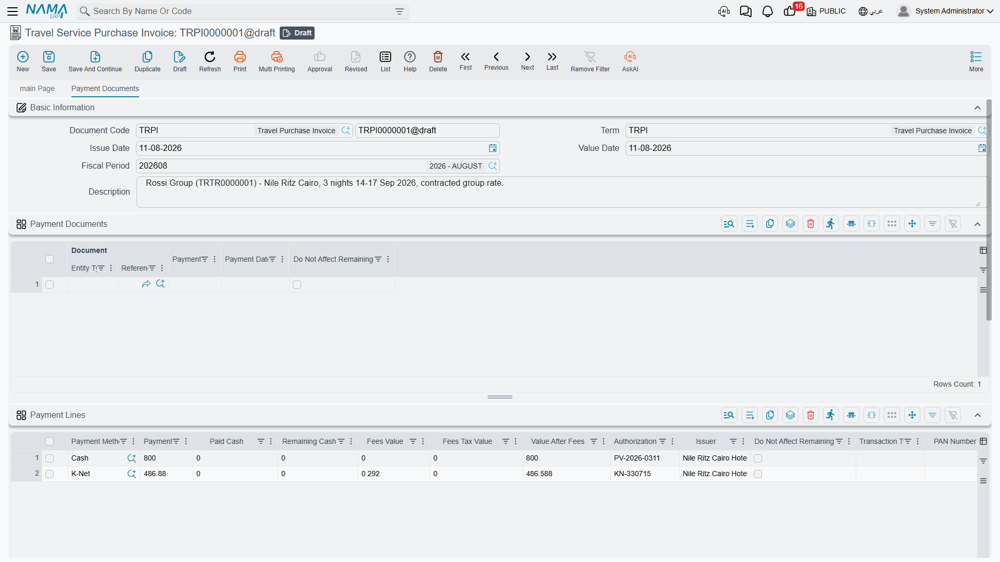
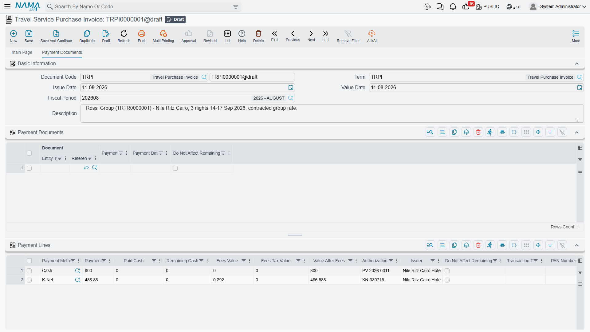

# Payments, Instalments & Contract Terms

A travel agency almost never gets paid the way a shop does. A corporate agent books a 40-pax
Cairo–Luxor package worth 240,000, hands over a 40,000 card payment at the counter as a deposit,
signs a contract saying the balance is due in four monthly instalments, and then pays each of those
instalments by bank transfer weeks later — each transfer arriving as a separate receipt voucher.
One invoice, four different money stories.

That is why every travel financial document carries four grids that have nothing to do with what is
being sold and everything to do with how it gets paid for. They sit on the document's second page,
**Payment Documents** / سندات الدفع, underneath the Details grid, and they are identical on all six
documents — [Travel Service Sales Order, Sales Invoice and Sales Return](./travel-sales-cycle) and
[Travel Service Purchase Order, Purchase Invoice and Purchase Return](./travel-purchase-cycle).
Rather than repeat them on both cycle pages, they are explained here once.

## The four grids at a glance

| Grid | What it records | Who fills it | Where it appears |
|---|---|---|---|
| **Payment Lines** | Money settled on the spot, split by payment method | You, at the counter | Invoices and returns only |
| **Payment Documents** | Receipt and payment vouchers raised separately against this document | The system | All six documents |
| **Payments** | The instalment plan — what is promised, and when | You, usually via a button | All six documents |
| **Standard Terms** | The contractual clauses of the deal | You | All six documents |

Note the first row carefully: **the two order documents have no Payment Lines grid at all.** An
order can carry an instalment plan, contractual clauses and a trail of vouchers, but you cannot take
cash on an order — for that you need the invoice.

## Payment Lines — money changing hands right now

This is the counter grid. One row per payment method used, so a customer settling 40,000 half in
cash and half on a card produces two rows, and a customer paying nothing today produces none.

| Column | What it is for |
|---|---|
| **Payment Method** | The method master file — cash drawer, a specific card terminal, a wallet, a cheque type. This is the only required column |
| **Payment Value** | How much came in through that method |
| **Paid Cash** / **Remaining Cash** | What the customer physically handed over and the change given back — cash rows only |
| **Fees Value**, **Fees Tax Value**, **Value After Fees** | The merchant fee the payment method charges you, its tax, and what is left afterwards |
| **Authorization Number** | The approval code from the terminal or the bank |
| **Issuer** | Who issued the instrument — the card-issuing bank, the cheque's bank |
| **Transaction Type** | The kind of operation the terminal performed |
| **Do Not Affect Remaining** | Records the payment without letting it reduce the document's Remaining |

::: info Card payments carry a terminal footprint
When the payment method is a card terminal, the row also carries the details echoed back by the
terminal: the card type and the masked card number, the terminal, merchant and scheme identifiers,
the transaction and card numbers, the ECR reference and the terminal's raw response.
On an integrated terminal these arrive by themselves when the card is approved. They are there so
that a support person reconciling a disputed 40,000 charge against the bank's settlement file can
find the exact transaction from the invoice alone.
:::

**What a payment row does.** It reduces the document's *Total Paid* and *Remaining* immediately, and
when the document is processed it produces its own accounting line. The account for that line comes
from the **Payment Method** master file first; only when the method names no account of its own does
the document term's Cash side stand in. Fees and fee tax produce their own lines from the payment
method as well. This matters when a new payment method appears in a branch and its entries land
somewhere unexpected — the method, not the term, is usually the place to look.

**What it does not do.** It has no effect on the instalment plan below it. Paying 40,000 at the
counter does not mark any instalment as settled; it only lowers the Remaining that the instalment
plan has to add up to.

Two small helpers on the toolbar save typing when the customer is settling in full:
**Copy Remaining To First Cash Payment Method Line** and **Copy To First Cash Line** push the
outstanding amount into the first cash row for you.

Where a payment method demands an authorization number, saving without one is rejected. Paid and
remaining cash are recalculated for you on every save, and a document can never be committed with a
negative Remaining, negative Cash Paid or negative change.

## Payment Documents — the voucher trail the system keeps for you

The second grid looks like something you fill in. It is not. **Read it; do not type in it.**

When someone raises a Receipt Voucher in the accounting module and points it at a Travel Service
Sales Invoice, committing that voucher adds a row here by itself, converting the voucher's amount
into the invoice's currency. Change the voucher and the row is revalued; cancel or unlink it and the
row disappears. Four columns tell the whole story: the **Document** (the voucher itself, which you
can open from the cell), the **Value**, the **Payment Date**, and **Do Not Affect Remaining** for
the rare voucher that should be recorded against the invoice without reducing what is owed.

Which kind of voucher a document listens to follows the direction of the money:

| Document | Settled by |
|---|---|
| Travel Service Sales Order, Travel Service Sales Invoice, Travel Service Purchase Return | **Receipt** vouchers — money coming in |
| Travel Service Purchase Order, Travel Service Purchase Invoice, Travel Service Sales Return | **Payment** vouchers — money going out |

If a party has open vouchers that have not been matched to anything yet, the toolbar actions
**Collect Receipt Vouchers** and **Collect Payment Vouchers** pull them into this grid for you
rather than making you go voucher by voucher.

Like payment lines, these rows lower *Total Paid* and *Remaining*. Unlike payment lines, they can
also carry accounting of their own: the document term has an **External Effects** grid where you can
say "a voucher of this type, matching these criteria, books to these two accounts" — see
[Document Terms](./travel-document-terms).

If you want the full picture of how vouchers are raised and matched in the first place, the
accounting module's [Receipts and Payments](/modules/accounting/receipts-and-payments) page covers
that side.

## Payments — the instalment plan

The third grid is the payment schedule: the promise. Our 40,000-deposit customer owes 200,000, and
the contract says four monthly instalments of 50,000 starting the first of next month. Those four
lines are what this grid holds.

You rarely type them. Above the grid sits the **Payment Template** field, where you pick a
[Payment Schedule Template](/modules/invoicing/payment-schedules-user-guide) — a reusable pattern
such as "deposit now, remainder over four months". Then the **Generate Payments** button on the
document's first page builds the rows: it asks for the down payment, how many instalments you want,
the period between them, any grace period before the first one, the day of the month payments fall
on, specific values for the first, second and last instalment if they differ, and how to round. It
then spreads the document's **Remaining** across the rows it creates and writes the down payment
back into **Cash Paid** on the header.

Each row carries:

| Column | Filled by |
|---|---|
| **Instalment Code** | You or the generator — required, and the codes must be unique on the document. A missing code is filled in automatically on save |
| **Selection**, **Instalment Description**, **Remarks** | You |
| **Payment Percentage** and **Value** | The generator, or you |
| **Payment Date** | The generator, or you — required |
| **Paid Value**, **Collected by System**, **Remaining**, **Paid** | The system, as vouchers settle the instalment |

::: warning A schedule is a plan, not a settlement
Creating instalment rows collects nothing and books nothing. The grid produces no journal entry of
its own — no receivable is split, no revenue is deferred, nothing is scheduled to happen on a date.
It is a written promise plus a set of targets that payment vouchers can later be matched against,
which is what fills the Paid Value, Collected by System, Remaining and Paid columns.
:::

Because the plan and the money must agree, the document will not commit unless the schedule
reconciles with the document's Remaining plus whatever the vouchers have already covered. If you
change a price after generating the schedule, run **Generate Payments** again — otherwise the two
numbers drift apart and the save is rejected.

One term option changes how the plan behaves once vouchers start arriving: **Pay Installments In
Order** forces instalments to be settled oldest first, so a customer cannot pay the fourth
instalment while the second is still open.

## Standard Terms — the clauses of the contract

The last grid is not about money at all. It is the contract's small print: the cancellation window,
the visa-documents deadline, the rooming-list cut-off, the penalty for a late name change. Each row
points at a **Standard Term** master file where the wording lives, so the same clause can be
attached to hundreds of contracts and printed identically on all of them.

| Column | What it is for |
|---|---|
| **Standard Term** | The clause being attached |
| **Planned Term End Date** | The date by which the clause must be satisfied |
| **Extended Term End Date** | The revised date, once an extension has been granted — maintained by the system |
| **Fulfilment Date** | When the clause was actually satisfied — maintained by the system |
| **Total Extension Fines** | Fines accumulated for extending it — maintained by the system |
| **Remarks** | Anything specific to this contract |

The Standard Term master file decides whether the clause is one that has to be formally satisfied at
all, whether it may be extended, and how long the initial work period runs. When a clause does
require fulfilment, satisfying it is a separate act: a **Standard Term Fulfilment** document is
raised against the clause, and the system writes the fulfilment date and the document reference back
into the row. The general mechanism is described in
[Standard Terms and Conditions](/modules/invoicing/standard-terms-feature-documentation).

These lines are contractual bookkeeping only — **they book nothing**. A clause that has been
breached does not create a fine entry by itself; the fine, if any, is a separate document.

## How the four grids meet the header totals

All of this converges on three header figures. **Cash Paid** is what the header itself records as
settled; **Total Paid** adds the payment lines and the voucher rows on top of it; and
**Remaining** is the net value minus everything that counted. Rows flagged *Do Not Affect
Remaining*, on either payment grid, are deliberately left out of that subtraction — they are
recorded for the audit trail without changing what is owed.

The instalment grid sits outside that arithmetic entirely. It has to *agree* with Remaining, but it
never changes it.

Back to the cycles these documents belong to: [Selling to the Client](./travel-sales-cycle) and
[Buying from Suppliers](./travel-purchase-cycle). For the accounts each of these grids ends up
touching, see [Document Terms](./travel-document-terms).
