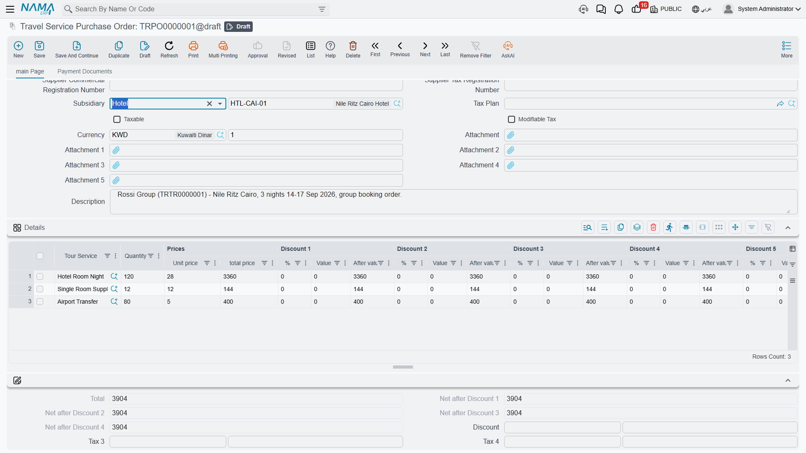
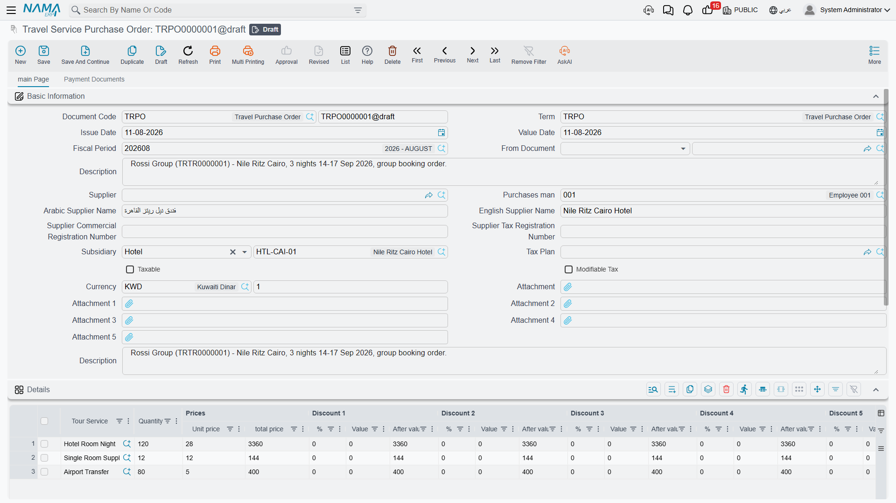
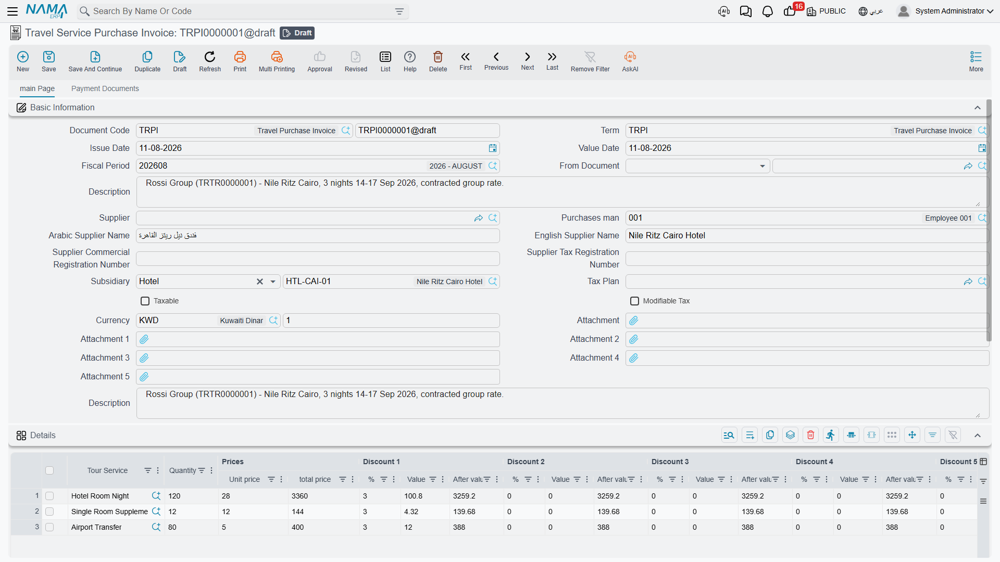
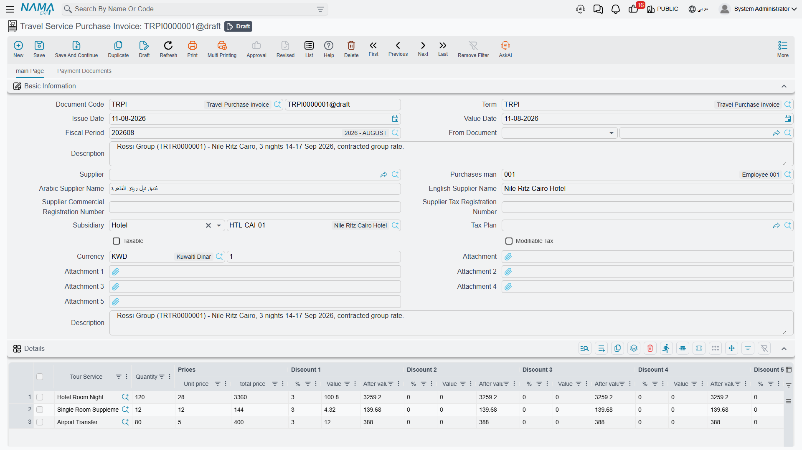

# Buying from Suppliers

A tour costs money long before it earns any. A 40-pax group arriving in Cairo for five nights needs
200 room-nights at a hotel, 40 return flight seats, five days of a tour guide, a dozen restaurant
meals and a coach for every transfer. Somebody has to buy all of that, agree a price for it, and end
up owing the right amount to the right party.

That is what the purchase side of the Travel module is for. Three documents cover it, all under
**Travel → Documents**:

- **Travel Service Purchase Order** — what you have committed to buy.
- **Travel Service Purchase Invoice** — what you have been billed for and now owe.
- **Travel Service Purchase Return** — a service handed back or a booked cost cancelled.

## The one idea to understand first

Everything you buy in this module is a **tour service**. There is no hotel field on a purchase line,
no flight field, no room-night field, no link to a voucher. A purchase line has exactly one "what am
I buying" reference, and it is the **Tour Service** master file.

So how does the system know you bought nights from the Nile Hotel rather than from anyone else? From
the **party** on the line. Hotels, restaurants and tour guides in Nama are not suppliers — they
*replace* suppliers. Each one is its own master file carrying its own accounts, and each one is used
directly as the account party on a purchase document, exactly where a supplier would normally sit.
Flights and generic services, where the counterparty really is a travel wholesaler or a transport
company, use an ordinary Supplier record instead. The account-party idea is explained in full on
[Master Files](./travel-master-files).

Put the two together and every cost you can think of becomes one line:

| What you actually bought | Tour Service | Quantity | Party |
|---|---|---|---|
| 200 room-nights at the Nile Hotel | Hotel Accommodation | 200 | Nile Hotel |
| 40 return seats, Cairo–Luxor | Domestic Flight | 40 | Sky Travel Ltd (supplier) |
| 5 days of a guide | Tour Guiding | 5 | Ahmed Fouad (tour guide) |
| 12 lunches at El Nil Restaurant | Group Lunch | 12 | El Nil Restaurant |
| 6 airport transfers | Airport Transfer | 6 | Cairo Coaches (supplier) |

Read a line as a sentence: *tour service = accommodation, quantity 200, party = Nile Hotel*. That is
the whole model.

Two consequences follow from it and are worth knowing early. First, the **tax policy of a line comes
from the Tour Service** you picked, not from the party and not from the header — so a service that is
zero-rated stays zero-rated whoever you buy it from. Second, when a document term takes its cost
account "from the item", the item in question **is** the Tour Service, so the accounts on the Tour
Service master file are what decide which expense account the purchase lands in. Setting your tour
services up thoughtfully is what makes the accounting come out right.

::: info Nothing here touches a warehouse
The travel purchase cycle creates **no inventory movement of any kind**. There is no goods receipt,
no stock balance, no warehouse or location on a line, no item costing and no valuation. A tour
service is not an item on a shelf — buying 200 room-nights raises a cost and a liability, and that
is all it does. If you are used to the supply-chain purchase cycle, this is the biggest difference:
here the invoice is the only thing that matters, because there is nothing to receive.
:::

## Travel Service Purchase Order

The order is where a commitment gets recorded: you have blocked 200 room-nights with the Nile Hotel
for the March group at an agreed rate, and you want that on file before the invoice arrives.

The header carries the usual document identity — document book and code, **Term**, issue date, value
date and fiscal period — plus the buying side: **Supplier**, **Purchases man**, and the supplier's
Arabic and English names, commercial registration number and tax registration number, which fill in
for you once the supplier is chosen. Next to them sits **Subsidiary**, the account party for the
whole document; this is where a hotel, a restaurant or a tour guide goes when the counterparty is not
a supplier at all. **From Document** links the order to whatever it came from. Tax handling is set by
**Tax Plan**, **Taxable** and **Modifiable Tax**, the money is expressed in the header **Currency**
and **Currency Rate**, and there are five attachment slots and a description field.

Below the header, a money block totals the document: total, the running net after each of the four
discount levels, the header discount as a percentage or a value, header taxes 3 and 4, the net value,
the cash paid, the total paid and the remaining balance. A **Totals** group breaks the four discount
totals and four tax totals out separately, and a **Dimensions** group carries legal entity, analysis
set, branch, sector and department.

The **Details** grid is the order itself. Each row is one purchase: **Tour Service**, **Quantity**
(required), unit price and total price, up to eight discount levels, four taxes, the net value, a
**Line Subsidiary** — the party for this particular row, which can be a hotel, restaurant, tour
guide, supplier, customer, employee or bank account — and a description. Line-level supplier name and
registration numbers come down from the header automatically.

### Two ways an order comes into existence

**By hand.** Open Travel → Documents → Travel Service Purchase Order, pick the supplier or the
account party, and type the lines. This is what you do for a one-off coach hire or a flight
allocation that was never planned on a tour.

**Generated from a tour.** On a saved tour, the **More** menu carries **Create Tourism Service
Purchase Orders**. This is the single bridge between the operations half of the module — which
records who, where, when and how many, and carries no money at all — and the financial half. The
button walks the tour five times: once over the accommodation lines grouped by hotel, once over the
flight lines grouped by supplier, and three times over the service lines, grouped by supplier, by
tour guide and by restaurant. Each pass produces **one purchase order per party**, using the document
book and term that pass has been given on the tour's own term. A pass with no book and no term
configured is simply skipped, which is how you choose which cost families the button generates at
all.

The orders it produces are deliberately **skeletons**: one line per tour line, quantity 1, the right
tour service, the right party — and **no price**. Nothing in the module knows what a hotel charges,
so pricing is yours to do. Open each generated order and enter the real quantities and rates: 200
room-nights at 45 a night, five guide days at 300 a day. Running the button again refreshes the
orders in place against the current state of the tour and clears away generated orders that no longer
correspond to anything on it, so do your pricing once the tour's itinerary has settled. The full
behaviour of the button, and which tour lines feed which pass, is covered on [Tours](./tours).

::: warning The order is a real financial document
Unlike the operations documents, a purchase order takes a **document term**, and its effects are
processed like any other financial document. Whatever debit and credit sides that term carries will
be booked when the order is saved. Decide deliberately what you want the order to do — many
installations want it to book nothing and leave all the accounting to the invoice, which is achieved
simply by leaving the term's account sides empty. See [Document Terms](./travel-document-terms).
:::

## Travel Service Purchase Invoice

The invoice is the document that actually makes you owe money. Its header is the same as the order's
— book and code, term, dates, supplier and purchases man, account party, tax settings, currency,
dimensions and the money block — and it is normally built from an order through **From Document**.

The **Details** grid is the order's grid plus two columns: each invoice line carries its own
**Currency** and **Rate**, so one document can mix a hotel billing in local currency with a flight
allocation billed in dollars. Everything else reads the same: tour service, quantity, unit price,
total, eight discount levels, four taxes, net value, line party and description.

Alongside the details, the invoice has three more grids — payment lines, an instalment schedule and
external payment documents — plus a standard-terms grid. They are introduced below and documented in
full on [Payments, Instalments & Contract Terms](./travel-payments-and-terms).

### What happens when you save

Saving is instant. The document's financial effects are created as a **business request** that is
processed in the background, so you are never left waiting on the accounting while you type the next
invoice. If a request fails — a closed period, a missing account — it shows up with a failed
processing status and can be retried from the **Business Requests** list view; nothing is lost and
nothing needs re-keying.

What that processing produces is driven entirely by the document's term, and it is built in layers:

1. **Taxes** first — each of the four line taxes and the two header taxes goes to the account side
   configured for it on the term. On a purchase, tax lands on the debit side, which is how
   recoverable input tax is captured.
2. **Discounts** next — the invoice discount, each of the eight line discount levels and the
   rounding discount each have their own side, and on a purchase they land on the credit side.
3. **The cost side** — one entry per detail row, on the term's debit side, valued at the line's
   **total price before discounts and taxes**. This is the cost of the service, and it is where the
   Tour Service's own accounts come into play when the term reads its account from the item.
4. **The party side** — one entry per detail row, on the term's credit side, valued at what is
   **still owed**: the net value less the cash paid, less anything settled through a payment method,
   less anything explicitly marked as not affecting the remaining balance. This is the balance that
   ends up on the hotel's, restaurant's, guide's or supplier's account.
5. **Money settled on the spot** — the cash amount goes to the term's cash side, and every row of the
   payment grid produces its own pair of entries using that payment method's own accounts, with
   separate entries again for the method's fees and the tax on those fees. Payment documents written
   outside the invoice can carry their own accounting too, configured per document type on the term.

Because every one of those sides is a term setting, the practical rule is simple: **an invoice books
exactly what its term tells it to book, and nothing else**. A term with no debit and credit
configured produces no entries at all. If you need to rebuild the entries after changing a term, the
**Regenerate Accounting Effects** action on the document toolbar does exactly that.

A few checks run before the document will commit. The **Details** grid cannot be empty. Unit prices
and discount values cannot be negative, and neither can the remaining amount, the cash paid or the
remaining cash. A payment method that requires an authorization number will insist on one. If you are
using an instalment plan, the schedule is checked against the amount still outstanding and the
instalment codes are validated.

The invoice list view is built for chasing money: it filters by supplier, purchases man and account
party, and shows net value, cash paid, total paid and remaining side by side, so a glance tells you
which parties are still owed.

## Travel Service Purchase Return

Sometimes a booked cost goes away. The group shrank from 40 to 32 and eight room-nights were
released; a coach never turned up; a guide's day was cancelled and credited back. The **Travel
Service Purchase Return** records that.

It is the invoice's mirror image, field for field: the same header, the same Details grid with tour
service, quantity, per-line currency and rate, discounts, taxes and line party, the same payment,
instalment, external-payment and standard-term grids, and the same term-driven processing on save.

What flips is the direction. On a return the two main sides swap: the **party is debited** — you owe
the hotel less — and the **cost side is credited**, reversing the expense. Taxes and discounts flip
with them. Money moves the other way too: where a purchase invoice reacts to payment vouchers written
against it, a purchase return reacts to **receipt** vouchers, because on a return it is money coming
back to you.

Build the return from the invoice it reverses through **From Document**, then delete the lines you are
keeping and reduce the quantities on the rest.

## The other grids, in one line each

The **Payment Lines** grid on an invoice or return records money settled at the moment the document
is written, split by payment method — cash, card, wallet, cheque — each row carrying its amount, fees,
fees tax, authorization number, issuer and card details.

The **Payments** grid is the instalment plan: what you have promised to pay, in how many instalments,
on which dates, with the paid and remaining amounts tracked for you as vouchers settle them. The
**Generate Payments** action fills it in from a count, a period and a down payment rather than making
you type each row.

The **Payment Documents** grid lists payment and receipt vouchers written *outside* this document
that settle it. You do not type these rows — the system maintains them whenever a voucher points at
the document, converting the voucher amount into the document's currency — and the **Collect Payment
Vouchers** action pulls existing vouchers for the party in a date range into the grid.

The **Standard Terms** grid attaches contractual clauses to the deal: each row is a standard term with
a planned end date, and the system tracks when it was fulfilled and any extension penalties.

All four are covered properly on
[Payments, Instalments & Contract Terms](./travel-payments-and-terms), along with the **Generate
payment voucher** actions that turn an outstanding balance, or a set of selected instalments,
straight into a payment voucher.

## Carrying a document forward

There is no "convert to invoice" wizard in this module, and none is needed. Every travel financial
document has a **From Document** field, and pointing a new document at an existing one is how you
carry work forward.

Create the new document, choose the source in **From Document**, and the system copies the account
party, the whole money block and every detail line — tour service, quantity, line party, prices and
description — into the document you are writing. From there you adjust: correct the quantities to what
was actually delivered, price anything the order left blank, fill in the supplier and the per-line
currency the new document needs, and delete the lines that do not belong.

That is how an order becomes an invoice, and how an invoice becomes a return. The chain stays
recorded in each document's From Document field, so from any invoice you can walk back to the order
it came from, and from a generated order back to the tour that produced it.
