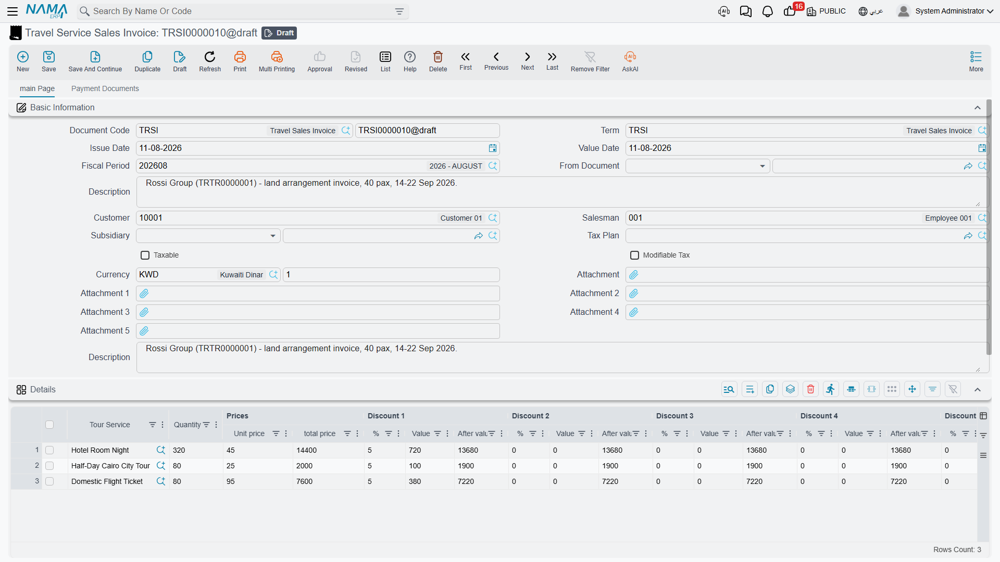
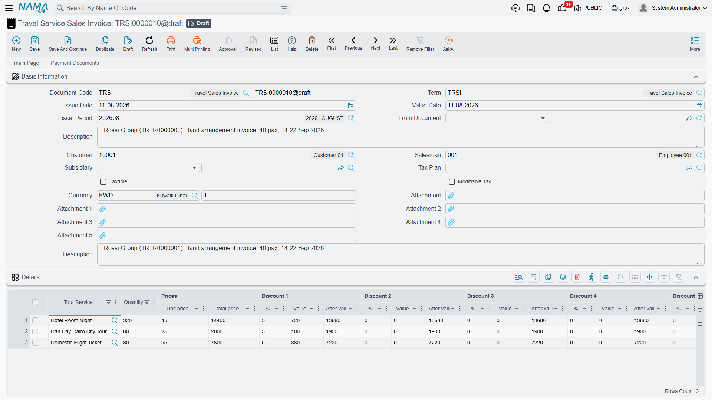
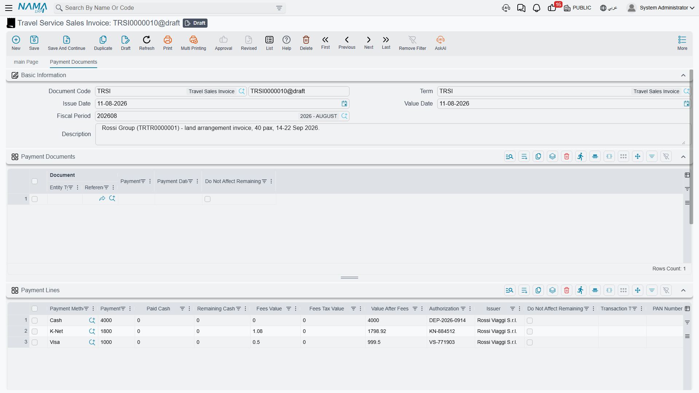

# Selling to the Client

A travel agency sells nights, seats, transfers, entrance tickets and guiding hours. None of that
sits on a shelf, none of it has a warehouse, and none of it can be counted at the end of the
month. But every bit of it has a price, a discount, a tax, and a client who has to be billed and
chased for the money — which is exactly what an invoice is for.

That tension is why the Travel module ships its own selling documents instead of reusing the
ordinary sales invoice, and it is the first thing to understand before you open any of them.

## Why Travel has its own sales invoice

Open an ordinary Nama sales invoice and a line asks you for an item, a warehouse, a unit of
measure and a quantity, because behind the scenes that line has to move stock out of a store and
carry the item's cost with it. A travel line has none of those things to give.

A line on a **Travel Service Sales Invoice** names a **Tour Service** — "Full-day Luxor
sightseeing", "Airport transfer, private car", "5-night half board, double room" — and that is
the whole of it. There is no warehouse to issue from, no unit of measure, no quantity on hand to
run down, and no item cost to relieve. Nothing at all moves in inventory when you commit a travel
sales invoice.

::: info Everything else is the ordinary engine
Money, discount levels, taxes, payment methods, instalment plans, contract clauses, dimensions,
document books and e-invoicing all come from the same shared machinery the rest of Nama uses. If
you already know the supply-chain sales invoice, this screen will feel familiar the moment you
open it — the details grid is the only part that looks different, and it looks different for one
reason only: it sells a service, not a thing.
:::

The three documents live under **Travel > Documents**:

- **Travel Service Sales Order** — the booking the client agreed to.
- **Travel Service Sales Invoice** — the bill, and the document that collects the money.
- **Travel Service Sales Return** — the reversal, raised against one specific invoice.

## Travel Service Sales Order

The order is where you record what the client has committed to before you bill them: the agreed
services, the agreed prices, the discount that was negotiated, the instalment plan that was
promised, and the contractual clauses that will be printed on the contract.

Its header is short: the **Document Code** (book and code), the **Term**, **Issue Date**, **Value
Date** and **Fiscal Period**, the **Customer**, the **Salesman**, and the **Currency** with its
**Currency Rate** (which default to the working currency at rate 1). Below that sit the usual
**Dimensions** — Legal Entity, Analysis Set, Branch, Sector and Department — and six attachment
slots for the signed booking form, passport scans, and anything else worth keeping with the file.

The **Details** grid is the same one described under the invoice below, minus the per-line
currency columns: a sales order line is priced in the document's own currency. The order also has
no payment-method grid — money taken at the counter belongs on the invoice — but it does carry the
instalment grid and the standard-terms grid, so the payment plan and the contract clauses can be
agreed at order time and copied forward.

::: warning The order takes a document term, and that term is a financial one
This is the point people miss. A Travel Service Sales Order is not a memo — it carries a **Term**
just like the invoice does, and when it is committed its effects are created and processed exactly
the way an invoice's are. If that term carries debit and credit account sides, the order books to
the general ledger.

So set the order's term up deliberately. Give the order its **own** term rather than pointing it
at the invoice's, and leave that term's account sides empty if you want the order to stay a purely
commercial document and let only the invoice raise revenue. See
[Document Terms](./travel-document-terms) for how the sides are configured.
:::

When you are ready to bill, open a new **Travel Service Sales Invoice** and pick the order in the
**From Document** field. The system copies the header's payment template and money block and, line
by line, the tour service, quantity, prices and discounts — so you bill what was booked without
retyping it.

## Travel Service Sales Invoice

This is the main document of the sales side: it prices the services, calculates the discounts and
taxes, takes whatever money the client hands over at the counter, tracks what is still owed, and
raises the receivable against the client.

### The header

Along with the document code, term, issue date, value date and fiscal period, the header asks for:

- **Customer** — the client being billed. This is who gets debited.
- **Salesman** — the employee credited with the sale.
- **From Document** — the order (or another document) this invoice was built from.
- **Currency** and **Currency Rate** — the currency the invoice is priced and processed in.
- **Description** and the six attachment slots.
- The **Dimensions** group: Legal Entity, Analysis Set, Branch, Sector, Department.

The tax setup of the document — which tax plan applies, and whether the invoice is taxable at all
— comes from the **Term**, so changing the term changes the tax treatment. That, together with the
account sides the term carries, is what makes choosing the right term the single most consequential
decision on the header.

### The Details grid — what is being sold

Each line answers one question: *which service, how many, at what price, less what, plus what tax*.

| Column | What goes in it |
|---|---|
| **Tour Service** | The service master file being sold. |
| **Quantity** | How many — pax, nights, rooms, transfers. Required on every line. |
| **Unit price** / **total price** | The rate per unit, and the line's gross value. |
| **Discount 1 … Discount 8** | Eight independent levels, each with a **%**, a **Value** and the **After value** it leaves behind. They apply in sequence, so discount 2 works on what discount 1 left. |
| **Item Tax**, **Tax 2**, **Tax 3**, **Tax 4** | Four tax levels, each with its percentage and its value. The percentages come from the tax plan carried by the tour service. |
| **Net value** | What this line is finally worth. |
| **Currency** and **Rate** | For a line priced in a currency other than the document's. |
| **Line Subsidiary** | The party this particular line is attributable to, when it is not the header's. |
| **Description** | Free text — flight number, room type, whatever the client should see on the bill. |

A worked example. A tour operator books a 40-pax group from Cairo for five nights. One line carries
the tour service *Cairo 5-night full package*, quantity **40**, unit price **1,850** — a gross
**74,000**. The agreed 5% group discount goes into Discount 1, taking **3,700** off and leaving
**70,300**. VAT at 14% adds **9,842**, so the line's net value is **80,142**.

Under the grid the money block adds up what the lines produced: the **Total**, the running **Net
after Discount 1..4**, the header-level **Discount**, **Tax 3** and **Tax 4** applied to the whole
invoice, the **Net**, and then the collection side — **Cash Paid**, **Total Paid** and
**Remaining**. The **Totals** group repeats the same figures broken out per discount level and per
tax level, which is what you read when a client asks you to justify a number.

Remaining is simply the net less everything already collected: the cash taken at the counter, the
payment-method lines, and any receipt vouchers linked to the invoice.

### What happens when you save

Committing the invoice does not stop to write ledger entries. The document creates its effects as a
**business request** that is processed in the background, so the save itself is instant and the
work is retryable. You can watch its **processing status**, and reprocess it if something in the
setup was wrong, from the **Business Requests** list view.

What that request contains, for our 40-pax invoice:

1. **The client is debited** with what is still owed — the net value less the cash taken, less the
   payment-method lines, less anything flagged as not affecting the remaining.
2. **Revenue is credited** with the gross line price, before any discount is taken off.
3. **Each tax level gets its own pair of sides** — sales tax 1 and 2, and the two invoice-level
   taxes — each raised separately, so the tax accounts can be reconciled against the returns you
   file.
4. **Each discount level gets its own pair** — the header discount and discounts 1 to 8 — so a
   given discount lands in its own account instead of quietly shrinking revenue.
5. **Cash taken at the counter** is debited to the cash side.
6. **Each payment-method line** is debited to the account that payment method carries — the card
   settlement account, the cheques-under-collection account, the till — along with the merchant fee
   and the tax on that fee where the method charges them.
7. **Receipt vouchers linked to the invoice** are handled according to the term's external-effects
   rules.

Every one of those accounts comes from the document **Term**. A term with no debit and credit sides
configured produces a request with nothing in it, and the invoice books nothing at all — which is
occasionally what you want, and never what you want by accident. Again, see
[Document Terms](./travel-document-terms).

If you correct a committed invoice and commit it again, the same ledger transaction is updated
rather than a second one being created.

## Collecting the money

Three of the grids on the invoice are about payment rather than about what was sold, and they get a
page of their own — [Payments, Instalments & Contract Terms](./travel-payments-and-terms) —
because they behave the same way on the purchase side. In outline:

**Payment Lines** record how the client paid *right now*, one line per method: cash, card, cheque.
Each line carries the amount, the cash tendered and the change given back, the merchant fee and its
tax, the authorization number and the issuer, and — for a card taken on a connected terminal — the
terminal's own echo of the transaction. This grid is on the invoice and on the return, not on the
order.

**Payments** is the instalment plan: an instalment code and description, the percentage or value
due, the due date, what has been paid against it and what remains. A payment template on the header
plus the **Generate Payments** action will build the whole schedule for you from a down payment, a
number of instalments and a period. The schedule has to reconcile with what is still outstanding on
the invoice before the document will commit.

**Standard Terms** are the contractual clauses attached to the sale — cancellation policy, visa
responsibility, the deadline for the balance — each with its planned end date and, where the clause
is one that has to be fulfilled, the date it was fulfilled. These lines are contractual text; they
book nothing.

Alongside those, the **Payment Documents** grid shows the receipt vouchers raised against this
invoice. You do not type into it: when a receipt voucher is committed against the invoice its line
appears here, and if the voucher is later amended or cancelled the line follows.

## Travel Service Sales Return

A return reverses part or all of one specific travel sales invoice — the group shrank from 40 to
32, the optional Luxor day was dropped, the client cancelled inside the free window.

It looks like the invoice: same header, same details grid, same payment, instalment and
standard-terms grids. Two things make it different.

**It must be raised from an invoice.** The **From Document** field is mandatory on a return, and it
will only accept a **Travel Service Sales Invoice**. There is no such thing as a free-standing
travel sales return. Pick the invoice and the services, quantities and prices are copied in for
you; delete the lines you are not returning and reduce the quantities on the ones you are.

**Everything you return is checked against what that invoice actually sold** — and against what has
already been returned on earlier returns from the same invoice. Before the return will commit, the
system verifies that:

- every service and unit price on the return exists as a line on the source invoice;
- the total quantity returned across *all* returns against that invoice does not exceed the quantity
  the invoice sold — so eight seats returned today plus four returned last week cannot add up to
  more than the forty that were billed;
- the unit price you are refunding is not higher than the unit price the invoice charged;
- no discount percentage on the return exceeds the discount percentage the invoice gave.

If any of those fail, the return names the service and the figures that are at odds and refuses to
commit until you fix them.

When it does commit, its effects mirror the invoice's exactly: the client is credited instead of
debited, revenue is debited, and the tax, discount and cash sides all swap. As with the invoice,
the accounts come from the return's own document term.

## Taxes and e-invoicing

Travel sales invoices take part in tax-authority e-invoicing on the same footing as any other Nama
invoice. The invoice carries the tax-authority fields the integration needs, and each tour service
master file carries its own tax-authority code, so the service can be identified on the submitted
document.

The standard actions are on the screen: one that checks the document against the tax authority's
rules before you send it, and ones that open the submitted invoice on the authority's portal, as
the issuing user or as a visitor. Which authority you are talking to, and the credentials and
certificates behind it, are set up once for the installation and then apply to travel invoices
without any travel-specific configuration.

## Where the sales cycle sits next to operations

It is worth being clear about the division of labour. The **tour** is the operations file: who is
travelling, where, when, in which hotels, with which guide, on which coach. It carries **no prices
and no money at all** — see [Tours](./tours). Nothing on a tour bills anybody.

The client's price is raised here, on the sales side, by billing the **tour services** the client
bought. So the rhythm in an agency is: build the tour to run the trip, and raise the sales order
and the sales invoice to charge for it, choosing the tour services that describe what the client is
paying for. The two halves are worked side by side by the same team, and the sales invoice is the
only place the client's money appears.
