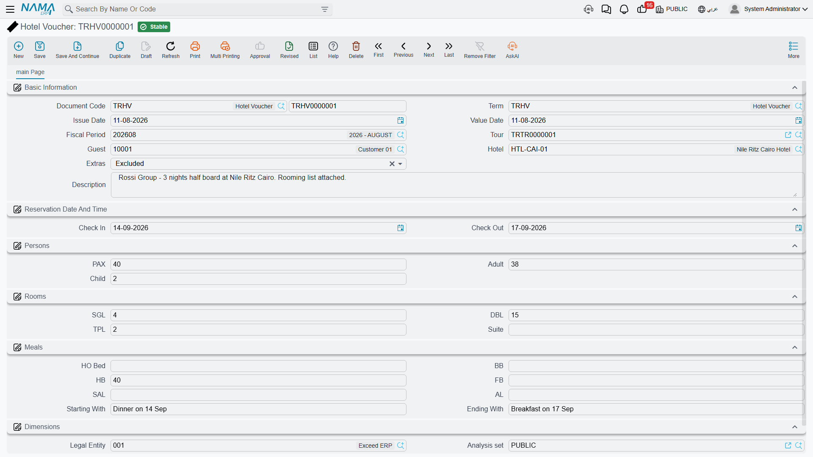
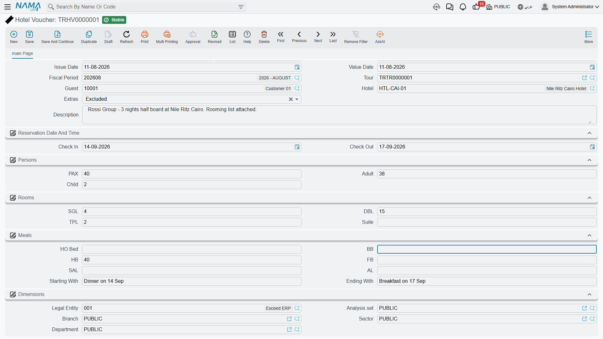
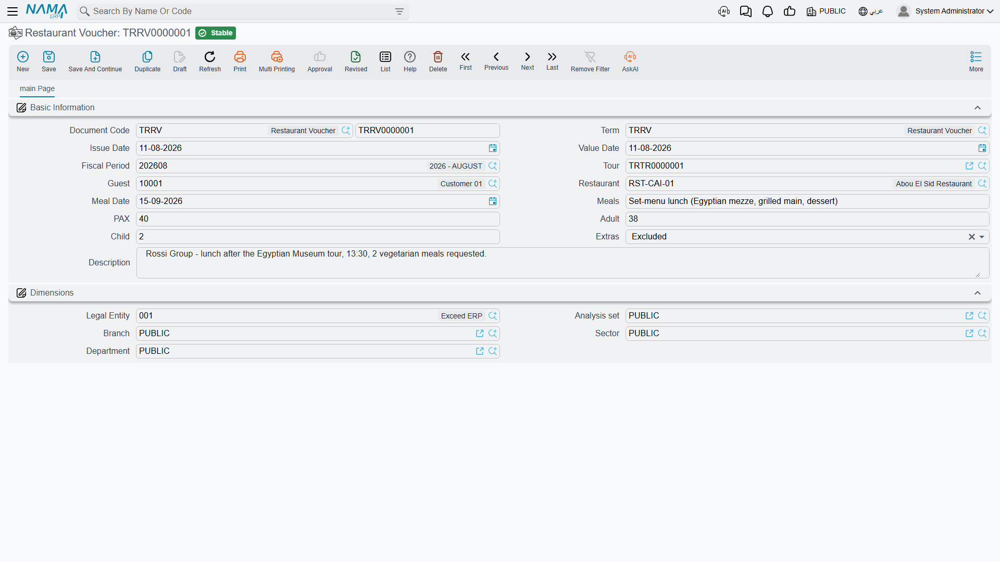

# Hotel & Restaurant Vouchers

Long before anyone had an ERP, a travel agency confirmed a booking by writing a **voucher**: a
slip of paper handed to the hotel — or to the restaurant — saying "these people are coming, on
these dates, this is what we have booked for them, and this is what we are paying for". The
guests carry a copy, the hotel keeps a copy, and if there is ever an argument at the reception
desk about whether dinner was included, the voucher settles it.

The Hotel Voucher and the Restaurant Voucher in Nama are exactly that slip, kept inside the
system instead of in a drawer. Once the reservation is recorded, the whole team can see what was
promised to whom: the operations desk, the person answering the phone when the hotel calls, and
the accountant reconciling the supplier's bill at the end of the month all look at the same
record.

Both live under **Travel → Documents**, and both behave like ordinary Nama documents: they have a
document book and code, a term, an issue date and a value date, a fiscal period, the usual
dimensions (legal entity, branch, sector, department, analysis set), and the normal draft →
commit lifecycle. So a voucher can be numbered, routed through an approval, revised and archived
just like an invoice — it simply has no money on it.

## Hotel Voucher

Open **Travel → Documents → Hotel Voucher**. The screen is one page, and it reads top to bottom
like the slip it replaces.

### Who the booking is for, and where

The first group answers "who and where":

| Field | What you put in it |
|---|---|
| Tour | The [tour](./tours) this stay belongs to, so the voucher can be found from the trip it serves |
| Guest | The party the booking is held in the name of — in practice the client or travel agency the tour was sold to |
| Hotel | The [hotel](./travel-master-files) receiving the voucher |
| Description | Anything the hotel needs to be told in words |

::: info The Guest field holds the party you booked with
When a voucher is created from a tour, Nama copies the tour's **agent** — the travel agency or
client the tour belongs to — into Guest. That is deliberate: the voucher is a commitment between
your agency and the hotel, and the party on it is the party the booking is held for, not a list
of individual travellers. Names of individual guests, when the hotel asks for a rooming list,
belong in the Description or in an attached document.
:::

### The dates of the stay

**Check In** and **Check Out** are the two dates the hotel actually cares about. There is no
"nights" field on the voucher — the number of nights lives on the tour's accommodation line, and
the voucher simply states the two ends of the stay.

### How many people are coming

**PAX** is the total headcount, and **Adult** and **Child** break that total down. Hotels price
and seat children differently, so the split matters even though no price appears here.

### How the rooms are split

Four counts, and each is a **number of rooms**, not a number of people:

| Field | Meaning |
|---|---|
| SGL | Single rooms — one person to a room |
| DBL | Double rooms — two people sharing |
| TPL | Triple rooms — three people sharing |
| Suite | Suites |

So a 40-pax group from Cairo staying five nights might be recorded as **8 SGL + 10 DBL + 4 TPL**
— eight travellers alone, twenty sharing doubles, twelve in triples, which adds up to the 40 in
the PAX field.

### Which meal plan applies

The travel trade abbreviates meal plans, and every hotel contract in the world uses the same
letters. Most people outside operations have never seen them spelled out, so here they are:

| Field | Trade name | What the guest actually gets |
|---|---|---|
| Bed | Room only / bed only | The room and nothing else — every meal is paid for separately |
| BB | Bed & breakfast | The room plus breakfast |
| HB | Half board | Breakfast plus one more main meal, normally dinner |
| FB | Full board | Breakfast, lunch and dinner |
| SAL | Soft all-inclusive | All meals plus soft drinks and the basics between meals |
| AL | All-inclusive | Everything the hotel's all-inclusive package covers, drinks included |

Each of these is a **count**, not a tick box, because one voucher often covers a mixed group: part
of the party on half board, the rest on bed & breakfast. Fill in the counts that apply and leave
the rest empty.

Two free-text fields finish the group. **Starting With** and **Ending With** tell the hotel which
meal the stay opens and closes on — "starting with dinner, ending with breakfast" is the classic
pair, and it is the detail that decides whether the kitchen expects the group on the evening they
arrive.

## Restaurant Voucher

**Travel → Documents → Restaurant Voucher** is the same idea compressed into a single meal
instead of a stay. Same document header, same dimensions, same draft → commit lifecycle.

| Field | What you put in it |
|---|---|
| Tour | The [tour](./tours) the meal belongs to |
| Guest | The party the booking is held for, as on the hotel voucher |
| Restaurant | The [restaurant](./travel-master-files) receiving the voucher |
| Meal Date | The day the group is expected |
| Meals | Free text describing what is being served — "set lunch menu", "buffet dinner, vegetarian option for 4" |
| PAX / Adult / Child | The headcount and its split, exactly as on the hotel voucher |
| Description | Anything else the restaurant should know |

Continuing the same group: the 40 travellers are booked into a Nile-view restaurant for lunch on
the third day, so the Meal Date is that day, PAX is 40 — 34 adults and 6 children — and the Meals
field says "set lunch menu, three courses".

## Extras: included or excluded

Both vouchers carry one small field with a big practical consequence: **Extras**, with two
choices, **Included** and **Excluded**.

This is the answer to the question the guest will ask at the counter — the minibar, the drinks
with dinner, the side orders, the things that are not part of the booked plan. Set it to
**Included** and you are telling the hotel or restaurant to put those on your agency's account.
Set it to **Excluded** and the guest settles them personally before leaving. The module does not
list which items count as extras; that is whatever your commercial agreement with that supplier
says. What the voucher does is put the answer in writing, so nobody has to phone the office to
find out.

## How vouchers get created

There are two ways in, and the second is the one operations staff normally use.

1. **Standalone, from the menu.** **Travel → Documents → Hotel Voucher** (or Restaurant Voucher),
   then fill everything in by hand. Use this when a booking has no tour behind it yet, or when you
   are recording something after the fact.

2. **Straight from the tour.** Open the [tour](./tours) and look at the accommodation grid: each
   row has a **Hotel Voucher** column, and pressing **+** on it creates the voucher right there,
   already filled in from the row you were standing on — the hotel, the check-in and check-out
   dates, the PAX count, the single/double/triple room counts, and the guest taken from the tour's
   agent. The services grid has the same thing in a **Restaurant Voucher** column, which brings
   across the restaurant, the meal date, the PAX count and the guest.

   Everything the tour line does not know — adults and children, suites, the meal-plan counts,
   Starting With and Ending With, and the Extras choice — is left for you to complete. Once the
   voucher is saved, the tour row points at it, so anyone opening the tour can jump straight to
   the reservation slip for that leg.

::: tip Build the tour first
Because the second path copies the booking details out of the tour line, it is far quicker to
build the tour's accommodation and services grids first and create the vouchers from there than
to type each voucher from scratch.
:::

## A voucher records no money

This is the single most important thing to understand about vouchers, and it surprises people
who expect a booking document to carry a cost.

**There is no rate, no amount, no currency and no tax anywhere on either voucher**, and neither
document has any accounting effect — committing one moves nothing in the ledger, and cancelling
or deleting one has no financial consequence at all. A voucher is a booking record and a
handover slip. That is its whole job.

The money for the same booking travels a completely separate road. On the tour, the **Create
Tourism Service Purchase Orders** button turns the accommodation and service lines into
**Travel Service Purchase Orders** — one per hotel, restaurant, tour guide or supplier — and those
orders carry the rates. Each order becomes a **Travel Service Purchase Invoice** when the
supplier bills you, and that invoice is what reaches the ledger and the supplier's account. The
whole cost side is described in [Buying from Suppliers](./travel-purchase-cycle).

::: info Two documents, two audiences
Think of it as one booking told twice. The voucher is written **for the hotel**: who is coming,
when, in which rooms, on which meal plan. The purchase order and invoice are written **for your
accountant**: what that stay costs and who owes whom. Neither one replaces the other, and neither
one is derived from the other — you record the reservation on the voucher and the cost through
the purchase cycle.
:::
