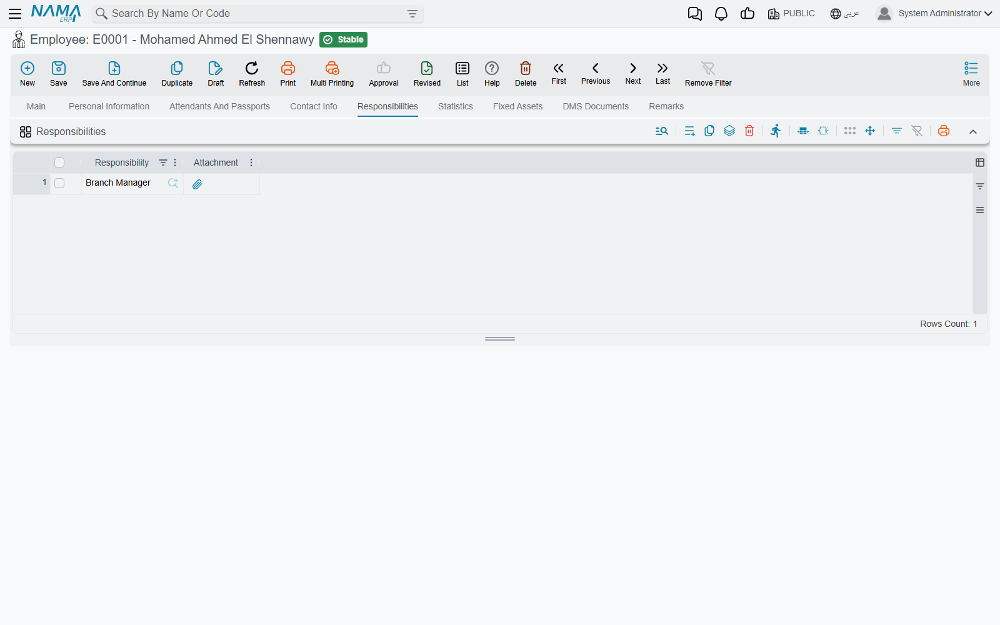
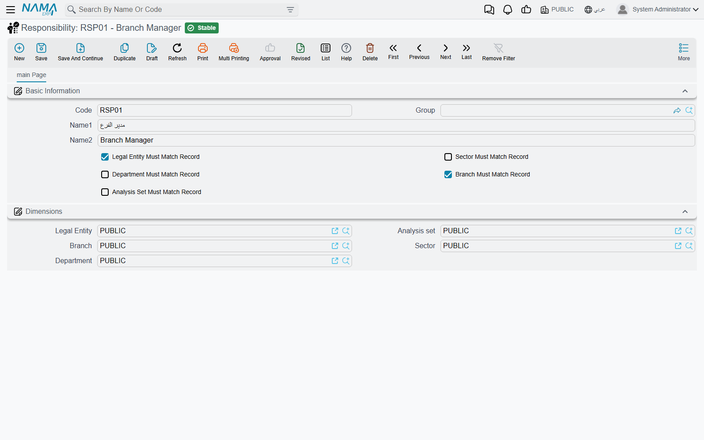
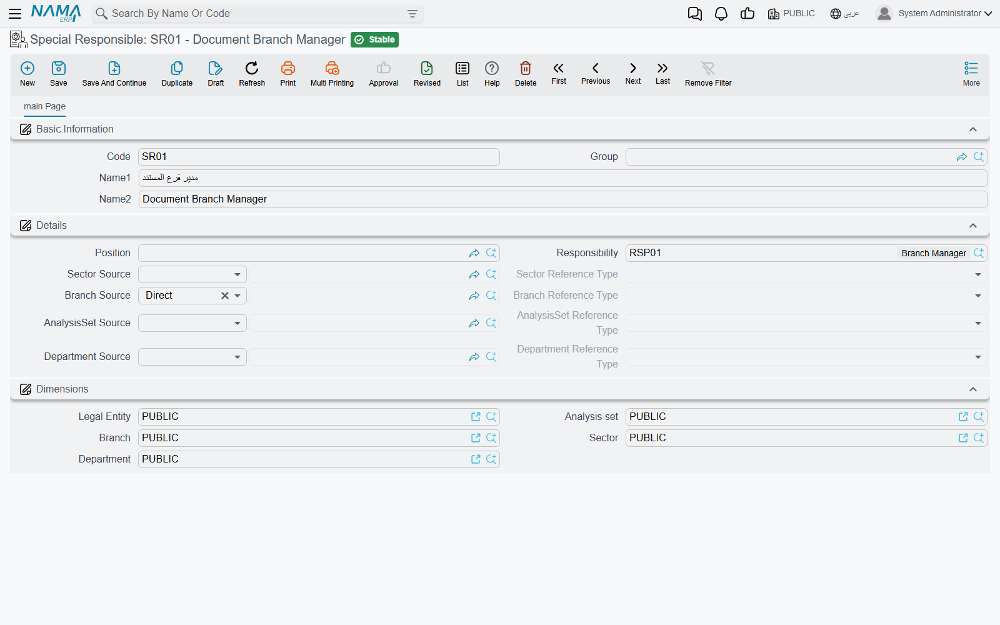
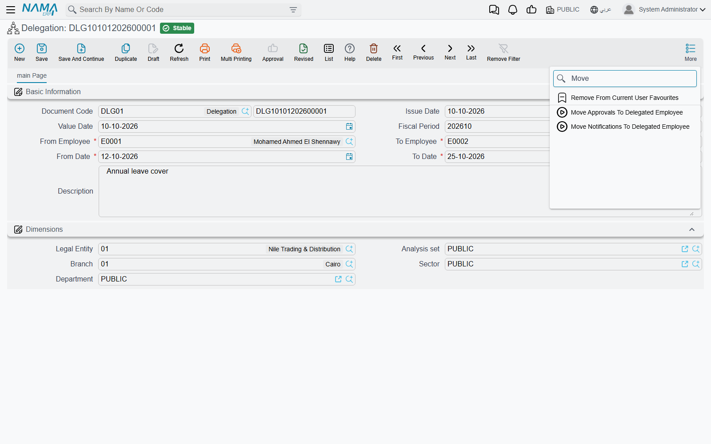

# Responsibilities, Special Responsibles and Delegation

An approval step that names one employee breaks the day that employee leaves, changes job or goes on holiday. An approval step that names a *role* keeps working. Three screens under **Administration → Security** let you route approvals and notifications to roles instead of people, and hand someone's work to a stand-in for a while:

- **Responsibility** — a named role ("Credit Controller", "Warehouse Supervisor") that you hand to employees.
- **Special Responsible** — a search rule: "the employee in *this* group, with *this* position or responsibility, in the *same branch as the document*".
- **Delegation** — a dated document that says "while X is away, Y covers for X".

The approval definition itself — steps, decisions, fallbacks — is described in the [Approvals System guide](/platform/approvals/approvals-system); this page covers the three screens that feed it.

## Responsibility: a role you hand to employees

A **Responsibility** record is mostly a name. What gives it meaning is the list of employees who hold it: open an **Employee**, go to the **Responsibilities** page and add a row per responsibility (each row can carry an **Attachment** — the signed appointment letter, for instance).

Positions can hand responsibilities out for you. The **Organizational Position** screen has its own **Responsibilities** grid; when you pick a position on an employee, the employee's **Responsibilities** grid is filled with the position's responsibilities. A row ticked **Do Not Copy Responsibility To Employee** stays on the position and is not copied — use it for a responsibility that only some holders of the position should get.

Wherever a recipient or an approver can be chosen from a list that includes **Responsibility**, choosing one means "every employee who currently holds it":

- In an **Approval Definition** step with **Responsible Type** = **Employee Or Group**, pick the responsibility as the responsible party. The step goes to all holders, and the step's **Require All Approvers** setting decides whether one of them is enough.
- In a **Notification Definition**'s **Targets** grid, a Responsibility row messages every holder — see [Who receives it](/platform/notifications/notifications-system#Who-receives-it).

Because the list is read when the step or message is raised, adding the responsibility to a new employee is all it takes to bring them in; nobody has to edit the approval definition.

### Keeping it to the right branch

A company with three branches usually has three credit controllers, and the Riyadh invoice should not wait on the Jeddah controller. The five switches on the Responsibility screen handle that:

| Switch | Effect |
|---|---|
| **Sector Must Match Record** | Only holders whose sector matches the record's sector |
| **Legal Entity Must Match Record** | Only holders in the record's legal entity |
| **Branch Must Match Record** | Only holders in the record's branch |
| **Department Must Match Record** | Only holders in the record's department |
| **Analysis Set Must Match Record** | Only holders in the record's analysis set |

The dimensions compared are those on the **employee** record and those on the record being approved. Two things count as a match besides the same value: an **empty** dimension on either side (an employee with no branch covers every branch), and a composite dimension that contains the other one. The approval definition and the notification definition have the same five switches of their own, and both sets apply.

::: tip When a step suddenly has no approver
If every holder is filtered out, the step falls back to the definition's **Fallback Employee**. A step that keeps landing on the fallback usually means the holders' employee records have the wrong — or no — branch or department, not that the responsibility is wrong.
:::

## Special Responsible: find the approver from the document

A **Special Responsible** is a saved search over employees. Instead of a fixed list, it describes the employee you want, and part of that description is taken from the document being approved. Think of it as "the branch manager of whichever branch this invoice belongs to".

It narrows employees by any combination of:

- **Employee Group** — an employee group (only groups for employees are offered).
- **Position** — an organizational position.
- **Responsibility** — a [responsibility](#Responsibility-a-role-you-hand-to-employees) the employee holds.
- **Sector**, **Branch**, **Department** and **Analysis Set** — each with its own *source*, explained below.

Every criterion you fill must match. The legal entity is always taken from the document: the employee must be in the document's legal entity, or have none.

### Where each dimension comes from

Each of the four dimensions has a **Source** field (**Sector Source**, **Branch Source**, **Department Source**, **AnalysisSet Source**) with three useful choices:

| Source | Arabic | The dimension is taken from |
|---|---|---|
| **Direct** | من المستند | The document being approved |
| **Reference** | من مرجع | A record the document points to — chosen in the matching **Reference Type** field |
| **Specific** | محدد | A fixed value you pick on the Special Responsible itself |

**Reference Type** offers four records:

| Reference Type | Read from |
|---|---|
| **Employee** | The employee linked to the user who last edited the document — "the branch of whoever raised it" |
| **Customer** | The document's customer — on sales documents |
| **Warehouse** | The line's warehouse — on supply-chain documents |
| **Item** | The line's item — on supply-chain documents |

Warehouse and Item are read **per line**. When an approval is raised for individual lines, each line gets the approvers that match its own warehouse or item; when the whole document is approved at once, the first line is used.

Leave a source empty and that dimension does not narrow the search. The same happens when the source yields nothing — a Reference to a customer on a document that has no customer, for instance. The match on the four dimensions is exact: when a dimension *is* filtered, an employee with that dimension empty does not qualify.

The screen keeps the fields consistent for you: **Reference Type** is only editable when the source is Reference, and the fixed dimension only when the source is Specific. Saving with Specific but no value, or Reference but no Reference Type, is refused with the usual "field is required" message on the empty field.

### Where you use it

- As the responsible party of an **Approval Definition** step — **Responsible Type** = **Employee Or Group**, then pick the Special Responsible. If nobody matches, the step goes to the definition's **Fallback Employee**.
- As the definition's **Other Alternates** — employees who may act on *any* step alongside the regular approvers; see [Alternate Approvers](/platform/approvals/approvals-system#Alternate-Approvers).

#### Worked example: the branch manager of the invoice's branch

1. Create a Responsibility **Branch Manager** and add it to each branch manager's employee record. Make sure each of them has their branch filled.
2. Create a Special Responsible **Invoice Branch Manager**: **Responsibility** = Branch Manager, **Branch Source** = Direct.
3. In the sales invoice's Approval Definition, set a step's **Responsible Type** to **Employee Or Group** and its responsible party to *Invoice Branch Manager*.

A Riyadh invoice now waits for the Riyadh branch manager, and a Jeddah invoice for the Jeddah one — with one approval definition.

## Delegation: covering for someone who is away

When the purchasing manager goes on two weeks' leave, purchase orders still need approving. The **Delegation** document (Administration → Security → Delegation) covers that without touching a single approval definition:

| Field | Meaning |
|---|---|
| **From Employee** | The person who is away — the delegator |
| **To Employee** | The stand-in — the delegate |
| **From Date / To Date** | The period the delegation is active |

All four are required. Once the document is saved, and for as long as **today** falls within the period, it changes three things:

1. **New approval requests reach both.** Every time an approval step is assigned to the delegator, the delegate is added as an extra candidate. Either of them can act; the delegator loses nothing.
2. **Escalations go to the stand-in.** When an approver escalates to the delegator — Escalate To Supervisor, Escalate To Direct Supervisor or Escalate To Specific Employee — the case goes to the delegate instead, unless the delegate is the very person escalating.
3. **Notifications follow.** The delegate's notification list shows the delegator's notifications as well, and newly raised notifications are copied to the delegate. The details, and how to switch this off for sensitive messages, are in [Delegation: reaching the stand-in](/platform/notifications/notifications-system#Delegation-reaching-the-stand-in).

The delegate works under their own login: approvals they give are recorded under their own name. They therefore need a user linked to their employee record, as every approver does.

### What was already waiting

A delegation created on the first day of leave only catches what is raised *after* it. Two buttons on the Delegation screen deal with the backlog; both work on the open document or on the rows ticked in the Delegation list:

- **Move Approvals To Delegated Employee** — in every approval case still in progress where the delegator is a current candidate, and whose request date falls inside the delegation period, the delegator is **replaced** by the delegate.
- **Move Notifications To Delegated Employee** — moves the delegator's unread notifications from the period across to the delegate.

Unlike the ongoing behaviour above, both are a *move*: the items leave the delegator's queue.

::: info Two things called "delegation"
This Delegation hands over **work** — approvals and notifications — and leaves everyone's permissions alone. If the stand-in also needs to open screens they normally cannot see, give them the delegator's permissions for the same period with [Temporary Additional Permissions (Delegation)](/platform/security/security-delegation). The two are often used together.
:::
