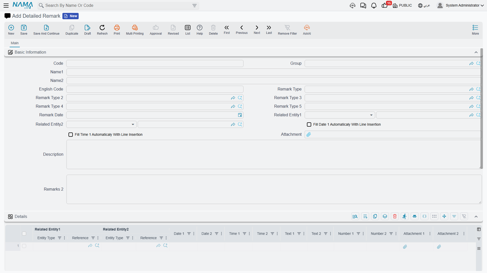

# Attachments

Paperwork follows business documents around. A purchase invoice arrives as a PDF in somebody's
inbox. A delivery note comes back from the customer with a signature scrawled across it. An employee
file needs a copy of an ID. All of it has to end up somewhere that the person looking at the record
six months from now will think to check — which means on the record itself, not in a shared folder
named after last year's project.

An **attachment** in Nama is a file stored in a field on a record. That is the whole idea, and the
one thing worth understanding before anything else: attachments are not a bag hanging off the record
that you can keep dropping files into. They are **fields** — named, countable slots — and each one
holds exactly one file.

::: info Where to find them
Wherever the screen shows a paper-clip. Most document and master-file screens carry attachment fields
named **Attachment 1**, **Attachment 2** and so on, usually in the basic information group or on a
tab of their own; grids can carry an **Attachment** column so each line has its own file.
:::

The screen above shows both at once: an **Attachment** field on the header, and **Attachment 1** and
**Attachment 2** columns on the detail grid, each cell with its own paper-clip.

## One field, one file

A screen that offers five attachment fields can hold five files, and a sixth file has nowhere to go
until you clear one of the five or the screen is changed to expose more slots. Different record types
expose different numbers — some have a single **Attachment**, many have three or five, some go up to
ten.

This is a deliberate design and it has a consequence worth planning around: **decide what each slot
is for**. On a purchase invoice, "Attachment 1 = supplier's original invoice, Attachment 2 = delivery
proof, Attachment 3 = approval e-mail" is a convention people can follow and search by. Left
undecided, the same three documents end up in different slots on every record and the fields become
useless for anything but eyeballing.

If a record genuinely needs an open-ended number of files — a contract with forty annexes, a property
with a folder of deeds — that is what
[Document Management](/platform/dms/) is for, and the two systems coexist happily.

::: tip Attachment fields can be renamed
The field label is not fixed at "Attachment 1". Renaming the slots to what they actually hold is one
of the cheapest usability wins available; see
[field appearance](/platform/fields-and-entities-settings/fields-settings-field-appearance).
:::

## Attaching a file

The attachment widget is small and does more than it looks like it does.

**Click the paper-clip** and a file picker opens. Pick a file and it uploads immediately — you will
see the file name appear as a chip next to the clip.

**Drag a file onto the field** and it is picked up the same way, which is usually faster when the file
is already sitting in a mail client or a folder next to the browser.

**Alt-click or Ctrl-click the paper-clip** to scan instead of uploading, if a scanner is set up for
that field. On fields configured the other way round — where scanning is the normal case — the icon is
a scanner and Alt-click gives you the file picker. Both routes are always available; the configuration
only decides which one is one click away.

Fields set up as **signature** fields show a pen instead, and clicking it opens a canvas the customer
signs on screen. Scanner and signature setup both live in
[field appearance](/platform/fields-and-entities-settings/fields-settings-field-appearance); which
scanning software is used is set in
[Attachments and Storage](/platform/global-config/global-config-attachments).

::: warning Uploading is not saving
The file is uploaded the moment you pick it, but it is not on the record until you **save the record**.
Close the screen without saving and the attachment goes with everything else you did not save. This
catches people out because the file name appears immediately and looks committed.
:::

## Opening, replacing and removing

Once a field holds a file, the chip carries the file name.

- **Click the chip** to download or open the file.
- **Hover over it** for a second and an image attachment shows a preview without downloading, which is
  what makes scanned paperwork practical to skim.
- **Click the × on the chip** to detach the file. As with attaching, the removal takes effect when the
  record is saved.

To replace a file, remove the old one and attach the new one. There is no overwrite in place — and
that is worth knowing, because the [audit trail](/platform/audit-trail) records the field as having
changed, but the previous file itself is not kept as a separate version you can retrieve from the
record.

## Attachments on detail lines

Attachments are not only a header feature. A grid column of the attachment type gives **every line its
own file** — which is the natural model when the lines are the things being evidenced.

The classic cases are the ones where a single document covers many independent items: a petty-cash
document where each line is a different expense with its own receipt; a profit-distribution document
where each line carries its supporting calculation; a purchase document where each line's item has a
certificate.

The widget behaves exactly as it does on the header — click to upload, Alt-click to scan, click the
chip to open, × to remove — just inside the cell. The same rule about saving applies: the line's file
is not stored until the document is saved.

## Where the files are stored

By default the file's bytes go **into the database**, which keeps backups self-contained: restore the
database and every attachment comes back with it.

That stops being comfortable once there are a few years of scans. The alternative — turning on
**Externalize Attachments** — moves the bytes to a folder on disk and leaves only a pointer in the
database. The database stays small; the price is that the attachment folder is now part of your backup
and has to be restored alongside the database, or every attachment in the system shows as missing.
Both options, along with the network-share settings, previews and thumbnails, are described in
[Attachments and Storage](/platform/global-config/global-config-attachments).

Nama can also convert Office files and images to PDF for previewing and printing, using external
tools configured on the same screen. When previews stop working after a server move, that is almost
always where the problem is.

## Finding out what is attached where

Attachments spread out, and after a couple of years somebody will ask how much of the database is
scanned paper, or which documents are missing their supporting file.

The global option **Create Attachment Info Table** answers that. With it on, Nama maintains a
side table describing every attachment in the system — the record it belongs to, the **field** it sits
in, the **line number** when it is on a detail line, when it was created, and the file itself — and
exposes it in the menus so you can list, filter and report on it like any other data.

That line-number detail is what makes it genuinely useful: without it you could tell that a document
had attachments, but not which of its forty lines were missing a receipt.

## Getting files in and out in bulk

Two [entity flows](/platform/entity-flows/introduction-to-entity-flows) handle attachments in volume,
for the times when clicking a paper-clip a thousand times is not an option.

- **[Export Attachments](/entity-flows/core/EAExportAttachments)** pulls the attached files off a set of records and writes them out as
  files — the tool to reach for when handing an auditor everything supporting a period.
- **[Download URLs into Attachments](/entity-flows/core/EADownloadURLsIntoAttachments)** goes the other way: it takes a URL held on the record and fetches
  the file behind it into an attachment field, which is how attachments arrive from an e-commerce
  front end or a supplier portal that only gives you a link.

## Attachments and security

Two things are worth checking deliberately rather than assuming.

Attachment fields are ordinary fields, so **field-level security** applies to them: a role that must
not see a scanned salary letter can have the field hidden through
[field, page and list-view security](/platform/security/field-page-listview-security).

The global option **Allow Download Attachment Without Authentication** is the one to be careful with.
It makes attachment links work without a session, which some external viewers and customer portals
need — but it also means anyone holding the link can fetch the file. Turn it on only when you have
decided that is acceptable for every attachment in the system, because it is not a per-field setting.
