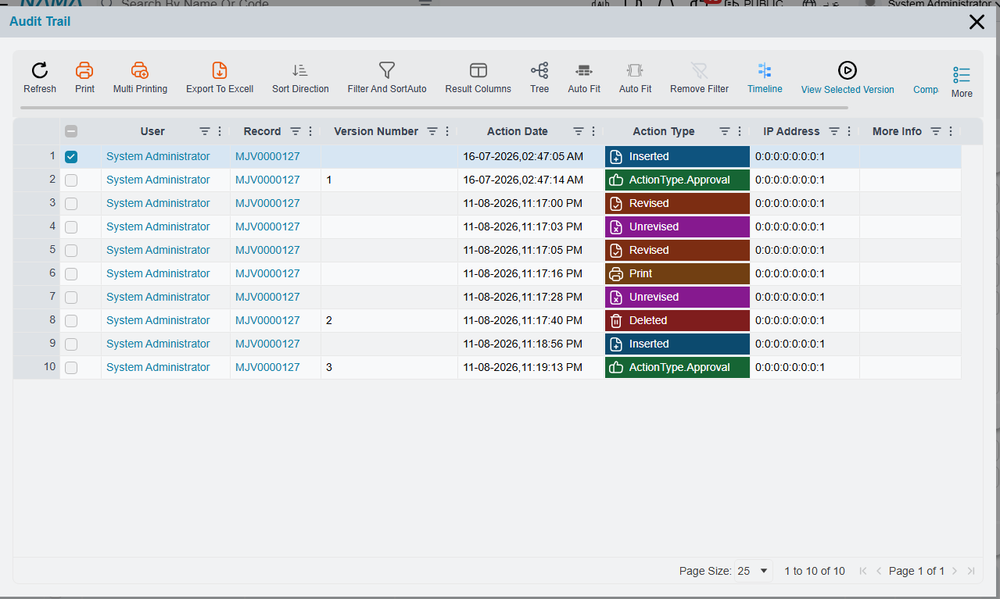
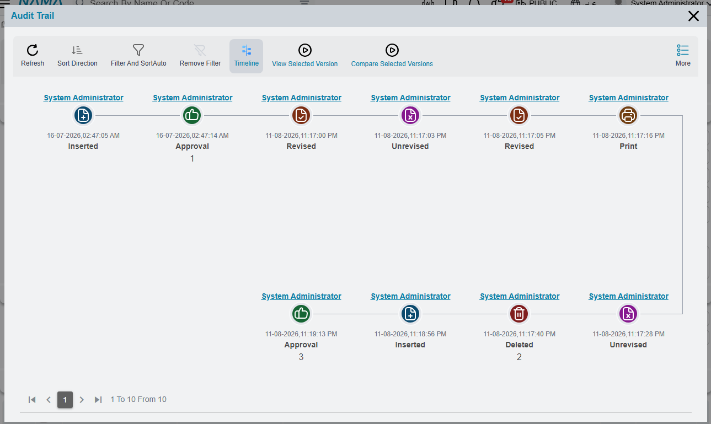

# Audit Trail and Version History

Sooner or later somebody asks the question every ERP has to answer: *who changed this, and what did
it say before?* A customer's credit limit is suddenly double what it was. An invoice that was
approved last week now shows a different total. A stock issue that everyone remembers creating has
vanished from the list.

Nama answers that question without anybody having to switch anything on. Every time a record is
saved, the system keeps a **version** of it — a complete compressed snapshot of the record as it was
— and writes a line into the record's **audit trail** saying who saved it, when, from which machine,
and what kind of change it was. The trail is not a special feature of invoices or of customers; it
is there on every record in the system, including the ones you built yourself.

::: info Where to find it
Open any record and use the **More** menu: **Audit Trail** shows the version-by-version history, and
**Record Detailed Audit Trail** shows field-level changes for the fields you have chosen to track in
detail.
:::

## Reading the audit trail

The Audit Trail popup is a list, one line per recorded action, oldest at the top. It carries the
facts you need to reconstruct what happened.

| Column | What it tells you |
|---|---|
| User | Who performed the action. |
| Record | The record the action was performed on. |
| Version Number | The version the action produced, where it produced one. |
| Action Date | When it happened, to the second. |
| Action Type | What kind of action it was — see the list below. |
| IP Address | The machine the action came from. |
| More Info | Extra context, when there is any. |

Not every line carries a version number. Actions that store a version of the record — the ones you
can later view or revert to — get one; actions that only note that something happened, such as
printing or revising, leave the column empty. That is why the numbers in the column jump rather than
running 1, 2, 3 down the list.

Every column is also a filter and a sort column, so on a record with a long history you can narrow to
one user, one day, or one kind of action. **Sort Direction** on the popup's own toolbar flips the
order when you want the most recent action first, and **Export To Excell** takes the whole trail out
for an auditor.

The same list can be read as a **timeline** instead of a grid — the **Timeline** button on the
toolbar switches between the two. Each event becomes a card with the user as its heading, an icon
coloured by action type, the date, and the version number underneath, which is easier to scan when
you are telling somebody the story of a document.

### The kinds of action recorded

Saving is only one of the things worth recording, and the **Action Type** column distinguishes them.

- **Inserted**, **Modified**, **Deleted** — the record was created, changed or removed.
- **Add Draft** — the record was saved as a draft rather than committed. There is a separate type for
  the automatic draft saves triggered by [auto-save fields on a book](/platform/document-books).
- **Approval** — the save happened as part of an approval decision rather than as a direct edit. The
  grid writes this one as `ActionType.Approval` while the timeline writes it as `Approval`; they are
  the same action. Individual approval steps — approve, reject, return, escalate — are recorded too.
- **Revised** and **Unrevised** — see [revise and unrevise](/platform/revise-and-unrevise).
- **Cancelled** and **Un Cancelled**.
- **Export** — the record was exported.
- **Print**, **Run Report**, **Export Report** — the record was printed, or a report was run over it.
- **Log In** and **Log Out** — session events, which appear on the user's own trail rather than on a
  document.
- **Run Util** — an administrative tool was run against the record. Reprocessing a record and purging
  it both show up here.

**More Info** is where the system adds the small facts that do not have a column of their own. When a
record arrived through an import, the trail says which import type brought it. When a record was
created with the Duplicate action, the trail names the record it was duplicated from — which is often
the fastest way to explain why two documents look suspiciously alike.

## Looking at the record as it was

A line in the trail is not just a note that something changed; the version behind it is a full copy of
the record. Select a single line and use **View Selected Version** to open the record exactly as it
stood at that version — every field, every grid line, as of that moment. The action wants exactly one
row; select two and it asks you to narrow the selection.

This is read-only. You are looking at history, not editing it.

## Comparing two versions

Seeing an old version answers "what did it say?". Comparing answers the more useful question, "what
actually changed?".

There are two ways in.

**Compare Selected Versions** works from inside the Audit Trail popup: select exactly **two** lines
and the system shows you what changed between them. Select one line, or three, and it will ask for
two.

**Compare Two Versions** asks you directly. It has two questions — **Start Version** and
**End Version** — and reports every tracked field change between the two, which is the tool to reach
for when somebody says "it was fine at version 3 and wrong by version 9".

Both comparisons draw on the detailed field audit described next, so a field that is not tracked in
detail will not show up in the comparison even though the version snapshots themselves are complete.

## Detailed field auditing

The version history tells you that version 7 differs from version 6. The **detailed field audit**
tells you *which field* changed, from what, to what — and it is the trail people actually want when
money is involved.

It is deliberately **opt-in per field**. You name the fields worth watching — a credit limit, a
selling price, a discount percentage — in the **Audit Fields** grid, described on
[record behaviour](/platform/fields-and-entities-settings/fields-settings-record-behaviour). Fields
you have not named are still captured in the version snapshot, but they do not get a line of their
own in the detailed trail.

Once a field is tracked, every change to it produces a line in **Record Detailed Audit Trail**:

| Column | What it holds |
|---|---|
| Field | The field that changed. |
| Old Value / New Value | The before and after, as text. |
| Old Number / New Number | The before and after when the field is numeric. |
| Old Reference / New Reference | The before and after when the field points at another record. |
| Old Date / New Date | The before and after when the field is a date. |
| Version Number | The version in which the change happened. |
| Action Date | When it happened. |
| New Line / Deleted Line | Marks changes that are the addition or removal of a grid line rather than an edit to an existing one. |

That last pair matters on documents. Detailed auditing follows grid lines as well as header fields,
so a line added to or deleted from an invoice's detail grid is recorded as such, not silently folded
into a header change.

::: warning Keep the audited field list short
Detailed auditing writes rows on every save. A handful of commercially important fields costs almost
nothing; a hundred audited fields on a busy document type produces a trail nobody will read and a
table that grows faster than the documents themselves.
:::

## Reverting a record to an earlier version

Because the versions are complete snapshots, Nama can put a record back the way it was. Both revert
actions live in the **More** menu of a **list view**, and both work on the rows you have selected — so
a mistake that touched twenty records can be undone in one go.

**Revert to previous version** asks a single question, **Versions back steps count**, which defaults
to 1. Answer 1 and the record goes back to how it looked one version ago; answer 3 and it goes back
three.

**Revert To Version At Specific Time** asks for a **Date And Time** and whether you want the
**Last Version Before The Date Specified** or the **First Version After The Date Specified**. This is
the one to use when you know *when* things went wrong but not which version number that was — "put
these documents back the way they were before yesterday's import".

::: warning A revert is a new save, not an undo
Reverting takes the old version and saves it as the current record. That means it creates a **new**
version at the top of the history — nothing is erased, and the trail shows the revert as another
Modified action. It also means the revert goes through **all the normal validation** for that record.
If the old version references a book that has since been made inactive, or a period that is now
closed, the revert will fail exactly as a manual edit would.
:::

## Turning version tracking on and off

Version history is on out of the box. The global option **Track Records Versions**, on the
[Approvals tab](/platform/global-config/global-config-approvals) of the global configuration, is what
controls it, and it defaults to on.

Individual entity types can override the global setting through their own entity configuration, which
is how you keep full history on financial documents while sparing a high-volume, low-value record
type the storage.

::: danger Switching it off costs you the trail, not just the versions
The version snapshot and the audit-trail line are written together. Turn version tracking off for an
entity and you lose the ability to see who changed its records, not merely the ability to restore
them. Think twice before doing it to anything with an accounting or inventory effect.
:::

Snapshots are stored compressed, so the cost per version is smaller than the size of the record
suggests — but on a record that is edited dozens of times a day it still adds up, which is the honest
reason the per-entity override exists.

## Controlling who can see the trail

The audit trail actions are ordinary actions, so they follow the ordinary rules described in
[security profiles](/platform/security/security-profiles): actions are allowed unless a line in the
profile disables them. To keep the trail from a role, add an action-security line for the type that
disables **Audit Trail** and **Record Detailed Audit Trail** — and, if the role should not be able to
roll records back, the two revert actions as well.

The revert actions deserve particular attention. They rewrite live records in bulk from a list view,
and unlike a normal edit they do not require the user to look at what they are changing.
