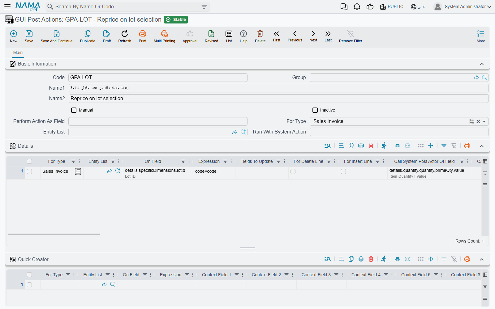

# GUI Post Actions

Every screen in Nama already reacts while the user types: pick a customer and the payment terms fill in, change a quantity and the price is recalculated. That reaction happens on the screen, the moment the field changes, long before anything is saved. **GUI Post Actions** let you add reactions of your own to any field on any screen — copy a value from one field to another, calculate a grid column from the others in the same row, or make one field trigger the system's built-in reaction of another.

Reach for it when a customer says *"when I choose X, the screen should immediately do Y"*. If the change only has to happen when the record is saved, an [entity flow](/platform/entity-flows/) is the right tool instead; a post action is about what the user sees while still editing.

The screen is at *Basic → Settings → GUI Post Actions*. One record can hold any number of lines, so it is common to keep all the post actions of one screen, or of one customer request, in a single record.

## How a post action runs

1. The user changes a field — types in it, picks a reference, or leaves a grid cell.
2. The system's own reaction for that field runs first, exactly as it would without your post action.
3. Your line for that field then runs: the screen sends the record's relevant fields to the server, the **Expression** is evaluated against them, and the fields it changed are written back onto the screen.
4. If the line names another field's reaction or a screen action to call, that runs last.

Nothing is saved by any of this. The user sees the new values on screen and saves the record as usual — or discards it.

Users pick up a new or changed post action the next time they log in.

## The screen

### The header

| Field | What it does |
|---|---|
| **For Type** | The screen the lines apply to, such as *Sales Invoice*. Copied onto every line when you save. |
| **Entity List** | An [entity type list](/platform/automation-and-rules/entity-type-lists.md) instead of one type, so the same lines serve a family of screens. Also copied onto every line. |
| **Manual** | Turns the record into a button instead of a reaction to a field — see [Manual post actions](#Manual-post-actions-buttons-and-follow-ups) below. |
| **Perform Action As Field** | Required for a manual post action. Type anything; on save it is replaced by an internal name for the button. |
| **Run With System Action** | Runs the lines after one of the screen's standard actions succeeds — see below. Filling it in ticks **Manual** for you. |
| **Inactive** | Switches the whole record off. Saving it inactive also marks every line inactive. |

::: warning Reactivating a record does not reactivate its lines
Ticking **Inactive** on the header switches off every line as well. Unticking it later does not switch them back on — untick **Inactive** on each line you want running again, or the record stays silent.
:::

Leave **For Type** and **Entity List** empty on the header when the lines are for different screens; each line then carries its own.

### The Details grid

Each line is one reaction.

| Column | What it does |
|---|---|
| **For Type** / **Entity List** | The screen(s) this line works on. A line with neither applies to the field on every screen that has it. |
| **On Field** | The field whose change triggers the line, by its field id — `customer`, `details.specificDimensions.lotId`, `lines.n1`. Several fields separated by commas share the line. Required. |
| **Expression** | What to do, written as a field map: one `target=source` per line, the same language entity flows use (see [Field Maps](/entity-flows/core/ai-generated-field-maps-documentation.md)). Required. |
| **Fields To Update** | Which fields the screen re-reads afterwards. Usually left empty — see [the third example](#What-the-Fields-To-Update-column-is-for). |
| **For Insert Line** / **For Delete Line** | Run the line when a row is added to, or removed from, a grid instead of when a field changes. **On Field** must then be the grid itself (`details`), not one of its columns. |
| **Call System Post Actor Of Field** | After the expression, run the system's built-in reaction of another field, as if the user had just changed it. |
| **Call GUI Action** | After the expression, run one of the screen's actions, by its action id. |
| **Context Field 1 … 30** | The fields the screen must send so the expression can be evaluated. Filled in for you — see the tip in the [second example](#Calculating-one-grid-column-from-the-others-in-the-same-row). |
| **Criteria** | A [criteria definition](/platform/automation-and-rules/criteria-definitions.md): the line runs only when the record matches it. |
| **Reversed Criteria Definition** | The opposite: the line is skipped when the record matches. |
| **Apply When Query** / **Do Not Apply When Query** | The same two conditions written as an SQL query against the record instead of a saved criteria. |
| **Description** | Your own note on what the line is for. |
| **Inactive** | Switches this one line off. |

### The Suggestion Providers grid

A suggestion provider offers a drop-down of suggested values while the user types in a text field — for example, the descriptions already used on earlier records. Fill in **For Type** (or **Entity List**), **On Field**, and a **Suggestion Query** that returns the values. The query must contain `top`, `distinct` and the `$csg` placeholder, which stands for what the user has typed so far. `@entity@` is replaced by the screen's entity type name before the query runs. For example:

```sql
select distinct top 15 name1 from @entity@ where name1 like '%' + {$csg} + '%'
```

At most 25 suggestions are shown.

## Manual post actions: buttons and follow-ups

Tick **Manual** and the lines no longer wait for a field to change. Instead:

- **As a button.** Fill in **Perform Action As Field**, save, and add the record to the screen as a button through a [Screen Modifier](/platform/screen-modifier/screen-modifier-action-buttons.md) — its **GUI Post Actions** column only accepts manual records. Pressing the button runs the lines on the record as it is on screen.
- **After a standard action.** Fill in **Run With System Action** with the id of one of the screen's standard actions. Whenever that action finishes successfully, the lines run on the result. No Screen Modifier is needed.

In both cases the lines' **On Field** is filled in for you when you save, so leave it to the system.

## Worked examples

Each example ends with a *JSON for direct import* block. To load one, open a new GUI Post Actions record and paste it as described in [Importing Into the Record You Have Open](/platform/import-export/importing-records.md#Importing-Into-the-Record-You-Have-Open).

### Recalculating the price when a lot is selected

On a sales invoice the price should follow the lot: when a lot has its own price in the price list, or is part of an offer with a discount, choosing it should update the price at once. The system already recalculates the price correctly when the quantity changes — but that means the user has to retype the quantity after choosing the lot.

One line on the lot column fixes it. The line's **On Field** is the lot, and **Call System Post Actor Of Field** names the quantity, so selecting a lot runs the system's own quantity reaction — and with it the price recalculation — without anyone touching the quantity. The expression `code=code` changes nothing; it is there only because **Expression** is required.

::: details JSON for Direct Import
```json
{
  "lines": [
    {
      "forType": "SalesInvoice",
      "fieldID": "details.specificDimensions.lotId",
      "expression": "code=code",
      "callPostActorOfField": "details.quantity.quantity.primeQty.value"
    }
  ]
}
```
:::



### Calculating one grid column from the others in the same row

A user types a quantity in `n1` and a rate in `n2` on a journal entry line, and `n3` should immediately show `n1 × n2` — before the document is saved, on the row being edited and on no other row.

Add one line per field that should trigger the calculation. Set **On Field** to the field the user types in (`lines.n1`), and write the calculation in **Expression**, naming the target with the **grid's own field id**:

```ini
lines.n3=sql(select isnull(try_cast({lines.n1} as decimal(20,6)), 0)
                  * isnull(try_cast({lines.n2} as decimal(20,6)), 0))
```

Three things make or break this expression:

- **Name the target with the grid prefix** (`lines.n3`, `details.n3`), not with a bare field name. `$line.n3` works too — inside a post action on a grid field, `$line` is the row the user is editing — but the grid prefix is the form that also works in every other kind of field map. See [Field Maps — Line Selection](/entity-flows/core/ai-generated-field-maps-documentation#Line-Selection).
- **Guard every placeholder that can be empty.** A cell the user has not filled in yet arrives as `NULL`, and SQL Server treats an untyped `NULL` as text: without the `isnull(try_cast(…))` wrapper the action fails with `Operand data type nvarchar is invalid for multiply operator` the first time one of the two cells is blank — which, on a row being typed in, is most of the time.
- **Cover each trigger.** A post action runs only for the field named in its **On Field**, so a calculation that must follow both operands needs a line for `lines.n1` and one for `lines.n2` — or one line whose **On Field** is `lines.n1,lines.n2`.

::: tip Context fields fill themselves in
The **Context Field 1 … 30** columns list what the screen has to send to the server for the expression to be evaluated. You do not fill them in by hand — they are worked out from the expression, the field and the line's conditions as soon as you type them, so if they look wrong, fix the expression and let them be rewritten.
:::

::: details JSON for Direct Import
```json
{
  "lines": [
    {
      "forType": "JournalEntry",
      "fieldID": "lines.n1",
      "expression": "lines.n3=sql(select isnull(try_cast({lines.n1} as decimal(20,6)), 0) * isnull(try_cast({lines.n2} as decimal(20,6)), 0))"
    },
    {
      "forType": "JournalEntry",
      "fieldID": "lines.n2",
      "expression": "lines.n3=sql(select isnull(try_cast({lines.n1} as decimal(20,6)), 0) * isnull(try_cast({lines.n2} as decimal(20,6)), 0))"
    }
  ]
}
```
:::

### What the Fields To Update column is for

After the expression has run, the screen is told which fields to re-read from the result. Left empty, **Fields To Update** is worked out for you: every field on the **left** of an `=` in the expression is refreshed, which is what you want almost every time.

Fill it in when the expression changes a field that is not on the left of an `=` — a value set indirectly through `switchTarget`, a `runCommand` that recalculates the document, or a field that another field's calculation depends on. Anything not named there keeps its old value on screen until the record is saved and reopened, even though the server did change it.

List the fields exactly as the expression names them, separated by commas or newlines:

```ini
lines.n3, lines.n4
```

## Messages you may see

None of these messages has an Arabic translation; they appear in English on Arabic screens too.

| Message | Why | What to do |
|---|---|---|
| *You selected With Insert (Or Delete) Line, so the field {0} cannot be used because it is not a detail field.* | A line has **For Insert Line** or **For Delete Line** ticked, but its **On Field** is a header field. | Put the grid's own id in **On Field** (`details`, `lines`). |
| *You selected With Insert (Or Delete) Line, so the field {0} is a column name, please select a detail field not a column (most probably you mean the field {1})* | Same switches, but **On Field** names a grid column instead of the grid. | Use the field the message suggests as `{1}`. |
| *Suggestion query MUST contain top and distinct keywords, in addition to $csg parameter to mitigate performance problems, an example:* (followed by a sample query) | A **Suggestion Query** is missing `top`, `distinct` or the `$csg` placeholder. | Add all three, as in the example above. |
| *GUI Post Actions {0} must be manual* | Raised by the Screen Modifier when its **GUI Post Actions** column names a record that is not manual. | Tick **Manual** on the post action, or pick a manual one. |

## See also

- [Field Maps](/entity-flows/core/ai-generated-field-maps-documentation.md) — the expression language
- [Adding Buttons to a Screen](/platform/screen-modifier/screen-modifier-action-buttons.md) — placing a manual post action as a button
- [Entity Type Lists](/platform/automation-and-rules/entity-type-lists.md) and [Criteria Definitions](/platform/automation-and-rules/criteria-definitions.md)
