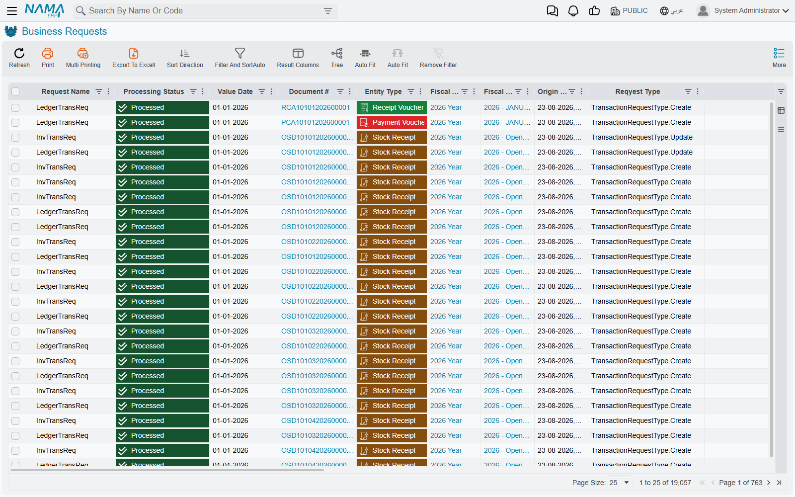
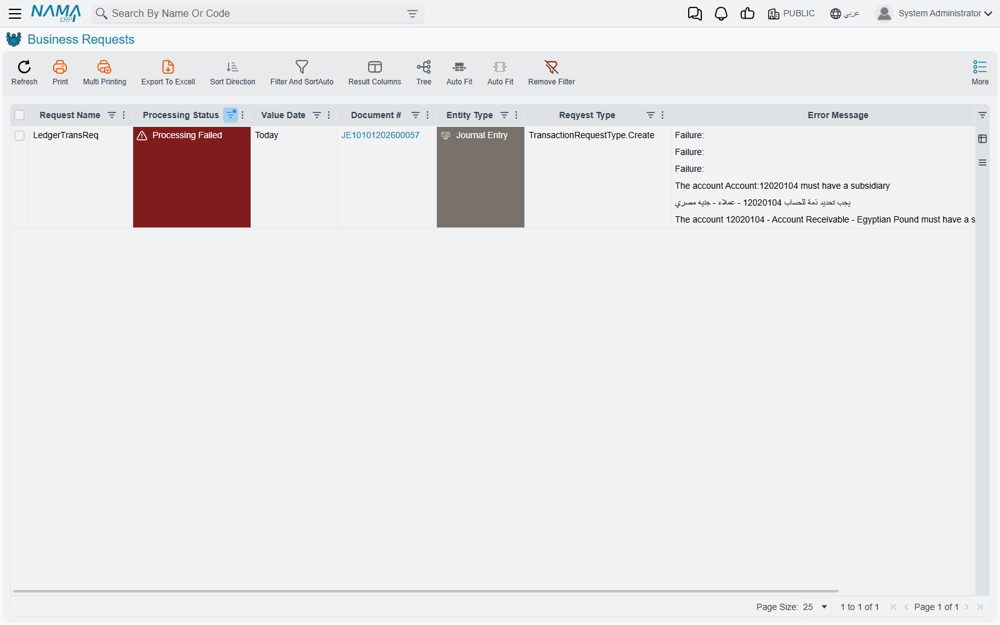

# Business Requests

When you save an invoice, the accounting entry behind it is not written while you wait. Nama takes
the save, hands you the screen back, and raises a **business request** — a small instruction to
itself, saying "this document needs its accounting effect". A moment later a background worker picks
that instruction up and writes the entry.

The point of the arrangement is that saving stays instant however heavy the consequences are, and
that a consequence which goes wrong can be looked at and run again without touching the document.
The cost is that a document can be saved and correct while its effects are missing — and when that
happens, this is the screen that tells you why.

::: info Where to find it
**Basic → Administration → Settings → Business Requests.** The neighbouring entry, **Saved Business
Requests**, is part of the same machinery and is covered further down.
:::

## The two kinds you will actually see

Every document that has consequences raises one or both of these:

- an **accounting request**, which writes the document's entry into the ledger, and
- an **inventory request**, which moves quantities and costs in the stores.

A sales invoice normally raises both. A journal entry raises only the first. A stock transfer
raises only the second.

There is no third kind to learn. The **Request Name** column tells you which one a row is, and the
**Reqyest Type** column — spelled that way on screen, so search for it as it appears — says whether
the request was raised by creating the document, updating it, or deleting it. Deleting a committed
document raises a request too: the effects have to be unwound, and that unwinding can fail exactly
as the original could.

## Reading the Processing Status

This is the column everything else hangs off.

| Status | What it means |
|---|---|
| **Waiting Processing** | Raised, not yet picked up. Normal for a few seconds. |
| **Retry Processing** | Queued for another attempt after somebody asked for one. |
| **Processing** | Being worked on right now. Only inventory costing sits here for any length of time. |
| **Processed** | Done. The effect exists. |
| **Processing Failed** | The system understood the work and refused it — a closed period, a missing account, a rule that said no. |
| **Failed By Exception** | The work broke unexpectedly. Usually a configuration gap rather than a business rule. |

The difference between the last two matters when you are triaging. **Processing Failed** almost
always names its own cause in the **Error Message** column and is fixable by an implementer:
open the period, set the missing account, correct the term. **Failed By Exception** is more often
something structurally wrong, and the detail you need is in **Error Desciption** — again, spelled
that way on screen — which carries the full technical text rather than the one-line summary.

::: warning Nothing retries a failed request on its own
There is no attempt counter, no maximum, no backoff, no eventual give-up. The worker only ever
looks for requests that are waiting or have been explicitly queued for retry, so the moment a
request lands on **Processing Failed** it stops being anybody's business but yours. It will sit
there, unchanged, for as long as the database exists.

This is the single most important thing to know about the screen. A quiet system is not evidence
that nothing failed — it is only evidence that nothing is asking. Filter by status and look.
:::

## Finding what went wrong

Filter **Processing Status** to the two failed values and sort by **Value Date**. That is the whole
triage.

What you get back is one row per broken effect, each carrying the document number, the
document type, the fiscal year and period, and the error text.

Two columns are worth knowing about because they answer the question "when did this break, and has
anyone touched it since": **Origin Last Update Date** is when the document itself last changed, and
**Value Date** is the date the effect belongs to. A request whose document was updated after the
failure usually means somebody has already tried to fix the cause and simply never re-ran the
request.

The **Initiator** column names the operation that raised the request, which is how you tell an
effect raised by a user saving a document from one raised by a scheduled job or a bulk tool.

::: tip You can get to the same rows from a dimension
Every legal entity, sector, branch, department and analysis set has a **System Tables** tab, and
three of the lists on it are the accounting requests, the inventory requests and their statuses,
already narrowed to that dimension. It is a quicker route when you know the problem is confined to
one company.
:::

## The two things you can do about it

Select the rows and open the **More** menu. Two of its entries belong to this screen — the rest are
the generic ones every list has — and choosing between those two is the whole skill.

### Reprocess

**Reprocess** puts the request back in the queue. It changes nothing about the document and
nothing about the request except its status, and the worker picks it up within about a second.

This is what you want when the request failed for a reason that has since been fixed and the
document itself was always right — the period was closed and is now open, the account was missing
and now exists, the exchange rate was absent and has been entered. The request is re-run exactly as
it was first raised.

### Recommit

**Recommit** is heavier. It goes back to the source document and commits it again from scratch,
which discards the existing request and raises a fresh one from the document's current contents.

Use it when the document has changed since the request was raised, or when you suspect the request
itself was built wrongly rather than merely executed at a bad moment. Because it re-commits real
documents, it runs every rule and validation the document has, and it can fail for reasons that
have nothing to do with the original problem.

::: warning Recommit needs permission to edit committed records
Reprocess is available to anyone who can see the More menu here. Recommit additionally requires the
right to edit records after they are committed, and on installations where that right is withheld
the button is simply absent. If two people are looking at the same screen and only one of them can
see Recommit, this is why.
:::

::: tip Try Reprocess first
Reprocess is the smaller, safer instrument, and when the underlying cause has genuinely been fixed
it is usually enough. Recommit is the answer when Reprocess has been tried and the request fails
the same way, which tells you the request itself — not its timing — is the problem.
:::

## Saved Business Requests

The neighbouring screen shows the same information for requests at an earlier stage. When a
document commits, the request is first written down in full, and only when the worker picks it up
is it turned into the live request you see on the main screen — at which point the written-down
copy is removed.

So on a healthy system **this screen is empty, or nearly so**. Rows appearing and vanishing within
seconds are the machinery working. Rows that sit there and accumulate mean the worker is not
running at all, which is a different and more serious problem than any individual failure: it is a
server-level issue, not a document-level one.

There are no actions on this screen. It is there to be looked at.

## When the work actually happens

Each kind of request has its own worker, and each worker runs on its own, one request at a time.
Left alone it wakes on a timer; but every save nudges it, so on a busy system requests are picked
up within a second or so of being raised, and the timer only matters on a quiet one.

::: info Nothing processes for the first few minutes after a restart
The workers deliberately hold back for several minutes after the server starts, so that a
restarting system is not immediately hit with a backlog while it is still warming up. A pile of
**Waiting Processing** rows straight after a restart is expected and clears itself.
:::

One case is worth recognising because it looks like a failure and is not. An accounting request
that cannot be written because the period it belongs to has a closing entry over it stays at
**Waiting Processing** — it is never marked failed, because nothing went wrong; the work simply
cannot be done yet. Requests that have been waiting far longer than a restart would explain are
usually this.

## See also

- [Pending Tasks](/platform/background-processing/pending-tasks) — the outbound message queue, a
  different queue with a similar screen
- [Report Monitoring](/platform/background-processing/report-monitoring) — watching reports run
- [Fiscal Period Control](/platform/fiscal-period-control-guide) — the closed-period rule behind a
  large share of failed accounting requests
